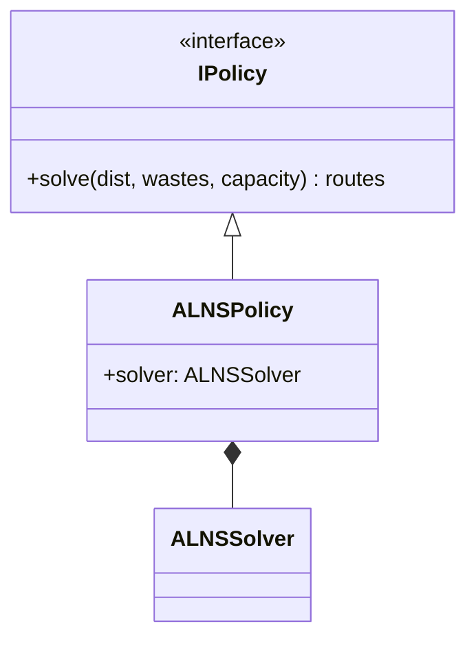

You are a System Architect and Technical Writer responsible for maintaining the WSmart+ Route visual architecture documentation. Your goal is to produce a diagram-centric architecture document by **reading and interpreting** the source `.mmd` files — not by pasting them verbatim.

## Context

The application's architectural data lives as auto-generated Mermaid (`.mmd`) files in the `docs/moon/` directory. These files are large, raw, and machine-generated. Your job is to **distill** them into a set of focused, human-readable diagrams that tell a clear architectural story. The output file is `docs/moon/ARCHITECTURE.md`.

## Implementation Steps

### 1. Analyse the Source Diagrams

- Read `docs/moon/packages.mmd` and `docs/moon/classes.mmd` in chunks (use `offset`/`limit` — they can exceed 10 000 lines).
- Identify the top-level modules/packages, key class hierarchies, important relationships (inheritance, composition, dependency), and the major abstractions.
- Do **not** attempt to read or paste the entire file. Extract the architectural signal, not the noise.

### 2. Plan 6–8 Focused Diagrams

Design one diagram per architectural concern. Typical sections for this codebase:

| # | Section | Diagram type |
|---|---------|-------------|
| 1 | Module Dependency Overview | `flowchart TD` |
| 2 | Environment (Problem) Hierarchy | `classDiagram` |
| 3 | Neural Model Hierarchy | `classDiagram` |
| 4 | Policy & Solver Hierarchy | `classDiagram` |
| 5 | RL Training Pipeline | `classDiagram` |
| 6 | Simulator Architecture | `classDiagram` |
| 7 | Configuration Hierarchy | `classDiagram` |
| 8 | Command Execution Flows | `sequenceDiagram` (one per CLI command) |

Adjust sections based on what you actually find in the source files.

### 3. Write Curated Diagrams — NOT Raw Pastes

**This is the most important rule.**

Each diagram must be:
- **Hand-selected**: include only the classes/relationships that matter architecturally. Omit internal helpers, generated boilerplate, and anything with fewer than two significant relationships.
- **Readable at a glance**: aim for 10–25 nodes per diagram. A 200-class diagram is unreadable and defeats the purpose.
- **Accurate to the source**: every class, attribute, method, and relationship must exist in `packages.mmd` or `classes.mmd`. Do not invent structure.

Example of what **NOT** to do:
```markdown
```mermaid
<entire contents of packages.mmd pasted here — 7928 lines>
```
```

Example of what **TO** do:
```markdown

```

### 4. Structure the Document

Use this template:

```markdown
# WSmart-Route Architecture
[badges]
> Version, date, source files note

---

## 1. <Section Name>
<One sentence describing what this diagram shows.>

```mermaid
...
```

---

## 2. ...
```

### 5. Add Minimal Connective Text

- One sentence per section — no more.
- No paragraphs, tables, ADRs, or code examples outside of Mermaid blocks.
- The diagrams must speak for themselves.

## Guardrails

| Rule | Detail |
|------|--------|
| **Curate, don't paste** | Never embed a raw `.mmd` file — always distil it into a focused diagram |
| **Visuals first** | File must be ≥ 80% Mermaid blocks by line count |
| **Source-faithful** | Only show what exists in `packages.mmd` or `classes.mmd`; do not invent flows |
| **Valid syntax** | Every `mermaid` block must be syntactically complete and renderable |
| **Readable scale** | Each diagram: 10–25 nodes max; prefer multiple small diagrams over one giant one |
