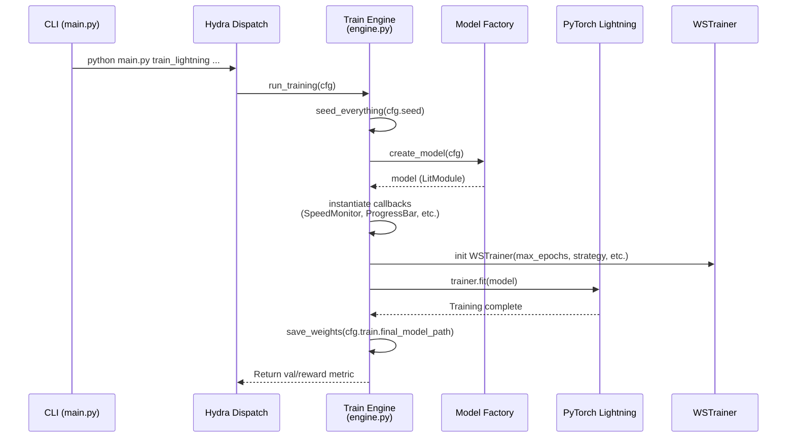
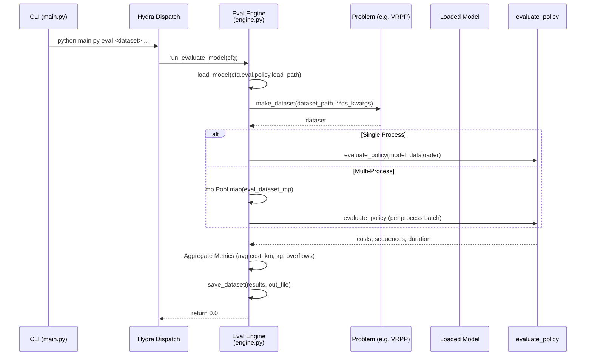
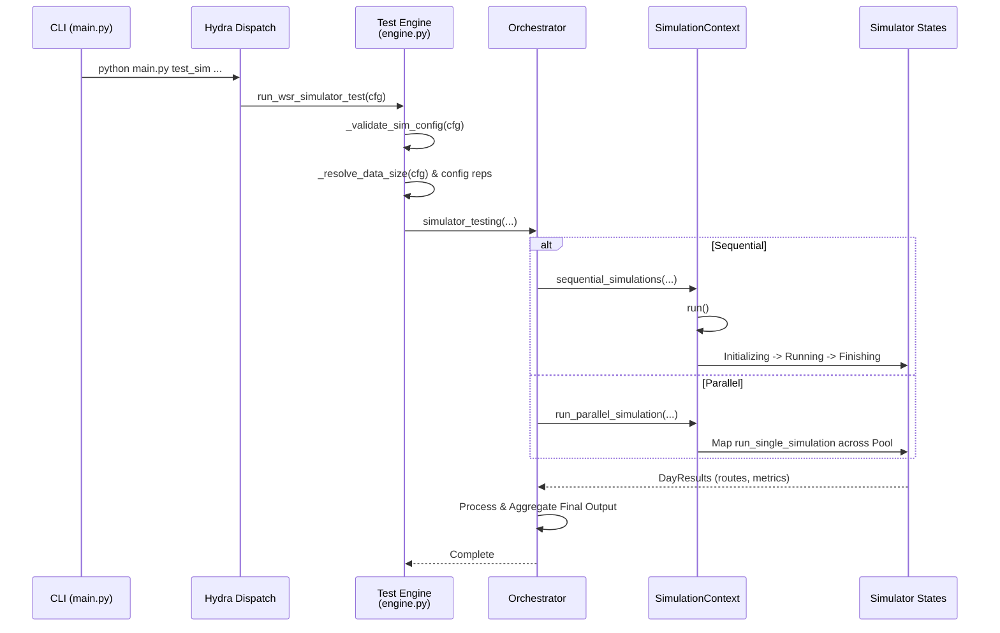
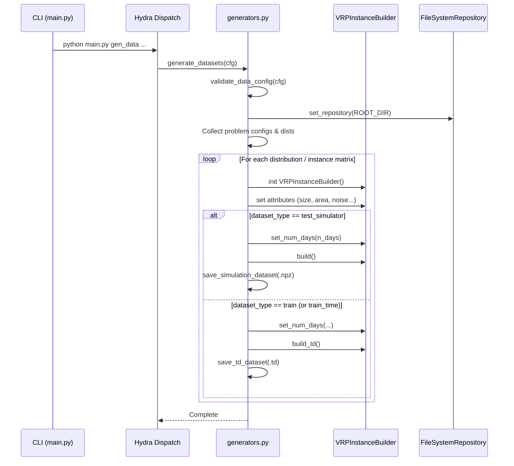

# WSmart-Route Architecture

[](https://www.python.org/)
[](https://pytorch.org/get-started/locally/)
[](https://github.com/astral-sh/uv)
[](https://www.gurobi.com/)
[](https://github.com/astral-sh/ruff)
[](https://mypy-lang.org/)
[](https://docs.pytest.org/)
[](https://coverage.readthedocs.io/)
[](https://github.com/ACFHarbinger/WSmart-Route/actions/workflows/ci.yml)

> **Version**: 4.0
> **Last Updated**: January 22, 2026 (Lightning Migration Complete)
> **Purpose**: Comprehensive system design documentation for WSmart+ Route

WSmart-Route is a high-performance framework designed to solve complex Combinatorial Optimization (CO) problems, specifically the Vehicle Routing Problem with Profits (VRPP) and Capacitated Waste Collection VRP (CWC VRP). It bridges the gap between Deep Reinforcement Learning (DRL) and Operations Research (OR) by providing a unified environment for training, benchmarking, and deploying intelligent agents alongside classical solvers.

---

## Table of Contents

1. [High-Level Overview](#1-high-level-overview)
2. [Technology Stack](#2-technology-stack)
3. [System Layers](#3-system-layers)
4. [Key Design Patterns](#4-key-design-patterns)
5. [Data Flow](#5-data-flow)
6. [Component Interactions](#6-component-interactions)
7. [Directory Structure](#7-directory-structure)
8. [Neural Architecture Details](#8-neural-architecture-details)
9. [Optimization Solver Integration](#9-optimization-solver-integration)
10. [Reinforcement Learning Pipeline](#10-reinforcement-learning-pipeline)
11. [Simulator Architecture](#11-simulator-architecture)
12. [GUI Architecture](#12-gui-architecture)
13. [Configuration Management](#13-configuration-management)
14. [Deployment Architecture](#14-deployment-architecture)
15. [Performance Considerations](#15-performance-considerations)

---

## Module Documentation

For detailed technical documentation of individual subsystems, see the [docs/](docs/) directory:

| Document                                               | Module                  | Description                                                                   |
| ------------------------------------------------------ | ----------------------- | ----------------------------------------------------------------------------- |
| **[CLI Module](docs/CLI_MODULE.md)**                   | `logic/src/cli/`        | Command-line interface, argument parsing, Hydra integration, and entry points |
| **[Configuration Module](docs/CONFIGS_MODULE.md)**     | `logic/src/configs/`    | Config system architecture, Hydra composition, and dataclass configurations   |
| **[Configuration Guide](docs/CONFIGURATION_GUIDE.md)** | -                       | Comprehensive guide to Hydra configuration, CLI overrides, and best practices |
| **[Constants Module](docs/CONSTANTS_MODULE.md)**       | `logic/src/utils/`      | System-wide constants, problem definitions, and enum types                    |
| **[Data Module](docs/DATA_MODULE.md)**                 | `logic/src/data/`       | Dataset generation, loading utilities, and data augmentation                  |
| **[Environments Module](docs/ENVS_MODULE.md)**         | `logic/src/envs/`       | Problem environments (VRPP, WCVRP, SCWCVRP) and state management              |
| **[Interfaces Module](docs/INTERFACES_MODULE.md)**     | `logic/src/interfaces/` | Abstract base classes, protocols, and type definitions                        |
| **[Models Module](docs/MODELS_MODULE.md)**             | `logic/src/models/`     | Neural architectures, encoders, decoders, and network components (264KB doc)  |
| **[Pipeline Module](docs/PIPELINE_MODULE.md)**         | `logic/src/pipeline/`   | Training, evaluation, simulation orchestration, and RL algorithms             |
| **[Policies Module](docs/POLICIES_MODULE.md)**         | `logic/src/policies/`   | Classical solvers (Gurobi, ALNS, HGS) and heuristic policies                  |
| **[Utilities Module](docs/UTILS_MODULE.md)**           | `logic/src/utils/`      | Helper functions, I/O utilities, logging, and debugging tools                 |

These module docs complement the high-level architecture overview below with implementation-level details, API references, and usage examples.

---

## 1. High-Level Overview

The system operates on a **hybrid architecture** where DRL agents learn to construct solutions or gate classical heuristics. It supports:

### 1.1 Core Capabilities

| Capability                 | Description                                                                               |
| -------------------------- | ----------------------------------------------------------------------------------------- |
| **Simulation**             | Event-driven simulator for waste collection logistics over temporal horizons (1-365 days) |
| **Neural Optimization**    | Attention-based models for constructive routing (AM, TAM, DDAM)                           |
| **Classical Optimization** | Suite of solvers: exact (BPC), metaheuristics (ALNS, HGS), heuristics                     |
| **Hierarchical RL**        | Manager-Worker architecture for multi-level decision making                               |
| **Interactive GUI**        | PySide6 application for visualization and control                                         |
| **CLI/TUI**                | Modular command-line interface with interactive terminal UI                               |

### 1.2 Architecture Principles

1. **Separation of Concerns**: Logic layer completely independent of GUI
2. **Modularity**: Components can be swapped (encoders, decoders, policies)
3. **Extensibility**: Factory patterns for easy addition of new models/policies
4. **Reproducibility**: Seeded randomness, checkpointing, configuration versioning
5. **Scalability**: Parallel execution, GPU acceleration, distributed HPO

### 1.3 System Context Diagram

```
┌─────────────────────────────────────────────────────────────────────────────┐
│                              User Interfaces                                │
├─────────────────┬───────────────────┬───────────────────────────────────────┤
│      CLI        │       TUI         │                GUI                    │
│   (main.py)     │    (rich/prompt)  │             (PySide6)                 │
└────────┬────────┴─────────┬─────────┴─────────────────┬─────────────────────┘
         │                  │                           │
         ▼                  ▼                           ▼
┌─────────────────────────────────────────────────────────────────────────────┐
│                          Logic Layer (logic/src/)                           │
├─────────────────────────────────────────────────────────────────────────────┤
│  ┌─────────────┐  ┌─────────────┐  ┌─────────────┐  ┌─────────────────────┐ │
│  │   Models    │  │  Policies   │  │   Envs      │  │     Pipeline        │ │
│  │  (Neural)   │  │ (Classical) │  │ (Problems)  │  │ (Train/Eval/Sim)    │ │
│  └──────┬──────┘  └──────┬──────┘  └──────┬──────┘  └──────────┬──────────┘ │
│         │                │                │                    │            │
│         └────────────────┼────────────────┼────────────────────┘            │
│                          ▼                ▼                                 │
│                    ┌─────────────────────────────┐                          │
│                    │     Simulator Engine        │                          │
│                    │  (Bins, Network, Actions)   │                          │
│                    └─────────────────────────────┘                          │
└─────────────────────────────────────────────────────────────────────────────┘
         │                                                        │
         ▼                                                        ▼
┌─────────────────────────┐                        ┌─────────────────────────┐
│    External Solvers     │                        │       Data Layer        │
├─────────────────────────┤                        ├─────────────────────────┤
│  • Gurobi (Exact)       │                        │  • Datasets (data/)     │
│  • Hexaly (Local Search)│                        │  • Model Weights        │
│  • OR-Tools             │                        │  • Distance Matrices    │
│  • PyVRP                │                        │  • Waste Fill Data      │
│  • ALNS Package         │                        │  • Configurations       │
└─────────────────────────┘                        └─────────────────────────┘
```

---

## 2. Technology Stack

### 2.1 Runtime Environment

| Component           | Specification  | Notes                                |
| ------------------- | -------------- | ------------------------------------ |
| **Python**          | 3.9+           | Managed via `uv` package manager     |
| **Package Manager** | uv             | Fast, reliable dependency resolution |
| **Build System**    | pyproject.toml | PEP 517/518 compliant                |

### 2.2 Deep Learning Stack

| Library               | Version | Purpose                      |
| --------------------- | ------- | ---------------------------- |
| **PyTorch**           | 2.2.2   | Core deep learning framework |
| **PyTorch Geometric** | 2.3.1   | Graph neural network layers  |
| **torch-scatter**     | 2.1.2+  | Sparse tensor operations     |
| **TensorBoard**       | 2.20.0  | Training visualization       |
| **Weights & Biases**  | 0.21.1  | Experiment tracking          |

### 2.3 Optimization Solvers

| Solver       | Version | Type          | Use Case                              |
| ------------ | ------- | ------------- | ------------------------------------- |
| **Gurobi**   | 11.0.3  | Exact (MIP)   | Optimal solutions for small instances |
| **Hexaly**   | 14.0+   | Hybrid        | High-performance local search         |
| **OR-Tools** | 9.4     | Hybrid        | Google's optimization toolkit         |
| **PyVRP**    | 0.9.1+  | Metaheuristic | HGS-based VRP solver                  |
| **ALNS**     | 7.0+    | Metaheuristic | Adaptive neighborhood search          |
| **fast-tsp** | 0.1.4   | Heuristic     | Quick TSP solutions                   |

### 2.4 Data Engineering

| Library       | Version | Purpose               |
| ------------- | ------- | --------------------- |
| **Pandas**    | 2.1.4   | Data manipulation     |
| **NumPy**     | 1.26.4  | Numerical computing   |
| **SciPy**     | 1.13.1  | Scientific algorithms |
| **NetworkX**  | 3.2.1   | Graph algorithms      |
| **GeoPandas** | 1.0.1   | Geographic data       |
| **Shapely**   | 2.0.7   | Geometric operations  |

### 2.5 GUI & Visualization

| Library        | Version | Purpose                       |
| -------------- | ------- | ----------------------------- |
| **PySide6**    | 6.9.0   | Qt for Python (GUI framework) |
| **Matplotlib** | 3.9.4   | Static plotting               |
| **Plotly**     | 6.3.0   | Interactive charts            |
| **Folium**     | 0.20.0  | Map visualization             |
| **Seaborn**    | 0.13.2  | Statistical plots             |

### 2.6 CLI & Utilities

| Library            | Version | Purpose                  |
| ------------------ | ------- | ------------------------ |
| **hydra-core**     | 1.3.2   | Configuration management |
| **rich**           | 14.1.0  | Rich terminal output     |
| **prompt-toolkit** | -       | Interactive TUI          |
| **loguru**         | 0.7.3   | Logging framework        |
| **PyYAML**         | 6.0.2   | Configuration files      |

---

## 3. System Layers

### 3.1 Logic Layer (`logic/src/`)

The core computational engine, strictly separated from UI concerns.

```
logic/src/
├── cli/                          # Command-line interface
│   ├── __init__.py               # parse_params(), launch_tui()
│   ├── base_parser.py            # ConfigsParser base class
│   ├── registry.py               # Command dispatcher
│   ├── sim_parser.py             # Simulation/eval arguments
│   ├── data_parser.py            # Data generation arguments
│   ├── fs_parser.py              # File system arguments
│   ├── gui_parser.py             # GUI arguments
│   ├── ts_parser.py              # Test suite arguments
│   └── tui.py                    # Terminal UI
│
├── models/                       # Neural architectures
│   ├── attention_model.py        # Core AM implementation
│   ├── deep_decoder_am.py        # Deep decoder variant
│   ├── temporal_am.py            # Temporal attention
│   ├── gat_lstm_manager.py       # HRL manager
│   ├── pointer_network.py        # Classic pointer network
│   ├── meta_rnn.py               # Meta-learning component
│   ├── context_embedder.py       # Problem embeddings
│   ├── critic_network.py         # Value baseline
│   ├── hypernet.py               # Weight generation
│   ├── moe_model.py              # Mixture of experts
│   ├── model_factory.py          # Factory pattern
│   ├── embeddings/               # Problem embeddings
│   │   ├── __init__.py           # Registry & factory
│   │   ├── vrpp.py               # VRPP embedding
│   │   ├── cvrpp.py              # CVRPP embedding
│   │   └── wcvrp.py              # WCVRP embedding
│   ├── policies/                 # Neural policy wrappers
│   │   ├── am.py
│   │   ├── base.py
│   │   ├── critic.py
│   │   ├── deep_decoder.py
│   │   ├── pointer.py
│   │   ├── symnco.py
│   │   ├── temporal.py
│   │   ├── utils.py
│   │   └── classical/            # Classical policy wrappers
│   │   │   ├── __init__.py
│   │   │   ├── alns.py           # ALNS wrapper
│   │   │   ├── adaptive_large_neighborhood_search.py
│   │   │   ├── hgs.py            # HGS wrapper
│   │   │   ├── hybrid_genetic_search.py
│   │   │   ├── hybrid.py
│   │   │   ├── local_search.py   # Local search operators
│   │   │   ├── random_local_search.py
│   │   │   └── split.py          # Split algorithm
│   ├── modules/                  # Atomic components
│   │   ├── multi_head_attention.py
│   │   ├── graph_convolution.py
│   │   ├── distance_graph_convolution.py
│   │   ├── gated_graph_convolution.py
│   │   ├── efficient_graph_convolution.py
│   │   ├── feed_forward.py
│   │   ├── normalization.py
│   │   ├── activation_function.py
│   │   ├── skip_connection.py
│   │   ├── connections.py
│   │   ├── hyper_connection.py
│   │   ├── moe.py
│   │   ├── moe_feed_forward.py
│   │   └── normalized_activation_function.py
│   └── subnets/                  # Encoder/decoder networks
│       ├── gat_encoder.py
│       ├── gac_encoder.py
│       ├── tgc_encoder.py
│       ├── ggac_encoder.py
│       ├── gcn_encoder.py
│       ├── mlp_encoder.py
│       ├── ptr_encoder.py
│       ├── moe_encoder.py
│       ├── attention_decoder.py
│       ├── gat_decoder.py
│       ├── ptr_decoder.py
│       ├── deep_decoder.py
│       └── grf_predictor.py
│
├── policies/                     # Classical algorithms
│   ├── regular.py                # Fixed schedule
│   ├── last_minute.py            # Reactive threshold
│   ├── look_ahead.py             # Rolling horizon
│   ├── adaptive_large_neighborhood_search.py
│   ├── branch_cut_and_price.py
│   ├── hybrid_genetic_search.py
│   ├── multi_vehicle.py
│   ├── single_vehicle.py
│   ├── lin_kernighan.py
│   ├── neural_agent.py           # Neural wrapper
│   ├── policy_swc_tcf.py
│   ├── dispatcher.py
│   ├── adapters.py               # PolicyFactory
│   ├── alns_aux/                 # ALNS operators
│   ├── look_ahead_aux/           # Look-ahead helpers
│   └── hgs_aux/                  # HGS components
│
├── envs/                         # Problem environments (formerly tasks/)
│   ├── base.py                   # BaseProblem class
│   ├── generators.py             # Data generators
│   ├── problems.py               # Problem registry
│   ├── vrpp.py                   # VRPP implementation
│   ├── wcvrp.py                  # WCVRP implementation
│   ├── swcvrp.py                 # SWCVRP implementation
│   └── .py.typed
│
├── pipeline/                     # Orchestration
│   ├── simulations/              # Simulator engine
│   │   ├── simulator.py
│   │   ├── day.py
│   │   ├── bins.py
│   │   ├── network.py
│   │   ├── loader.py
│   │   ├── processor.py
│   │   ├── actions.py
│   │   ├── states.py
│   │   ├── context.py
│   │   ├── checkpoints.py
│   │   └── wsmart_bin_analysis/
│   ├── rl/                       # Lightning-based RL pipeline (ACTIVE)
│   │   ├── common/               # Training utilities
│   │   │   ├── base.py           # RL4COLitModule
│   │   │   ├── baselines.py      # Rollout, Critic, POMO, Warmup, etc.
│   │   │   ├── epoch.py          # Epoch management
│   │   │   ├── time_training.py  # Temporal training
│   │   │   └── post_processing.py
│   │   ├── core/                 # RL algorithms
│   │   │   ├── reinforce.py
│   │   │   ├── ppo.py
│   │   │   ├── sapo.py
│   │   │   ├── gspo.py
│   │   │   ├── dr_grpo.py
│   │   │   ├── pomo.py
│   │   │   ├── symnco.py
│   │   │   ├── imitation.py
│   │   │   ├── adaptive_imitation.py
│   │   │   ├── hrl.py
│   │   ├── meta/                 # Meta-learning
│   │   │   ├── contextual_bandits.py
│   │   │   ├── multi_objective.py
│   │   │   ├── td_learning.py
│   │   │   ├── weight_optimizer.py
│   │   │   └── hypernet_strategy.py
│   │   ├── hpo/                  # Hyperparameter optimization
│   │   │   ├── optuna_hpo.py
│   │   │   └── dehb.py
│   ├── features/                 # Feature-specific implementations
│   │   ├── train.py              # Main training entry point (Hydra)
│   │   ├── eval.py               # Evaluation pipeline
│   │   └── test.py               # Simulation testing
│
├── data/                         # Data generation
│   ├── generate_data.py
│   ├── builders.py
│   ├── datasets.py
│   ├── fast_datasets.py
│   └── transforms.py
│
└── utils/                        # Utilities
    ├── definitions.py            # Global constants
    ├── setup_utils.py            # Initialization
    ├── io_utils.py               # File I/O
    ├── data_utils.py             # Data processing
    ├── debug_utils.py            # Debugging
    ├── crypto_utils.py           # Encryption
    ├── config_loader.py          # Config loading
    ├── task_utils.py             # Task utilities
    ├── check_docstrings.py       # Doc validation
    ├── functions/                # Algorithm helpers
    │   ├── beam_search.py
    │   ├── boolmask.py
    │   ├── graph_utils.py
    │   ├── lexsort.py
    │   ├── monkey_patch.py
    │   └── function.py
    ├── io/                       # I/O submodule
    └── logging/                  # Logging submodule
```

### 3.2 GUI Layer (`gui/src/`)

Multi-threaded desktop application for visualization and control.

```
gui/src/
├── app.py                        # Application entry
├── windows/                      # Top-level windows
│   ├── main_window.py            # Main container
│   └── ts_results_window.py      # Simulation dashboard
│
├── tabs/                         # Functional modules
│   ├── reinforcement_learning/   # Training configuration
│   │   ├── rl_base.py
│   │   ├── rl_model.py
│   │   ├── rl_data.py
│   │   ├── rl_optim.py
│   │   ├── rl_costs.py
│   │   ├── rl_training.py
│   │   ├── rl_output.py
│   │   └── scripts.py
│   ├── evaluation/               # Model evaluation
│   │   ├── eval_problem.py
│   │   ├── eval_data_batching.py
│   │   ├── eval_input_output.py
│   │   └── eval_decoding.py
│   ├── test_simulator/           # Simulation testing
│   │   ├── ts_tab.py
│   │   ├── ts_settings.py
│   │   ├── ts_policy_parameters.py
│   │   ├── ts_input_output.py
│   │   └── ts_advanced.py
│   ├── generate_data/            # Data generation
│   │   ├── gd_general.py
│   │   ├── gd_problem.py
│   │   └── gd_advanced.py
│   ├── analysis/                 # Visualization
│   │   ├── input_analysis.py
│   │   ├── output_analysis.py
│   │   └── pandas_model.py
│   ├── file_system/              # File management
│   │   ├── fs_update.py
│   │   ├── fs_delete.py
│   │   └── fs_cryptography.py
│   ├── meta_rl_train.py          # Meta-learning
│   └── hyperparam_optim.py       # HPO
│
├── helpers/                      # Background workers
│   ├── chart_worker.py           # Plot data streaming
│   ├── data_loader_worker.py     # Async data loading
│   └── file_tailer_worker.py     # Log streaming
│
├── core/                         # Core logic
│   └── mediator.py               # Mediator pattern
│
├── components/                   # Reusable widgets
│   └── clickable_header.py       # Collapsible header
│
├── utils/                        # GUI utilities
│   └── app_definitions.py        # UI registry
│
└── styles/                       # Visual design
    └── globals.py                # Stylesheets
```

---

## 4. Key Design Patterns

### 4.1 Pattern Overview

| Pattern             | Location                          | Purpose                           |
| ------------------- | --------------------------------- | --------------------------------- |
| **Factory**         | `model_factory.py`, `adapters.py` | Centralized object creation       |
| **Strategy**        | `policies/*`                      | Interchangeable algorithms        |
| **State**           | `simulations/states.py`           | Simulation lifecycle management   |
| **Command**         | `simulations/actions.py`          | Encapsulated simulation steps     |
| **Mediator**        | `gui/core/mediator.py`            | Decoupled component communication |
| **Observer**        | `checkpoints.py` (hooks)          | State persistence triggers        |
| **Template Method** | `trainers.py`                     | Training loop skeleton            |

### 4.2 Factory Pattern

```python
# model_factory.py
class ModelFactory:
    @staticmethod
    def create_model(name: str, problem: str, opts: dict) -> nn.Module:
        if name == 'am':
            return AttentionModel(problem, **opts)
        elif name == 'tam':
            return TemporalAM(problem, **opts)
        elif name == 'ddam':
            return DeepDecoderAM(problem, **opts)
        ...

# adapters.py
class PolicyFactory:
    @staticmethod
    def get_adapter(policy_name: str, **kwargs) -> Policy:
        if policy_name == 'gurobi':
            return GurobiPolicy(**kwargs)
        elif policy_name == 'alns':
            return ALNSPolicy(**kwargs)
        ...
```

### 4.3 State Pattern (Simulator Lifecycle)

```python
# simulations/states.py
class SimulationState(ABC):
    @abstractmethod
    def handle(self, context: SimulationContext) -> 'SimulationState':
        pass

class InitializingState(SimulationState):
    def handle(self, context):
        # Load data, initialize bins, setup network
        context.load_area_data()
        context.initialize_bins()
        return RunningState()

class RunningState(SimulationState):
    def handle(self, context):
        if context.current_day >= context.max_days:
            return FinishingState()
        context.run_day()
        return self

class FinishingState(SimulationState):
    def handle(self, context):
        context.save_results()
        return None  # Terminal state
```

### 4.4 Command Pattern (Simulation Actions)

```python
# simulations/actions.py
class SimulationAction(ABC):
    @abstractmethod
    def execute(self, context: SimulationDayContext) -> None:
        pass

class FillBinsAction(SimulationAction):
    def execute(self, context):
        context.bins.fill_stochastic()

class ExecutePolicyAction(SimulationAction):
    def __init__(self, policy: Policy):
        self.policy = policy

    def execute(self, context):
        routes = self.policy.solve(context.state)
        context.set_routes(routes)

class CollectWasteAction(SimulationAction):
    def execute(self, context):
        context.bins.collect(context.routes)

class LogResultsAction(SimulationAction):
    def execute(self, context):
        context.log_daily_metrics()
```

### 4.5 Mediator Pattern (GUI Communication)

```python
# gui/core/mediator.py
class UIMediator:
    def __init__(self):
        self._main_window = None
        self._tabs = {}

    def register_tab(self, name: str, tab: QWidget):
        self._tabs[name] = tab
        tab.set_mediator(self)

    def notify(self, sender: QWidget, event: str, data: dict):
        if event == 'command_updated':
            self._main_window.update_command_preview(data['command'])
        elif event == 'training_started':
            self._tabs['analysis'].enable_live_plotting()
```

---

## 5. Data Flow

### 5.1 Training Pipeline Flow

```
┌─────────────┐     ┌────────────────┐     ┌─────────────────┐
│ User Input  │───▶│ Hydra Config   │───▶│ Config Object   │
│ (CLI/GUI)   │     │ (yaml/override)│     │ (dataclass)     │
└─────────────┘     └────────────────┘     └────────┬────────┘
                                                    │
                                                    ▼
┌─────────────────────────────────────────────────────────────┐
│                      Training Pipeline                      │
├─────────────────────────────────────────────────────────────┤
│  ┌───────────────┐     ┌───────────────┐     ┌─────────────┐│
│  │ Data Loader   │───▶│ Model Factory │───▶│   Model     ││
│  │ (batch_size)  │     │ (create_model)│     │ (encoder+   ││
│  │               │     │               │     │  decoder)   ││
│  └───────────────┘     └───────────────┘     └──────┬──────┘│
│                                                     │       │
│  ┌───────────────┐    ┌───────────────┐             │       │
│  │   Baseline    │◀──│ RL Algorithm  │◀───────────┘       │
│  │ (rollout/     │    │ (REINFORCE/   │                     │
│  │  critic/pomo) │    │  PPO/etc.)    │                     │
│  └───────────────┘    └───────┬───────┘                     │
│                               │                             │
│                               ▼                             │
│  ┌───────────────┐    ┌───────────────┐                     │
│  │  Checkpoint   │◀──│   Optimizer   │                     │
│  │  (model.pt)   │    │ (Adam/SGD)    │                     │
│  └───────────────┘    └───────────────┘                     │
└─────────────────────────────────────────────────────────────┘
```

### 5.2 Simulation Pipeline Flow

```
┌─────────────┐
│   Config    │
│ (policies,  │
│  days, area)│
└──────┬──────┘
       │
       ▼
┌──────────────────────────────────────────────────────────────┐
│                    Simulation Pipeline                       │
├──────────────────────────────────────────────────────────────┤
│                                                              │
│  ┌──────────────────────────────────────────────────────────┐│
│  │                  Initialization Phase                    ││
│  │  ┌──────────┐   ┌──────────┐   ┌──────────┐   ┌─────────┐││
│  │  │  Loader  │─▶│ Network  │─▶│   Bins   │─▶│ Context │││
│  │  │(area data│   │(distance │   │(fill     │   │(config) │││
│  │  │coords)   │   │ matrix)  │   │ rates)   │   │         │││
│  │  └──────────┘   └──────────┘   └──────────┘   └─────────┘││
│  └──────────────────────────────────────────────────────────┘│
│                            │                                 │
│                            ▼                                 │
│  ┌─────────────────────────────────────────────────────────┐ │
│  │                  Day Loop (for each day)                │ │
│  │                                                         │ │
│  │  ┌─────────┐   ┌──────────┐   ┌──────────┐   ┌─────────┐│ │
│  │  │ Fill    │─▶│ Policy   │─▶│ Execute  │─▶│  Log    ││ │
│  │  │ Bins    │   │ Decision │   │ Routes   │   │ Results ││ │
│  │  │ (γ dist)│   │          │   │ (collect)│   │ (JSON)  ││ │
│  │  └─────────┘   └──────────┘   └──────────┘   └─────────┘│ │
│  │                                                         │ │
│  │Actions: [FillBins] → [ExecutePolicy] → [Collect] → [Log]│ |
│  └─────────────────────────────────────────────────────────┘ │
│                            │                                 │
│                            ▼                                 │
│  ┌─────────────────────────────────────────────────────────┐ │
│  │                  Finalization Phase                     │ │
│  │  ┌──────────────┐   ┌──────────────┐   ┌───────────────┐│ │
│  │  │ Aggregate    │─▶│ Generate     │─▶│ Save Results  ││ │
│  │  │ Statistics   │   │ Heatmaps     │   │ (Excel/JSON)  ││ │
│  │  └──────────────┘   └──────────────┘   └───────────────┘│ │
│  └─────────────────────────────────────────────────────────┘ │
└──────────────────────────────────────────────────────────────┘
```

### 5.3 Neural Model Forward Pass

```
Input: {loc, waste, depot}
              │
              ▼
    ┌─────────────────┐
    │ Context Embedder│  Problem-specific initial embeddings
    └────────┬────────┘
             │
             ▼
    ┌─────────────────┐
    │     Encoder     │  GAT/GCN/TGC layers
    │  (N layers)     │  Multi-head attention + FFN
    └────────┬────────┘
             │
             ▼
    ┌─────────────────┐
    │  Graph Pooling  │  Aggregate node embeddings
    │  (mean/sum/max) │
    └────────┬────────┘
             │
             ▼
    ┌─────────────────────────────────────────────┐
    │              Decoder (Autoregressive)        │
    │                                              │
    │   for step in range(max_steps):              │
    │     ┌────────────────────────────────────┐   │
    │     │ 1. Compute context (current state) │   │
    │     │ 2. Attend over node embeddings     │   │
    │     │ 3. Apply mask (invalid nodes)      │   │
    │     │ 4. Sample/argmax next node         │   │
    │     │ 5. Update state                    │   │
    │     └────────────────────────────────────┘   │
    │                                              │
    └────────────────────┬─────────────────────────┘
                         │
                         ▼
              Output: {actions, log_probs}
```

---

## 6. Component Interactions

### 6.1 Model-Problem Interface

```python
# Each model implements this interface
class RoutingModel(nn.Module):
    def forward(self, input: Dict[str, Tensor], return_pi: bool = False) -> Tuple:
        """
        Args:
            input: Problem instance batch
                - 'loc': (batch, nodes, 2) coordinates
                - 'waste': (batch, nodes) rewards
                - 'depot': (batch, 2) depot location

        Returns:
            cost: (batch,) solution costs
            log_likelihood: (batch,) log probabilities
            pi (optional): (batch, seq_len) action sequence
        """

# Each problem implements this interface
class BaseProblem:
    def get_costs(self, dataset: Dict, pi: Tensor) -> Tensor:
        """Compute costs for given routes."""

    def get_reward(self, dataset: Dict, pi: Tensor) -> Tensor:
        """Compute rewards (for VRPP)."""

    def make_state(self, input: Dict) -> State:
        """Create initial state for decoding."""
```

### 6.2 Policy Interface

```python
class Policy(ABC):
    @abstractmethod
    def solve(
        self,
        distances: np.ndarray,
        wastes: np.ndarray,
        capacity: float,
        depot: int = 0
    ) -> Tuple[List[List[int]], float, float]:
        """
        Solve routing problem.

        Returns:
            routes: List of routes (each route is list of node indices)
            total_profit: Sum of collected wastes
            total_cost: Sum of distances traveled
        """

# All policies implement this:
# - GurobiPolicy
# - ALNSPolicy
# - HGSPolicy
# - LookAheadPolicy
# - NeuralPolicy
# etc.
```

### 6.3 Simulator-Policy Interface

```python
class Simulator:
    def run_day(self, policy: Policy) -> DayResult:
        # Get current state
        state = self.get_current_state()

        # Policy decision
        routes, profit, cost = policy.solve(
            distances=self.network.distance_matrix,
            wastes=self.bins.get_wastes(),
            capacity=self.vehicle_capacity,
            depot=self.depot_index
        )

        # Execute routes
        collected = self.bins.collect(routes)

        # Log results
        return DayResult(
            routes=routes,
            kg_collected=collected,
            km_traveled=cost,
            overflows=self.bins.count_overflows()
        )
```

---

## 7. Directory Structure

### 7.1 Complete Project Structure

```
WSmart-Route/
├── logic/                        # Core logic layer
│   ├── src/                      # Source code
│   │   ├── cli/                  # CLI argument parsers
│   │   ├── models/               # Neural architectures
│   │   │   ├── modules/          # Atomic components
│   │   │   └── subnets/          # Encoders/decoders
│   │   ├── policies/             # Classical algorithms
│   │   │   ├── alns_aux/         # ALNS operators
│   │   │   ├── look_ahead_aux/   # Look-ahead helpers
│   │   │   └── hgs_aux/          # HGS components
│   │   ├── envs/                # Problem environments
│   │   │   ├── vrpp.py           # VRPP environment
│   │   │   ├── wcvrp.py          # WCVRP environment
│   │   │   └── swcvrp.py         # SWCVRP environment
│   │   ├── pipeline/             # Orchestration
│   │   │   ├── simulations/      # Simulator engine
│   │   │   ├── rl/                       # RL algorithms (Lightning-based, ACTIVE)
│   │   │   │   ├── core/         # Core RL
│   │   │   │   ├── meta/         # Meta-learning
│   │   │   │   ├── hpo/          # Hyperparameter optimization
│   │   │   │   └── features/     # Training utilities
│   │   ├── data/                 # Data generation
│   │   └── utils/                # Utilities
│   │       ├── functions/        # Algorithm helpers
│   │       ├── io/               # I/O submodule
│   │       └── logging/          # Logging submodule
│   └── test/                     # Logic tests
│       └── fixtures/             # Test fixtures
│
├── gui/                          # GUI layer
│   ├── src/                      # Source code
│   │   ├── windows/              # Application windows
│   │   ├── tabs/                 # Functional tabs
│   │   │   ├── reinforcement_learning/   # DEPRECATED
│   │   │   ├── evaluation/
│   │   │   ├── test_simulator/
│   │   │   ├── generate_data/
│   │   │   ├── analysis/
│   │   │   └── file_system/
│   │   ├── helpers/              # Background workers
│   │   ├── core/                 # Core logic
│   │   ├── components/           # Reusable widgets
│   │   ├── utils/                # GUI utilities
│   │   └── styles/               # Visual design
│   └── test/                     # GUI tests
│
├── scripts/                      # Execution scripts
│   ├── train.sh                  # Training
│   ├── gen_data.sh               # Data generation
│   ├── test_sim.sh               # Simulation testing
│   ├── evaluation.sh             # Evaluation
│   ├── meta_train.sh             # Meta-learning
│   ├── hyperparam_optim.sh       # HPO
│   ├── setup_env.sh              # Environment setup
│   ├── slurm.sh                  # HPC cluster
│   └── *.bat                     # Windows equivalents
│
├── assets/                       # Static assets
│   ├── configs/                  # Configuration files
│   ├── diagrams/                 # Architecture diagrams
│   ├── images/                   # UI images & logos
│   ├── keys/                     # Encryption keys
│   ├── model_weights/            # Pre-trained models
│   │   └── [area]/[problem]/     # Organized by area/problem
│   └── output/                   # Generated outputs
│       └── [experiment]/         # Experiment results
│
├── data/                         # Datasets (git-ignored)
│   ├── vrpp/                     # VRPP datasets
│   ├── wcvrp/                    # WCVRP datasets
│   ├── bins_coords/              # Bin coordinates
│   ├── bins_waste/               # Waste fill data
│   └── distance_matrices/        # Distance matrices
│
├── reports/                      # Research reports
│
├── .github/                      # GitHub configuration
│   └── workflows/
│       ├── ci.yml                # CI/CD pipeline
│       └── sync-to-public.yml    # Public sync
│
├── env/                          # Environment files
│   ├── environment.yml           # Conda environment
│   └── requirements.txt          # Pip requirements
│
├── main.py                       # Main entry point
├── __main__.py                   # Package entry
├── pyproject.toml                # Project configuration
├── Makefile                      # Build targets
├── .gitignore                    # Git ignore rules
├── .pre-commit-config.yaml       # Pre-commit hooks
│
├── README.md                     # Main documentation
├── AGENTS.md                     # AI assistant guide
├── CONTRIBUTING.md               # Contribution guide
├── CHANGELOG.md                  # Version history
│
├── docs/                         # Documentation
│   ├── ARCHITECTURE.md           # This file
│   ├── BENCHMARKS.md             # Performance benchmarks
│   ├── COMPATIBILITY.md          # Model-environment matrix
│   ├── DEPENDENCIES.md           # Dependency policy
│   ├── DEVELOPMENT.md            # Development guide
│   ├── GLOSSARY.md               # Terms & abbreviations
│   ├── ROADMAP.md                # Implementation roadmap
│   ├── TESTING.md                # Testing guide
│   ├── TROUBLESHOOTING.md        # Troubleshooting guide
│   ├── TUTORIAL.md               # Deep dive tutorials
│   ├── CLI_MODULE.md             # CLI module docs
│   ├── CONFIGS_MODULE.md         # Configuration module docs
│   ├── CONFIGURATION_GUIDE.md    # Hydra config guide
│   ├── CONSTANTS_MODULE.md       # Constants module docs
│   ├── DATA_MODULE.md            # Data module docs
│   ├── ENVS_MODULE.md            # Environments module docs
│   ├── INTERFACES_MODULE.md      # Interfaces module docs
│   ├── MODELS_MODULE.md          # Models module docs
│   ├── PIPELINE_MODULE.md        # Pipeline module docs
│   ├── POLICIES_MODULE.md        # Policies module docs
│   ├── UTILS_MODULE.md           # Utilities module docs
│   └── DOCUMENTATION_STANDARDS.md # Documentation standards
```

---

## 8. Neural Architecture Details

### 8.1 Attention Model (AM)

The flagship architecture for constructive routing.

```
                          AttentionModel
                               │
           ┌───────────────────┼─────────────────┐
           ▼                   ▼                 ▼
    ┌─────────────┐    ┌─────────────┐    ┌─────────────┐
    │  Context    │    │   Encoder   │    │   Decoder   │
    │  Embedder   │    │ (3 layers)  │    │ (attention) │
    └──────┬──────┘    └──────┬──────┘    └──────┬──────┘
           │                  │                  │
           │    ┌─────────────┘                  │
           │    │                                │
           ▼    ▼                                ▼
    ┌──────────────┐                      ┌─────────────┐
    │ Node Features│                      │   Action    │
    │  (128-dim)   │────────────────────▶│  Selection  │
    └──────────────┘                      └─────────────┘

Encoder Layer:
    x → MHA(x) → Add&Norm → FFN(x) → Add&Norm → x'

    MHA: Multi-Head Attention (8 heads, 128 dim)
    FFN: 2-layer MLP (128 → 512 → 128)
    Norm: Instance Normalization

Decoder (per step):
    1. context = [graph_embedding; current_node; remaining_capacity]
    2. q = W_q @ context
    3. k = W_k @ node_embeddings
    4. v = W_v @ node_embeddings
    5. scores = (q @ k.T) / sqrt(d_k)
    6. scores = mask_invalid(scores)  # -inf for invalid
    7. probs = softmax(scores)
    8. action = sample(probs) or argmax(probs)
```

### 8.2 Encoder Types

| Encoder         | Architecture               | Use Case                          |
| --------------- | -------------------------- | --------------------------------- |
| **GATEncoder**  | Multi-head Graph Attention | Default; best for variable graphs |
| **GACEncoder**  | GAT + Edge Features        | When edge features matter         |
| **TGCEncoder**  | Transformer-style GCN      | Capturing long-range dependencies |
| **GGACEncoder** | Gated GAT                  | Complex node-edge interactions    |
| **GCNEncoder**  | Standard GCN               | Faster; fixed topology            |
| **MLPEncoder**  | Pure MLP                   | No graph structure                |

### 8.3 Hierarchical RL (Manager-Worker)

```
                    MustGoManager (High-Level)
                           │
                    ┌──────┴──────┐
                    │  GAT + LSTM │
                    │ (Temporal)  │
                    └──────┬──────┘
                           │
                    Gate Probability
                    (Collect Today?)
                           │
              ┌────────────┴────────────┐
              │                         │
          p(gate)=0                 p(gate)=1
          (Skip Day)                (Collect)
              │                         │
              ▼                         ▼
          No Routes               AttentionModel
                                   (Low-Level)
                                        │
                                  ┌─────┴─────┐
                                  │  Encoder  │
                                  │  Decoder  │
                                  └─────┬─────┘
                                        │
                                        ▼
                                     Routes
```

---

## 9. Optimization Solver Integration

### 9.1 Gurobi Integration

```python
# vrpp_optimizer.py
class GurobiVRPPOptimizer:
    def __init__(self, time_limit: int = 300, mip_gap: float = 0.01):
        self.time_limit = time_limit
        self.mip_gap = mip_gap

    def solve(self, distances, wastes, capacity, depot=0):
        import gurobipy as gp

        n = len(distances)
        model = gp.Model("VRPP")

        # Variables
        x = model.addVars(n, n, vtype=gp.GRB.BINARY, name="x")  # Edges
        y = model.addVars(n, vtype=gp.GRB.BINARY, name="y")     # Visited

        # Objective: Maximize profit - cost
        model.setObjective(
            gp.quicksum(wastes[i] * y[i] for i in range(n)) -
            gp.quicksum(distances[i][j] * x[i,j] for i,j in range(n)),
            gp.GRB.MAXIMIZE
        )

        # Constraints: Capacity, connectivity, subtour elimination
        ...

        model.optimize()
        return self._extract_routes(x, y)
```

### 9.2 ALNS Integration

```python
# adaptive_large_neighborhood_search.py
class ALNSSolver:
    def __init__(self):
        self.destroy_operators = [
            RandomDestroy(),
            WorstDestroy(),
            RelatedDestroy()
        ]
        self.repair_operators = [
            GreedyRepair(),
            RegretRepair()
        ]

    def solve(self, instance, max_iterations=10000):
        from alns import ALNS, State

        alns = ALNS()
        for op in self.destroy_operators:
            alns.add_destroy_operator(op)
        for op in self.repair_operators:
            alns.add_repair_operator(op)

        initial = self.construct_initial(instance)
        result = alns.iterate(initial, max_iterations)
        return result.best_state.routes
```

### 9.3 Policy Selection Matrix

| Instance Size   | Speed Priority | Quality Priority | Recommended         |
| --------------- | -------------- | ---------------- | ------------------- |
| < 50 nodes      | -              | ★★★              | Gurobi (exact)      |
| < 100 nodes     | ★★             | ★★★              | HGS                 |
| < 200 nodes     | ★★★            | ★★               | ALNS                |
| > 200 nodes     | ★★★            | ★★               | Neural (AM)         |
| Any (multi-day) | ★★             | ★★★              | Look-Ahead + Gurobi |

---

## 10. Reinforcement Learning Pipeline

### 10.1 REINFORCE Algorithm

```python
# reinforce.py
def train_batch(self, batch):
    # 1. Forward pass
    cost, log_p, pi = self.model(batch, return_pi=True)

    # 2. Compute baseline
    if self.baseline_type == 'rollout':
        with torch.no_grad():
            bl_cost, _, _ = self.baseline_model(batch)
    elif self.baseline_type == 'critic':
        bl_cost = self.critic(batch)
    elif self.baseline_type == 'exponential':
        bl_cost = self.running_avg

    # 3. Compute advantage
    advantage = cost - bl_cost

    # 4. Policy gradient loss
    reinforce_loss = (advantage * log_p).mean()

    # 5. Optional: Entropy bonus
    entropy = -(log_p * log_p.exp()).sum(-1).mean()
    loss = reinforce_loss - self.entropy_weight * entropy

    # 6. Backward pass
    self.optimizer.zero_grad()
    loss.backward()
    torch.nn.utils.clip_grad_norm_(self.model.parameters(), self.max_grad_norm)
    self.optimizer.step()

    return loss.item()
```

### 10.2 Baseline Strategies

| Baseline        | Description      | Variance Reduction | Computational Cost |
| --------------- | ---------------- | ------------------ | ------------------ |
| **None**        | Raw reward       | None               | None               |
| **Exponential** | Moving average   | Low                | Low                |
| **Critic**      | Learned V(s)     | Medium             | Medium             |
| **Rollout**     | Greedy eval      | High               | High               |
| **POMO**        | Multi-start best | Very High          | Very High          |

### 10.3 Training Loop

```python
# train_lightning.py
def train(cfg: DictConfig):
    # Setup
    model = ModelFactory.create_lit_model(cfg)
    callbacks = [
        ModelCheckpoint(...),
        RichProgressBar(),
        LearningRateMonitor()
    ]

    # Initialize Trainer
    trainer = L.Trainer(
        accelerator=cfg.train.accelerator,
        devices=cfg.train.devices,
        max_epochs=cfg.train.n_epochs,
        callbacks=callbacks,
        logger=WandbLogger(...)
    )

    # Train
    trainer.fit(model)
```

---

## 11. Simulator Architecture

### 11.1 Component Diagram

```
┌─────────────────────────────────────────────────────────────────────┐
│                         Simulator Engine                            │
├─────────────────────────────────────────────────────────────────────┤
│                                                                     │
│ ┌──────────────┐      ┌──────────────┐      ┌──────────────────────┐│
│ │   Context    │◀──▶│    State     │◀──▶│      Actions         ││
│ │  (config,    │      │  Machine     │      │  (Fill, Execute,     ││
│ │   state)     │      │ (lifecycle)  │      │   Collect, Log)      ││
│ └──────────────┘      └──────────────┘      └──────────────────────┘│
│         │                   │                        │              │
│         │                   │                        │              │
│         ▼                   ▼                        ▼              │
│  ┌──────────────────────────────────────────────────────────────┐   │
│  │                      Components                              │   │
│  ├──────────────┬──────────────┬──────────────┬─────────────────┤   │
│  │    Bins      │   Network    │   Loader     │   Checkpoint    │   │
│  │ (fill, level │ (distances,  │ (area data,  │ (save, resume)  │   │
│  │  collect)    │  shortest    │  coords)     │                 │   │
│  │              │  path)       │              │                 │   │
│  └──────────────┴──────────────┴──────────────┴─────────────────┘   │
│                                                                     │
└─────────────────────────────────────────────────────────────────────┘
```

### 11.2 Bin Fill Models

```python
# bins.py
class Bins:
    def fill_stochastic(self):
        """Fill bins using configured distribution."""
        if self.distribution == 'gamma':
            # Gamma distribution: X ~ Γ(α, β)
            fill_amounts = np.random.gamma(
                self.alpha,
                self.beta,
                size=self.n_bins
            )
        elif self.distribution == 'empirical':
            # Sample from historical data
            fill_amounts = np.random.choice(
                self.historical_fills,
                size=self.n_bins
            )

        # Update levels (capped at capacity)
        self.levels = np.minimum(
            self.levels + fill_amounts,
            self.capacities
        )

    def collect(self, routes: List[List[int]]) -> float:
        """Collect waste from visited bins."""
        total_collected = 0.0
        for route in routes:
            for bin_idx in route:
                if bin_idx != self.depot_idx:
                    total_collected += self.levels[bin_idx]
                    self.levels[bin_idx] = 0.0
        return total_collected
```

### 11.3 Distance Matrix Computation

````python
# network.py
class Network:
    def compute_distance_matrix(self, method='osm'):
        """Compute pairwise distances between nodes."""
        if method == 'osm':
            # Real road network via OpenStreetMap
            import osmnx as ox
            G = ox.graph_from_point(self.center, dist=5000, network_type='drive')
            for i, j in combinations(range(self.n_nodes), 2):
                path = ox.shortest_path(G, self.nodes[i], self.nodes[j])
                self.distances[i, j] = ox.utils_graph.get_route_edge_attributes(G, path, 'length')
                self.distances[j, i] = self.distances[i, j]

        elif method == 'euclidean':
            # Straight-line distance
            from scipy.spatial.distance import cdist
            self.distances = cdist(self.coords, self.coords, metric='euclidean')

        elif method == 'google':
            # Google Maps Distance Matrix API
            from googlemaps import Client
            client = Client(key=self.api_key)
            # ... API calls ...

### 11.4 Selection Strategies

Modular strategies control *which* bins are selected for collection each day.

| Strategy | Description | Configuration Parameters |
|----------|-------------|--------------------------|
| **LastMinute** | Reactive: Collect when fill level > threshold | `threshold` (0.0-1.0) |
| **Lookahead** | Proactive: Collect if overflow predicted within N days | `lookahead_days` (int) |
| **Revenue** | Profit-driven: Collect if Revenue > Cost | `price_per_kg`, `cost_per_km` |
| **Regular** | Periodic: Fixed schedule (e.g., every 3 days) | `frequency` (days) |
| **MeansStdDev** | Statistical: Collect if current + mean fill * days > capacity | `confidence_factor` (float) |

These strategies are composable via `MustGoSelectionAction` and can be chained with `PostProcessAction` for complex behaviors.

### 11.5 Post-Processing

The `PostProcessAction` allows for modular refinement of generated tours. It functions as a middleware layer between policy execution and the final simulation step.

- **Purpose**: Refine tours (e.g., local search, TSP re-optimization) completely independent of the generation policy.
- **Configuration**: List of processors defined in `post_processing` key of simulation config.
- **Support**: Can Use XML/YAML configs similarly to selection strategies.

```python
# actions.py
class PostProcessAction(SimulationAction):
    def execute(self, context):
        tour = context.get("tour")
        processors = context.get("config").get("post_processing", [])

        for pp_name in processors:
             processor = PostProcessorFactory.create(pp_name)
             tour = processor.process(tour)

        context["tour"] = tour
````

```

---

## 12. GUI Architecture

### 12.1 Application Structure

```

┌─────────────────────────────────────────────────────────────────────┐
│ MainWindow (QMainWindow) │
├──────────────────────────┬──────────────────────────────────────────┤
│ Menu Bar │ │
│ ┌────┬────┬────┬────┐ │ │
│ │File│Edit│View│Help│ │ │
│ └────┴────┴────┴────┘ │ │
├──────────────────────────┼──────────────────────────────────────────┤
│ │ │
│ Navigation Sidebar │ Central Tab Widget │
│ ┌──────────────────┐ │ ┌──────────────────────────────────┐ │
│ │ 🎓 Training │ │ │ [Training] [Eval] [Sim] [Data] │ │
│ │ 📊 Evaluation │ │ ├──────────────────────────────────┤ │
│ │ 🧪 Simulation │ │ │ │ │
│ │ 📁 Data Gen │ │ │ Active Tab Content │ │
│ │ 📈 Analysis │ │ │ │ │
│ │ ⚙️ Settings │ │ │ │ │
│ └──────────────────┘ │ │ │ │
│ │ │ │ │
│ │ └──────────────────────────────────┘ │
├──────────────────────────┴──────────────────────────────────────────┤
│ Status Bar │
│ [Ready] [GPU: RTX 4080] [Memory: 4.2GB/12GB] [Progress: ████░ 80%] │
└─────────────────────────────────────────────────────────────────────┘

```

### 12.2 Signal Flow

```

┌─────────────────┐ ┌─────────────────┐ ┌─────────────────┐
│ Training Tab │ │ UIMediator │ │ MainWindow │
│ │ │ │ │ │
│ [Start Button] │─signal──▶│ notify() │─update──▶│ Command Preview │
│ [Parameters] │─signal──▶│ (routing) │─update──▶│ Status Bar │
│ │ │ │ │ │
└────────┬────────┘ └────────┬────────┘ └─────────────────┘
│ │
│ │ notify
│ ▼
│ ┌─────────────────┐
│ │ Analysis Tab │
│ │ │
└───data ready────▶│ enable_plotting │
│ │
└─────────────────┘

````

### 12.3 Background Worker Pattern

```python
# helpers/chart_worker.py
class ChartWorker(QThread):
    data_ready = Signal(dict)
    finished = Signal()

    def __init__(self, log_path: str):
        super().__init__()
        self.log_path = log_path
        self.running = True

    def run(self):
        while self.running:
            try:
                data = self.parse_log()
                self.data_ready.emit(data)
            except Exception as e:
                logger.error(f"ChartWorker error: {e}")
            self.msleep(1000)  # Poll every second

        self.finished.emit()

    def stop(self):
        self.running = False

# Usage in Tab
class TrainingTab(QWidget):
    def start_training(self):
        self.chart_worker = ChartWorker(self.log_path)
        self.chart_worker.data_ready.connect(self.update_chart)
        self.chart_worker.finished.connect(self.on_training_finished)
        self.chart_worker.start()

    def update_chart(self, data):
        self.plot_widget.update(data)
````

---

## 13. Configuration Management

### 13.1 Configuration Hierarchy

```
┌─────────────────────────────────────────────────────────────────────┐
│                    Configuration Hierarchy                          │
├─────────────────────────────────────────────────────────────────────┤
│                                                                     │
│  1. Defaults (hardcoded in parser)                                  │
│     │                                                               │
│     ▼                                                               │
│  2. YAML Config (assets/configs/*.yaml)                             │
│     │                                                               │
│     ▼                                                               │
│  3. Environment Variables                                           │
│     │                                                               │
│     ▼                                                               │
│  4. Command Line Arguments                                          │
│     │                                                               │
│     ▼                                                               │
│  Final Configuration (opts object)                                  │
│                                                                     │
└─────────────────────────────────────────────────────────────────────┘
```

### 13.2 Key Configuration Files

| File                                   | Purpose                           |
| -------------------------------------- | --------------------------------- |
| `pyproject.toml`                       | Project metadata, dependencies    |
| `assets/configs/train.yaml`            | Training defaults                 |
| `assets/configs/sim.yaml`              | Simulation defaults               |
| `assets/configs/areas/*.yaml`          | Area-specific settings            |
| `assets/configs/policies/*.{yaml,xml}` | Detailed Policy Configurations    |
| `.env`                                 | Environment secrets (git-ignored) |

### 13.3 Configuration Dataclass

```python
# From CLI parsing
@dataclass
class TrainConfigs:
    # Model
    model: str = 'am'
    encoder: str = 'gat'
    embed_dim: int = 128
    hidden_dim: int = 512
    n_encode_layers: int = 3

    # Training
    n_epochs: int = 100
    batch_size: int = 256
    learning_rate: float = 1e-4
    optimizer: str = 'adam'

    # RL
    rl_algorithm: str = 'reinforce'
    baseline: str = 'rollout'
    entropy_weight: float = 0.0

    # Problem
    problem: str = 'vrpp'
    graph_size: int = 50

    # Hardware
    cuda_enabled: bool = True
    seed: int = 42
```

---

## 14. Deployment Architecture

### 14.1 Deployment Options

| Method                    | Use Case                | Requirements      |
| ------------------------- | ----------------------- | ----------------- |
| **Local (uv)**            | Development, research   | Python 3.9+, CUDA |
| **Docker**                | Reproducible deployment | Docker engine     |
| **HPC (Slurm)**           | Large-scale experiments | Slurm cluster     |
| **Desktop (PyInstaller)** | End-user distribution   | None              |

### 14.2 Slurm Deployment

```bash
# scripts/slurm.sh
#!/bin/bash
#SBATCH --job-name=wsmart-train
#SBATCH --nodes=1
#SBATCH --ntasks=1
#SBATCH --cpus-per-task=8
#SBATCH --gres=gpu:1
#SBATCH --mem=32G
#SBATCH --time=24:00:00
#SBATCH --output=logs/%j.out

module load cuda/11.8
module load python/3.9

source .venv/bin/activate

python main.py train_lightning \
    model=am \
    env.name=vrpp \
    env.num_loc=100 \
    train.n_epochs=100 \
    train.batch_size=256
```

### 14.3 CI/CD Pipeline

```yaml
# .github/workflows/ci.yml
name: CI

on:
  push:
    branches: [main]
  pull_request:
    branches: [main]

jobs:
  test:
    runs-on: ubuntu-latest
    steps:
      - uses: actions/checkout@v4
      - name: Install uv
        uses: astral-sh/setup-uv@v1
      - name: Setup Python
        run: uv python install 3.9
      - name: Install dependencies
        run: uv sync --all-extras --dev
      - name: Lint
        run: uv run ruff check .
      - name: Test
        run: uv run pytest --cov --cov-report=xml
```

---

## 15. Performance Considerations

### 15.1 GPU Memory Optimization

| Strategy                   | Implementation                                |
| -------------------------- | --------------------------------------------- |
| **Gradient Checkpointing** | `torch.utils.checkpoint` for encoder layers   |
| **Mixed Precision**        | `torch.cuda.amp.autocast()` for FP16 training |
| **Batch Size Tuning**      | Auto-detect based on available VRAM           |
| **Memory Profiling**       | `torch.cuda.memory_stats()` monitoring        |

### 15.2 Parallel Execution

```python
# Simulation parallelization
from concurrent.futures import ProcessPoolExecutor

def run_parallel_simulation(configs, n_workers=-1):
    if n_workers == -1:
        n_workers = os.cpu_count()

    with ProcessPoolExecutor(max_workers=n_workers) as executor:
        futures = []
        for config in configs:
            future = executor.submit(run_single_simulation, config)
            futures.append(future)

        results = [f.result() for f in futures]
    return results
```

### 15.3 Caching Strategies

| Cache Type                | Location                  | Purpose                 |
| ------------------------- | ------------------------- | ----------------------- |
| **Distance Matrices**     | `data/distance_matrices/` | Avoid recomputation     |
| **Compiled Models**       | `torch.jit`               | Faster inference        |
| **Dataset Preprocessing** | `.pkl` files              | Skip loading overhead   |
| **HPO Results**           | `assets/output/hpo/`      | Resume interrupted runs |

### 15.4 Profiling Tools

```bash
# PyTorch Profiler
python -m torch.profiler --profile-memory main.py train_lightning

# NVIDIA Nsight
nsys profile python main.py train_lightning

# Memory Profiling
python -m memory_profiler main.py train_lightning
```

---

## Appendix: Architecture Decision Records

### ADR-001: Separation of Logic and GUI

**Decision**: Maintain strict separation between `logic/` and `gui/` layers.

**Rationale**:

- Enables headless operation for HPC clusters
- Facilitates testing of logic without GUI dependencies
- Allows future alternative interfaces (web, mobile)

**Consequences**:

- GUI must communicate via defined interfaces only
- Logic cannot import any GUI module
- Shared utilities must be in `logic/src/utils/`

### ADR-002: Factory Pattern for Models and Policies

**Decision**: Use factory methods for instantiating models and policies.

**Rationale**:

- Centralized creation logic
- Easy addition of new implementations
- Consistent configuration handling

**Consequences**:

- All models must be registered in `model_factory.py`
- All policies must be registered in `adapters.py`
- CLI/GUI can reference by string name

### ADR-003: State Pattern for Simulator

**Decision**: Implement simulator lifecycle using State pattern.

**Rationale**:

- Clear state transitions
- Supports checkpointing and resume
- Isolates phase-specific logic

**Consequences**:

- Each state is a separate class
- State transitions are explicit
- Context holds shared state

---

**This architecture document is the blueprint for WSmart+ Route. Keep it updated as the system evolves.**

---

## 16. Hydra Command Execution Flows

The project is driven by a central Hydra configuration model, primarily coordinated through `hydra_dispatch.py`. Depending on the exact CLI mode invoked, workflows resolve specific configurations natively before executing dedicated entry point engines.

### 16.1 Train Command (`train_lightning`, `hpo`, `meta_train`)

The `run_training` and `run_hpo` entry points coordinate Lightning training instances, initializing trainers and handling configurations before distributing epochs to hardware.



### 16.2 Evaluate Command (`eval`)

The evaluation pipeline handles deterministic assessment of models over dataset instances and exports solutions/tours directly, typically in single-process chunks or GPU scatter processes.



### 16.3 Simulator Command (`test_sim`)

The state-driven sequence orchestrates one or more environments over configured `N` days, iterating through fill models and executing heuristic/routing models daily to yield a consolidated JSON result file.



### 16.4 Data Generation Command (`gen_data`)

The generic VRP generator engine is responsible for initializing coordinates, node attributes, graph topology, and baseline wastes depending on whether the structure targets RL training sets or complex periodic sequence simulations.


