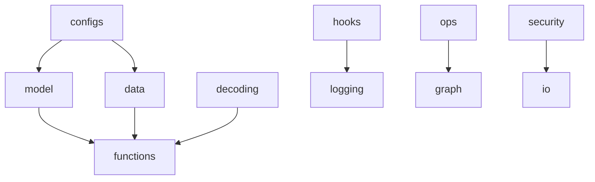

# Foundational Utilities & Mathematical Toolkit

**Module**: `logic/src/utils`
**Purpose**: Comprehensive technical specification of the foundational toolkit—including config management, data processing, and security.
**Version**: 3.0
**Last Updated**: February 2026

---

## Table of Contents

1.  [**Overview**](#1-overview)
2.  [**Module Organization**](#2-module-organization)
3.  [**Configuration Utilities**](#3-configuration-utilities)
4.  [**Data Utilities**](#4-data-utilities)
5.  [**Decoding Utilities**](#5-decoding-utilities)
6.  [**Documentation Utilities**](#6-documentation-utilities)
7.  [**Function Utilities**](#7-function-utilities)
8.  [**Graph Utilities**](#8-graph-utilities)
9.  [**PyTorch Hooks**](#9-pytorch-hooks)
10. [**IO Utilities**](#10-io-utilities)
11. [**Logging Utilities**](#11-logging-utilities)
12. [**Model Utilities**](#12-model-utilities)
13. [**Operations Utilities**](#13-operations-utilities)
14. [**Security Utilities**](#14-security-utilities)
15. [**Task Utilities**](#15-task-utilities)
16. [**UI Utilities**](#16-ui-utilities)
17. [**Validation Utilities**](#17-validation-utilities)
18. [**Integration Examples**](#18-integration-examples)
19. [**Best Practices**](#19-best-practices)
20. [**Quick Reference**](#20-appendix-quick-reference)

---

## 1. Overview

The `logic/src/utils` module provides the foundational toolkit for the WSmart+ Route framework. It encompasses 15 specialized sub-modules covering everything from configuration management and data processing to neural network training utilities and security features.

### Design Philosophy

1. **Modularity**: Each sub-module is self-contained with clear responsibilities
2. **Reusability**: Functions designed for cross-component usage
3. **Type Safety**: Comprehensive type hints and input validation
4. **Performance**: Optimized tensor operations and batch processing
5. **Security**: Built-in encryption and key management

### Import Strategy

```python
# Import specific utilities
from logic.src.utils.configs import setup_model_and_baseline
from logic.src.utils.data import generate_waste, load_dataset
from logic.src.utils.hooks import add_gradient_monitoring_hooks

# Or import sub-module
from logic.src.utils import configs, data, hooks
```

---

## 2. Module Organization

```
logic/src/utils/
├── configs/          # Configuration and setup management
├── data/             # Data generation and loading
├── decoding/         # Action selection strategies
├── docs/             # Documentation automation
├── functions/        # Low-level mathematical utilities
├── graph/            # Graph construction and algorithms
├── hooks/            # PyTorch training monitors
├── io/               # File operations and I/O
├── logging/          # Multi-layered logging system
├── model/            # Model loading and checkpointing
├── ops/              # Specialized tensor operations
├── security/         # Cryptography and key management
├── tasks/            # RL loss functions and optimizers
├── ui/               # Frontend integration utilities
└── validation/       # Code quality enforcement
```

### Module Dependencies



---

## 3. Configuration Utilities

**Module**: `logic/src/utils/configs/`

Translates configuration files (YAML, Hydra, XML) into executable runtime objects.

### Key Components

#### Environment Setup (`setup_env.py`)

```python
from logic.src.utils.configs.setup_env import setup_cost_weights, setup_env

# Parse cost component weights
weights = setup_cost_weights(opts, def_val=1.0)
# Returns: {"w_waste": 1.0, "w_length": 1.0, "w_overflows": 1.0}

# Initialize Gurobi environment
env = setup_env(
    license_file="path/to/license.lic",
    server="hostname:port"
)
```

**Features**:

- Problem-specific weight configuration
- Gurobi license management
- Secure key file decryption

#### Training Setup (`setup_training.py`)

```python
from logic.src.utils.configs.setup_training import setup_model_and_baseline

opts = {
    'encoder': 'gat',           # Graph Attention encoder
    'embed_dim': 128,
    'baseline': 'rollout',      # Greedy rollout baseline
    'bl_update_every': 1,
    'device': 'cuda'
}

model, baseline = setup_model_and_baseline(
    problem=MyProblem(),
    data_load={},
    use_cuda=True,
    opts=opts
)
```

**Supported Baselines**:

- `ExponentialBaseline`: Exponential moving average
- `CriticBaseline`: Neural value function
- `RolloutBaseline`: Greedy rollout (standard for REINFORCE)
- `POMOBaseline`: Shared baseline for POMO training

#### Optimization Setup (`setup_optimization.py`)

```python
from logic.src.utils.configs.setup_optimization import setup_optimizer_and_scheduler

optimizer, scheduler = setup_optimizer_and_scheduler(
    model=model,
    baseline=baseline,
    opts={
        'optimizer': 'adam',
        'lr': 1e-4,
        'scheduler': 'cosine',
        'T_max': 100
    }
)
```

**Supported Optimizers**: Adam, AdamW, SGD, RMSprop
**Supported Schedulers**: StepLR, ExponentialLR, CosineAnnealing, ReduceLROnPlateau

#### Configuration Loading (`config_loader.py`)

```python
from logic.src.utils.configs.config_loader import load_yaml_config, load_xml_config

# Load YAML
config = load_yaml_config("experiment.yaml")

# Load XML (legacy compatibility)
config_dict = load_xml_config("legacy_config.xml")
```

#### Shell Integration (`yaml_to_env.py`)

```python
from logic.src.utils.configs.yaml_to_env import to_bash_value, load_config

cfg = load_config("experiment.yaml")
# Convert to Bash-compatible format
bash_export = f"declare -A CONF={to_bash_value(cfg)}"
```

#### HRL Setup (`setup_manager.py`, `setup_worker.py`)

```python
from logic.src.utils.configs.setup_manager import setup_hrl_manager
from logic.src.utils.configs.setup_worker import setup_hrl_worker

# Load Manager agent (High-Level)
manager = setup_hrl_manager(
    policy_name="gat_lstm_manager",
    checkpoint_dir="weights/"
)

# Load Worker agent (Low-Level)
worker = setup_hrl_worker(
    policy_name="am_worker",
    checkpoint_dir="weights/"
)
```

---

## 4. Data Utilities

**Module**: `logic/src/utils/data/`

Manages data lifecycle: generation, loading, serialization, and state management.

### Key Components

#### Synthetic Data Generation (`generation.py`)

```python
from logic.src.utils.data.generation import generate_waste, generate_focus

# Generate waste levels for 100 instances with 20 nodes
waste_data = generate_waste(
    problem_size=20,
    distribution="gamma",       # Realistic variability
    graph=(coords, None),       # Coordinate array
    dataset_size=100
)

# Create clustered distributions (hotspots)
focus_data = generate_focus(
    size=20,
    num_focus=3,                # 3 hotspot clusters
    focus_range=(0.7, 1.0)      # High fill levels
)
```

**Supported Distributions**:

- `uniform`: Uniform random [0, 1]
- `gamma`: Gamma distribution (realistic waste patterns)
- `normal`: Normal distribution
- `focus`: Clustered hotspots

#### Dataset Serialization (`loader.py`)

```python
from logic.src.utils.data.loader import (
    save_dataset, load_dataset,
    save_td_dataset, load_td_dataset
)

# Standard pickle I/O
save_dataset(data, "train.pkl")
loaded_data = load_dataset("train.pkl")

# TensorDict specialized I/O
save_td_dataset(td_batch, "train_td.pkl")
td_batch = load_td_dataset("train_td.pkl", device="cuda")
```

#### State Wrapper (`td_state_wrapper.py`)

```python
from logic.src.utils.data.td_state_wrapper import TensorDictStateWrapper

# Wrap raw environment state
state_wrapper = TensorDictStateWrapper(
    raw_td,
    problem_name="cvrp",
    env=env
)

# Access standardized features
current_node = state_wrapper.get_current_node()
mask = state_wrapper.get_mask()
is_done = state_wrapper.finished

# Take action
next_state = state_wrapper.update(action)
```

**Properties**:

- `current_node`: Current vehicle location
- `current_fill`: Current bin fill levels
- `finished`: Episode termination flag
- `visited`: Visited node mask
- `overflows`: Overflow count

#### TensorDict Utilities (`td_utils.py`)

```python
from logic.src.utils.data.td_utils import tensordict_collate_fn

# Custom collation for DataLoader
dataloader = DataLoader(
    dataset,
    batch_size=32,
    collate_fn=tensordict_collate_fn,
    pin_memory=True
)
```

**Features**:

- Recursive nested dictionary handling
- Automatic TensorDict stacking
- Fixes `pin_memory` issues

#### Simulation Parameters (`parameters.py`)

```python
from logic.src.utils.data.parameters import load_area_and_waste_type_params

# Load real-world calibrated parameters
capacity, revenue, density, cost, bin_vol = load_area_and_waste_type_params(
    area="Rio Maior",           # Portuguese municipality
    waste_type="plastic"        # Waste stream
)
```

**Supported Areas**: Rio Maior, Figueira da Foz, Mixed (mixrmbac)
**Supported Waste Types**: glass, plastic, paper

#### RL Data Handling (`rl_utils.py`)

```python
from logic.src.utils.data.rl_utils import ensure_tensordict

# Ensure data is TensorDict format
td = ensure_tensordict(
    data,
    device="cuda",
    auto_convert=True
)
```

---

## 5. Decoding Utilities

**Module**: `logic/src/utils/decoding/`

Action selection strategies for converting neural network logits into discrete actions.

### Key Components

#### Base Strategy (`base.py`)

```python
from logic.src.utils.decoding.base import DecodingStrategy

class CustomDecoder(DecodingStrategy):
    def step(self, logits, mask, td):
        # Implement custom decoding logic
        pass
```

**Common Parameters**:

- `temperature`: Scales logits before softmax (T↑ = more random, T↓ = more greedy)
- `tanh_clipping`: Prevents numerical instability (Bello et al. 2016)
- `mask_logits`: Mask invalid actions (set to -∞)

#### Greedy Decoding (`greedy.py`)

```python
from logic.src.utils.decoding import Greedy

# Deterministic selection (argmax)
decoder = Greedy(mask_logits=True)
action, log_probs, entropy = decoder.step(logits, mask, td)
```

**Use Cases**:

- Validation/testing
- Fast inference
- Baseline rollouts

#### Sampling Strategies (`sampling.py`)

```python
from logic.src.utils.decoding import Sampling

# Stochastic sampling with temperature
decoder = Sampling(
    temperature=1.5,            # Higher = more exploration
    mask_logits=True,
    top_k=5,                    # Top-k sampling
    top_p=0.9                   # Nucleus sampling
)

action, log_probs, entropy = decoder.step(logits, mask, td)
```

**Sampling Modes**:

- **Standard**: Sample from full distribution
- **Top-K**: Restrict to K most likely actions
- **Top-P (Nucleus)**: Restrict to cumulative probability ≥ P

**Use Cases**:

- REINFORCE training
- POMO exploration
- Stochastic policy evaluation

#### Beam Search (`beam_search.py`, `batch_beam.py`)

```python
from logic.src.utils.decoding import BeamSearch

# Maintain top-B partial solutions
decoder = BeamSearch(
    beam_width=5,               # Track top-5 solutions
    expand_size=10              # Consider 10 candidates per expansion
)

next_action, beam_probs, _ = decoder.step(logits, mask, td)
```

**Features**:

- GPU-optimized batch processing
- Efficient beam expansion/pruning
- Parallel candidate scoring

**Use Cases**:

- High-quality inference
- Competitive baselines
- Solution refinement

#### Evaluation Mode (`evaluate.py`)

```python
from logic.src.utils.decoding import Evaluate

# Calculate probability of given action sequence
decoder = Evaluate()
_, log_prob_sequence, _ = decoder.step(
    logits,
    mask,
    td,
    predetermined_actions=expert_actions
)
```

**Use Cases**:

- Imitation learning
- Expert trajectory evaluation
- Policy distillation

#### Decoding Utilities (`decoding_utils.py`)

```python
from logic.src.utils.decoding.decoding_utils import (
    batchify, unbatchify,
    top_k_filter, top_p_filter,
    CachedLookup
)

# Duplicate tensors for multi-start
batched = batchify(input_tensor, n=8)  # [B, ...] -> [B*8, ...]

# Filter logits for Top-K sampling
filtered_logits = top_k_filter(logits, k=5)

# Efficient state lookup for beam search
cache = CachedLookup(state_dict)
retrieved_state = cache.get(beam_index)
```

---

## 6. Documentation Utilities

**Module**: `logic/src/utils/docs/`

Automated documentation generation, validation, and style enforcement.

### Key Components

#### Automated Docstring Injection (`add_docstrings_batch.py`)

```bash
# Process single file
python logic/src/utils/docs/add_docstrings_batch.py logic/src/models/my_model.py

# Process directory (recursively)
python logic/src/utils/docs/add_docstrings_batch.py logic/src/models/
```

**Features**:

- AST-based parsing (non-destructive)
- Pre-populated templates with:
  - Argument names and types
  - Return types
  - Class attributes
- Safe insertion (no overwriting existing docstrings)

#### Missing Docstring Detection (`check_docstrings.py`)

```bash
# Check directory for missing docstrings
python logic/src/utils/docs/check_docstrings.py logic/src/models
```

**Output**:

```
Missing Docstrings Report
━━━━━━━━━━━━━━━━━━━━━━━━━━━━━━━━━━━━━━━━━
File                     Type      Name
─────────────────────────────────────────
models/attention.py      Function  forward
models/attention.py      Class     MultiHeadAttention
━━━━━━━━━━━━━━━━━━━━━━━━━━━━━━━━━━━━━━━━
Total: 2 missing docstrings
```

**Features**:

- Ignores private members (`_name`)
- Rich table formatting
- Module/Class/Function categorization

#### Style Validation (`check_google_style.py`)

```bash
# Validate Google Style compliance
python logic/src/utils/docs/check_google_style.py logic/src
```

**Checks**:

- ✅ `Args:` section present for functions with parameters
- ✅ `Returns:` section present for functions with return values
- ✅ `Attributes:` section present for classes
- ✅ Documented args match function signature
- ✅ Correct indentation and formatting

**Example Violation**:

```python
def compute_cost(route, distance_matrix, penalty=10.0):
    """Compute route cost.

    Args:
        route: Node sequence.
        distance_matrix: Pairwise distances.
        # Missing: penalty parameter

    # Missing: Returns section
    """
    return total_cost
```

---

## 7. Function Utilities

**Module**: `logic/src/utils/functions/`

Low-level mathematical, tensor, and system utilities.

### Key Components

#### Tensor Operations (`tensors.py`)

```python
from logic.src.utils.functions.tensors import move_to, compute_in_batches

# Recursive device moving
data = {
    "features": torch.randn(10, 5),
    "metadata": {"ids": torch.arange(10)}
}
gpu_data = move_to(data, torch.device("cuda"))

# Batch processing (avoid OOM)
def expensive_function(x):
    return model(x)

results = compute_in_batches(
    expensive_function,
    calc_batch_size=64,      # Process 64 at a time
    large_tensor,            # [1000, ...]
    progress_bar=True
)
```

**Use Cases**:

- Large dataset processing
- Multi-GPU data distribution
- Memory-constrained inference

#### Boolean Masking (`boolmask.py`)

```python
from logic.src.utils.functions.boolmask import (
    create_visit_mask,
    create_capacity_mask
)

# Mask visited nodes
visit_mask = create_visit_mask(visited, num_nodes)

# Mask nodes exceeding capacity
capacity_mask = create_capacity_mask(
    current_capacity,
    node_demands,
    vehicle_capacity
)

# Combine masks
final_mask = visit_mask & capacity_mask
```

**Use Cases**:

- Invalid action masking in RL
- Variable-length sequence handling
- Constraint enforcement

#### Parallel Execution (`parallel.py`)

```python
from logic.src.utils.functions.parallel import parallel_map

# Parallel function application
results = parallel_map(
    func=process_instance,
    items=dataset,
    num_workers=8,
    use_threading=False      # Use multiprocessing
)
```

#### Path Utilities (`path.py`)

```python
from logic.src.utils.functions.path import (
    compute_path_distance,
    validate_path_constraints
)

# Compute Euclidean path length
distance = compute_path_distance(coordinates)

# Validate path feasibility
is_valid = validate_path_constraints(
    path,
    demands,
    capacity
)
```

#### Lexicographical Sort (`lexsort.py`)

```python
from logic.src.utils.functions.lexsort import lexsort, batch_micheal_moore_search

# Sort by x, then y coordinate
keys = [x_coords, y_coords]
sorted_indices = lexsort(keys, dim=-1)

# Michael-Moore search algorithm
best_solution = batch_micheal_moore_search(
    cost_matrix,
    initial_solution
)
```

#### Problem Type Detection (`problem.py`)

```python
from logic.src.utils.functions.problem import is_vrpp_problem, is_wc_problem

if is_vrpp_problem(problem_name):
    # Use profit-based objective
    reward = profit - cost
elif is_wc_problem(problem_name):
    # Use waste collection objective
    reward = kg_collected - overflows * penalty
```

#### Sampling Strategies (`sampling.py`)

```python
from logic.src.utils.functions.sampling import sample_many

# Generate diverse solutions
best_solution, best_cost = sample_many(
    policy=model,
    td=problem_instance,
    iter_rep=10,             # 10 repetitions
    batch_rep=1,
    decode_type="sampling"
)
```

#### RL Utilities (`rl.py`)

```python
from logic.src.utils.functions.rl import ensure_tensordict

# Robustly convert to TensorDict
td = ensure_tensordict(
    data_batch,
    device="cuda",
    auto_convert=True,
    validate=True
)
```

---

## 8. Graph Utilities

**Module**: `logic/src/utils/graph/`

Graph construction, conversion, and algorithm execution.

### Key Components

#### Graph Conversion (`conversion.py`)

```python
from logic.src.utils.graph.conversion import (
    adj_to_idx,
    idx_to_adj,
    tour_to_adj
)

# Dense adjacency matrix -> Sparse edge indices
adj = np.array([[0, 1, 0], [1, 0, 1], [0, 1, 0]])
edge_index = adj_to_idx(adj, negative=False)
# Returns: (2, E) array for PyTorch Geometric

# Sparse edge indices -> Dense adjacency matrix
adj_reconstructed = idx_to_adj(edge_index, num_nodes=3)

# Tour sequence -> Adjacency matrix
tour = [0, 3, 7, 12, 0]  # Depot -> nodes -> depot
adj_tour = tour_to_adj(tour, num_nodes=13)
```

#### Graph Algorithms (`algorithms.py`)

```python
from logic.src.utils.graph.algorithms import find_longest_path

# Find longest path in DAG
longest_path = find_longest_path(
    adj_matrix,
    source_node=0,
    target_node=10
)
```

**Algorithms**:

- Longest path (DAG)
- Shortest path (Floyd-Warshall, Dijkstra)
- Topological sort
- Connected components

#### Network Construction (`network_utils.py`)

```python
from logic.src.utils.graph.network_utils import (
    get_edge_idx_dist,
    get_adj_knn
)

# Distance-based connectivity (radius graph)
edge_idx, edge_attr = get_edge_idx_dist(
    distance_matrix,
    threshold=0.5         # Connect nodes within distance 0.5
)

# K-Nearest Neighbor graph
adj_knn = get_adj_knn(
    distance_matrix,
    k=5                   # Connect each node to 5 nearest
)
```

**Use Cases**:

- Sparse graph construction for GNNs
- Local connectivity modeling
- Distance-aware attention

#### Graph Generation (`generation.py`)

```python
from logic.src.utils.graph.generation import (
    generate_grid_graph,
    generate_random_graph,
    generate_clustered_graph
)

# Grid topology
adj_grid = generate_grid_graph(rows=10, cols=10)

# Random Erdős–Rényi graph
adj_random = generate_random_graph(n=100, p=0.1)

# Clustered graph
adj_clustered = generate_clustered_graph(
    num_nodes=100,
    num_clusters=5,
    intra_prob=0.8,        # High within-cluster connectivity
    inter_prob=0.05        # Low between-cluster connectivity
)
```

---

## 9. PyTorch Hooks

**Module**: `logic/src/utils/hooks/`

Comprehensive monitoring, debugging, and optimization tools for deep learning training.

### Categories

1. **Gradient Hooks** - Monitor gradient flow and detect training issues
2. **Activation Hooks** - Track activations, dead neurons, and sparsity
3. **Memory Hooks** - Profile GPU memory and optimize batch sizes
4. **Weight Hooks** - Monitor weight updates and detect training problems
5. **Attention Hooks** - Capture attention weights for visualization

### Gradient Hooks

#### Monitoring Gradients (`gradient_hooks.py`)

```python
from logic.src.utils.hooks import (
    add_gradient_monitoring_hooks,
    print_gradient_statistics
)

# Add monitoring hooks
hook_data = add_gradient_monitoring_hooks(
    model,
    gradient_threshold=10.0,   # Warn if gradient > 10
    verbose=True               # Print warnings
)

# Training step
loss.backward()

# View gradient statistics
print_gradient_statistics(hook_data['gradients'], top_k=10)
```

**Output**:

```
================================================================================
Layer Name                               Mean       Max        Norm
================================================================================
encoder.layers.0.weight                  0.0012     0.0234     1.45
encoder.layers.1.weight                  0.0008     0.0156     0.98
================================================================================
```

#### Per-Layer Gradient Clipping

```python
from logic.src.utils.hooks import add_gradient_clipping_hook

# Clip gradients to max norm of 1.0
handles = add_gradient_clipping_hook(model, max_norm=1.0)

# Training automatically clips gradients
loss.backward()
```

#### NaN/Inf Detection

```python
from logic.src.utils.hooks import add_gradient_nan_detector_hook

# Raise error if NaN detected
handles = add_gradient_nan_detector_hook(model, raise_on_nan=True)

try:
    loss.backward()
except ValueError as e:
    print(f"NaN gradient detected: {e}")
```

#### Gradient Accumulation Tracking

```python
from logic.src.utils.hooks import add_gradient_accumulation_hook

hook_data = add_gradient_accumulation_hook(model, accumulation_steps=4)

for _ in range(4):
    loss = compute_loss()
    loss.backward()  # Accumulate gradients

# Check accumulated norms
print(hook_data['accumulated_norms'])
```

### Activation Hooks

#### Capturing Activations (`activation_hooks.py`)

```python
from logic.src.utils.hooks import add_activation_capture_hooks

# Capture from specific layer types
hook_data = add_activation_capture_hooks(
    model,
    layer_types=(nn.Linear, nn.Conv2d)
)

output = model(input)

# Access activations
for name, activation in hook_data['activations'].items():
    print(f"{name}: shape={activation.shape}, mean={activation.mean():.4f}")
```

#### Dead Neuron Detection

```python
from logic.src.utils.hooks import add_dead_neuron_detector_hook

hook_data = add_dead_neuron_detector_hook(model, threshold=1e-6)

# Run multiple forward passes
for _ in range(100):
    output = model(input)

# Check for dead neurons
for name, count in hook_data['dead_neurons'].items():
    if count > 0:
        print(f"⚠️  {name}: {count} dead neurons")
```

#### Activation Statistics

```python
from logic.src.utils.hooks import (
    add_activation_statistics_hook,
    compute_activation_statistics,
    print_activation_summary
)

hook_data = add_activation_statistics_hook(model)

# Run forward passes
for _ in range(10):
    output = model(input)

# Compute final statistics
stats = compute_activation_statistics(hook_data['statistics'])
print_activation_summary(stats)
```

#### Activation Sparsity

```python
from logic.src.utils.hooks import (
    add_activation_sparsity_hook,
    compute_sparsity_percentages
)

hook_data = add_activation_sparsity_hook(model, threshold=0.01)
output = model(input)

sparsity = compute_sparsity_percentages(hook_data['sparsity'])
for name, pct in sparsity.items():
    print(f"{name}: {pct:.2%} sparse")
```

### Memory Hooks

#### Memory Profiling (`memory_hooks.py`)

```python
from logic.src.utils.hooks import add_memory_profiling_hooks, print_memory_summary

hook_data = add_memory_profiling_hooks(model)
output = model(input)

print_memory_summary(hook_data['memory_stats'], top_k=10)
```

#### Memory Leak Detection

```python
from logic.src.utils.hooks import add_memory_leak_detector_hook

hook_data = add_memory_leak_detector_hook(model, threshold_mb=50.0)

for _ in range(10):
    output = model(input)  # Warns if memory grows > 50MB
```

#### Estimating Memory Requirements

```python
from logic.src.utils.hooks import estimate_model_memory

memory = estimate_model_memory(
    model,
    input_shape=(100, 2),     # Without batch dimension
    batch_size=128
)

print(f"Parameters: {memory['param_mb']:.2f} MB")
print(f"Activations: {memory['activation_mb']:.2f} MB")
print(f"Total: {memory['total_mb']:.2f} MB")
```

#### Automatic Batch Size Optimization

```python
from logic.src.utils.hooks import optimize_batch_size

def input_generator(batch_size):
    return torch.randn(batch_size, 100, 2, device='cuda')

optimal_bs = optimize_batch_size(
    model,
    input_generator,
    initial_batch_size=32,
    safety_margin=0.9         # Use 90% of max
)

print(f"Optimal batch size: {optimal_bs}")
```

### Weight Hooks

#### Monitoring Weight Changes (`weight_hooks.py`)

```python
from logic.src.utils.hooks import (
    add_weight_change_monitor_hook,
    compute_weight_changes,
    print_weight_summary
)

# Store initial weights
hook_data = add_weight_change_monitor_hook(model)

# Train for some steps
for _ in range(100):
    loss.backward()
    optimizer.step()
    optimizer.zero_grad()

# Compute changes from initial state
changes = compute_weight_changes(model, hook_data, metric='norm')
print_weight_summary(changes, {})
```

#### Weight Distribution Monitoring

```python
from logic.src.utils.hooks import add_weight_distribution_monitor

stats = add_weight_distribution_monitor(model)

for name, stat in stats['statistics'].items():
    print(f"{name}:")
    print(f"  Mean: {stat['mean']:.4f}")
    print(f"  Std: {stat['std']:.4f}")
    print(f"  Sparsity: {stat['sparsity']:.2%}")
```

#### Weight Update Monitoring

```python
from logic.src.utils.hooks import (
    add_weight_update_monitor_hook,
    analyze_weight_updates,
    restore_optimizer_step
)

# Wrap optimizer
hook_data = add_weight_update_monitor_hook(optimizer, log_interval=10)

# Train
for _ in range(1000):
    loss.backward()
    optimizer.step()  # Updates logged automatically
    optimizer.zero_grad()

# Analyze update patterns
analysis = analyze_weight_updates(hook_data['update_history'], window_size=10)

for name, metrics in analysis.items():
    if metrics['is_stuck']:
        print(f"⚠️  {name}: Weights stuck (not updating)")
    if metrics['is_exploding']:
        print(f"⚠️  {name}: Exploding weights")

# Restore original optimizer.step()
restore_optimizer_step(optimizer, hook_data)
```

### Best Practices

1. **Remove hooks when done:**

   ```python
   for handle in hook_data['handles']:
       handle.remove()
   ```

2. **Use hooks selectively:**
   - Don't add all hooks at once (overhead)
   - Focus on specific debugging needs
   - Disable in production

3. **Monitor only key layers:**

   ```python
   hook_data = add_gradient_monitoring_hooks(
       model,
       layer_names=['encoder.layer.0', 'decoder.layer.0']
   )
   ```

4. **Sample hooks to reduce overhead:**
   - Use `log_interval` parameter
   - Log every N steps instead of every step

### Performance Overhead

| Hook Type           | Overhead   | When to Use                    |
| ------------------- | ---------- | ------------------------------ |
| Gradient Monitoring | Low        | Always during debugging        |
| Activation Capture  | Medium     | Specific analysis only         |
| Memory Profiling    | Low        | Initial setup, troubleshooting |
| Weight Monitoring   | Low-Medium | During hyperparameter tuning   |
| Attention Capture   | Medium     | Visualization needs only       |

---

## 10. IO Utilities

**Module**: `logic/src/utils/io/`

Robust file operations, data splitting, and dictionary processing.

### Key Components

#### File Operations (`files.py`)

```python
from logic.src.utils.io.files import read_json, zip_directory, extract_zip
import threading

# Thread-safe JSON reading
file_lock = threading.Lock()
config = read_json("config.json", lock=file_lock)

# Compress directory
zip_directory(
    source_dir="experiment_logs/",
    output_file="logs.zip",
    compression=zipfile.ZIP_DEFLATED
)

# Extract archive
extract_zip("logs.zip", dest_dir="extracted_logs/")
```

#### Concurrent Access (`locking.py`)

```python
from logic.src.utils.io.locking import read_output

# Thread-safe experiment output reading
policy_results = read_output(
    file_path="experiment_log.json",
    policy_name="hgs",
    metric="cost",
    lock=file_lock
)
```

#### File Splitting (`splitting.py`)

```python
from logic.src.utils.io.splitting import split_file, calculate_chunks

# Split large CSV into smaller parts
parts = split_file(
    path="large_dataset.csv",
    max_part_size=100_000_000,  # 100 MB per part
    output_dir="split_data/"
)

# Calculate optimal chunk size
chunk_size = calculate_chunks(
    file_size=1_000_000_000,    # 1 GB file
    target_chunks=10
)
```

#### Dictionary Processing (`dict_processing.py`)

```python
from logic.src.utils.io.dict_processing import process_dict_two_inputs

# Recursively process dictionary values
process_dict_two_inputs(
    file_path="experiment_log.json",
    key1="start_time",
    key2="end_time",
    output_key="duration",
    output_filename="experiment_log_updated.json",
    process_func=lambda t1, t2: t2 - t1
)
```

#### Batch File Processing (`file_processing.py`)

```python
from logic.src.utils.io.file_processing import process_pattern_files

# Process all JSON files matching pattern
def update_version(data):
    data['version'] = '2.0'
    return data

process_pattern_files(
    root="experiments/",
    pattern="**/config.json",
    process_func=update_version,
    in_place=True
)
```

#### Preview Changes (`preview.py`)

```python
from logic.src.utils.io.preview import preview_dict_two_inputs

# Simulate changes without writing
preview_dict_two_inputs(
    file_path="experiment_log.json",
    key1="kg_collected",
    key2="km_traveled",
    output_key="efficiency",
    output_filename="experiment_log_updated.json",
    process_func=lambda kg, km: kg / km if km > 0 else 0
)
```

#### Value Processing (`value_processing.py`)

```python
from logic.src.utils.io.value_processing import format_number

# Format large numbers
formatted = format_number(1234567.89)  # "1.23M"
formatted = format_number(1234.56)     # "1.23k"
```

#### Statistics Aggregation (`statistics.py`)

```python
from logic.src.utils.io.statistics import aggregate_logs

# Aggregate statistics from multiple log files
stats = aggregate_logs(
    log_dir="experiments/run_*",
    metrics=["cost", "profit", "kg"],
    aggregation="mean"
)
```

---

## 11. Logging Utilities

**Module**: `logic/src/utils/logging/`

Multi-layered logging system for distributed training, experiment tracking, and UI integration.

### Key Components

#### Rank-Aware Logger (`pylogger.py`)

```python
from logic.src.utils.logging.pylogger import get_pylogger

# Multi-GPU / Rank Zero aware
log = get_pylogger(__name__)

log.info("Starting training...")          # Only Rank 0 logs
log.warning("Batch size is very large!")
log.error("Training failed!")
```

**Features**:

- Distributed Data Parallel (DDP) aware
- Prevents log duplication in multi-GPU training
- Integrates with structured logging

#### Log Utilities (`log_utils.py`)

```python
from logic.src.utils.logging.log_utils import (
    setup_system_logger,
    log_values,
    log_epoch
)

# Configure global logging
setup_system_logger(
    log_file="training.log",
    console_level="INFO",
    file_level="DEBUG"
)

# Log scalar metrics
metrics = {
    "train_loss": 0.45,
    "grad_norm": 1.2,
    "reward": -1200.5
}
log_values(metrics, step=100, opts=opts)

# Log epoch summary
log_epoch(
    epoch=10,
    train_metrics={"loss": 0.45},
    val_metrics={"reward": -1200.5},
    lr=1e-4
)
```

#### JSON Formatter (`json_formatter.py`)

```python
from logic.src.utils.logging.json_formatter import JsonFormatter
import logging

# Setup JSON logging
handler = logging.FileHandler("logs.json")
handler.setFormatter(JsonFormatter())

logger = logging.getLogger()
logger.addHandler(handler)

# Log entries become JSON objects
logger.info("Training started", extra={"epoch": 1, "lr": 1e-4})
```

**Output**:

```json
{
  "timestamp": "2026-02-08T10:30:45.123",
  "level": "INFO",
  "module": "train",
  "message": "Training started",
  "epoch": 1,
  "lr": 0.0001
}
```

#### Specialized Modules

**Metrics (`modules/metrics.py`)**:

```python
from logic.src.utils.logging.modules.metrics import (
    calculate_loss_stats,
    calculate_reward_stats
)

# Calculate training statistics
loss_stats = calculate_loss_stats(loss_history)
reward_stats = calculate_reward_stats(reward_history)
```

**Analysis (`modules/analysis.py`)**:

```python
from logic.src.utils.logging.modules.analysis import load_log_dict

# Load and aggregate simulation logs
log_data = load_log_dict(
    log_dir="simulation_logs/",
    policies=["hgs", "alns", "gurobi"]
)
```

**GUI Bridge (`modules/gui.py`)**:

```python
from logic.src.utils.logging.modules.gui import send_daily_output_to_gui

# Send simulation snapshot to GUI
send_daily_output_to_gui(
    day=5,
    metrics={"kg": 125.3, "km": 45.2},
    tour=[0, 3, 7, 12, 0],
    output_dir="gui_updates/"
)
```

**Storage (`modules/storage.py`)**:

```python
from logic.src.utils.logging.modules.storage import (
    save_log_entry,
    rotate_log_files
)

# Persist log entry
save_log_entry(
    entry={"metric": "cost", "value": 123.45},
    log_file="metrics.log"
)

# Rotate log files (max size: 10 MB)
rotate_log_files(
    log_dir="logs/",
    max_size_mb=10,
    keep_count=5
)
```

### Visualization

#### Route Plotting (`plotting/routes.py`)

```python
from logic.src.utils.logging.plotting.routes import plot_vrp_solution
import matplotlib.pyplot as plt

# Visualize VRP solution
fig, ax = plot_vrp_solution(
    coords=node_coords,
    tour=solution_tour,
    depot_idx=0,
    title="HGS Solution"
)
plt.savefig("route.png")
```

#### Heatmaps (`plotting/heatmaps.py`)

```python
from logic.src.utils.logging.plotting.heatmaps import plot_attention_heatmap

# Visualize attention weights
fig = plot_attention_heatmap(
    attention_matrix,
    node_labels=node_names,
    title="Attention Layer 0"
)
```

#### Loss Landscape (`visualization/landscape.py`)

```python
from logic.src.utils.logging.visualization.landscape import plot_loss_landscape

# Visualize loss surface around checkpoint
plot_loss_landscape(
    model=model,
    dataloader=val_loader,
    loss_fn=loss_function,
    range_x=(-1, 1),
    range_y=(-1, 1),
    steps=20
)
```

---

## 12. Model Utilities

**Module**: `logic/src/utils/model/`

Model instantiation, checkpoint management, and compatibility.

### Key Components

#### Checkpoint Utilities (`checkpoint_utils.py`)

```python
from logic.src.utils.model.checkpoint_utils import torch_load_cpu, load_data

# Safe checkpoint loading (CPU first)
checkpoint = torch_load_cpu("best_model.pt")

# Generic data loader (handles resume checkpoints)
data = load_data(
    path="data.pkl",
    resume_file="checkpoint.pt",  # Optional resume
    data_key="validation_data"
)
```

#### Model Loading (`loader.py`)

```python
from logic.src.utils.model.loader import load_model

# Load pre-trained model
model, config = load_model(
    path="checkpoints/best.pt",
    eval_mode=True,           # Set to eval()
    device="cuda"
)

# Model automatically:
# 1. Determines architecture from checkpoint
# 2. Instantiates correct class
# 3. Loads state dict (handles name mismatches)
# 4. Returns in eval mode
```

#### Problem Factory (`problem_factory.py`)

```python
from logic.src.utils.model.problem_factory import load_problem

# Load problem class
ProblemClass = load_problem("cvrp")
problem_instance = ProblemClass(
    num_loc=50,
    vehicle_capacity=100.0
)

# Supported problems
problems = ["vrpp", "cvrpp", "wcvrp", "cwcvrp", "sdwcvrp", "scwcvrp"]
```

#### Model Processing (`processing.py`)

```python
from logic.src.utils.model.processing import (
    get_inner_model,
    parse_softmax_temperature
)

# Unwrap DataParallel/DistributedDataParallel
inner_model = get_inner_model(model)

# Parse temperature (float or schedule file)
temperature = parse_softmax_temperature(
    temp_arg="schedule.json",     # Or float: 1.0
    device="cuda"
)
```

#### Config Utilities (`config_utils.py`)

```python
from logic.src.utils.model.config_utils import (
    validate_config,
    fill_default_values
)

# Ensure config completeness
config = fill_default_values(
    config=old_checkpoint_config,
    defaults={
        'embed_dim': 128,
        'num_heads': 8,
        'feed_forward_hidden': 512
    }
)

# Validate config
is_valid = validate_config(config, required_keys=['encoder', 'decoder'])
```

---

## 13. Operations Utilities

**Module**: `logic/src/utils/ops/`

Specialized mathematical and tensor operations for VRP and RL.

### Key Components

#### Distance Calculations (`distance.py`)

```python
from logic.src.utils.ops.distance import (
    get_distance_matrix,
    get_tour_length,
    get_open_tour_length
)

# Batch pairwise distance matrix
# Input: [batch, n, 2], Output: [batch, n, n]
dist_matrix = get_distance_matrix(node_coords)

# Closed tour length (returns to depot)
tour_length = get_tour_length(tour_coords)

# Open path length (start ≠ end)
path_length = get_open_tour_length(path_coords)
```

#### Graph Construction (`graph.py`)

```python
from logic.src.utils.ops.graph import (
    nearest_neighbor_graph,
    get_full_graph_edge_index
)

# Sparse KNN graph
edge_index, edge_attr = nearest_neighbor_graph(
    locs=node_coords,
    k_sparse=10              # Connect to 10 nearest
)

# Fully connected graph
full_edge_index = get_full_graph_edge_index(num_node=20)
```

#### Probabilistic Operations (`probabilistic.py`)

```python
from logic.src.utils.ops.probabilistic import calculate_entropy

# Shannon entropy for exploration regularization
# H = -Σ p log p
entropy = calculate_entropy(log_probs)
loss = policy_loss - entropy_coef * entropy
```

#### Tensor Operations (`tensor.py`)

```python
from logic.src.utils.ops.tensor import unbatchify_and_gather

# Multi-start decoding result handling
# [batch * starts, ...] -> [batch, ...]
best_results = unbatchify_and_gather(
    multi_start_outputs,
    num_starts=8,
    gather_best=True
)
```

#### POMO Operations (`pomo.py`)

```python
from logic.src.utils.ops.pomo import (
    augment_coordinates,
    apply_dihedral_group
)

# Generate 8x augmentations via dihedral group
augmented_coords = augment_coordinates(
    coords,
    augment_8=True           # Rotations + reflections
)

# Apply specific transformation
transformed = apply_dihedral_group(
    coords,
    transform_id=3           # 0-7 (identity, rot90, rot180, ...)
)
```

**Use Cases**:

- POMO training (8x data augmentation)
- Test-time augmentation
- Symmetry-aware training

---

## 14. Security Utilities

**Module**: `logic/src/utils/security/`

Cryptographic operations for data protection and key management.

### Key Components

#### Key Management (`keys.py`)

```python
from logic.src.utils.security.keys import generate_key, load_key

# Generate new key with PBKDF2HMAC
key, salt = generate_key(
    salt_size=32,
    env_filename=".env.production",
    key_var="ENCRYPTION_KEY",
    salt_var="SALT"
)

# Load existing key from environment
key = load_key(env_file=".env.production")
```

**Security Features**:

- PBKDF2HMAC key derivation (100,000 iterations)
- Random salt generation
- Environment variable storage
- Support for multiple key sets

#### Data Encryption (`data.py`)

```python
from logic.src.utils.security.data import (
    encrypt_file_data,
    decrypt_file_data,
    encode_data,
    decode_data
)

# Encrypt file
encrypted_bytes = encrypt_file_data(
    key=encryption_key,
    input="secrets.yaml",
    output_file="secrets.enc"
)

# Decrypt file
decrypted_data = decrypt_file_data(
    key=encryption_key,
    input="secrets.enc",
    output_file="secrets_decrypted.yaml"
)

# Base64 encoding/decoding
encoded = encode_data(binary_data)
decoded = decode_data(encoded_string)
```

**Encryption Method**: Fernet (symmetric encryption, AES-128 CBC)

#### Secure Directories (`directories.py`)

```python
from logic.src.utils.security.directories import (
    validate_path,
    ensure_secure_directory
)

# Prevent path traversal attacks
is_safe = validate_path(
    path="data/../../etc/passwd",  # False (outside allowed dirs)
    allowed_dirs=["data/", "logs/"]
)

# Ensure directory is secure
secure_dir = ensure_secure_directory(
    path="sensitive_data/",
    create=True,
    permissions=0o700           # Owner read/write/execute only
)
```

**Use Cases**:

- Protecting API keys
- Encrypting dataset files
- Securing configuration files
- Compliance with data protection regulations

---

## 15. Task Utilities

**Module**: `logic/src/utils/tasks/`

RL-specific loss functions and training loop helpers.

### Key Components

#### Novel Loss Functions (`losses.py`)

```python
from logic.src.utils.tasks.losses import (
    problem_symmetricity_loss,
    solution_symmetricity_loss,
    invariance_loss
)

# Problem symmetry loss (instance invariance)
# L_sym = -(R - R̄) log P
loss_prob_sym = problem_symmetricity_loss(
    reward,              # [batch, num_augmentations]
    log_likelihood,      # [batch, num_augmentations]
    dim=1
)

# Solution symmetry loss (starting node invariance)
loss_sol_sym = solution_symmetricity_loss(
    tour_lengths,        # [batch, num_starts]
    log_likelihood,      # [batch, num_starts]
    dim=1
)

# Embedding invariance loss (cosine similarity)
loss_inv = invariance_loss(
    embeddings_original,  # [batch, embed_dim]
    embeddings_augmented, # [batch, embed_dim]
    target_similarity=0.95
)
```

**Theory**:

- Enforces policy invariance to problem transformations
- Improves generalization across instance distributions
- Reduces sample complexity

#### Training Utilities (`training_utils.py`)

```python
from logic.src.utils.tasks.training_utils import (
    get_optimizer,
    get_scheduler,
    get_lightning_device
)

# Optimizer factory
optimizer = get_optimizer(
    name="adamw",
    parameters=model.parameters(),
    lr=1e-4,
    weight_decay=0.01,
    betas=(0.9, 0.999)
)

# Scheduler factory
scheduler = get_scheduler(
    name="cosine",
    optimizer=optimizer,
    T_max=100,                # Total epochs
    eta_min=1e-6              # Minimum LR
)

# Lightning device detection
device = get_lightning_device(trainer)
```

**Supported Optimizers**:

- Adam, AdamW (recommended for Transformers)
- SGD (with momentum and Nesterov)
- RMSprop

**Supported Schedulers**:

- CosineAnnealing, CosineAnnealingWarmRestarts
- StepLR, MultiStepLR
- ExponentialLR
- ReduceLROnPlateau (metric-based)

#### Task Utilities (`task_utils.py`)

```python
from logic.src.utils.tasks.task_utils import (
    calculate_validation_reward,
    get_problem_metrics
)

# Calculate reward during rollout
reward = calculate_validation_reward(
    problem=env,
    tour=solution,
    decode_type="greedy"
)

# Get problem-specific metrics
metrics = get_problem_metrics(problem_name="cvrp")
# Returns: ["cost", "tour_length", "num_vehicles"]
```

#### Legacy Compatibility (`dummy_problem.py`)

```python
from logic.src.utils.tasks.dummy_problem import DummyProblem

# Minimal wrapper for legacy components
problem = DummyProblem(name="cvrp")
```

---

## 16. UI Utilities

**Module**: `logic/src/utils/ui/`

Geospatial visualization and frontend integration.

### Key Components

#### Map Utilities (`maps_utils.py`)

```python
from logic.src.utils.ui.maps_utils import (
    get_map_center,
    load_distance_matrix
)

# Calculate map centroid
tour = [
    {"lat": 40.71, "lng": -74.00},
    {"lat": 40.73, "lng": -73.99}
]
center_lat, center_lng = get_map_center(tour)

# Default fallback for empty tours
center_lat, center_lng = get_map_center([])
# Returns: (39.5, -8.0) - Portugal area

# Load pre-calculated distance matrix
dist_matrix = load_distance_matrix(
    instance_name="riomaior_plastic"
)
```

**Use Cases**:

- Automatic map centering in GUI
- Loading cached Google Maps distances
- Folium map initialization
- Route visualization

**Data Sources**:

- `data/wsr_simulator/distance_matrix/*.csv`
- Cached Google Maps API responses
- OpenStreetMap data

---

## 17. Validation Utilities

**Module**: `logic/src/utils/validation/`

Static analysis, debugging, and code hygiene enforcement.

### Key Components

#### Class Validator (`check_multi_classes.py`)

```bash
# Enforce "One Class Per File" rule
python logic/src/utils/validation/check_multi_classes.py --path logic/src
```

**Output**:

```
Scanning for files with multiple top-level classes...
━━━━━━━━━━━━━━━━━━━━━━━━━━━━━━━━━━━━━━━━━━━━━━━━━━━━━━━━━━━━━━
File                                    | Count | Classes Found
━━━━━━━━━━━━━━━━━━━━━━━━━━━━━━━━━━━━━━━━━━━━━━━━━━━━━━━━━━━━━━
logic/src/legacy/old_module.py          | 3     | Network, Trainer, Evaluator
━━━━━━━━━━━━━━━━━━━━━━━━━━━━━━━━━━━━━━━━━━━━━━━━━━━━━━━━━━━━━━
```

**Features**:

- AST-based analysis (no imports needed)
- Excludes private classes (`_ClassName`)
- CI/CD integration ready
- Pre-commit hook compatible

#### Code Metrics (`count_loc.py`, `tree_loc.py`)

```bash
# Count Lines of Code
python logic/src/utils/validation/count_loc.py logic/src

# Visualize directory structure density
python logic/src/utils/validation/tree_loc.py logic/src
```

**Output**:

```
Directory                    Files    LOC      Comments
━━━━━━━━━━━━━━━━━━━━━━━━━━━━━━━━━━━━━━━━━━━━━━
logic/src/models/            45       12,345   1,234
logic/src/policies/          28       8,901    890
logic/src/envs/              12       4,567    456
━━━━━━━━━━━━━━━━━━━━━━━━━━━━━━━━━━━━━━━━━━━━━━
Total                        85       25,813   2,580
```

#### Debug Utilities (`debug_utils.py`)

```python
from logic.src.utils.validation.debug_utils import (
    inspect_object_state,
    trace_execution_path
)

# Inspect complex object state
inspect_object_state(
    obj=model,
    depth=2,                    # Recursion depth
    show_private=False
)

# Trace execution during rollout
with trace_execution_path(log_file="trace.log"):
    output = model(input)
```

**Use Cases**:

- Debugging complex RL rollouts
- Inspecting checkpoint contents
- Profiling execution paths
- Development-time diagnostics

---

## 18. Integration Examples

### Complete Training Pipeline

```python
from logic.src.utils.configs import setup_model_and_baseline, setup_optimizer_and_scheduler
from logic.src.utils.data import load_dataset, ensure_tensordict
from logic.src.utils.hooks import add_gradient_monitoring_hooks, add_memory_profiling_hooks
from logic.src.utils.logging import get_pylogger, log_values
from logic.src.utils.decoding import Sampling

# Setup logger
log = get_pylogger(__name__)

# Load data
train_data = load_dataset("data/train.pkl")

# Setup model and baseline
model, baseline = setup_model_and_baseline(
    problem=env,
    data_load={},
    use_cuda=True,
    opts=config
)

# Setup optimization
optimizer, scheduler = setup_optimizer_and_scheduler(
    model=model,
    baseline=baseline,
    opts=config
)

# Add monitoring hooks
grad_hooks = add_gradient_monitoring_hooks(model, verbose=True)
mem_hooks = add_memory_profiling_hooks(model)

# Setup decoder
decoder = Sampling(temperature=1.0, mask_logits=True)

# Training loop
for epoch in range(num_epochs):
    for batch in train_data:
        # Ensure TensorDict format
        td = ensure_tensordict(batch, device="cuda")

        # Forward pass
        logits, _ = model(td)
        actions, log_probs, _ = decoder.step(logits, td.get_mask(), td)

        # Compute loss
        loss = compute_reinforce_loss(log_probs, rewards, baseline)

        # Backward pass
        loss.backward()
        optimizer.step()
        optimizer.zero_grad()

        # Log metrics
        log_values({
            "train_loss": loss.item(),
            "grad_norm": grad_hooks['gradients'][-1]['norm']
        }, step=epoch)

    # Update scheduler
    scheduler.step()

    log.info(f"Epoch {epoch} complete. LR: {scheduler.get_last_lr()[0]:.6f}")

# Cleanup hooks
for handle in grad_hooks['handles']:
    handle.remove()
```

### Model Evaluation Pipeline

```python
from logic.src.utils.model import load_model
from logic.src.utils.data import load_dataset
from logic.src.utils.decoding import Greedy, BeamSearch
from logic.src.utils.ops.distance import get_tour_length
from logic.src.utils.logging.plotting.routes import plot_vrp_solution

# Load pre-trained model
model, config = load_model("checkpoints/best.pt", eval_mode=True)
model.to("cuda")

# Load test data
test_data = load_dataset("data/test.pkl")

# Setup decoders
greedy_decoder = Greedy(mask_logits=True)
beam_decoder = BeamSearch(beam_width=5)

results = []

for instance in test_data:
    # Greedy decoding
    with torch.no_grad():
        logits, _ = model(instance)
        greedy_actions, _, _ = greedy_decoder.step(logits, instance.get_mask(), instance)

    # Beam search
    with torch.no_grad():
        beam_actions, _, _ = beam_decoder.decode(model, instance)

    # Compute costs
    greedy_cost = get_tour_length(instance.gather_by_index(greedy_actions))
    beam_cost = get_tour_length(instance.gather_by_index(beam_actions))

    results.append({
        "instance_id": instance.instance_id,
        "greedy_cost": greedy_cost.item(),
        "beam_cost": beam_cost.item(),
        "improvement": (greedy_cost - beam_cost) / greedy_cost * 100
    })

    # Visualize best solution
    plot_vrp_solution(
        coords=instance.coords.cpu().numpy(),
        tour=beam_actions.cpu().numpy(),
        title=f"Instance {instance.instance_id}"
    )

# Analyze results
avg_improvement = sum(r['improvement'] for r in results) / len(results)
print(f"Average improvement (Beam vs Greedy): {avg_improvement:.2f}%")
```

### Simulation with Logging

```python
from logic.src.utils.configs import setup_env
from logic.src.utils.data import load_area_and_waste_type_params
from logic.src.utils.logging import get_pylogger, send_daily_output_to_gui
from logic.src.utils.io import read_json, save_json
from logic.src.utils.ui import get_map_center

# Setup logger
log = get_pylogger(__name__)

# Load parameters
capacity, revenue, density, cost, bin_vol = load_area_and_waste_type_params(
    area="Rio Maior",
    waste_type="plastic"
)

# Initialize environment
env = setup_env(license_file="gurobi.lic")

# Simulation loop
for day in range(1, 32):  # 31-day simulation
    log.info(f"Simulating day {day}")

    # Run policy
    solution, metrics = policy.solve(env.get_state())

    # Log daily results
    send_daily_output_to_gui(
        day=day,
        metrics={
            "kg": metrics['kg_collected'],
            "km": metrics['distance_traveled'],
            "cost": metrics['operational_cost'],
            "profit": metrics['net_profit']
        },
        tour=solution.tour,
        output_dir="gui_updates/"
    )

    # Update environment
    env.step(solution)

    log.info(f"Day {day}: Profit={metrics['net_profit']:.2f}, Overflows={metrics['overflows']}")

# Save final results
save_json({
    "total_profit": env.total_profit,
    "total_overflows": env.total_overflows,
    "average_efficiency": env.total_kg / env.total_km
}, "simulation_results.json")
```

---

## 19. Best Practices

### 1. Configuration Management

✅ **Use centralized config loading:**

```python
from logic.src.utils.configs import load_yaml_config

config = load_yaml_config("experiment.yaml")
```

❌ **Avoid direct file operations:**

```python
with open("experiment.yaml") as f:
    config = yaml.safe_load(f)  # No validation
```

### 2. Data Handling

✅ **Use TensorDict wrappers:**

```python
from logic.src.utils.data import TensorDictStateWrapper

state = TensorDictStateWrapper(raw_state, problem_name="cvrp", env=env)
```

❌ **Avoid raw dictionary access:**

```python
current_node = state['current_node']  # No type safety
```

### 3. Logging

✅ **Use rank-aware logger:**

```python
from logic.src.utils.logging import get_pylogger

log = get_pylogger(__name__)
log.info("Training started")  # Only Rank 0 logs
```

❌ **Avoid standard logging in DDP:**

```python
print("Training started")  # Duplicates in multi-GPU
```

### 4. Hooks

✅ **Remove hooks after use:**

```python
for handle in hook_data['handles']:
    handle.remove()
```

❌ **Leave hooks attached:**

```python
# Memory leak and performance overhead
```

### 5. Security

✅ **Use encryption for sensitive data:**

```python
from logic.src.utils.security import encrypt_file_data

encrypt_file_data(key, "api_keys.json", "api_keys.enc")
```

❌ **Store secrets in plaintext:**

```python
# api_keys.json in version control - DANGEROUS!
```

### 6. Device Management

✅ **Use move_to for nested structures:**

```python
from logic.src.utils.functions.tensors import move_to

data = move_to(complex_nested_dict, device="cuda")
```

❌ **Manual device moving:**

```python
# Misses nested tensors, error-prone
```

### 7. Batch Processing

✅ **Use compute_in_batches for large data:**

```python
from logic.src.utils.functions.tensors import compute_in_batches

results = compute_in_batches(model, 64, large_dataset)
```

❌ **Process all at once:**

```python
results = model(large_dataset)  # OOM error
```

### 8. Error Handling

✅ **Validate inputs:**

```python
from logic.src.utils.validation import validate_path

if not validate_path(user_input, allowed_dirs):
    raise ValueError("Invalid path")
```

❌ **Trust user inputs:**

```python
# Path traversal vulnerability
```

---

## 20. Appendix: Quick Reference

### Common Imports

```python
# Configuration
from logic.src.utils.configs import (
    setup_model_and_baseline,
    setup_optimizer_and_scheduler
)

# Data
from logic.src.utils.data import (
    generate_waste,
    load_dataset,
    TensorDictStateWrapper
)

# Decoding
from logic.src.utils.decoding import Greedy, Sampling, BeamSearch

# Hooks
from logic.src.utils.hooks import (
    add_gradient_monitoring_hooks,
    add_memory_profiling_hooks
)

# Logging
from logic.src.utils.logging import get_pylogger, log_values

# Model
from logic.src.utils.model import load_model, load_problem

# Operations
from logic.src.utils.ops.distance import get_distance_matrix, get_tour_length

# Security
from logic.src.utils.security import encrypt_file_data, generate_key
```

### Module Dependencies

| Module     | Depends On                   | Used By                    |
| ---------- | ---------------------------- | -------------------------- |
| `configs`  | `model`, `data`, `functions` | Training scripts, pipeline |
| `data`     | `functions`, `ops`           | Environments, dataloaders  |
| `decoding` | `functions`, `ops`           | Models, evaluation         |
| `hooks`    | `logging`                    | Training monitoring        |
| `logging`  | `io`, `ui`                   | All training/simulation    |
| `model`    | `configs`, `functions`       | Evaluation, inference      |
| `ops`      | `graph`                      | Models, data processing    |
| `security` | `io`                         | Data protection            |

### File Size Reference

| Sub-module | Files | Approx. LOC | Complexity |
| ---------- | ----- | ----------- | ---------- |
| configs    | 8     | 1,200       | Medium     |
| data       | 10    | 1,500       | Medium     |
| decoding   | 6     | 800         | High       |
| docs       | 3     | 600         | Low        |
| functions  | 10    | 1,000       | Medium     |
| graph      | 4     | 500         | Low        |
| hooks      | 5     | 1,400       | Medium     |
| io         | 10    | 1,200       | Low        |
| logging    | 15    | 2,000       | High       |
| model      | 6     | 800         | Medium     |
| ops        | 6     | 600         | Medium     |
| security   | 3     | 400         | Low        |
| tasks      | 4     | 500         | Medium     |
| ui         | 1     | 200         | Low        |
| validation | 4     | 400         | Low        |

---

**Document Version**: 1.0
**Maintainer**: WSmart+ Route Development Team
**Last Review**: February 2026
**Next Review**: May 2026

## 21. Related Documentation

- [Constants Module](CONSTANTS_MODULE.md) - Global constants and mappings
- [Configuration Guide](CONFIGURATION_GUIDE.md) - Hydra config system
- [Architecture Guide](ARCHITECTURE.md) - System design overview
- [CLAUDE.md](../CLAUDE.md) - AI coding assistant instructions
