# WSmart-Route Architecture

> **Version**: 5.0 | **Last Updated**: April 2026 | **Source diagrams**: `docs/moon/packages.mmd`, `docs/moon/classes.mmd`

---

## 1. Module Dependency Overview

Top-level package layout and key inter-module dependencies across the logic layer.

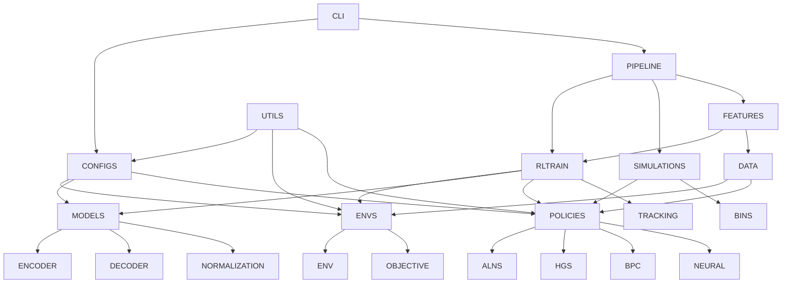

---

## 2. Environment (Problem) Hierarchy

Problem environments and their generators; `IEnv` is the shared contract for all routing problems.

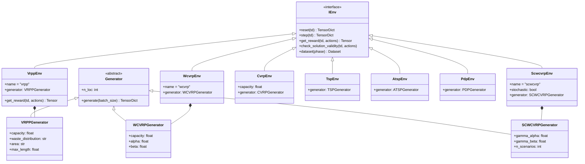

---

## 3. Neural Model Hierarchy

Encoder/decoder component graph and major model implementations built on PyTorch `nn.Module`.

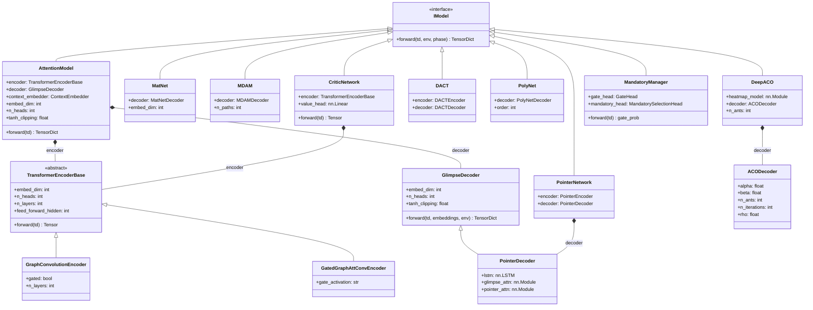

---

## 4. Policy & Solver Hierarchy

`IPolicy` is the shared solving contract; policies range from exact solvers to RL-guided hybrids.

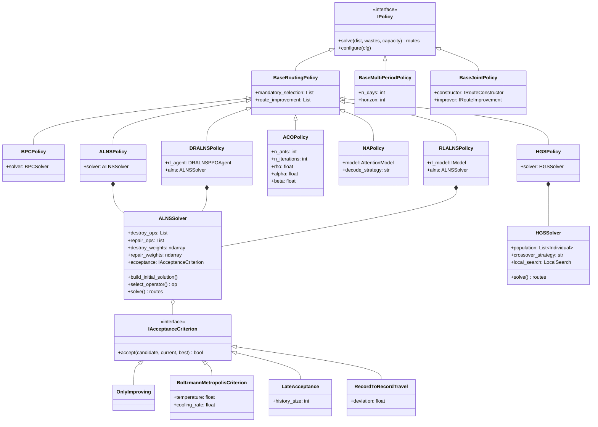

---

## 5. RL Training Pipeline

Lightning-based RL module hierarchy with interchangeable baseline strategies.

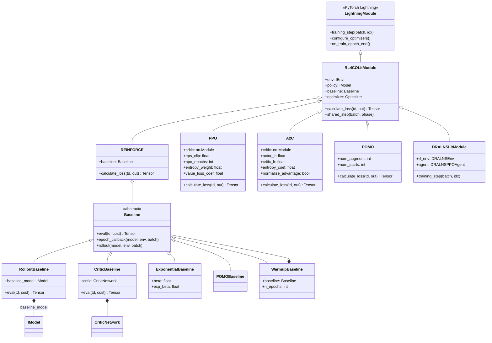

---

## 6. Simulator Architecture

State-machine-driven multi-day simulation; `SimulationContext` owns all components and drives state transitions.

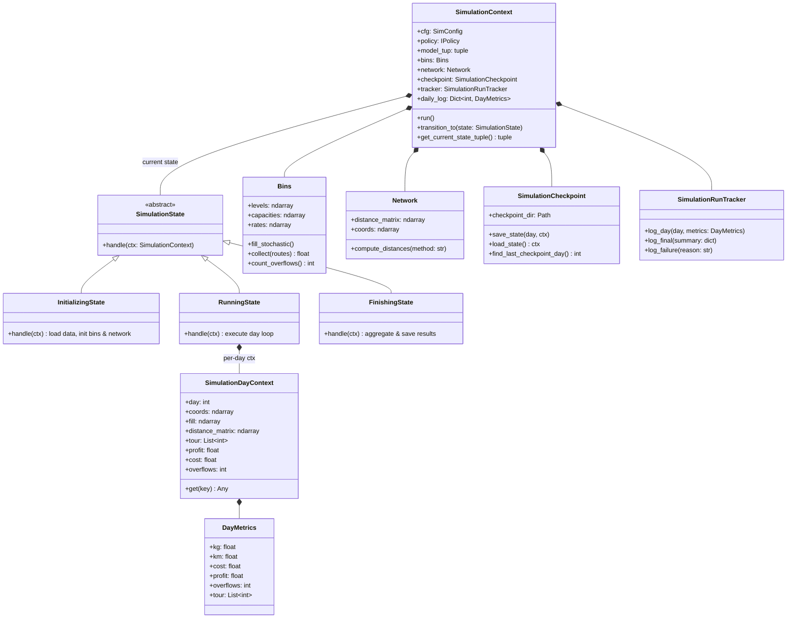

---

## 7. Configuration Hierarchy

Hydra-composed config tree; each solver family has a typed `*Config` → `*Params` pair.

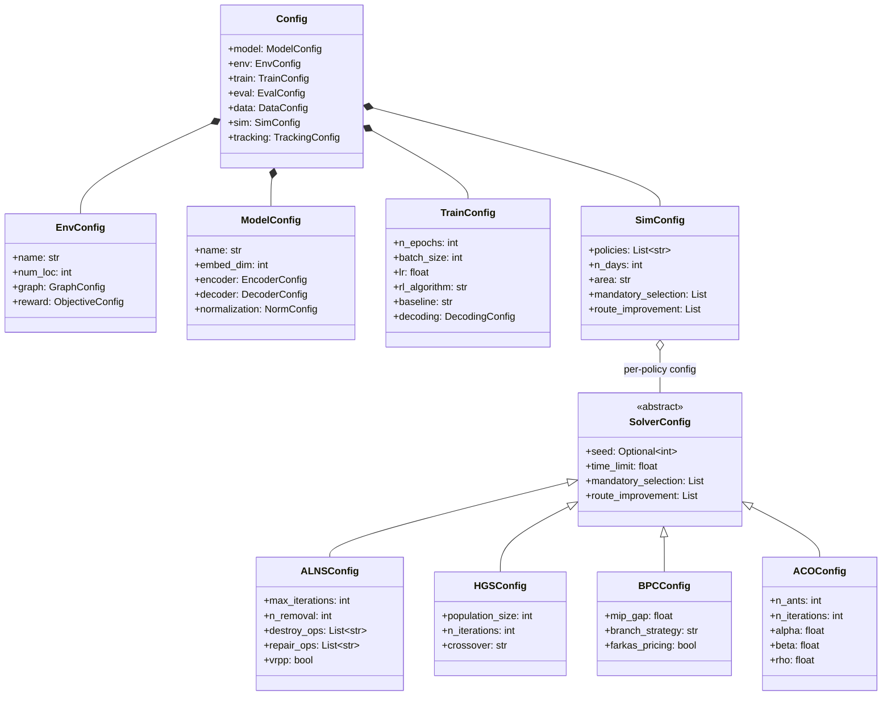

---

## 8. Command Execution Flows

### 8.1 Train (`train_lightning`, `hpo`, `meta_train`)

Lightning training lifecycle from CLI invocation through engine to final checkpoint.

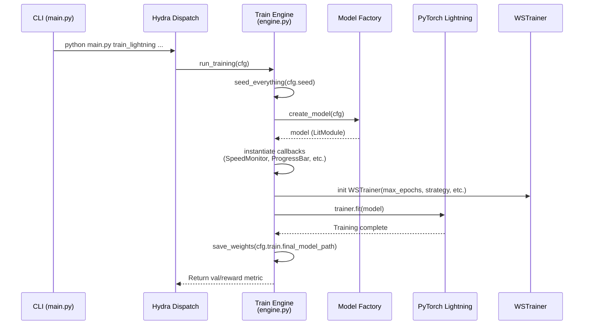

### 8.2 Evaluate (`eval`)

Deterministic model assessment over dataset instances with optional multi-process scatter.

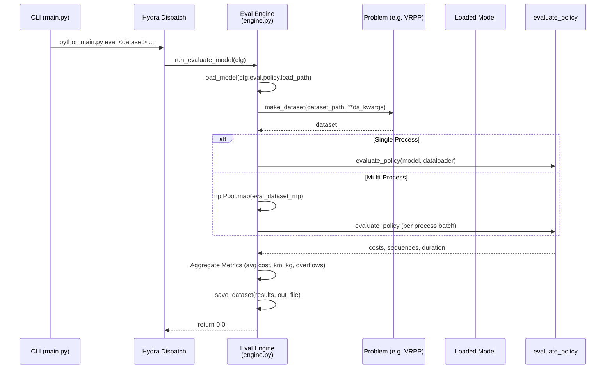

### 8.3 Simulator (`test_sim`)

State-machine-driven multi-day simulation with sequential or parallel execution paths.

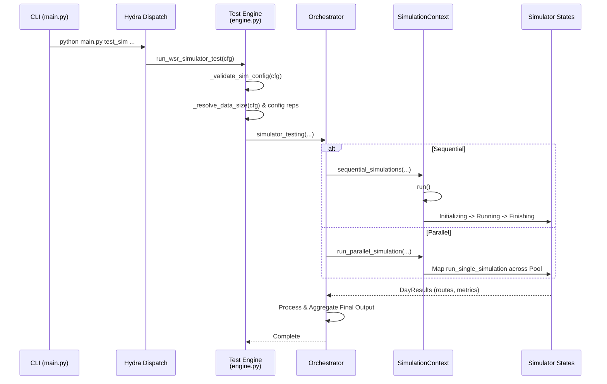

### 8.4 Data Generation (`gen_data`)

VRP instance builder pipeline producing training tensors or multi-day simulation datasets.

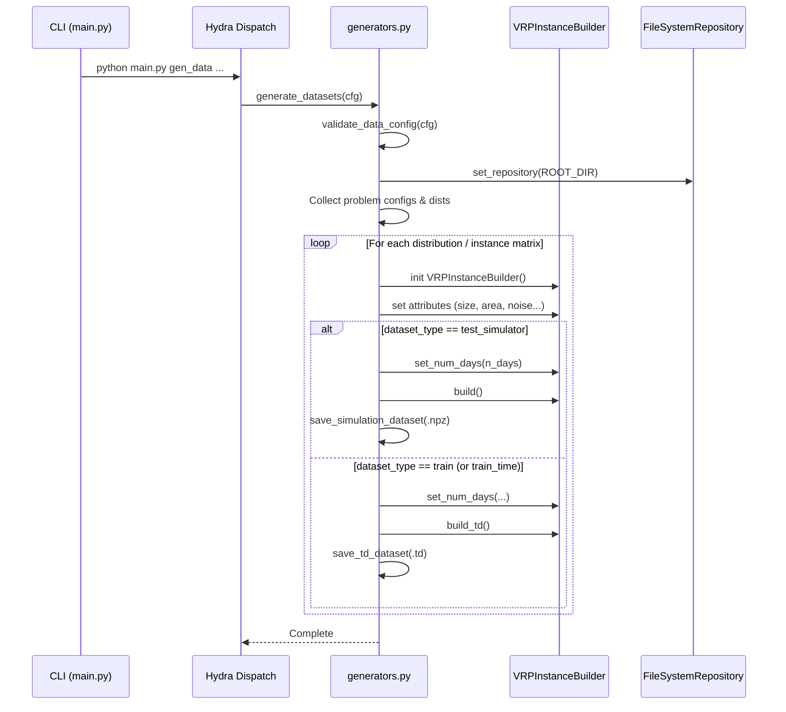
