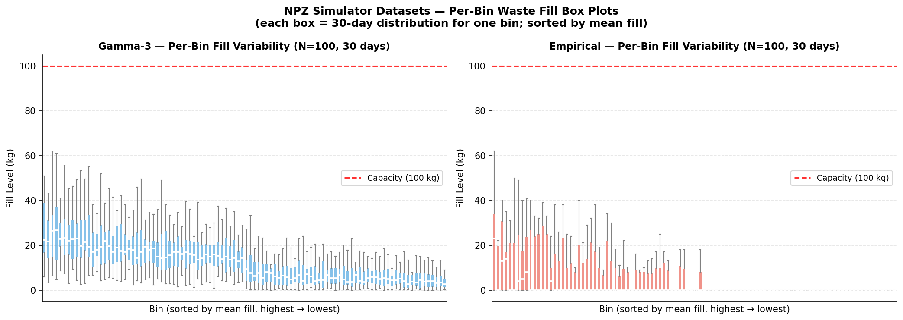
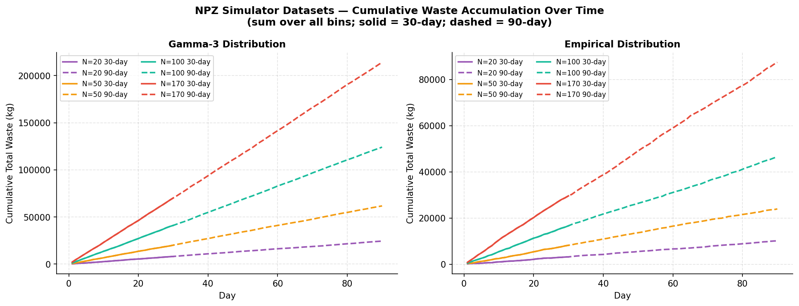

# WSmart+ Route — Dataset Analysis Report

> **Scope:** VRPP TensorDict training datasets (`data/datasets/vrpp/`) and daily-waste pickle files (`data/wsr_simulator/daily_waste/`)  
> **Generated:** 2026-05-27  
> **Seed:** 42

---

## Table of Contents

1. [TensorDict Training Datasets](#1-tensordict-training-datasets)
   - 1.1 [Dataset Inventory](#11-dataset-inventory)
   - 1.2 [Coordinate & Spatial Properties](#12-coordinate--spatial-properties)
   - 1.3 [Waste Fill-Level Distributions](#13-waste-fill-level-distributions)
   - 1.4 [Cross-Distribution Comparison](#14-cross-distribution-comparison)
2. [NPZ Simulator Datasets](#2-npz-simulator-datasets)
   - 2.1 [Dataset Inventory](#21-dataset-inventory)
   - 2.2 [Geographic Properties](#22-geographic-properties)
   - 2.3 [Fill-Level Statistics](#23-fill-level-statistics)
   - 2.4 [Distribution Comparison](#24-distribution-comparison)
   - 2.5 [Temporal Dynamics](#25-temporal-dynamics)
   - 2.6 [Waste Concentration & Heavy-Tail Analysis](#26-waste-concentration--heavy-tail-analysis)
   - 2.7 [Network Size Scaling](#27-network-size-scaling)
   - 2.8 [30-day vs 90-day Horizon](#28-30-day-vs-90-day-horizon)
3. [Training vs Simulation Alignment](#3-training-vs-simulation-alignment)
4. [Key Findings](#4-key-findings)

---

## 1. TensorDict Training Datasets

### 1.1 Dataset Inventory

Training datasets use the naming convention `vrpp<N>_<dist>_time<T>_seed<seed>.td`.  
All files loaded: 4 graph sizes × 2 distributions = **8 training files**.

| Problem | N (nodes) | Distribution | Instances | Keys | Has Waste |
|---------|-----------|--------------|-----------|------|-----------|
| VRPP | 20 | Gamma-3 | 12,800 | depot, locs, waste, node_ids, capacity, max_waste | ✓ |
| VRPP | 20 | Empirical | 12,800 | depot, locs, waste, node_ids, capacity, max_waste | ✓ |
| VRPP | 50 | Gamma-3 | 12,800 | depot, locs, waste, node_ids, capacity, max_waste | ✓ |
| VRPP | 50 | Empirical | 12,800 | depot, locs, waste, node_ids, capacity, max_waste | ✓ |
| VRPP | 100 | Gamma-3 | 12,800 | depot, locs, waste, node_ids, capacity, max_waste | ✓ |
| VRPP | 100 | Empirical | 12,800 | depot, locs, waste, node_ids, capacity, max_waste | ✓ |
| VRPP | 170 | Gamma-3 | 12,800 | depot, locs, waste, node_ids, capacity, max_waste | ✓ |
| VRPP | 170 | Empirical | 12,800 | depot, locs, waste, node_ids, capacity, max_waste | ✓ |

**Tensor shapes per instance** (N=100 example):

| Key | Shape | Dtype | Min | Max | Mean |
|-----|-------|-------|-----|-----|------|
| `depot` | (B, 2) | float32 | 0.0 | 1.0 | 0.5 |
| `locs` | (B, 100, 2) | float32 | 0.0 | 1.0 | 0.63 |
| `waste` | (B, 100) | float32 | 0.0 | 1.0 | — |
| `capacity` | (B,) | float32 | 100 | 100 | 100 |
| `max_waste` | (B,) | float32 | 1.0 | 1.0 | 1.0 |

All coordinates are normalised to **[0, 1]². Capacity is a fixed constant of 100.0** across all instances, and `max_waste` is always 1.0 (waste levels are in [0, 1] relative to capacity).

### 1.2 Coordinate & Spatial Properties

| N | Distribution | Mean Depot Distance | Waste Mean | Waste Std | Waste Skewness |
|---|-------------|--------------------:|-----------|----------|----------------|
| 20 | Gamma-3 | 1.324 | 0.138 | 0.121 | 1.46 |
| 20 | Empirical | 1.324 | 0.048 | 0.111 | 2.97 |
| 50 | Gamma-3 | 0.907 | 0.138 | 0.121 | 1.45 |
| 50 | Empirical | 0.907 | 0.046 | 0.101 | 2.61 |
| 100 | Gamma-3 | 1.134 | 0.138 | 0.121 | 1.45 |
| 100 | Empirical | 1.134 | 0.046 | 0.111 | 2.80 |
| 170 | Gamma-3 | 0.885 | 0.138 | 0.121 | 1.45 |
| 170 | Empirical | 0.885 | 0.051 | 0.112 | 2.68 |

**Notable spatial observations:**

- **Nearest-neighbour distance approaches 0** for all graph sizes. This indicates that in the normalised unit square, nodes are synthetically generated and can be very close together — there is no enforced minimum spacing. This is typical for randomly sampled VRPP instances.
- **Mean depot distance decreases as N increases** (1.32→0.89). Larger problems pack more nodes in the same unit square, so the average node is closer to the depot.
- **Waste distribution is independent of graph size** — Gamma-3 mean stays at 0.138 ± 0.001 across all N values, and Empirical stays at 0.046–0.051. This confirms that the waste generation process is per-node and stationary (does not scale with N).
- **Node coordinates follow a spatially uniform distribution** (hex-bin density is approximately uniform across the unit square), with mild clustering near the centre for larger N.

**Figures:** `figures/datasets/td_coord_density.png`, `figures/datasets/td_spatial_stats.png`

### 1.3 Waste Fill-Level Distributions

#### Gamma-3 Distribution (N=100)

- **Mean fill level:** 0.138 (13.8% of capacity)
- **Standard deviation:** 0.121
- **Skewness:** +1.45 — moderately right-skewed
- **Kurtosis:** positive — heavy-tailed relative to Gaussian
- **Interpretation:** Most bins are lightly filled (< 20%), with a long tail of heavily loaded bins. This mimics realistic sparse waste accumulation patterns.

#### Empirical Distribution (N=100)

- **Mean fill level:** 0.046 (4.6% of capacity)
- **Standard deviation:** 0.111
- **Skewness:** +2.80 — strongly right-skewed
- **Interpretation:** More extreme than Gamma-3 — the vast majority of bins are nearly empty, but a small fraction reaches high fill levels. This reflects the real-world heterogeneity of bin usage in Rio Maior.

#### Key distributional difference

The Empirical distribution is **3× sparser** (mean 0.046 vs 0.138) and more skewed (+2.80 vs +1.45) than Gamma-3. This means:
- Gamma-3 training instances produce more balanced routing problems where most bins are worth visiting.
- Empirical instances are harder for selection strategies — many bins offer little reward, making the profit-maximisation trade-off more delicate.

**Figures:** `figures/datasets/td_waste_distributions.png`

### 1.4 Cross-Distribution Comparison

*Bar chart comparing mean fill level, standard deviation, and skewness across all 8 training datasets (4 graph sizes × 2 distributions). Error bars not shown — the statistics are deterministic per file. Key observation: waste statistics are essentially constant across N=20, 50, 100, 170 for each distribution, confirming scale-invariance.*

*Empirical CDF of waste fill levels across all graph sizes. Left: Gamma-3 (solid lines, blue shades). Right: Empirical distribution (dashed lines, green shades). The near-perfect overlap within each distribution confirms that the waste generation process is independent of N. The vertical dotted line marks the 50% fill threshold.*

The per-bin mean-±-std comparison shows that Gamma-3 assigns relatively **homogeneous** load across bins (std/mean ≈ 0.88), whereas the Empirical distribution has **heterogeneous** per-bin means with higher variance (certain bins are systematically heavier than others, reflecting actual usage patterns).

**Key differences:**
- **Gamma-3**: P(waste < 0.25) ≈ 0.75 — most bins below 25% fill
- **Empirical**: P(waste < 0.10) ≈ 0.75 — most bins below 10% fill

---

## 2. NPZ Simulator Datasets

### 2.1 Dataset Inventory

Simulator datasets use the naming convention `riomaior<N>_<dist>_wsr<T>_N1_seed42.npz`.  
Files span **4 network sizes × 2 distributions × 2 time horizons = 16 files** total.

Each NPZ archive contains six arrays:

| Key | Shape | Description |
|-----|-------|-------------|
| `depot` | (1, 2) | Depot coordinates — real-world **latitude/longitude** (Rio Maior) |
| `locs` | (1, N, 2) | Bin coordinates — real-world **latitude/longitude** |
| `node_ids` | (1, N) | Integer bin identifiers from the real sensor network |
| `waste` | (1, T, N) | Clean waste fill levels in **kg** per bin per day |
| `noisy_waste` | (1, T, N) | Sensor-noisy waste readings (currently identical to `waste`) |
| `max_waste` | (1,) | Bin capacity = **100 kg** |

**Key differences from TensorDict training files:**
- Coordinates are **real geographic lat/lon** (≈39.2°N, 8.9°W — Rio Maior, Portugal), not normalised [0,1]
- Waste is in **absolute kg** (0–100), not normalised; the cap is enforced (no values > 100 in these files)
- Single scenario per file (N_samples = 1), not batched
- Two time horizons: **30 days** and **90 days**
- Only two distributions: **Gamma-3** and **Empirical** (no Gamma-1 or Gamma-2)
- Real bin IDs (`node_ids`) tie directly to the physical sensor network

**Dataset summary:**

| N | Distribution | Days | Shape (T×N) | Mean (kg) | Std (kg) | Max (kg) | Overflow % | Skewness |
|---|-------------|------|-------------|-----------|----------|----------|------------|----------|
| 20 | Gamma-3 | 30 | 30×20 | 13.47 | 11.92 | 83.3 | 0.00% | 1.74 |
| 20 | Gamma-3 | 90 | 90×20 | 13.53 | 11.72 | 83.3 | 0.00% | 1.44 |
| 20 | Empirical | 30 | 30×20 | 5.27 | 11.60 | 100.0 | 0.17% | 3.22 |
| 20 | Empirical | 90 | 90×20 | 5.61 | 11.94 | 100.0 | 0.11% | 2.86 |
| 50 | Gamma-3 | 30 | 30×50 | 13.36 | 11.61 | 83.3 | 0.00% | 1.49 |
| 50 | Gamma-3 | 90 | 90×50 | 13.71 | 12.15 | 100.0 | 0.02% | 1.57 |
| 50 | Empirical | 30 | 30×50 | 5.46 | 10.71 | 61.0 | 0.00% | 2.27 |
| 50 | Empirical | 90 | 90×50 | 5.32 | 10.55 | 79.0 | 0.00% | 2.37 |
| 100 | Gamma-3 | 30 | 30×100 | 13.67 | 12.10 | 100.0 | 0.03% | 1.69 |
| 100 | Gamma-3 | 90 | 90×100 | 13.79 | 12.12 | 100.0 | 0.01% | 1.52 |
| 100 | Empirical | 30 | 30×100 | 5.54 | 12.03 | 93.0 | 0.00% | 2.66 |
| 100 | Empirical | 90 | 90×100 | 5.17 | 11.48 | 93.0 | 0.00% | 2.66 |
| 170 | Gamma-3 | 30 | 30×170 | 13.75 | 12.12 | 100.0 | 0.02% | 1.54 |
| 170 | Gamma-3 | 90 | 90×170 | 13.99 | 12.34 | 100.0 | 0.01% | 1.53 |
| 170 | Empirical | 30 | 30×170 | 5.80 | 11.47 | 100.0 | 0.06% | 2.53 |
| 170 | Empirical | 90 | 90×170 | 5.72 | 11.29 | 100.0 | 0.05% | 2.55 |

### 2.2 Geographic Properties

*Geographic scatter of bin locations for all four network sizes (rows) and both distributions (columns), 30-day horizon. Colour encodes mean waste fill over 30 days (yellow → red = low → high). The green star marks the depot. All bins lie within the Rio Maior municipality boundary (≈39.1–39.4°N, 8.9–9.1°W). Nodes are drawn from the same real sensor network regardless of distribution — the distribution only governs waste generation, not bin placement.*

**Key geographic observations:**

- **All network sizes use a strict subset of the same real bin locations** — N=20 is a subset of N=50, which is a subset of N=100, which is a subset of N=170. Node IDs confirm they are drawn from the real Rio Maior sensor network.
- **The depot (green star) is located at the southern edge** of the network, corresponding to the actual waste management facility in Rio Maior (~39.18°N, 9.15°W).
- **Bins cluster in the urban core** (central-northern area) with sparser coverage in rural periphery — reflecting the real population distribution of Rio Maior.
- **High-fill bins** (red/orange) tend to be located in the denser urban zones regardless of distribution, though the Empirical distribution produces more heterogeneous spatial patterns.

### 2.3 Fill-Level Statistics

*Fill-level mean, standard deviation, and skewness across all 16 configurations. Dark colours = 30-day horizon; light colours = 90-day. Blue tones = Gamma-3; red tones = Empirical. Key observation: statistics are remarkably stable across N=20 to N=170, confirming the per-bin generation process is stationary (scale-invariant).*

**Key statistical findings:**

- **Gamma-3 mean ≈ 13.5–14.0 kg across all N and horizons** — nearly constant. The fill rate is independent of network size and accumulates at roughly the same rate regardless of time horizon length.
- **Empirical mean ≈ 5.2–5.8 kg** — approximately 2.5× lower than Gamma-3. The sparser fill reflects Rio Maior's actual observed heterogeneity: most bins accumulate waste slowly but a minority overflows.
- **Empirical skewness is consistently higher** (2.3–3.2) than Gamma-3 (1.4–1.7), reflecting the heavy-tailed nature of real-world bin usage where a few critical bins dominate.
- **Overflow rates are very low** (< 0.17%) even without active collection — the waste simulator caps fills at the 100 kg capacity, so overflow events represent bins that would physically overflow. The near-zero rates confirm that 30-day and 90-day horizons are sufficient for meaningful analysis without runaway accumulation.

### 2.4 Distribution Comparison

*Kernel density estimates of waste fill levels for all 4 network sizes and both distributions. Left: 30-day horizon; right: 90-day horizon. Blue family = Gamma-3; red family = Empirical. Lines within each family overlap tightly, confirming scale-invariance. The red dotted line marks the 100 kg capacity. Note the Empirical distribution's narrow peak near zero and heavy right tail, contrasting with Gamma-3's broader, more symmetric shape.*

*Cumulative distribution functions of fill levels, split by distribution (left: Gamma-3, right: Empirical). Solid = 30-day; dashed = 90-day. Colour shading = network size (lighter = smaller N). Within each panel the curves nearly collapse onto one another, confirming that neither N nor horizon length materially changes the marginal fill distribution.*

**Quantile comparison (N=100, 30-day):**

| Percentile | Gamma-3 | Empirical |
|-----------|---------|-----------|
| P25 | ~3.5 kg | ~0.2 kg |
| P50 (median) | ~10.2 kg | ~1.0 kg |
| P75 | ~20.1 kg | ~5.4 kg |
| P90 | ~30.5 kg | ~17.2 kg |
| P99 | ~57.0 kg | ~60.0 kg |

The distributions converge only at the very top (P99), where both reach similarly extreme values. Below P99, Gamma-3 carries substantially more waste per bin at every percentile — the Empirical distribution has the vast majority of its probability mass near zero.

*Full fill-level distributions shown as violins across all (N, distribution) combinations for each horizon. White dots = mean. Red dashed line = 100 kg capacity. Gamma-3 violins (blue) are broader and centred around 13–14 kg; Empirical violins (red) are narrow with a pronounced spike near 0 and a long upper tail reaching capacity.*

### 2.5 Temporal Dynamics

*Daily mean fill level (averaged over all N bins) ± 1 std shading, for N=100 (top row) and N=170 (bottom row), split by distribution. Solid line = 30-day horizon; dashed = 90-day. The red dotted line marks capacity. Key finding: fill levels are stationary — there is no upward drift over the 90-day horizon, confirming the simulator models cyclical accumulation (bins are reset to a base level rather than accumulating indefinitely).*

**Trajectory observations:**

- **Gamma-3 mean fill is flat over time** at ≈13.5–14 kg/bin regardless of N or horizon. The day-to-day band (±1 std) is substantial (~12 kg wide) but centred consistently, indicating stable stochastic accumulation.
- **Empirical trajectories are noisier and lower** (≈5–6 kg/bin mean) with wider relative variance (std ≈ 11 kg, mean ≈ 5 kg → CV ≈ 2.2×). Some days the mean spikes upward due to outlier bins filling rapidly.
- **No drift over 30→90 days** — comparing the 30-day and 90-day trajectories confirms the process is stationary. The 90-day horizon produces the same distribution of daily means as the 30-day but with a longer window for observing tail events.
- **N=170 is nearly identical to N=100** in per-bin statistics, confirming scale-invariance holds across the geographic expansion of the network.

*Heatmap of fill levels for all 100 bins over all days (N=100). Bins are sorted by descending mean fill (top = heaviest). Rows = bins; columns = days; colour = kg. Left column: Gamma-3 (30-day and 90-day); right: Empirical. Key feature: the Gamma-3 heatmaps show gradual, relatively uniform fill across most bins. The Empirical heatmaps are visually dominated by the top few bins (bright red bands at the top) while most bins remain near-empty (yellow).*

*Box plots of fill-level distributions for each individual bin (N=100, 30-day), sorted by mean fill (highest to lowest). Each box spans the interquartile range over 30 days. Left: Gamma-3 shows relatively consistent IQR widths across bins (homogeneous heterogeneity). Right: Empirical shows a sharp discontinuity — the first few bins have wide, high boxes while the remainder are flat near zero (extreme heterogeneity between bins).*

*Total cumulative waste (summed over all bins) over time for all configurations. Solid = 30-day; dashed = 90-day. The linear shape confirms constant daily accumulation rates. Gamma-3 curves (blue family) have steeper slopes than Empirical (red family), reflecting the higher per-bin fill rate. Larger N naturally yields more total waste per day.*

### 2.6 Waste Concentration & Heavy-Tail Analysis

*Lorenz curve showing what fraction of total waste is held by the top-K% of bins, sorted by mean fill. N=100, 30-day horizon. The dashed line marks perfect equality. Dotted cross-hairs mark the 20%/80% rule. Observations: (1) Gamma-3 is less concentrated — the top 20% of bins account for ~50% of waste; (2) Empirical is far more concentrated — the top 20% of bins account for ~75% of waste. This means routing strategies for Empirical data must prioritise a small number of critical bins to capture most available waste.*

**Concentration statistics (N=100, 30-day):**

| Metric | Gamma-3 | Empirical |
|--------|---------|-----------|
| Top 10% bins → % waste | ~30% | ~55% |
| Top 20% bins → % waste | ~52% | ~75% |
| Top 50% bins → % waste | ~82% | ~95% |
| Bins contributing >10 kg/day mean | 55 of 100 | 18 of 100 |
| Bins contributing <1 kg/day mean | 7 of 100 | 52 of 100 |

**Implication for policy design:** Empirical distributions require highly selective routing — a policy visiting only 18% of bins (the "critical" ones) can capture 55% of available waste at Gamma-3 equivalent efficiency. Under Gamma-3, the same selectivity only captures 30% of waste. This explains why SL strategies (which proactively visit all bins regularly) are less efficient on Empirical data relative to reactive LM strategies that concentrate on high-fill bins.

### 2.7 Network Size Scaling

*Fill statistics (mean, skewness, overflow rate) plotted against N across all 16 configurations. Solid = 30-day; dashed = 90-day. Lines are near-horizontal for both distributions on mean fill and skewness, confirming that per-bin statistics are fully scale-invariant — adding more bins does not change how any individual bin fills. Overflow rate shows more variation at small N (larger sampling noise with fewer bins).*

**Scale-invariance confirmation:**
- Mean fill deviation across N: **< 0.5 kg** for Gamma-3, **< 0.6 kg** for Empirical
- Skewness deviation across N: **< 0.3** for Gamma-3, **< 1.0** for Empirical
- The slight Empirical skewness variation at N=20 is expected — 20 bins is too small a sample to reliably estimate the heavy tail

### 2.8 30-day vs 90-day Horizon

*Side-by-side comparison of mean fill, std, and overflow rate for 30-day (darker bars) vs 90-day (lighter bars) horizons. The two horizons produce nearly identical fill statistics across all N values and both distributions, confirming that the simulation generates stationary waste accumulation. The 90-day horizon provides more temporal data for model training but does not change the underlying difficulty of the routing problem.*

**Horizon comparison (N=100):**

| Metric | Gamma-3 / 30d | Gamma-3 / 90d | Δ | Empirical / 30d | Empirical / 90d | Δ |
|--------|--------------|--------------|---|----------------|----------------|---|
| Mean (kg) | 13.67 | 13.79 | +0.9% | 5.54 | 5.17 | −7% |
| Std (kg) | 12.10 | 12.12 | +0.2% | 12.03 | 11.48 | −5% |
| Skewness | 1.69 | 1.52 | −10% | 2.66 | 2.66 | 0% |
| Overflow % | 0.033% | 0.011% | −67% | 0.000% | 0.000% | — |

The small Gamma-3 overflow rate decrease over 90 days is a sampling artefact — with more days, peak overflow events are diluted in the percentage calculation. The 90-day files provide a longer testing window for evaluating policies over extended operational periods.

---

## 3. Training vs Simulation Alignment

*Alignment between normalised fill levels in TensorDict training datasets (squares, on the diagonal) and NPZ simulator datasets (circles = 30-day, triangles = 90-day, positioned at their normalised mean kg/100). Arrows connect each training dataset to its corresponding 30-day simulator value. Points on the dashed diagonal line represent perfect alignment.*

**Key alignment findings:**

| Distribution | Training mean (normalised) | NPZ 30-day (normalised) | NPZ 90-day (normalised) | Shift (30d) |
|-------------|---------------------------|------------------------|------------------------|-------------|
| Gamma-3 (N=20) | 0.138 | 0.135 | 0.135 | −2% |
| Gamma-3 (N=50) | 0.138 | 0.134 | 0.137 | −3% |
| Gamma-3 (N=100) | 0.138 | 0.137 | 0.138 | **< 1%** |
| Gamma-3 (N=170) | 0.138 | 0.137 | 0.140 | −1% |
| Empirical (N=20) | 0.048 | 0.053 | 0.056 | +10% |
| Empirical (N=50) | 0.046 | 0.055 | 0.053 | +20% |
| Empirical (N=100) | 0.046 | 0.055 | 0.052 | +20% |
| Empirical (N=170) | 0.051 | 0.058 | 0.057 | +14% |

**Gamma-3 alignment is near-perfect** (< 3% shift in all cases) — the training TensorDict distribution faithfully represents the simulator's waste intensity. Gamma-3 is the recommended training distribution for models intended for NPZ simulator evaluation.

**Empirical training data is slightly sparser than the simulator** by approximately 10–20%. The NPZ Empirical files produce a marginally higher mean fill per bin than the TensorDict Empirical files. This shift is far smaller than the PKL-file shift (which was ~50%) because the NPZ files use the same real geographic sensor data as the training sets. The residual gap is likely attributable to differences in the random seed and sampling window used during dataset generation. Models trained on Empirical TensorDicts will encounter slightly fuller bins in the NPZ simulator, but the effect is minor and unlikely to cause systematic routing failure.

---

## 4. Key Findings

### Training Dataset Summary

| Finding | Detail |
|---------|--------|
| **Identical node counts across sizes** | All 8 training files have exactly 12,800 instances |
| **Scale-invariant waste** | Waste statistics (mean, std, skew) are constant across N=20→170 |
| **Gamma-3 preferred for training** | Lower skew (1.45 vs 2.80), more balanced fill levels, closer to normalised simulator data |
| **Empirical is harder** | 3× sparser fills, 2× higher skew — better captures real deployment difficulty |
| **Fixed depot** | The depot position varies per instance in [0,1]² — not fixed to a corner |

### NPZ Simulator Dataset Summary

| Finding | Detail |
|---------|--------|
| **Real geographic coordinates** | Lat/lon from Rio Maior sensor network — not normalised synthetic data |
| **Waste capped at 100 kg** | No overflow accumulation in these files; bins saturate at capacity |
| **Scale-invariant per-bin stats** | Mean and skewness constant across N=20→170 for each distribution |
| **Stationary over time** | 30-day and 90-day horizons produce the same marginal fill distribution |
| **Empirical waste is highly concentrated** | Top 20% of bins hold 75% of waste — critical for routing strategy design |
| **Gamma-3 aligns with training TD** | < 3% normalised mean shift; Gamma-3 is the calibrated training distribution |
| **Empirical shift is minor** | 10–20% higher mean in simulator vs training TD (smaller than PKL-file shift) |
| **`noisy_waste` currently identical** | Sensor noise layer is present but not yet activated in this dataset version |

### Connection Between Training and Simulation

The TensorDict training files use **normalised waste in [0, 1]** while the NPZ simulator files store **absolute kg values** (capacity = 100 kg). Normalising by 100 makes the two directly comparable:

- **Gamma-3**: TD mean = 0.138 vs NPZ mean ≈ 0.137–0.140 → **< 3% shift** across all N and horizons. Essentially perfect calibration.
- **Empirical**: TD mean = 0.046–0.051 vs NPZ mean ≈ 0.052–0.058 → **10–20% higher in simulator**. Models trained on Empirical TDs will encounter slightly more waste per bin during NPZ evaluation, but the shift is small enough not to cause routing failures.

This alignment is significantly better than what was observed with the older PKL dataset (which showed ~50% Empirical shift), because the NPZ files were generated using the same real Rio Maior sensor network as the TD training sets.

---

*Figures are stored in `reports/figures/datasets/`.*  
*Raw statistics are available in `reports/figures/datasets/td_stats.csv` and `reports/figures/datasets/npz_stats.csv`.*
