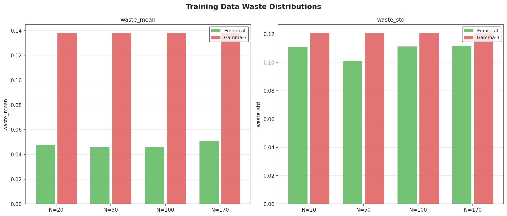
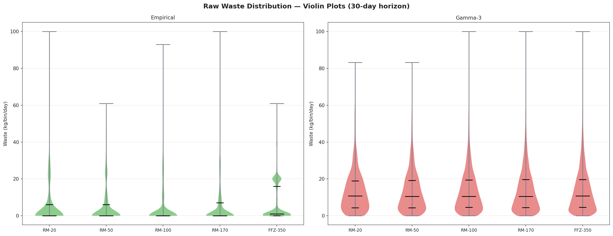
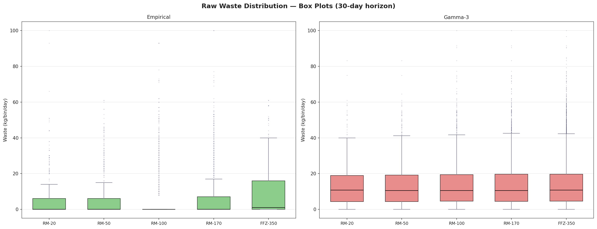
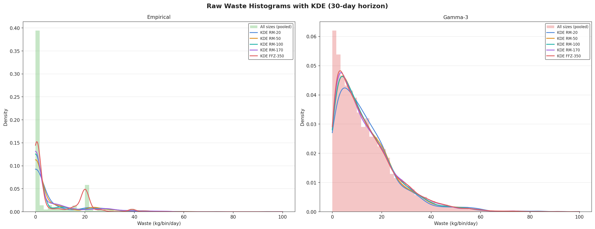
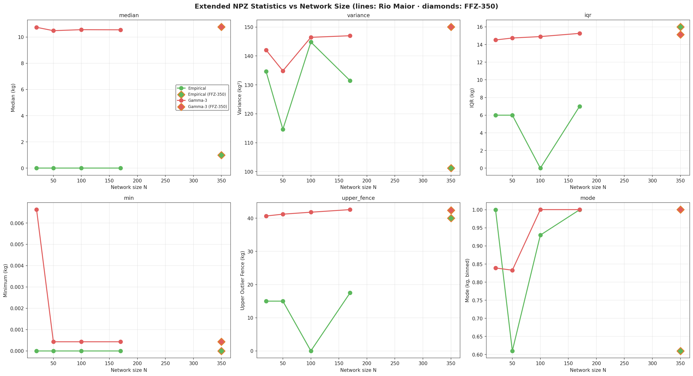

# WSmart+ Route — Dataset Analysis Report

> **Scope:** NPZ simulator datasets and TensorDict training datasets
> **Cities:** Figueira da Foz, Rio Maior
> **Distributions:** Empirical, Gamma-3
> **Horizons analysed:** 30 days, 90 days
> **Total NPZ dataset entries:** 20
> **Generated:** <!-- date -->

---

## Table of Contents

1. [Training Data (TD)](#1-training-data-td)
2. [Figueira da Foz NPZ Datasets](#2-figueira-da-foz-npz-datasets)
3. [Rio Maior NPZ Datasets](#3-rio-maior-npz-datasets)
4. [Waste Distribution Shapes](#4-waste-distribution-shapes)
5. [City Comparison](#5-city-comparison)
6. [TD vs NPZ Alignment](#6-td-vs-npz-alignment)

---

## 1. Training Data (TD)

Training data used for supervised learning models (stored as TensorDict `.td` files).
Each entry contains normalised waste values in [0, 1] (divide by 100 to convert to kg/kg).

<figure style="display:block;width:100%;margin:0.8em 0;padding:0;"></figure>

**Figure 1:** *Mean, std, and skewness of training waste values per network size and distribution.*

<figure style="display:block;width:100%;margin:0.8em 0;padding:0;"></figure>

**Figure 2:** *Bar chart of mean and std waste fractions per network size.*

### TD Statistics Summary

**Table 1:** *Training data (TD) statistics — mean, std, and skewness of normalised waste values per network size and distribution.*

| N | Distribution | Instances | Mean Waste | Std Waste | Skewness |
|---|-------------|-----------|------------|-----------|---------|
| 20 | Empirical | 12,800 | 0.0476 | 0.1110 | 2.971 |
| 20 | Gamma-3 | 12,800 | 0.1380 | 0.1207 | 1.457 |
| 50 | Empirical | 12,800 | 0.0459 | 0.1011 | 2.607 |
| 50 | Gamma-3 | 12,800 | 0.1380 | 0.1207 | 1.453 |
| 100 | Empirical | 12,800 | 0.0463 | 0.1113 | 2.798 |
| 100 | Gamma-3 | 12,800 | 0.1379 | 0.1206 | 1.453 |
| 170 | Empirical | 12,800 | 0.0510 | 0.1117 | 2.678 |
| 170 | Gamma-3 | 12,800 | 0.1380 | 0.1207 | 1.452 |

<!-- [ANALYSIS: Insert your observations here] -->

---

## 2. Figueira da Foz NPZ Datasets

**Network sizes:** N = 350  **Distributions:** Empirical, Gamma-3  **Horizons:** 30 days, 90 days

<figure style="display:block;width:100%;margin:0.8em 0;padding:0;"></figure>

**Figure 3:** *Mean, median, std and max waste per city and distribution (30-day horizon).*

<figure style="display:block;width:100%;margin:0.8em 0;padding:0;"></figure>

**Figure 4:** *How mean waste, std, and skewness vary with network size — Rio Maior N=20…170 (lines) plus the Figueira da Foz N=350 reference point (diamonds).*

<figure style="display:block;width:100%;margin:0.8em 0;padding:0;"></figure>

**Figure 5:** *Comparison of horizon statistics across network sizes, including the N=350 reference point.*

### Statistics Summary — Figueira da Foz (30-day horizon)

**Table 2:** *NPZ dataset statistics for Figueira da Foz — mean, median, std, max waste and IQR per network size and distribution (30-day horizon).*

| City | N | Distribution | Mean kg | Median kg | Std kg | Max kg | IQR kg | Skewness |
|------|---|-------------|---------|-----------|--------|--------|--------|---------|
| Figueira da Foz | 350 | Empirical | 7.15 | 1.00 | 10.06 | 61.0 | 16.00 | 1.366 |
| Figueira da Foz | 350 | Gamma-3 | 13.88 | 10.77 | 12.25 | 100.0 | 15.13 | 1.548 |

<!-- [ANALYSIS: Insert your observations here] -->

## 3. Rio Maior NPZ Datasets

**Network sizes:** N = 20, 50, 100, 170  **Distributions:** Empirical, Gamma-3  **Horizons:** 30 days, 90 days

<figure style="display:block;width:100%;margin:0.8em 0;padding:0;"></figure>

**Figure 6:** *Mean, median, std and max waste per city and distribution (30-day horizon).*

<figure style="display:block;width:100%;margin:0.8em 0;padding:0;"></figure>

**Figure 7:** *How mean waste, std, and skewness vary with network size — Rio Maior N=20…170 (lines) plus the Figueira da Foz N=350 reference point (diamonds).*

<figure style="display:block;width:100%;margin:0.8em 0;padding:0;"></figure>

**Figure 8:** *Comparison of horizon statistics across network sizes, including the N=350 reference point.*

### Statistics Summary — Rio Maior (30-day horizon)

**Table 3:** *NPZ dataset statistics for Rio Maior — mean, median, std, max waste and IQR per network size and distribution (30-day horizon).*

| City | N | Distribution | Mean kg | Median kg | Std kg | Max kg | IQR kg | Skewness |
|------|---|-------------|---------|-----------|--------|--------|--------|---------|
| Rio Maior | 20 | Empirical | 5.27 | 0.00 | 11.60 | 100.0 | 6.00 | 3.219 |
| Rio Maior | 20 | Gamma-3 | 13.47 | 10.74 | 11.92 | 83.3 | 14.52 | 1.741 |
| Rio Maior | 50 | Empirical | 5.46 | 0.00 | 10.71 | 61.0 | 6.00 | 2.267 |
| Rio Maior | 50 | Gamma-3 | 13.36 | 10.48 | 11.61 | 83.3 | 14.74 | 1.485 |
| Rio Maior | 100 | Empirical | 5.54 | 0.00 | 12.03 | 93.0 | 0.00 | 2.656 |
| Rio Maior | 100 | Gamma-3 | 13.67 | 10.56 | 12.10 | 100.0 | 14.90 | 1.690 |
| Rio Maior | 170 | Empirical | 5.80 | 0.00 | 11.47 | 100.0 | 7.00 | 2.528 |
| Rio Maior | 170 | Gamma-3 | 13.75 | 10.55 | 12.12 | 100.0 | 15.26 | 1.540 |

<!-- [ANALYSIS: Insert your observations here] -->

---

## 4. Waste Distribution Shapes

<figure style="display:block;width:100%;margin:0.8em 0;padding:0;"></figure>

**Figure 9:** *Violin plots of raw daily waste values (kg/bin/day) per network size and distribution, with embedded quartile markers.*

<figure style="display:block;width:100%;margin:0.8em 0;padding:0;"></figure>

**Figure 10:** *Box plots showing median, quartiles, interquartile range, outlier fences and outliers of raw waste values.*

<figure style="display:block;width:100%;margin:0.8em 0;padding:0;"></figure>

**Figure 11:** *Histograms with kernel density estimates of raw waste values per distribution — reveals modes and tail behaviour.*

<figure style="display:block;width:100%;margin:0.8em 0;padding:0;"></figure>

**Figure 12:** *Median, variance, interquartile range, minimum, outlier fences and mode per network size and distribution.*

### Extended Statistics Summary (30-day horizon)

**Table 4:** *Extended NPZ dataset statistics — median, variance, IQR, minimum, outlier fences and mode of raw waste values per city, network size and distribution (30-day horizon).*

| City | N | Distribution | Median | Variance | Q1 | Q3 | IQR | Min | Fences (lo/hi) | Mode |
|------|---|-------------|--------|----------|----|----|-----|-----|----------------|------|
| Figueira da Foz | 350 | Empirical | 1.00 | 101.19 | 0.00 | 16.00 | 16.00 | 0.00 | 0.00 / 40.00 | 0.61 |
| Figueira da Foz | 350 | Gamma-3 | 10.77 | 150.06 | 4.55 | 19.68 | 15.13 | 0.00 | 0.00 / 42.37 | 1.00 |
| Rio Maior | 20 | Empirical | 0.00 | 134.65 | 0.00 | 6.00 | 6.00 | 0.00 | 0.00 / 15.00 | 1.00 |
| Rio Maior | 20 | Gamma-3 | 10.74 | 142.06 | 4.37 | 18.89 | 14.52 | 0.01 | 0.00 / 40.67 | 0.84 |
| Rio Maior | 50 | Empirical | 0.00 | 114.63 | 0.00 | 6.00 | 6.00 | 0.00 | 0.00 / 15.00 | 0.61 |
| Rio Maior | 50 | Gamma-3 | 10.48 | 134.86 | 4.37 | 19.11 | 14.74 | 0.00 | 0.00 / 41.22 | 0.83 |
| Rio Maior | 100 | Empirical | 0.00 | 144.81 | 0.00 | 0.00 | 0.00 | 0.00 | 0.00 / 0.00 | 0.93 |
| Rio Maior | 100 | Gamma-3 | 10.56 | 146.45 | 4.56 | 19.47 | 14.90 | 0.00 | 0.00 / 41.82 | 1.00 |
| Rio Maior | 170 | Empirical | 0.00 | 131.46 | 0.00 | 7.00 | 7.00 | 0.00 | 0.00 / 17.50 | 1.00 |
| Rio Maior | 170 | Gamma-3 | 10.55 | 147.00 | 4.44 | 19.70 | 15.26 | 0.00 | 0.00 / 42.60 | 1.00 |

<!-- [ANALYSIS: Insert your observations here] -->

---

## 5. City Comparison

<figure style="display:block;width:100%;margin:0.8em 0;padding:0;"></figure>

**Figure 13:** *Key statistics across cities and distributions.*

### Statistics Summary — All Cities (30-day horizon)

**Table 5:** *NPZ dataset statistics across all cities — mean, median, std, max waste and IQR per city and distribution (30-day horizon).*

| City | N | Distribution | Mean kg | Median kg | Std kg | Max kg | IQR kg | Skewness |
|------|---|-------------|---------|-----------|--------|--------|--------|---------|
| Figueira da Foz | 350 | Empirical | 7.15 | 1.00 | 10.06 | 61.0 | 16.00 | 1.366 |
| Figueira da Foz | 350 | Gamma-3 | 13.88 | 10.77 | 12.25 | 100.0 | 15.13 | 1.548 |
| Rio Maior | 20 | Empirical | 5.27 | 0.00 | 11.60 | 100.0 | 6.00 | 3.219 |
| Rio Maior | 20 | Gamma-3 | 13.47 | 10.74 | 11.92 | 83.3 | 14.52 | 1.741 |
| Rio Maior | 50 | Empirical | 5.46 | 0.00 | 10.71 | 61.0 | 6.00 | 2.267 |
| Rio Maior | 50 | Gamma-3 | 13.36 | 10.48 | 11.61 | 83.3 | 14.74 | 1.485 |
| Rio Maior | 100 | Empirical | 5.54 | 0.00 | 12.03 | 93.0 | 0.00 | 2.656 |
| Rio Maior | 100 | Gamma-3 | 13.67 | 10.56 | 12.10 | 100.0 | 14.90 | 1.690 |
| Rio Maior | 170 | Empirical | 5.80 | 0.00 | 11.47 | 100.0 | 7.00 | 2.528 |
| Rio Maior | 170 | Gamma-3 | 13.75 | 10.55 | 12.12 | 100.0 | 15.26 | 1.540 |

<!-- [ANALYSIS: Insert your observations here] -->

---

## 6. TD vs NPZ Alignment

<figure style="display:block;width:100%;margin:0.8em 0;padding:0;"></figure>

*Comparison of mean waste levels between TD training data (normalised × 100) and NPZ simulator
data, including the Figueira da Foz N=350 reference point. Close alignment validates that
training distribution matches simulation.*

<!-- [ANALYSIS: Insert your observations here] -->

---

*Figures are stored in `figures/datasets/`.*
*Raw statistics: `public/global/datasets/td_stats.csv` and `public/global/datasets/npz_stats.csv`.*

## Interactive Charts

- [NPZ Statistics — Mean vs Std Scatter](private/datasets/npz_stats_interactive.html)
- [Waste Distribution by City and Network Size](private/datasets/waste_distribution_interactive.html)
- [City & Network Comparison](private/datasets/city_network_comparison_interactive.html)

