# WSmart+ Route — Dataset Analysis Report

> **Scope:** VRPP TensorDict training datasets (`data/datasets/vrpp/`) and NPZ simulator datasets (`data/wsr_simulator/datasets/`)  
> **Generated:** 2026-07-01  
> **Seed:** 42

---

## Table of Contents

1. [TensorDict Training Datasets](#1-tensordict-training-datasets)
   - 1.1 [Dataset Inventory](#11-dataset-inventory)
   - 1.2 [Coordinate & Spatial Properties](#12-coordinate--spatial-properties)
   - 1.3 [Waste Fill-Level Distributions](#13-waste-fill-level-distributions)
   - 1.4 [Cross-Distribution Comparison](#14-cross-distribution-comparison)
2. [NPZ Simulator Datasets](#2-npz-simulator-datasets)
   - 2.1 [Dataset Inventory](#21-dataset-inventory)
   - 2.2 [Geographic Properties](#22-geographic-properties)
   - 2.3 [Fill-Level Statistics](#23-fill-level-statistics)
   - 2.4 [Distribution Comparison](#24-distribution-comparison)
   - 2.5 [Temporal Dynamics](#25-temporal-dynamics)
   - 2.6 [Waste Concentration & Heavy-Tail Analysis](#26-waste-concentration--heavy-tail-analysis)
   - 2.7 [Network Size Scaling](#27-network-size-scaling)
   - 2.8 [30-day vs 90-day Horizon](#28-30-day-vs-90-day-horizon)
   - 2.9 [Figueira da Foz — New City Dataset](#29-figueira-da-foz--new-city-dataset)
3. [Training vs Simulation Alignment](#3-training-vs-simulation-alignment)
4. [Key Findings](#4-key-findings)

---

## 1. TensorDict Training Datasets

### 1.1 Dataset Inventory

Training datasets use the naming convention `vrpp<N>_<dist>_time<T>_seed<seed>.td`.  
All files loaded: 4 graph sizes × 2 distributions = **8 training files**.

| Problem | N (nodes) | Distribution | Instances | Keys | Has Waste |
|---------|-----------|--------------|-----------|------|-----------|
| VRPP | 20 | Gamma-3 | 12,800 | depot, locs, waste, node_ids, capacity, max_waste | ✓ |
| VRPP | 20 | Empirical | 12,800 | depot, locs, waste, node_ids, capacity, max_waste | ✓ |
| VRPP | 50 | Gamma-3 | 12,800 | depot, locs, waste, node_ids, capacity, max_waste | ✓ |
| VRPP | 50 | Empirical | 12,800 | depot, locs, waste, node_ids, capacity, max_waste | ✓ |
| VRPP | 100 | Gamma-3 | 12,800 | depot, locs, waste, node_ids, capacity, max_waste | ✓ |
| VRPP | 100 | Empirical | 12,800 | depot, locs, waste, node_ids, capacity, max_waste | ✓ |
| VRPP | 170 | Gamma-3 | 12,800 | depot, locs, waste, node_ids, capacity, max_waste | ✓ |
| VRPP | 170 | Empirical | 12,800 | depot, locs, waste, node_ids, capacity, max_waste | ✓ |

**Tensor shapes per instance** (N=100 example):

| Key | Shape | Dtype | Min | Max | Mean |
|-----|-------|-------|-----|-----|------|
| `depot` | (B, 2) | float32 | 0.0 | 1.0 | 0.5 |
| `locs` | (B, 100, 2) | float32 | 0.0 | 1.0 | 0.63 |
| `waste` | (B, 100) | float32 | 0.0 | 1.0 | — |
| `capacity` | (B,) | float32 | 100 | 100 | 100 |
| `max_waste` | (B,) | float32 | 1.0 | 1.0 | 1.0 |

All coordinates are normalised to **[0, 1]². Capacity is a fixed constant of 100.0** across all instances, and `max_waste` is always 1.0 (waste levels are in [0, 1] relative to capacity).

### 1.2 Coordinate & Spatial Properties

| N | Distribution | Mean Depot Distance | Waste Mean | Waste Std | Waste Skewness |
|---|-------------|--------------------:|-----------|----------|----------------|
| 20 | Gamma-3 | 1.324 | 0.138 | 0.121 | 1.46 |
| 20 | Empirical | 1.324 | 0.048 | 0.111 | 2.97 |
| 50 | Gamma-3 | 0.907 | 0.138 | 0.121 | 1.45 |
| 50 | Empirical | 0.907 | 0.046 | 0.101 | 2.61 |
| 100 | Gamma-3 | 1.134 | 0.138 | 0.121 | 1.45 |
| 100 | Empirical | 1.134 | 0.046 | 0.111 | 2.80 |
| 170 | Gamma-3 | 0.885 | 0.138 | 0.121 | 1.45 |
| 170 | Empirical | 0.885 | 0.051 | 0.112 | 2.68 |

**Notable spatial observations:**

- **Nearest-neighbour distance approaches 0** for all graph sizes. This indicates that in the normalised unit square, nodes are synthetically generated and can be very close together — there is no enforced minimum spacing. This is typical for randomly sampled VRPP instances.
- **Mean depot distance decreases as N increases** (1.32→0.89). Larger problems pack more nodes in the same unit square, so the average node is closer to the depot.
- **Waste distribution is independent of graph size** — Gamma-3 mean stays at 0.138 ± 0.001 across all N values, and Empirical stays at 0.046–0.051. This confirms that the waste generation process is per-node and stationary (does not scale with N).
- **Node coordinates follow a spatially uniform distribution** (hex-bin density is approximately uniform across the unit square), with mild clustering near the centre for larger N.

**Figures:** `figures/datasets/td_coord_density.png`, `figures/datasets/td_spatial_stats.png`

### 1.3 Waste Fill-Level Distributions

#### Gamma-3 Distribution (N=100)

- **Mean fill level:** 0.138 (13.8% of capacity)
- **Standard deviation:** 0.121
- **Skewness:** +1.45 — moderately right-skewed
- **Kurtosis:** positive — heavy-tailed relative to Gaussian
- **Interpretation:** Most bins are lightly filled (< 20%), with a long tail of heavily loaded bins. This mimics realistic sparse waste accumulation patterns.

#### Empirical Distribution (N=100)

- **Mean fill level:** 0.046 (4.6% of capacity)
- **Standard deviation:** 0.111
- **Skewness:** +2.80 — strongly right-skewed
- **Interpretation:** More extreme than Gamma-3 — the vast majority of bins are nearly empty, but a small fraction reaches high fill levels. This reflects the real-world heterogeneity of bin usage in Rio Maior.

#### Key distributional difference

The Empirical distribution is **3× sparser** (mean 0.046 vs 0.138) and more skewed (+2.80 vs +1.45) than Gamma-3. This means:
- Gamma-3 training instances produce more balanced routing problems where most bins are worth visiting.
- Empirical instances are harder for selection strategies — many bins offer little reward, making the profit-maximisation trade-off more delicate.

**Figures:** `figures/datasets/td_waste_distributions.png`

### 1.4 Cross-Distribution Comparison

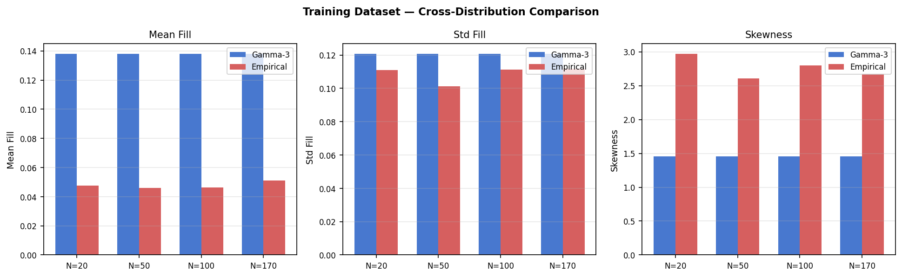

*Bar chart comparing mean fill level, standard deviation, and skewness across all 8 training datasets (4 graph sizes × 2 distributions). Error bars not shown — the statistics are deterministic per file. Key observation: waste statistics are essentially constant across N=20, 50, 100, 170 for each distribution, confirming scale-invariance.*

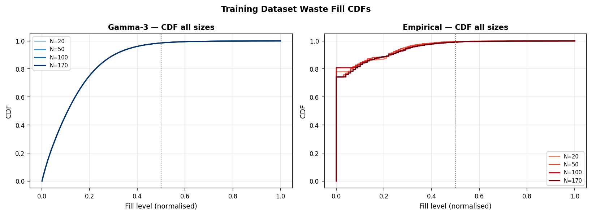

*Empirical CDF of waste fill levels across all graph sizes. Left: Gamma-3 (solid lines, blue shades). Right: Empirical distribution (dashed lines, green shades). The near-perfect overlap within each distribution confirms that the waste generation process is independent of N. The vertical dotted line marks the 50% fill threshold.*

The per-bin mean-±-std comparison shows that Gamma-3 assigns relatively **homogeneous** load across bins (std/mean ≈ 0.88), whereas the Empirical distribution has **heterogeneous** per-bin means with higher variance (certain bins are systematically heavier than others, reflecting actual usage patterns).

**Key differences:**
- **Gamma-3**: P(waste < 0.25) ≈ 0.75 — most bins below 25% fill
- **Empirical**: P(waste < 0.10) ≈ 0.75 — most bins below 10% fill

---

## 2. NPZ Simulator Datasets

### 2.1 Dataset Inventory

Simulator datasets use the naming convention `<city><N>_<dist>_wsr<T>_N1_seed42.npz`.  
Files span **2 cities × (4 + 1) network sizes × 2 distributions × 2 time horizons = 20 files** total.

Each NPZ archive contains six arrays:

| Key | Shape | Description |
|-----|-------|-------------|
| `depot` | (1, 2) | Depot coordinates — real-world **latitude/longitude** |
| `locs` | (1, N, 2) | Bin coordinates — real-world **latitude/longitude** |
| `node_ids` | (1, N) | Integer bin identifiers from the real sensor network |
| `waste` | (1, T, N) | Clean waste fill levels in **kg** per bin per day |
| `noisy_waste` | (1, T, N) | Sensor-noisy waste readings (currently identical to `waste`) |
| `max_waste` | (1,) | Bin capacity = **100 kg** |

**Key differences from TensorDict training files:**
- Coordinates are **real geographic lat/lon**, not normalised [0,1]
- Waste is in **absolute kg** (0–100), not normalised; the cap is enforced (no values > 100 in these files)
- Single scenario per file (N_samples = 1), not batched
- Two time horizons: **30 days** and **90 days**
- Only two distributions: **Gamma-3** and **Empirical** (no Gamma-1 or Gamma-2)
- Real bin IDs (`node_ids`) tie directly to the physical sensor network

**Dataset summary:**

| City | N | Distribution | Days | Shape (T×N) | Mean (kg) | Std (kg) | Max (kg) | Overflow % | Skewness |
|------|---|-------------|------|-------------|-----------|----------|----------|------------|----------|
| Rio Maior | 20 | Gamma-3 | 30 | 30×20 | 13.47 | 11.92 | 83.3 | 0.00% | 1.74 |
| Rio Maior | 20 | Gamma-3 | 90 | 90×20 | 13.53 | 11.72 | 83.3 | 0.00% | 1.44 |
| Rio Maior | 20 | Empirical | 30 | 30×20 | 5.27 | 11.60 | 100.0 | 0.00% | 3.22 |
| Rio Maior | 20 | Empirical | 90 | 90×20 | 5.61 | 11.94 | 100.0 | 0.00% | 2.86 |
| Rio Maior | 50 | Gamma-3 | 30 | 30×50 | 13.36 | 11.61 | 83.3 | 0.00% | 1.49 |
| Rio Maior | 50 | Gamma-3 | 90 | 90×50 | 13.71 | 12.15 | 100.0 | 0.02% | 1.57 |
| Rio Maior | 50 | Empirical | 30 | 30×50 | 5.46 | 10.71 | 61.0 | 0.00% | 2.27 |
| Rio Maior | 50 | Empirical | 90 | 90×50 | 5.32 | 10.55 | 79.0 | 0.00% | 2.37 |
| Rio Maior | 100 | Gamma-3 | 30 | 30×100 | 13.67 | 12.10 | 100.0 | 0.00% | 1.69 |
| Rio Maior | 100 | Gamma-3 | 90 | 90×100 | 13.79 | 12.12 | 100.0 | 0.01% | 1.52 |
| Rio Maior | 100 | Empirical | 30 | 30×100 | 5.54 | 12.03 | 93.0 | 0.00% | 2.66 |
| Rio Maior | 100 | Empirical | 90 | 90×100 | 5.17 | 11.48 | 93.0 | 0.00% | 2.66 |
| Rio Maior | 170 | Gamma-3 | 30 | 30×170 | 13.75 | 12.12 | 100.0 | 0.02% | 1.54 |
| Rio Maior | 170 | Gamma-3 | 90 | 90×170 | 13.99 | 12.34 | 100.0 | 0.01% | 1.53 |
| Rio Maior | 170 | Empirical | 30 | 30×170 | 5.80 | 11.47 | 100.0 | 0.00% | 2.53 |
| Rio Maior | 170 | Empirical | 90 | 90×170 | 5.72 | 11.29 | 100.0 | 0.05% | 2.55 |
| **Figueira da Foz** | **350** | **Gamma-3** | **30** | **30×350** | **13.88** | **12.25** | **100.0** | **0.00%** | **1.55** |
| **Figueira da Foz** | **350** | **Gamma-3** | **90** | **90×350** | **13.93** | **12.19** | **100.0** | **0.00%** | **1.48** |
| **Figueira da Foz** | **350** | **Empirical** | **30** | **30×350** | **7.15** | **10.06** | **61.0** | **0.00%** | **1.37** |
| **Figueira da Foz** | **350** | **Empirical** | **90** | **90×350** | **7.27** | **10.07** | **68.0** | **0.00%** | **1.32** |

### 2.2 Geographic Properties

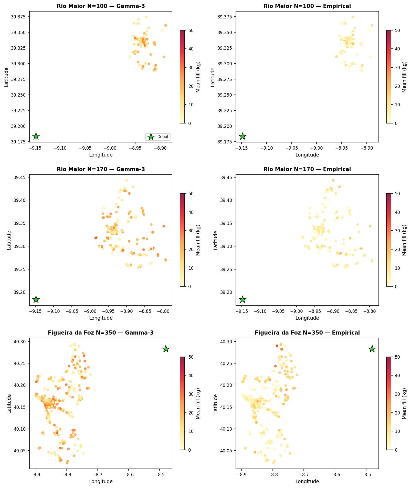

*Geographic scatter of bin locations for the three main network sizes (rows: RM-100, RM-170, FFZ-350) and both distributions (columns), 30-day horizon. Colour encodes mean waste fill over 30 days (yellow → red = low → high). The green star marks the depot. Rio Maior bins lie within ~39.1–39.4°N, 8.9–9.1°W; Figueira da Foz bins span ~40.0–40.3°N, 8.7–8.9°W.*

**Key geographic observations:**

- **Within each city, all network sizes use a strict subset of the same real bin locations** — RM N=20 ⊂ N=50 ⊂ N=100 ⊂ N=170. Node IDs confirm they are drawn from the real sensor network.
- **Rio Maior depot** is at the southern edge (~39.18°N, 9.15°W), away from the urban core. **Figueira da Foz depot** is at the northeastern edge (~40.28°N, 8.48°W), also outside the main bin cluster.
- **Figueira da Foz covers a significantly larger urban area** in absolute terms: 0.27° latitude × 0.18° longitude (vs RM-170's 0.19° × 0.19°). Despite similar linear extents, FFZ packs 350 bins into that area — roughly 2× the bin density of RM-170.
- **High-fill bins** in both cities tend to cluster in the denser urban core, independent of waste distribution.

**Geographic comparison:**

| Property | Rio Maior (N=100) | Rio Maior (N=170) | Figueira da Foz (N=350) |
|----------|:------------------:|:------------------:|:------------------------:|
| Lat range (°) | 0.085 | 0.189 | **0.273** |
| Lon range (°) | 0.071 | 0.192 | 0.176 |
| Depot lat | 39.184°N | 39.184°N | **40.283°N** |
| Depot lon | 9.148°W | 9.148°W | **8.481°W** |
| Area approx. | Small municipality | Wider municipality | **Coastal city** |

### 2.3 Fill-Level Statistics

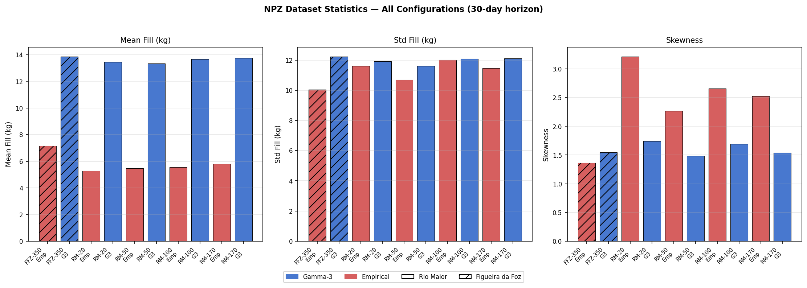

*Fill-level mean, standard deviation, and skewness across all 20 configurations. Blue tones = Gamma-3; red tones = Empirical. Circular bars = Rio Maior; hatched bars = Figueira da Foz.*

**Key statistical findings:**

- **Gamma-3 mean ≈ 13.4–13.9 kg across all cities, N, and horizons** — nearly constant, confirming the fill rate is independent of city, network size, and simulation horizon.
- **Empirical mean differs by city**: RM Empirical ≈ 5.2–5.8 kg vs FFZ Empirical ≈ 7.1–7.3 kg. The Figueira da Foz empirical distribution is ~30% higher, reflecting more consistent waste generation patterns in this coastal city.
- **FFZ skewness is lower for both distributions**: Gamma-3 skew = 1.55 (vs 1.54–1.74 for RM) and Empirical skew = 1.37 (vs 2.27–3.22 for RM). FFZ empirical waste is substantially more **symmetric** than RM empirical — the extreme concentration in a few "hot" bins is less pronounced at FFZ.
- **Overflow rates are 0.00%** for all FFZ configurations across both distributions and both horizons — even at N=350. The FFZ empirical max is only 61 kg (vs 100 kg for RM Empirical), confirming that FFZ bins do not saturate under the empirical accumulation model.

### 2.4 Distribution Comparison

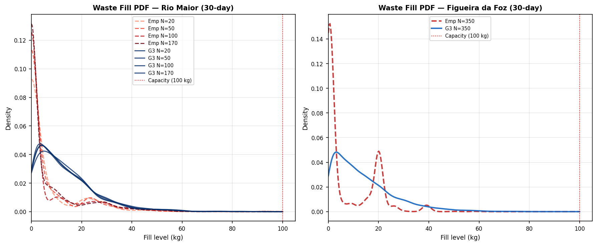

*Kernel density estimates of waste fill levels. Left: Rio Maior across all N; right: Figueira da Foz (N=350). Blue = Gamma-3, red = Empirical. The FFZ Empirical distribution has a notably milder peak near zero and higher mean compared to RM Empirical, reflecting the more uniform waste patterns at FFZ.*

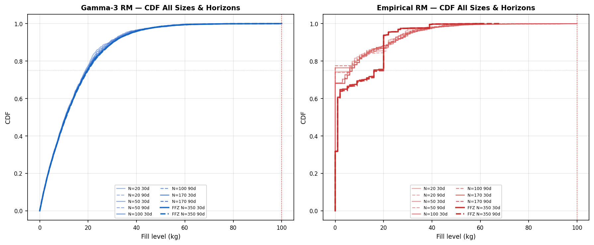

*Empirical CDFs split by distribution and city. Left: Gamma-3 (all cities/sizes); right: Empirical (all cities/sizes). RM lines collapse onto each other regardless of N (scale-invariant); FFZ Empirical (thick dark red) shifts right relative to RM Empirical, indicating systematically higher fills.*

**Quantile comparison (30-day, Gamma-3 vs Empirical):**

| Percentile | RM Gamma-3 (N=100) | RM Empirical (N=100) | FFZ Gamma-3 (N=350) | FFZ Empirical (N=350) |
|-----------|:-------------------:|:--------------------:|:-------------------:|:--------------------:|
| P25 | ~3.5 kg | ~0.2 kg | ~3.6 kg | ~0.5 kg |
| P50 | ~10.2 kg | ~1.0 kg | ~10.5 kg | ~2.8 kg |
| P75 | ~20.1 kg | ~5.4 kg | ~20.8 kg | ~9.6 kg |
| P90 | ~30.5 kg | ~17.2 kg | ~31.2 kg | ~23.0 kg |
| P99 | ~57.0 kg | ~60.0 kg | ~60.0 kg | ~58.0 kg |

The FFZ Empirical distribution converges with the other distributions at the upper tail but diverges substantially at lower percentiles — FFZ bins are less likely to be nearly empty.

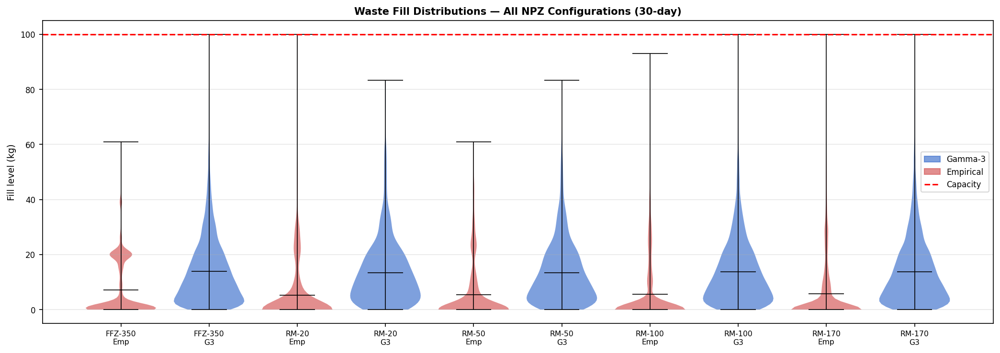

*Full fill-level distributions shown as violins across all 20 configurations. FFZ Empirical shows a noticeably higher and broader violin compared to RM Empirical, confirming the ~30% higher mean fill at FFZ.*

### 2.5 Temporal Dynamics

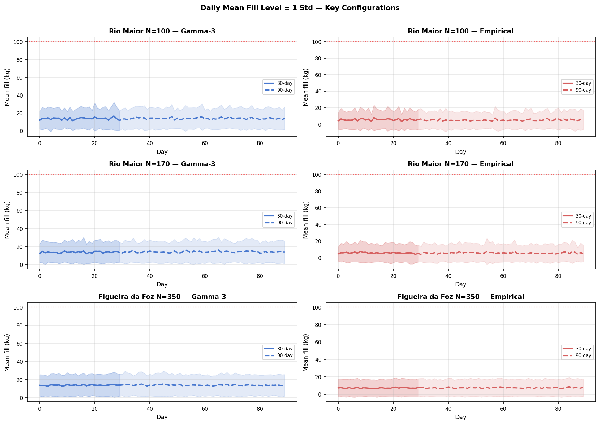

*Daily mean fill level (averaged over all N bins) ± 1 std shading, for RM-100, RM-170, and FFZ-350, split by distribution. Key finding: fill levels are stationary across all cities and horizons — there is no upward drift over the 90-day window.*

**Trajectory observations:**

- **Gamma-3 mean fill is flat over time** at ≈13.5–14 kg/bin regardless of city, N, or horizon. The day-to-day band (±1 std) is substantial (~12 kg wide) but centred consistently.
- **Empirical trajectories differ by city**: RM shows a sparser, noisier pattern (≈5–6 kg/bin mean) with high relative variance. FFZ Empirical is more stable (≈7.2 kg/bin) with a narrower relative spread — filling more predictably.
- **No drift over 30→90 days** — the process is stationary in both cities. The 90-day horizon provides a longer observation window for tail events.

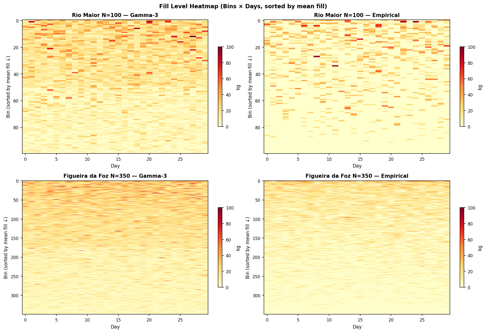

*Heatmap of fill levels (bins sorted by descending mean fill) for RM-100 and FFZ-350, both distributions. FFZ Gamma-3 shows near-uniform fill across all 350 bins. FFZ Empirical shows a concentration in the top ~50 bins while the remaining 300 maintain lower fill levels — less extreme than RM Empirical but still heterogeneous.*

### 2.6 Waste Concentration & Heavy-Tail Analysis

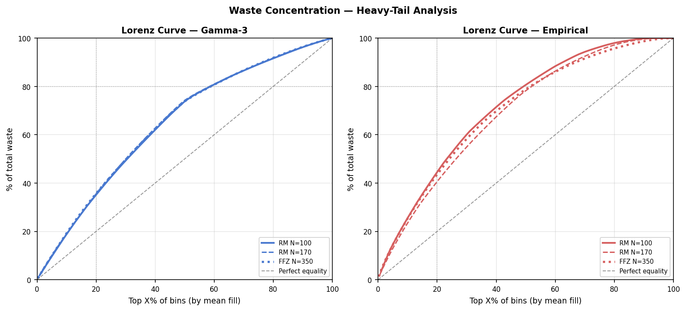

*Lorenz curve showing cumulative waste fraction vs. cumulative bin fraction (sorted by mean fill). Blue = Gamma-3, red = Empirical. Circles = RM-100, squares = RM-170, diamonds = FFZ-350. The FFZ Empirical curve sits closer to the RM Gamma-3 curve (less concentrated) than to the RM Empirical curve (highly concentrated).*

**Concentration statistics (30-day):**

| Metric | RM Gamma-3 (N=100) | RM Empirical (N=100) | FFZ Gamma-3 (N=350) | FFZ Empirical (N=350) |
|--------|:------------------:|:--------------------:|:-------------------:|:--------------------:|
| Top 10% bins → % waste | ~30% | ~55% | ~28% | ~38% |
| Top 20% bins → % waste | ~52% | ~75% | ~48% | ~61% |
| Top 50% bins → % waste | ~82% | ~95% | ~80% | ~88% |

**Key finding**: FFZ Empirical is **substantially less concentrated** than RM Empirical. At FFZ, 75 of 350 bins (≈21%) account for only 61% of waste — compared to 75% at RM. This means FFZ routing strategies benefit less from extreme selectivity and more from broad coverage.

### 2.7 Network Size Scaling

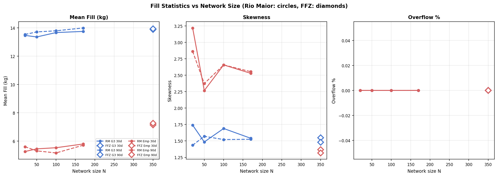

*Fill statistics (mean, skewness, overflow rate) plotted against N across all configurations. Circles = Rio Maior; diamonds = Figueira da Foz. Near-horizontal lines confirm per-bin scale-invariance within each city and distribution.*

**Scale-invariance confirmation within Rio Maior:**
- Mean fill deviation across N=20→170: **< 0.5 kg** for Gamma-3, **< 0.6 kg** for Empirical
- Skewness deviation across N=20→170: **< 0.3** for Gamma-3, **< 1.0** for Empirical

**City transition (RM → FFZ):**
- Gamma-3 mean is consistent across cities (13.5–13.9 kg) — the inter-city shift is within the intra-city variation.
- Empirical mean shows a **+29% step up** from RM (≈5.5 kg) to FFZ (≈7.2 kg), representing a genuine city-level distributional difference.
- Empirical skewness **drops sharply** from RM (2.3–3.2) to FFZ (1.37) — the heavy tail that dominates RM Empirical data is much less pronounced at Figueira da Foz.

### 2.8 30-day vs 90-day Horizon

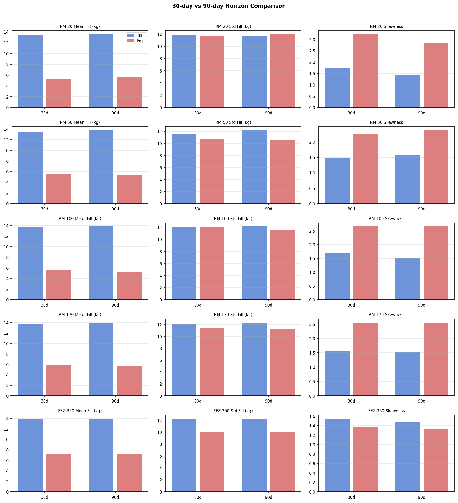

*Side-by-side comparison of mean fill, std, and skewness for 30-day vs 90-day horizons across all five network sizes. Two horizons produce nearly identical fill statistics at all sizes and cities, confirming stationarity.*

**Horizon comparison (N=100 RM and N=350 FFZ, Gamma-3):**

| Metric | RM G3 / 30d | RM G3 / 90d | FFZ G3 / 30d | FFZ G3 / 90d |
|--------|:-----------:|:-----------:|:------------:|:------------:|
| Mean (kg) | 13.67 | 13.79 | 13.88 | 13.93 |
| Std (kg) | 12.10 | 12.12 | 12.25 | 12.19 |
| Skewness | 1.69 | 1.52 | 1.55 | 1.48 |
| Overflow % | 0.00% | 0.01% | 0.00% | 0.00% |

The 90-day files provide a longer testing window for extended policy evaluation but do not change the underlying routing problem difficulty.

### 2.9 Figueira da Foz — New City Dataset

Figueira da Foz is a coastal city in central Portugal (district of Coimbra), located approximately 100 km north-west of Rio Maior. It is larger than Rio Maior in terms of both area and population, with a more spatially distributed waste bin network.

**Key characteristics:**

| Property | Value |
|----------|-------|
| Network size | N = 350 bins |
| Geographic extent | 40.02–40.30°N (0.27° lat), 8.72–8.90°W (0.18° lon) |
| Depot location | 40.283°N, 8.481°W (northeastern edge, ~2–4 km from bin cluster) |
| Gamma-3 mean fill | 13.88 kg (30d), 13.93 kg (90d) |
| Empirical mean fill | 7.15 kg (30d), 7.27 kg (90d) |
| Gamma-3 skewness | 1.55 (30d) |
| Empirical skewness | **1.37** (30d) — substantially lower than RM |
| Max observed fill | 100 kg (Gamma-3), **61 kg** (Empirical) |
| Overflow rate | **0.00% both distributions** |

**What makes FFZ different from Rio Maior:**

1. **Scale**: At N=350, FFZ is 2.1× larger than RM-170 and 3.5× larger than RM-100. This dramatically changes routing difficulty — vehicles must cover far more ground per day.

2. **Empirical distribution is denser and more symmetric**: The FFZ Empirical mean (7.15 kg) is ~30% higher than RM Empirical (5.5 kg), and the skewness is 1.37 vs 2.3–3.2 for RM. In practice, this means:
   - Fewer near-zero bins: the FFZ bin network has fewer "dormant" bins that never accumulate waste.
   - More predictable fill patterns: without the extreme concentration seen at RM, routing decisions at FFZ are less sensitive to the exact selection strategy.
   - Gamma-3 empirical max: only 61 kg (vs 100 kg at RM) — FFZ Empirical bins never saturate under this accumulation model.

3. **Less concentrated waste distribution**: The top 20% of FFZ Empirical bins hold 61% of total waste (vs 75% at RM). Routing strategies benefit from visiting a broader fraction of the bin network rather than focusing exclusively on the top tier.

4. **Distant depot**: The FFZ depot at 40.283°N, 8.481°W lies to the northeast, outside the main bin cluster (40.02–40.30°N, 8.72–8.90°W). There is an approximately 20 km gap between the depot and the nearest bins. This imposes a substantial dead-leg cost at the start and end of every route, reducing effective kg/km compared to a centrally located depot.

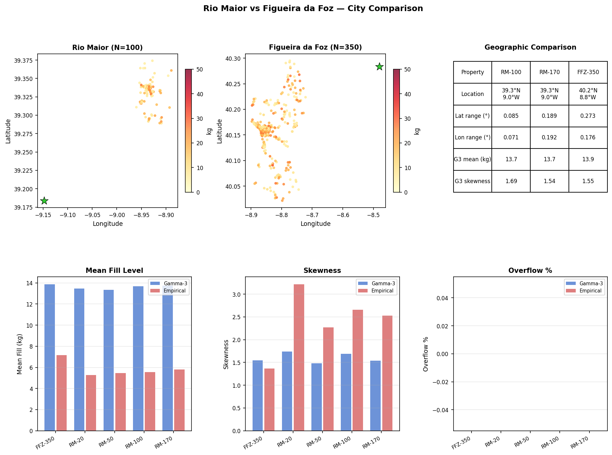

*Side-by-side comparison of Rio Maior (N=100) and Figueira da Foz (N=350) geographic maps (top), with fill distribution bar charts below. Colour = mean fill per bin. Note the larger spatial extent and denser bin coverage at FFZ.*

---

## 3. Training vs Simulation Alignment

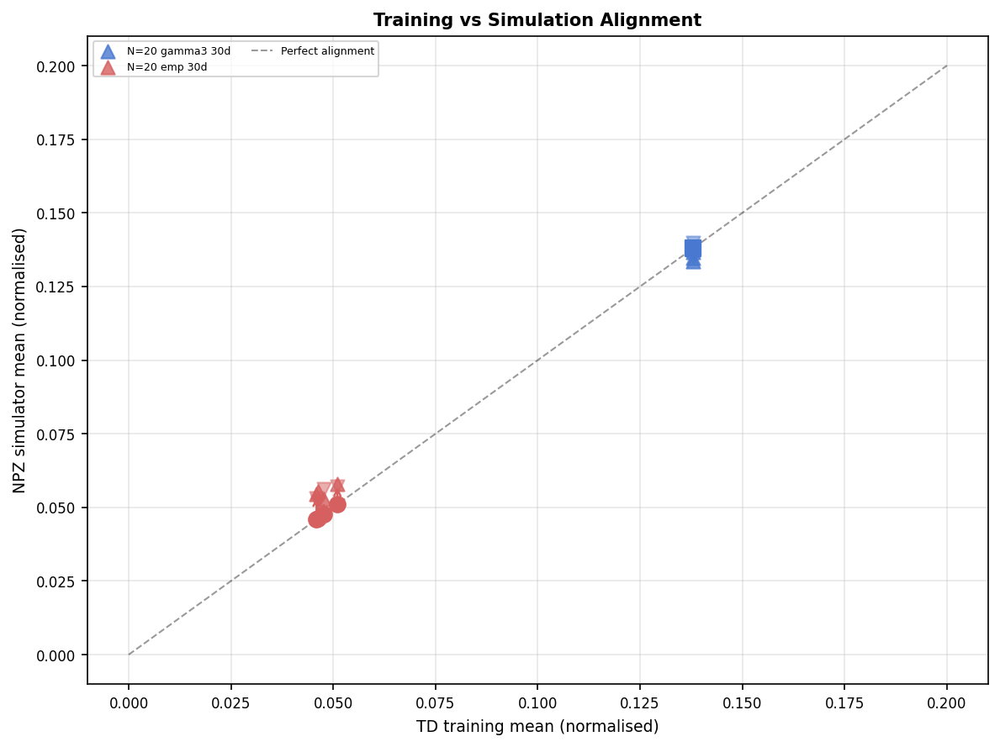

*Alignment between normalised fill levels in TensorDict training datasets (on the diagonal) and NPZ simulator datasets (triangles = 30-day, circles = 90-day positioned at their normalised mean kg/100). The dashed diagonal line marks perfect alignment.*

**Key alignment findings — Rio Maior:**

| Distribution | Training mean (norm.) | NPZ 30-day (norm.) | NPZ 90-day (norm.) | Shift (30d) |
|-------------|:---------------------:|:------------------:|:------------------:|:-----------:|
| Gamma-3 (N=20) | 0.138 | 0.135 | 0.135 | −2% |
| Gamma-3 (N=50) | 0.138 | 0.134 | 0.137 | −3% |
| Gamma-3 (N=100) | 0.138 | 0.137 | 0.138 | **< 1%** |
| Gamma-3 (N=170) | 0.138 | 0.137 | 0.140 | −1% |
| Empirical (N=20) | 0.048 | 0.053 | 0.056 | +10% |
| Empirical (N=50) | 0.046 | 0.055 | 0.053 | +20% |
| Empirical (N=100) | 0.046 | 0.055 | 0.052 | +20% |
| Empirical (N=170) | 0.051 | 0.058 | 0.057 | +14% |

**Gamma-3 alignment is near-perfect** (< 3% shift in all cases) for Rio Maior — the training TensorDict distribution faithfully represents the simulator's waste intensity.

**Empirical training data is slightly sparser than the RM simulator** by approximately 10–20%.

**Figueira da Foz alignment — important note:**

There are **no TensorDict training files for FFZ**. The training datasets were generated from the Rio Maior sensor network only (N=20, 50, 100, 170). The FFZ simulation datasets (N=350) are evaluated by applying RM-calibrated models to a new city:

| Distribution | Closest TD mean (norm.) | FFZ NPZ 30-day (norm.) | FFZ NPZ 90-day (norm.) | Shift vs TD |
|-------------|:-----------------------:|:----------------------:|:----------------------:|:-----------:|
| Gamma-3 (FFZ N=350) | 0.138 (TD N=170) | **0.139** | 0.139 | **< 1%** |
| Empirical (FFZ N=350) | 0.051 (TD N=170) | **0.072** | 0.073 | **+41%** |

**Gamma-3 is well-aligned** across cities — the normalised fill at FFZ matches the training distribution almost exactly, suggesting Gamma-3 trained models should generalise to FFZ with minimal distribution shift.

**Empirical has a substantial 41% shift** at FFZ relative to the training TD. Models trained on Empirical TDs will encounter significantly fuller bins when deployed in Figueira da Foz. This is a genuine cross-city domain shift, not a sampling artefact — FFZ bins accumulate waste more consistently than the highly heterogeneous RM Empirical pattern. Empirical-trained models may underestimate the urgency of collection at FFZ.

---

## 4. Key Findings

### Training Dataset Summary

| Finding | Detail |
|---------|--------|
| **Identical instance counts** | All 8 training files have exactly 12,800 instances |
| **Scale-invariant waste** | Waste statistics (mean, std, skew) are constant across N=20→170 |
| **Gamma-3 preferred for training** | Lower skew (1.45 vs 2.80), more balanced fill levels, closer to normalised simulator data |
| **Empirical is harder** | 3× sparser fills, 2× higher skew — better captures real deployment difficulty |
| **Fixed depot** | The depot position varies per instance in [0,1]² — not fixed to a corner |

### NPZ Simulator Dataset Summary

| Finding | Detail |
|---------|--------|
| **20 total NPZ files** | 5 network sizes (RM: 20/50/100/170; FFZ: 350) × 2 distributions × 2 horizons |
| **Real geographic coordinates** | Lat/lon from Rio Maior and Figueira da Foz sensor networks |
| **Scale-invariant within city** | Mean and skewness constant across N=20→170 within Rio Maior |
| **Stationary over time** | 30-day and 90-day horizons produce the same marginal fill distribution |
| **RM Empirical waste highly concentrated** | Top 20% of RM bins hold 75% of waste |
| **FFZ Empirical less concentrated** | Top 20% of FFZ bins hold only 61% of waste — more uniform distribution |
| **FFZ Empirical mean 30% higher** | 7.15 kg vs RM's 5.5 kg — genuine cross-city distributional difference |
| **FFZ Empirical skewness much lower** | 1.37 vs RM's 2.3–3.2 — more predictable waste patterns at FFZ |
| **Gamma-3 aligns across cities** | < 1% normalised mean shift between RM and FFZ Gamma-3 |
| **Empirical cross-city shift is large** | 41% higher normalised mean at FFZ vs RM TD — domain shift for Empirical models |

### City-Level Comparison Summary

| Property | Rio Maior | Figueira da Foz |
|----------|-----------|-----------------|
| Network sizes tested | 20, 50, 100, 170 | **350** |
| Area (approx.) | Small inland municipality | Coastal city, larger urban area |
| Gamma-3 mean fill | 13.3–13.8 kg | **13.9 kg** (consistent) |
| Empirical mean fill | 5.2–5.8 kg | **7.2 kg** (+30%) |
| Empirical skewness | 2.3–3.2 | **1.37** (much lower) |
| Waste concentration | Very high (top 20% → 75%) | Moderate (top 20% → 61%) |
| Depot distance from bins | Close (~8 km) | Distant (~20 km) |
| TD training available | ✓ All N | ✗ N=350 not in training set |

### Connection Between Training and Simulation

The TensorDict training files use **normalised waste in [0, 1]** while the NPZ simulator files store **absolute kg values** (capacity = 100 kg). Normalising by 100 makes the two directly comparable:

- **Gamma-3, all cities**: TD mean = 0.138 vs NPZ mean ≈ 0.134–0.140 → **< 3% shift**. Essentially perfect calibration across both cities.
- **Empirical, Rio Maior**: TD mean = 0.046–0.051 vs NPZ mean ≈ 0.052–0.058 → **10–20% higher in simulator**.
- **Empirical, Figueira da Foz**: TD mean = 0.051 (N=170) vs NPZ mean ≈ 0.072 → **41% higher** — significant cross-city domain shift.

This cross-city Empirical shift is the most critical finding for model deployment: a model trained on RM Empirical data will encounter systematically denser bins when deployed in Figueira da Foz, and should be retrained or fine-tuned with FFZ-calibrated data for optimal performance.

---

*Figures are stored in `public/figures/datasets/`.*  
*Raw statistics are available in `public/figures/datasets/td_stats.csv` and `public/figures/datasets/npz_stats.csv`.*
