# WSmart+ Route — Simulation Analysis Report

> **Scope:** 30-day and 90-day simulation runs across 3 region/network configurations × 2 distributions × 3 selection strategies × 2 route improvers × 8 route constructors
> **Total logs analysed (30d):** 480
> **Total logs analysed (90d):** 174
> **Scenarios:** RM-100 / Empirical, RM-100 / Gamma-3, RM-170 / Empirical, RM-170 / Gamma-3, FFZ-350 / Empirical, FFZ-350 / Gamma-3
> **Generated:** <!-- date -->

---

## Table of Contents

1. [Experimental Setup](#1-experimental-setup)
2. [30-Day Horizon Results](#2-30-day-horizon-results)
3. [90-Day Horizon Results](#3-90-day-horizon-results)
4. [Horizon Comparison (30d vs 90d)](#4-horizon-comparison-30d-vs-90d)

---

## 1. Experimental Setup

### Configuration Space

**Table 1:** *Configuration space — experimental dimensions and the values tested in this study.*

| Dimension | Values |
|-----------|--------|
| **Scenarios (region / N)** | RM-100 (N=100), RM-170 (N=170), FFZ-350 (N=350) |
| **Waste distribution** | Empirical, Gamma-3 |
| **Mandatory selection strategy** | LA, LM, SL |
| **Route constructors** | ACO_HH, ALNS, BPC, HGS, PG-CLNS, PSOMA, SANS, SWC-TCF |
| **Acceptance criteria** | bmc, custom, custom_bmc, custom_oi, gurobi, new |
| **Route improvers** | FTSP, CLS |
| **Simulation horizons (days)** | 30, 90 |

### Policy Naming Convention

Each log file encodes the full pipeline as:
`{mandatory_selection}_{route_constructor}[_{acceptance_criterion}]_{route_improver}`

For Last-Minute (LM), two critical fill threshold variants are tested: **CF70** (70% fill triggers mandatory collection) and **CF90** (90% threshold). Service-Level (SL) tests two service level targets: **SL1** and **SL2**. Results in this report aggregate CF70 and CF90 under **LM**, and SL1/SL2 under **SL**, unless otherwise specified.

### Metrics Tracked

**Table 2:** *Metrics tracked per simulation run, their optimisation direction, and a brief description.*

| Metric | Direction | Description |
|--------|-----------|-------------|
| `overflows` | ↓ lower better | Bins exceeding 100% capacity during simulation |
| `kg` | ↑ higher better | Total waste collected (kg) over the simulation horizon |
| `km` | ↓ lower better | Total vehicle distance driven (km) |
| `kg/km` | ↑ higher better | Route efficiency (waste per unit distance) |
| `ncol` | contextual | Number of collection events |
| `kg_lost` | ↓ lower better | Waste that overflowed and was not collected |
| `profit` | ↑ higher better | Revenue from collection minus operational cost |
| `days` | contextual | Active collection days in the simulation horizon |

---

## 2. 30-Day Horizon Results

> **Logs analysed:** 480
> **Constructors available:** ACO_HH, ALNS, BPC, HGS, PG-CLNS, PSOMA, SANS, SWC-TCF

### 2.1 Analytics Comparison — Pareto View

<figure style="display:block;width:100%;margin:0.8em 0;padding:0;">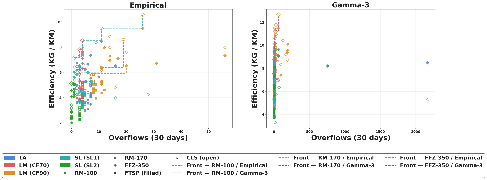</figure>

**Figure 1:** *Scatter of all 30-day runs in the overflows–kg/km space, one panel per waste distribution. Colour encodes the mandatory selection variant, marker shape encodes the scenario (region/N), filled markers = FTSP, open markers = CLS. Dashed lines = Pareto fronts, one colour per scenario (region × N × distribution).*

<figure style="display:block;width:100%;margin:0.8em 0;padding:0;">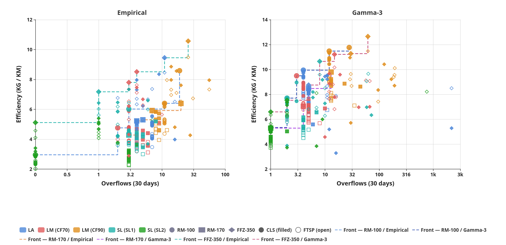</figure>

**Figure 2:** *Same chart with symlog X-axis — spreads the densely clustered low-overflow region.*

**[Interactive version](private/simulation/30d/pareto_scatter_interactive.html)**

#### Pareto-Front Policy Catalogue (30 days)

**Table 3:** *Pareto-optimal policy configurations over the 30-day horizon — each unique (selection variant, constructor, improver) that appeared on the Pareto front of at least one scenario, sorted by scenario count; metrics averaged across those scenarios.*

| Selection | Constructor | Improver | Overflows | kg/km | Pareto-Front Scenarios |
|-----------|-------------|----------|----------:|------:|------------------------|
| LM (CF90) | HGS | CLS | 22.3 | 8.911 | RM-100 / Empirical, RM-100 / Gamma-3, RM-170 / Empirical |
| LM (CF90) | PG-CLNS | CLS | 18.3 | 10.843 | FFZ-350 / Gamma-3, RM-100 / Gamma-3, RM-170 / Gamma-3 |
| SL (SL2) | ACO_HH | CLS | 1.0 | 5.973 | FFZ-350 / Empirical, FFZ-350 / Gamma-3, RM-170 / Gamma-3 |
| LA | ACO_HH | CLS | 4.5 | 6.845 | RM-170 / Empirical, RM-170 / Gamma-3 |
| LM (CF70) | BPC | CLS | 9.5 | 9.857 | FFZ-350 / Empirical, FFZ-350 / Gamma-3 |
| LM (CF90) | BPC | CLS | 44.0 | 11.604 | FFZ-350 / Empirical, FFZ-350 / Gamma-3 |
| SL (SL1) | BPC | CLS | 5.5 | 7.460 | FFZ-350 / Gamma-3, RM-170 / Empirical |
| SL (SL1) | PG-CLNS | CLS | 1.5 | 7.432 | FFZ-350 / Empirical, RM-100 / Gamma-3 |
| LA | BPC | CLS | 11.0 | 9.446 | FFZ-350 / Empirical |
| LA | PG-CLNS | CLS | 4.0 | 9.943 | RM-100 / Gamma-3 |
| LA | PSOMA | CLS | 5.0 | 5.295 | RM-170 / Empirical |
| LA | SANS | CLS | 5.0 | 8.746 | FFZ-350 / Gamma-3 |
| LM (CF70) | ACO_HH | CLS | 4.0 | 7.046 | RM-170 / Gamma-3 |
| LM (CF70) | HGS | CLS | 3.0 | 9.487 | RM-100 / Gamma-3 |
| LM (CF70) | PG-CLNS | CLS | 3.0 | 7.796 | FFZ-350 / Empirical |
| LM (CF70) | PSOMA | CLS | 2.0 | 4.755 | RM-100 / Empirical |
| LM (CF90) | ALNS | CLS | 11.0 | 6.398 | RM-100 / Empirical |
| LM (CF90) | PSOMA | CLS | 7.0 | 5.917 | RM-170 / Empirical |
| SL (SL1) | HGS | CLS | 3.0 | 6.015 | RM-100 / Empirical |
| SL (SL2) | PG-CLNS | CLS | 1.0 | 5.336 | RM-100 / Gamma-3 |
| SL (SL2) | PSOMA | CLS | 0.0 | 2.954 | RM-100 / Empirical |
| SL (SL2) | SANS | CLS | 1.0 | 6.591 | FFZ-350 / Gamma-3 |

<!-- [ANALYSIS: Insert your observations here] -->

### 2.2 Summary KPI Analysis

#### Overflow Performance

<figure style="display:block;width:100%;margin:0.8em 0;padding:0;">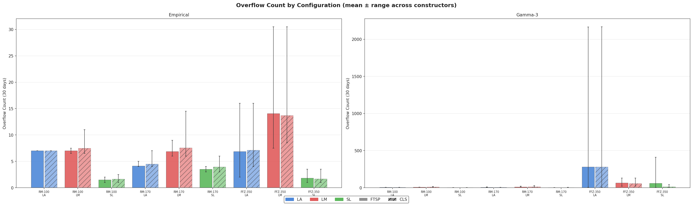</figure>

**Figure 3:** *Mean overflow count per scenario and selection strategy (mean ± min/max range across route constructors); route improvers shown as paired bars within each configuration.*

<figure style="display:block;width:100%;margin:0.8em 0;padding:0;">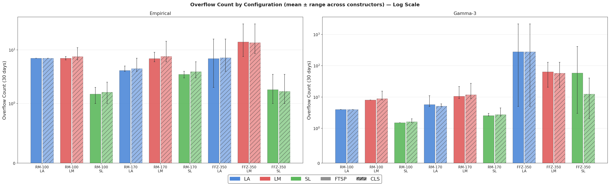</figure>

**Figure 4:** *Same chart with symlog Y axis — reveals structure compressed in the linear scale.*

**Table 4:** *Overflow counts by configuration over 30 days — min/max/mean across route constructors, per route improver.*

| Config | FTSP Min | FTSP Max | FTSP Mean | CLS Min | CLS Max | CLS Mean |
|--------|-----|-----|------|-----|-----|------|
| RM-100 / Empirical / LA | 7.0 | 7.0 | 7.0 | 7.0 | 7.0 | 7.0 |
| RM-100 / Empirical / LM | 6.5 | 7.5 | 7.0 | 6.5 | 11.0 | 7.5 |
| RM-100 / Empirical / SL | 1.0 | 2.0 | 1.5 | 1.0 | 2.5 | 1.6 |
| RM-100 / Gamma-3 / LA | 4.0 | 4.0 | 4.0 | 4.0 | 4.0 | 4.0 |
| RM-100 / Gamma-3 / LM | 8.0 | 8.0 | 8.0 | 8.0 | 15.5 | 8.9 |
| RM-100 / Gamma-3 / SL | 1.5 | 1.5 | 1.5 | 1.5 | 2.0 | 1.6 |
| RM-170 / Empirical / LA | 4.0 | 5.0 | 4.1 | 4.0 | 7.0 | 4.5 |
| RM-170 / Empirical / LM | 6.0 | 9.0 | 6.9 | 6.0 | 14.5 | 7.6 |
| RM-170 / Empirical / SL | 3.0 | 4.0 | 3.5 | 3.0 | 6.0 | 3.9 |
| RM-170 / Gamma-3 / LA | 5.0 | 11.0 | 5.8 | 5.0 | 6.0 | 5.1 |
| RM-170 / Gamma-3 / LM | 9.0 | 21.5 | 10.6 | 9.0 | 27.5 | 11.9 |
| RM-170 / Gamma-3 / SL | 2.5 | 3.0 | 2.6 | 2.5 | 4.5 | 2.8 |
| FFZ-350 / Empirical / LA | 2.0 | 16.0 | 6.9 | 4.0 | 16.0 | 7.1 |
| FFZ-350 / Empirical / LM | 7.5 | 30.5 | 14.1 | 8.5 | 30.5 | 13.7 |
| FFZ-350 / Empirical / SL | 1.0 | 3.5 | 1.8 | 1.0 | 3.5 | 1.7 |
| FFZ-350 / Gamma-3 / LA | 5.0 | 2166.0 | 279.6 | 5.0 | 2168.0 | 280.5 |
| FFZ-350 / Gamma-3 / LM | 20.5 | 129.5 | 64.2 | 20.0 | 129.5 | 57.7 |
| FFZ-350 / Gamma-3 / SL | 3.0 | 410.0 | 58.9 | 2.0 | 40.5 | 12.4 |

<!-- [ANALYSIS: Insert your observations here] -->

#### Route Efficiency (kg/km)

<figure style="display:block;width:100%;margin:0.8em 0;padding:0;">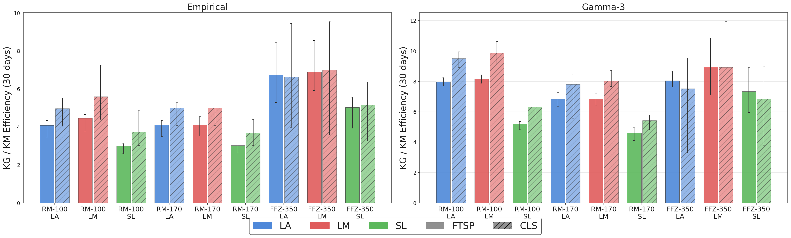</figure>

**Figure 5:** *Mean kg/km efficiency per scenario and selection strategy, with min–max whiskers across constructors; improvers as paired bars.*

**Table 5:** *Route efficiency (kg/km) by configuration over 30 days — min/max/mean across route constructors, per route improver.*

| Config | FTSP Min | FTSP Max | FTSP Mean | CLS Min | CLS Max | CLS Mean |
|--------|-----|-----|------|-----|-----|------|
| RM-100 / Empirical / LA | 3.47 | 4.35 | 4.09 | 4.04 | 5.53 | 4.97 |
| RM-100 / Empirical / LM | 3.78 | 4.66 | 4.46 | 4.40 | 7.23 | 5.60 |
| RM-100 / Empirical / SL | 2.60 | 3.11 | 3.00 | 3.02 | 4.88 | 3.74 |
| RM-100 / Gamma-3 / LA | 7.70 | 8.24 | 7.99 | 8.92 | 9.94 | 9.51 |
| RM-100 / Gamma-3 / LM | 7.87 | 8.43 | 8.17 | 9.15 | 10.62 | 9.88 |
| RM-100 / Gamma-3 / SL | 4.82 | 5.35 | 5.19 | 5.59 | 7.11 | 6.33 |
| RM-170 / Empirical / LA | 3.49 | 4.34 | 4.09 | 4.09 | 5.30 | 4.99 |
| RM-170 / Empirical / LM | 3.53 | 4.54 | 4.13 | 4.09 | 5.74 | 5.01 |
| RM-170 / Empirical / SL | 2.63 | 3.21 | 3.02 | 3.01 | 4.39 | 3.68 |
| RM-170 / Gamma-3 / LA | 6.36 | 7.28 | 6.83 | 5.58 | 8.47 | 7.81 |
| RM-170 / Gamma-3 / LM | 6.39 | 7.23 | 6.85 | 7.66 | 8.71 | 8.02 |
| RM-170 / Gamma-3 / SL | 4.11 | 4.96 | 4.63 | 4.80 | 5.79 | 5.42 |
| FFZ-350 / Empirical / LA | 5.28 | 8.45 | 6.76 | 3.98 | 9.45 | 6.62 |
| FFZ-350 / Empirical / LM | 5.92 | 8.55 | 6.89 | 3.57 | 9.54 | 6.98 |
| FFZ-350 / Empirical / SL | 3.93 | 5.55 | 5.03 | 3.26 | 6.36 | 5.16 |
| FFZ-350 / Gamma-3 / LA | 7.63 | 8.66 | 8.06 | 3.28 | 9.54 | 7.52 |
| FFZ-350 / Gamma-3 / LM | 7.11 | 10.81 | 8.94 | 5.14 | 11.93 | 8.93 |
| FFZ-350 / Gamma-3 / SL | 5.96 | 8.93 | 7.34 | 3.80 | 9.00 | 6.85 |

<!-- [ANALYSIS: Insert your observations here] -->

#### Distance Driven (km)

<figure style="display:block;width:100%;margin:0.8em 0;padding:0;"></figure>

**Figure 6:** *Distribution of total vehicle distance (km) per selection strategy and scenario (all constructors and improvers pooled), one panel per waste distribution.*

**Table 6:** *Vehicle distance driven (km) by configuration over 30 days — min/max/mean across route constructors, per route improver.*

| Config | FTSP Min | FTSP Max | FTSP Mean | CLS Min | CLS Max | CLS Mean |
|--------|-----|-----|------|-----|-----|------|
| RM-100 / Empirical / LA | 1688 | 2124 | 1809 | 1331 | 1824 | 1490 |
| RM-100 / Empirical / LM | 1674 | 2073 | 1763 | 1093 | 1782 | 1420 |
| RM-100 / Empirical / SL | 2594 | 3154 | 2746 | 1666 | 2725 | 2233 |
| RM-100 / Gamma-3 / LA | 2360 | 2526 | 2435 | 1955 | 2179 | 2046 |
| RM-100 / Gamma-3 / LM | 2282 | 2450 | 2351 | 1794 | 2107 | 1945 |
| RM-100 / Gamma-3 / SL | 3751 | 4208 | 3882 | 2932 | 3632 | 3203 |
| RM-170 / Empirical / LA | 3058 | 3814 | 3257 | 2496 | 3256 | 2677 |
| RM-170 / Empirical / LM | 3014 | 3937 | 3354 | 2407 | 3403 | 2761 |
| RM-170 / Empirical / SL | 4456 | 5375 | 4712 | 3292 | 4703 | 3901 |
| RM-170 / Gamma-3 / LA | 4413 | 5057 | 4710 | 3796 | 5697 | 4181 |
| RM-170 / Gamma-3 / LM | 4576 | 5144 | 4848 | 3804 | 4339 | 4142 |
| RM-170 / Gamma-3 / SL | 6629 | 8056 | 7152 | 5767 | 6892 | 6107 |
| FFZ-350 / Empirical / LA | 4158 | 6857 | 5436 | 3722 | 8511 | 5917 |
| FFZ-350 / Empirical / LM | 4192 | 6275 | 5312 | 3757 | 10510 | 5740 |
| FFZ-350 / Empirical / SL | 6559 | 10145 | 7610 | 5887 | 11587 | 7743 |
| FFZ-350 / Gamma-3 / LA | 4366 | 9201 | 8270 | 7015 | 21833 | 10033 |
| FFZ-350 / Gamma-3 / LM | 6355 | 10150 | 8074 | 5762 | 14283 | 8513 |
| FFZ-350 / Gamma-3 / SL | 6711 | 12201 | 9949 | 8322 | 19095 | 11435 |

<!-- [ANALYSIS: Insert your observations here] -->

### 2.3 Policy × Scenario Heatmaps

<figure style="display:block;width:100%;margin:0.8em 0;padding:0;">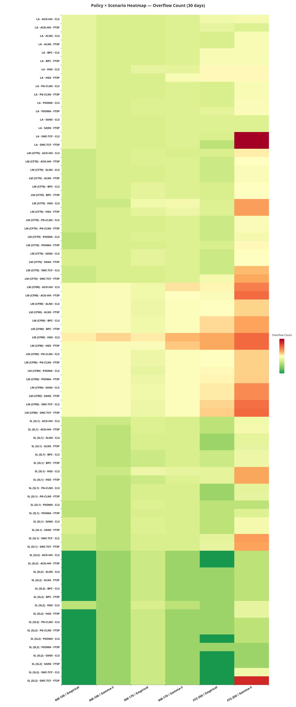</figure>

**Figure 7:** *Overflow count heatmap: each row is a full policy configuration (selection variant + constructor + improver), each column a simulation scenario (region × N × distribution).*

<figure style="display:block;width:100%;margin:0.8em 0;padding:0;">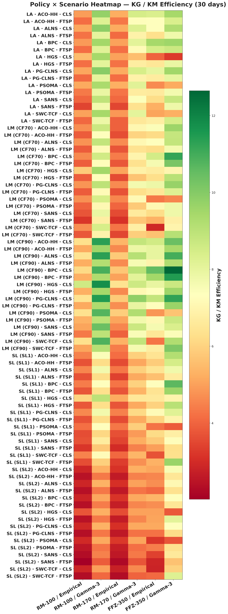</figure>

**Figure 8:** *kg/km efficiency heatmap with the same layout (rows = policy configurations, columns = scenarios).*

<figure style="display:block;width:100%;margin:0.8em 0;padding:0;">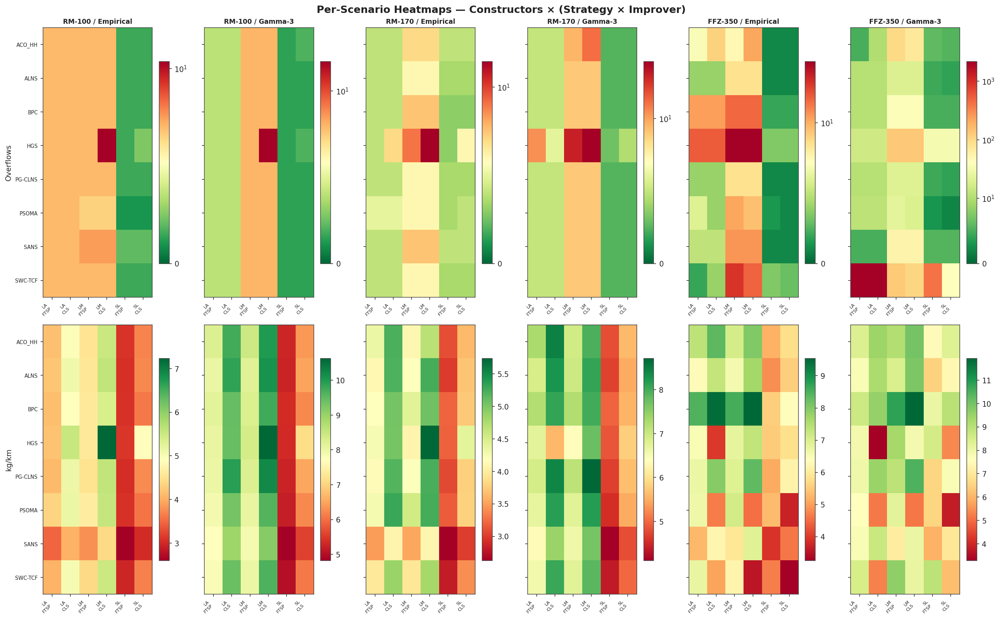</figure>

**Figure 9:** *One panel per scenario: route constructors on the rows, selection strategy × route improver combinations on the columns.*

**[Interactive heatmap](private/simulation/30d/policy_heatmap_interactive.html)**

<!-- [ANALYSIS: Insert your observations here] -->

### 2.4 Selection Strategy Comparison (LA vs LM vs SL)

<figure style="display:block;width:100%;margin:0.8em 0;padding:0;"></figure>

**Figure 10:** *One panel per waste distribution. Each bubble = one (strategy, scenario) combination, averaged over constructors and improvers; bubble size ∝ N.*

<figure style="display:block;width:100%;margin:0.8em 0;padding:0;"></figure>

**Figure 11:** *Same chart with symlog X axis.*

**[Interactive bubble chart](private/simulation/30d/strategy_bubble_interactive.html)**

#### LA (Look-Ahead)

**RM-100 / Empirical:** best overflow: **ACO_HH** (7.0); best efficiency: **HGS** (4.858 kg/km).

**RM-100 / Gamma-3:** best overflow: **ACO_HH** (4.0); best efficiency: **ACO_HH** (8.982 kg/km).

**RM-170 / Empirical:** best overflow: **ACO_HH** (4.0); best efficiency: **ACO_HH** (4.780 kg/km).

**RM-170 / Gamma-3:** best overflow: **ACO_HH** (5.0); best efficiency: **ACO_HH** (7.877 kg/km).

**FFZ-350 / Empirical:** best overflow: **SWC-TCF** (3.0); best efficiency: **BPC** (8.950 kg/km).

**FFZ-350 / Gamma-3:** best overflow: **SANS** (5.0); best efficiency: **BPC** (9.098 kg/km).

<!-- [ANALYSIS: Insert your observations here] -->

#### LM (Last-Minute)

**RM-100 / Empirical:** best overflow: **PSOMA** (6.5); best efficiency: **HGS** (5.915 kg/km).

**RM-100 / Gamma-3:** best overflow: **ACO_HH** (8.0); best efficiency: **HGS** (9.487 kg/km).

**RM-170 / Empirical:** best overflow: **ALNS** (6.0); best efficiency: **HGS** (4.910 kg/km).

**RM-170 / Gamma-3:** best overflow: **ALNS** (9.0); best efficiency: **PG-CLNS** (7.912 kg/km).

**FFZ-350 / Empirical:** best overflow: **ALNS** (8.5); best efficiency: **BPC** (9.042 kg/km).

**FFZ-350 / Gamma-3:** best overflow: **ALNS** (20.5); best efficiency: **BPC** (11.370 kg/km).

<!-- [ANALYSIS: Insert your observations here] -->

#### SL (Service-Level)

**RM-100 / Empirical:** best overflow: **PSOMA** (1.0); best efficiency: **HGS** (3.998 kg/km).

**RM-100 / Gamma-3:** best overflow: **ALNS** (1.5); best efficiency: **HGS** (6.217 kg/km).

**RM-170 / Empirical:** best overflow: **BPC** (3.0); best efficiency: **HGS** (3.794 kg/km).

**RM-170 / Gamma-3:** best overflow: **ACO_HH** (2.5); best efficiency: **HGS** (5.325 kg/km).

**FFZ-350 / Empirical:** best overflow: **ACO_HH** (1.0); best efficiency: **BPC** (5.957 kg/km).

**FFZ-350 / Gamma-3:** best overflow: **PSOMA** (2.5); best efficiency: **BPC** (8.525 kg/km).

<!-- [ANALYSIS: Insert your observations here] -->

<!-- [ANALYSIS: Insert your observations here] -->

### 2.5 Route Improver Comparison (FTSP vs CLS)

<figure style="display:block;width:100%;margin:0.8em 0;padding:0;">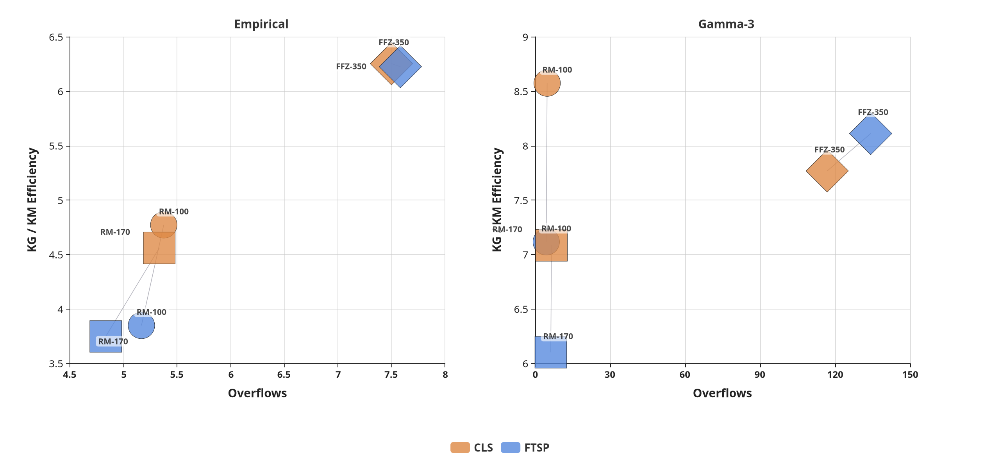</figure>

**Figure 12:** *Each bubble = one (improver, scenario) combination averaged over strategies and constructors — contrasts the route improvers directly.*

<figure style="display:block;width:100%;margin:0.8em 0;padding:0;">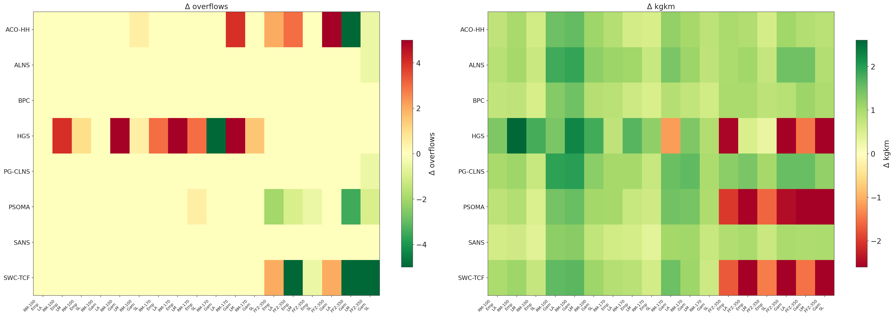</figure>

**Figure 13:** *Delta heatmap (CLS − FTSP) per constructor × configuration.*

<!-- [ANALYSIS: Insert your observations here] -->

### 2.6 Key Findings

<figure style="display:block;width:100%;margin:0.8em 0;padding:0;">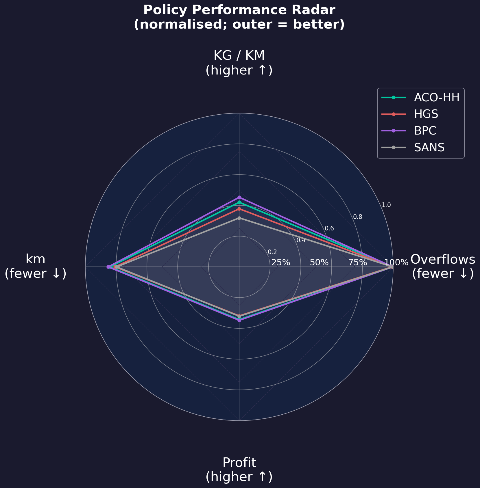</figure>

**Figure 14:** *Overlaid radar chart for key constructors. Outer = better on all axes.*

<figure style="display:block;width:100%;margin:0.8em 0;padding:0;"></figure>

**Figure 15:** *Average rank of each route constructor across all scenarios and strategies (improvers pooled). Bars grow upward — shorter = better.*

<!-- [ANALYSIS: Insert your observations here] -->

### 2.7 Full Results Table

**Table 7:** *Full results over the 30-day horizon — rows: graph size × region × data distribution; columns: mandatory selection strategy × route constructor × route improver. Each cell reports mean±std overflows and mean±std kg/km.*

| N | Region | Distribution | LA ACO_HH FTSP | LA ACO_HH CLS | LA ALNS FTSP | LA ALNS CLS | LA BPC FTSP | LA BPC CLS | LA HGS FTSP | LA HGS CLS | LA PG-CLNS FTSP | LA PG-CLNS CLS | LA PSOMA FTSP | LA PSOMA CLS | LA SANS FTSP | LA SANS CLS | LA SWC-TCF FTSP | LA SWC-TCF CLS | LM ACO_HH FTSP | LM ACO_HH CLS | LM ALNS FTSP | LM ALNS CLS | LM BPC FTSP | LM BPC CLS | LM HGS FTSP | LM HGS CLS | LM PG-CLNS FTSP | LM PG-CLNS CLS | LM PSOMA FTSP | LM PSOMA CLS | LM SANS FTSP | LM SANS CLS | LM SWC-TCF FTSP | LM SWC-TCF CLS | SL ACO_HH FTSP | SL ACO_HH CLS | SL ALNS FTSP | SL ALNS CLS | SL BPC FTSP | SL BPC CLS | SL HGS FTSP | SL HGS CLS | SL PG-CLNS FTSP | SL PG-CLNS CLS | SL PSOMA FTSP | SL PSOMA CLS | SL SANS FTSP | SL SANS CLS | SL SWC-TCF FTSP | SL SWC-TCF CLS |
|---|---|---|---|---|---|---|---|---|---|---|---|---|---|---|---|---|---|---|---|---|---|---|---|---|---|---|---|---|---|---|---|---|---|---|---|---|---|---|---|---|---|---|---|---|---|---|---|---|---|---|
| 100 | Rio Maior | Empirical | 7.0 ov 4.159 kg/km | 7.0 ov 4.951 kg/km | 7.0 ov 4.225 kg/km | 7.0 ov 5.095 kg/km | 7.0 ov 4.138 kg/km | 7.0 ov 4.900 kg/km | 7.0 ov 4.182 kg/km | 7.0 ov 5.534 kg/km | 7.0 ov 4.106 kg/km | 7.0 ov 5.118 kg/km | 7.0 ov 4.346 kg/km | 7.0 ov 5.144 kg/km | 7.0 ov 3.468 kg/km | 7.0 ov 4.038 kg/km | 7.0 ov 4.063 kg/km | 7.0 ov 5.019 kg/km | 7.0 ov 4.521 kg/km | 7.0 ov 5.522 kg/km | 7.0 ov 4.557 kg/km | 7.0 ov 5.594 kg/km | 7.0 ov 4.603 kg/km | 7.0 ov 5.379 kg/km | 7.0 ov 4.601 kg/km | 11.0 ov 7.230 kg/km | 7.0 ov 4.514 kg/km | 7.0 ov 5.598 kg/km | 6.5 ov 4.659 kg/km | 6.5 ov 5.559 kg/km | 7.5 ov 3.782 kg/km | 7.5 ov 4.396 kg/km | 7.0 ov 4.407 kg/km | 7.0 ov 5.500 kg/km | 1.5 ov 3.091 kg/km | 1.5 ov 3.692 kg/km | 1.5 ov 3.053 kg/km | 1.5 ov 3.730 kg/km | 1.5 ov 3.084 kg/km | 1.5 ov 3.628 kg/km | 1.5 ov 3.113 kg/km | 2.5 ov 4.883 kg/km | 1.5 ov 3.045 kg/km | 1.5 ov 3.748 kg/km | 1.0 ov 3.080 kg/km | 1.0 ov 3.576 kg/km | 2.0 ov 2.598 kg/km | 2.0 ov 3.017 kg/km | 1.5 ov 2.967 kg/km | 1.5 ov 3.682 kg/km |
|  |  | Gamma-3 | 4.0 ov 8.240 kg/km | 4.0 ov 9.725 kg/km | 4.0 ov 8.033 kg/km | 4.0 ov 9.857 kg/km | 4.0 ov 8.148 kg/km | 4.0 ov 9.451 kg/km | 4.0 ov 8.044 kg/km | 4.0 ov 9.444 kg/km | 4.0 ov 8.010 kg/km | 4.0 ov 9.943 kg/km | 4.0 ov 7.904 kg/km | 4.0 ov 9.328 kg/km | 4.0 ov 7.700 kg/km | 4.0 ov 8.924 kg/km | 4.0 ov 7.812 kg/km | 4.0 ov 9.412 kg/km | 8.0 ov 8.425 kg/km | 8.0 ov 9.999 kg/km | 8.0 ov 8.183 kg/km | 8.0 ov 10.090 kg/km | 8.0 ov 8.264 kg/km | 8.0 ov 9.740 kg/km | 8.0 ov 8.350 kg/km | 15.5 ov 10.623 kg/km | 8.0 ov 8.224 kg/km | 8.0 ov 10.212 kg/km | 8.0 ov 8.052 kg/km | 8.0 ov 9.585 kg/km | 8.0 ov 7.871 kg/km | 8.0 ov 9.151 kg/km | 8.0 ov 8.006 kg/km | 8.0 ov 9.634 kg/km | 1.5 ov 5.288 kg/km | 2.0 ov 6.368 kg/km | 1.5 ov 5.267 kg/km | 1.5 ov 6.495 kg/km | 1.5 ov 5.354 kg/km | 1.5 ov 6.234 kg/km | 1.5 ov 5.323 kg/km | 2.0 ov 7.111 kg/km | 1.5 ov 5.265 kg/km | 1.5 ov 6.516 kg/km | 1.5 ov 5.188 kg/km | 1.5 ov 6.244 kg/km | 1.5 ov 4.822 kg/km | 1.5 ov 5.585 kg/km | 1.5 ov 5.018 kg/km | 1.5 ov 6.109 kg/km |
| 170 | Rio Maior | Empirical | 4.0 ov 4.339 kg/km | 4.0 ov 5.221 kg/km | 4.0 ov 4.110 kg/km | 4.0 ov 5.210 kg/km | 4.0 ov 4.194 kg/km | 4.0 ov 5.042 kg/km | 4.0 ov 4.245 kg/km | 7.0 ov 5.028 kg/km | 4.0 ov 4.156 kg/km | 4.0 ov 5.181 kg/km | 5.0 ov 4.263 kg/km | 5.0 ov 5.295 kg/km | 4.0 ov 3.487 kg/km | 4.0 ov 4.085 kg/km | 4.0 ov 3.963 kg/km | 4.0 ov 4.853 kg/km | 7.0 ov 4.106 kg/km | 7.0 ov 4.681 kg/km | 6.0 ov 4.187 kg/km | 6.0 ov 5.249 kg/km | 7.5 ov 4.417 kg/km | 7.5 ov 5.062 kg/km | 9.0 ov 4.081 kg/km | 14.5 ov 5.738 kg/km | 6.0 ov 4.199 kg/km | 6.0 ov 5.234 kg/km | 6.0 ov 4.539 kg/km | 6.0 ov 5.244 kg/km | 7.5 ov 3.530 kg/km | 7.5 ov 4.087 kg/km | 6.0 ov 3.944 kg/km | 6.0 ov 4.791 kg/km | 4.0 ov 3.096 kg/km | 4.0 ov 3.642 kg/km | 3.5 ov 3.002 kg/km | 3.5 ov 3.706 kg/km | 3.0 ov 3.209 kg/km | 3.0 ov 3.725 kg/km | 3.0 ov 3.193 kg/km | 6.0 ov 4.395 kg/km | 3.5 ov 3.067 kg/km | 3.5 ov 3.770 kg/km | 3.5 ov 3.169 kg/km | 4.0 ov 3.787 kg/km | 4.0 ov 2.627 kg/km | 4.0 ov 3.009 kg/km | 3.5 ov 2.821 kg/km | 3.5 ov 3.407 kg/km |
|  |  | Gamma-3 | 5.0 ov 7.285 kg/km | 5.0 ov 8.469 kg/km | 5.0 ov 6.884 kg/km | 5.0 ov 8.275 kg/km | 5.0 ov 7.204 kg/km | 5.0 ov 8.085 kg/km | 11.0 ov 6.744 kg/km | 6.0 ov 5.583 kg/km | 5.0 ov 6.901 kg/km | 5.0 ov 8.412 kg/km | 5.0 ov 6.692 kg/km | 5.0 ov 8.154 kg/km | 5.0 ov 6.360 kg/km | 5.0 ov 7.413 kg/km | 5.0 ov 6.568 kg/km | 5.0 ov 8.063 kg/km | 9.5 ov 6.933 kg/km | 13.5 ov 7.951 kg/km | 9.0 ov 6.982 kg/km | 9.0 ov 8.092 kg/km | 9.0 ov 7.229 kg/km | 9.0 ov 7.998 kg/km | 21.5 ov 6.389 kg/km | 27.5 ov 7.743 kg/km | 9.0 ov 7.114 kg/km | 9.0 ov 8.711 kg/km | 9.0 ov 6.763 kg/km | 9.0 ov 8.182 kg/km | 9.0 ov 6.598 kg/km | 9.0 ov 7.656 kg/km | 9.0 ov 6.762 kg/km | 9.0 ov 7.851 kg/km | 2.5 ov 4.805 kg/km | 2.5 ov 5.614 kg/km | 2.5 ov 4.706 kg/km | 2.5 ov 5.488 kg/km | 2.5 ov 4.956 kg/km | 2.5 ov 5.562 kg/km | 3.0 ov 4.862 kg/km | 4.5 ov 5.788 kg/km | 2.5 ov 4.685 kg/km | 2.5 ov 5.644 kg/km | 2.5 ov 4.546 kg/km | 2.5 ov 5.488 kg/km | 2.5 ov 4.108 kg/km | 2.5 ov 4.802 kg/km | 2.5 ov 4.364 kg/km | 2.5 ov 5.005 kg/km |
| 350 | Figueira da Foz | Empirical | 7.0 ov 7.356 kg/km | 9.0 ov 8.348 kg/km | 4.0 ov 6.332 kg/km | 4.0 ov 7.302 kg/km | 11.0 ov 8.454 kg/km | 11.0 ov 9.446 kg/km | 16.0 ov 6.507 kg/km | 16.0 ov 3.976 kg/km | 4.0 ov 6.702 kg/km | 4.0 ov 7.960 kg/km | 6.0 ov 6.661 kg/km | 4.0 ov 4.669 kg/km | 5.0 ov 5.282 kg/km | 5.0 ov 6.212 kg/km | 2.0 ov 6.757 kg/km | 4.0 ov 5.050 kg/km | 7.5 ov 7.082 kg/km | 10.5 ov 8.006 kg/km | 8.5 ov 6.594 kg/km | 8.5 ov 7.651 kg/km | 15.0 ov 8.548 kg/km | 15.0 ov 9.536 kg/km | 30.5 ov 6.797 kg/km | 30.5 ov 7.307 kg/km | 8.5 ov 6.922 kg/km | 8.5 ov 8.324 kg/km | 10.5 ov 7.103 kg/km | 9.5 ov 4.555 kg/km | 11.5 ov 5.916 kg/km | 11.5 ov 6.907 kg/km | 20.5 ov 6.185 kg/km | 15.5 ov 3.575 kg/km | 1.0 ov 5.217 kg/km | 1.0 ov 5.784 kg/km | 1.0 ov 4.838 kg/km | 1.0 ov 5.551 kg/km | 2.0 ov 5.552 kg/km | 2.0 ov 6.363 kg/km | 3.5 ov 5.519 kg/km | 3.5 ov 5.805 kg/km | 1.0 ov 5.136 kg/km | 1.0 ov 6.153 kg/km | 1.5 ov 5.319 kg/km | 1.0 ov 3.714 kg/km | 1.0 ov 3.931 kg/km | 1.0 ov 4.618 kg/km | 3.5 ov 4.701 kg/km | 3.0 ov 3.259 kg/km |
|  |  | Gamma-3 | 5.0 ov 8.357 kg/km | 10.0 ov 9.431 kg/km | 11.0 ov 7.740 kg/km | 11.0 ov 9.211 kg/km | 11.0 ov 8.661 kg/km | 11.0 ov 9.535 kg/km | 16.0 ov 7.876 kg/km | 16.0 ov 3.283 kg/km | 11.0 ov 7.961 kg/km | 11.0 ov 9.492 kg/km | 12.0 ov 7.628 kg/km | 12.0 ov 5.187 kg/km | 5.0 ov 7.762 kg/km | 5.0 ov 8.746 kg/km | 2166.0 ov 8.490 kg/km | 2168.0 ov 5.284 kg/km | 100.0 ov 9.091 kg/km | 71.5 ov 9.996 kg/km | 20.5 ov 8.427 kg/km | 20.5 ov 9.898 kg/km | 38.5 ov 10.815 kg/km | 38.5 ov 11.926 kg/km | 129.5 ov 9.312 kg/km | 129.5 ov 7.848 kg/km | 21.0 ov 8.927 kg/km | 21.0 ov 10.464 kg/km | 23.5 ov 8.223 kg/km | 20.0 ov 5.140 kg/km | 55.5 ov 7.113 kg/km | 55.5 ov 8.061 kg/km | 125.5 ov 9.609 kg/km | 105.0 ov 8.089 kg/km | 6.0 ov 7.496 kg/km | 5.5 ov 8.345 kg/km | 4.5 ov 6.521 kg/km | 4.0 ov 7.431 kg/km | 5.0 ov 8.049 kg/km | 5.0 ov 9.001 kg/km | 33.0 ov 8.576 kg/km | 33.0 ov 5.402 kg/km | 4.5 ov 6.578 kg/km | 4.0 ov 7.769 kg/km | 3.0 ov 6.577 kg/km | 2.0 ov 3.800 kg/km | 5.5 ov 5.957 kg/km | 5.5 ov 6.931 kg/km | 410.0 ov 8.929 kg/km | 40.5 ov 6.162 kg/km |

<!-- [ANALYSIS: Insert your observations here] -->

---

## 3. 90-Day Horizon Results

> **Logs analysed:** 174
> **Constructors available:** ACO_HH, BPC, HGS, PG-CLNS, PSOMA, SANS, SWC-TCF

### 3.1 Analytics Comparison — Pareto View

<figure style="display:block;width:100%;margin:0.8em 0;padding:0;">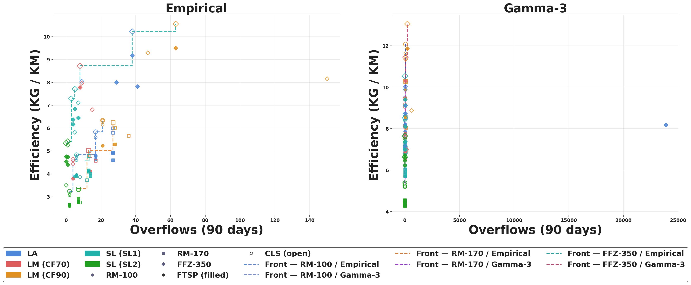</figure>

**Figure 16:** *Scatter of all 90-day runs in the overflows–kg/km space, one panel per waste distribution. Colour encodes the mandatory selection variant, marker shape encodes the scenario (region/N), filled markers = FTSP, open markers = CLS. Dashed lines = Pareto fronts, one colour per scenario (region × N × distribution).*

<figure style="display:block;width:100%;margin:0.8em 0;padding:0;">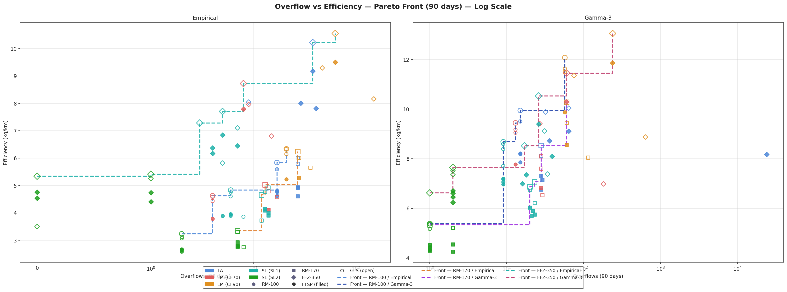</figure>

**Figure 17:** *Same chart with symlog X-axis — spreads the densely clustered low-overflow region.*

**[Interactive version](private/simulation/90d/pareto_scatter_interactive.html)**

#### Pareto-Front Policy Catalogue (90 days)

**Table 8:** *Pareto-optimal policy configurations over the 90-day horizon — each unique (selection variant, constructor, improver) that appeared on the Pareto front of at least one scenario, sorted by scenario count; metrics averaged across those scenarios.*

| Selection | Constructor | Improver | Overflows | kg/km | Pareto-Front Scenarios |
|-----------|-------------|----------|----------:|------:|------------------------|
| SL (SL1) | PG-CLNS | CLS | 11.6 | 7.281 | FFZ-350 / Empirical, FFZ-350 / Gamma-3, RM-100 / Empirical, RM-100 / Gamma-3, RM-170 / Gamma-3 |
| LM (CF90) | PG-CLNS | CLS | 41.2 | 8.736 | RM-100 / Empirical, RM-100 / Gamma-3, RM-170 / Empirical, RM-170 / Gamma-3 |
| LA | PG-CLNS | CLS | 20.0 | 8.108 | RM-100 / Empirical, RM-100 / Gamma-3, RM-170 / Gamma-3 |
| LM (CF70) | PG-CLNS | CLS | 10.0 | 6.366 | RM-100 / Empirical, RM-100 / Gamma-3, RM-170 / Empirical |
| SL (SL2) | ACO_HH | CLS | 1.0 | 6.108 | FFZ-350 / Empirical, FFZ-350 / Gamma-3, RM-170 / Gamma-3 |
| SL (SL2) | PG-CLNS | CLS | 3.3 | 3.989 | RM-100 / Empirical, RM-100 / Gamma-3, RM-170 / Empirical |
| LM (CF70) | BPC | CLS | 34.0 | 10.088 | FFZ-350 / Empirical, FFZ-350 / Gamma-3 |
| LM (CF90) | BPC | CLS | 150.5 | 11.802 | FFZ-350 / Empirical, FFZ-350 / Gamma-3 |
| SL (SL1) | ACO_HH | CLS | 16.0 | 5.768 | RM-170 / Empirical, RM-170 / Gamma-3 |
| SL (SL1) | BPC | CLS | 15.5 | 9.119 | FFZ-350 / Empirical, FFZ-350 / Gamma-3 |
| LA | BPC | CLS | 38.0 | 10.220 | FFZ-350 / Empirical |
| SL (SL2) | BPC | CLS | 1.0 | 5.416 | FFZ-350 / Empirical |
| SL (SL2) | SANS | CLS | 1.0 | 6.624 | FFZ-350 / Gamma-3 |

<!-- [ANALYSIS: Insert your observations here] -->

### 3.2 Summary KPI Analysis

#### Overflow Performance

<figure style="display:block;width:100%;margin:0.8em 0;padding:0;">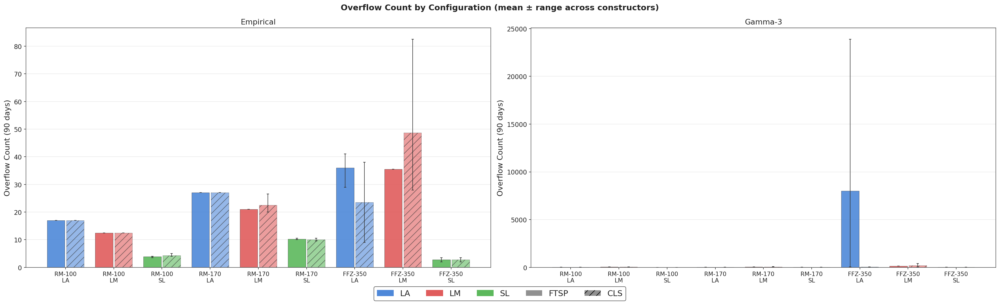</figure>

**Figure 18:** *Mean overflow count per scenario and selection strategy (mean ± min/max range across route constructors); route improvers shown as paired bars within each configuration.*

<figure style="display:block;width:100%;margin:0.8em 0;padding:0;">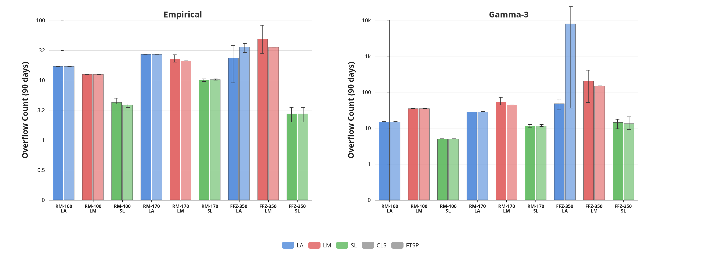</figure>

**Figure 19:** *Same chart with symlog Y axis — reveals structure compressed in the linear scale.*

**Table 9:** *Overflow counts by configuration over 90 days — min/max/mean across route constructors, per route improver.*

| Config | FTSP Min | FTSP Max | FTSP Mean | CLS Min | CLS Max | CLS Mean |
|--------|-----|-----|------|-----|-----|------|
| RM-100 / Empirical / LA | 17.0 | 17.0 | 17.0 | 17.0 | 17.0 | 17.0 |
| RM-100 / Empirical / LM | 12.5 | 12.5 | 12.5 | 12.5 | 12.5 | 12.5 |
| RM-100 / Empirical / SL | 3.5 | 4.0 | 3.9 | 4.0 | 5.0 | 4.2 |
| RM-100 / Gamma-3 / LA | 15.0 | 15.0 | 15.0 | 15.0 | 15.0 | 15.0 |
| RM-100 / Gamma-3 / LM | 35.0 | 35.0 | 35.0 | 35.0 | 35.0 | 35.0 |
| RM-100 / Gamma-3 / SL | 5.0 | 5.0 | 5.0 | 5.0 | 5.0 | 5.0 |
| RM-170 / Empirical / LA | 27.0 | 27.0 | 27.0 | 27.0 | 27.0 | 27.0 |
| RM-170 / Empirical / LM | 21.0 | 21.0 | 21.0 | 20.0 | 26.5 | 22.5 |
| RM-170 / Empirical / SL | 10.0 | 10.5 | 10.2 | 9.5 | 10.5 | 10.0 |
| RM-170 / Gamma-3 / LA | 28.0 | 29.0 | 28.3 | 28.0 | 28.0 | 28.0 |
| RM-170 / Gamma-3 / LM | 44.0 | 44.0 | 44.0 | 44.0 | 71.5 | 53.2 |
| RM-170 / Gamma-3 / SL | 11.0 | 12.5 | 11.5 | 10.5 | 12.5 | 11.5 |
| FFZ-350 / Empirical / LA | 29.0 | 41.0 | 36.0 | 9.0 | 38.0 | 23.5 |
| FFZ-350 / Empirical / LM | 35.5 | 35.5 | 35.5 | 28.0 | 82.5 | 48.7 |
| FFZ-350 / Empirical / SL | 2.0 | 3.5 | 2.8 | 2.0 | 3.5 | 2.8 |
| FFZ-350 / Gamma-3 / LA | 36.0 | 23886.0 | 7995.3 | 32.0 | 64.0 | 48.0 |
| FFZ-350 / Gamma-3 / LM | 149.0 | 149.0 | 149.0 | 51.0 | 407.5 | 202.5 |
| FFZ-350 / Gamma-3 / SL | 9.0 | 20.5 | 13.4 | 9.5 | 17.5 | 14.4 |

<!-- [ANALYSIS: Insert your observations here] -->

#### Route Efficiency (kg/km)

<figure style="display:block;width:100%;margin:0.8em 0;padding:0;">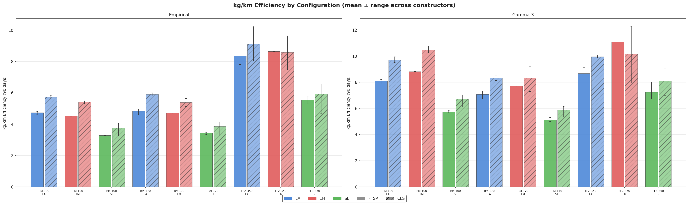</figure>

**Figure 20:** *Mean kg/km efficiency per scenario and selection strategy, with min–max whiskers across constructors; improvers as paired bars.*

**Table 10:** *Route efficiency (kg/km) by configuration over 90 days — min/max/mean across route constructors, per route improver.*

| Config | FTSP Min | FTSP Max | FTSP Mean | CLS Min | CLS Max | CLS Mean |
|--------|-----|-----|------|-----|-----|------|
| RM-100 / Empirical / LA | 4.63 | 4.81 | 4.74 | 5.59 | 5.84 | 5.72 |
| RM-100 / Empirical / LM | 4.51 | 4.51 | 4.51 | 5.29 | 5.48 | 5.41 |
| RM-100 / Empirical / SL | 3.27 | 3.30 | 3.28 | 3.26 | 4.03 | 3.77 |
| RM-100 / Gamma-3 / LA | 7.86 | 8.21 | 8.09 | 9.51 | 9.95 | 9.73 |
| RM-100 / Gamma-3 / LM | 8.82 | 8.82 | 8.82 | 10.28 | 10.76 | 10.48 |
| RM-100 / Gamma-3 / SL | 5.64 | 5.82 | 5.74 | 6.11 | 7.03 | 6.73 |
| RM-170 / Empirical / LA | 4.60 | 4.94 | 4.82 | 5.80 | 6.00 | 5.90 |
| RM-170 / Empirical / LM | 4.70 | 4.70 | 4.70 | 5.12 | 5.63 | 5.39 |
| RM-170 / Empirical / SL | 3.34 | 3.47 | 3.43 | 3.24 | 4.14 | 3.85 |
| RM-170 / Gamma-3 / LA | 6.76 | 7.32 | 7.07 | 8.13 | 8.54 | 8.34 |
| RM-170 / Gamma-3 / LM | 7.70 | 7.70 | 7.70 | 7.29 | 9.19 | 8.34 |
| RM-170 / Gamma-3 / SL | 5.00 | 5.30 | 5.13 | 5.32 | 6.15 | 5.89 |
| FFZ-350 / Empirical / LA | 7.81 | 9.18 | 8.34 | 8.05 | 10.22 | 9.13 |
| FFZ-350 / Empirical / LM | 8.64 | 8.64 | 8.64 | 7.48 | 9.64 | 8.58 |
| FFZ-350 / Empirical / SL | 5.29 | 5.79 | 5.54 | 4.66 | 6.56 | 5.93 |
| FFZ-350 / Gamma-3 / LA | 8.18 | 9.11 | 8.67 | 9.89 | 10.04 | 9.96 |
| FFZ-350 / Gamma-3 / LM | 11.08 | 11.08 | 11.08 | 7.93 | 12.25 | 10.19 |
| FFZ-350 / Gamma-3 / SL | 6.73 | 8.01 | 7.24 | 7.00 | 9.02 | 8.09 |

<!-- [ANALYSIS: Insert your observations here] -->

#### Distance Driven (km)

<figure style="display:block;width:100%;margin:0.8em 0;padding:0;"></figure>

**Figure 21:** *Distribution of total vehicle distance (km) per selection strategy and scenario (all constructors and improvers pooled), one panel per waste distribution.*

**Table 11:** *Vehicle distance driven (km) by configuration over 90 days — min/max/mean across route constructors, per route improver.*

| Config | FTSP Min | FTSP Max | FTSP Mean | CLS Min | CLS Max | CLS Mean |
|--------|-----|-----|------|-----|-----|------|
| RM-100 / Empirical / LA | 4523 | 4700 | 4594 | 3726 | 3890 | 3808 |
| RM-100 / Empirical / LM | 4961 | 4961 | 4961 | 4076 | 4231 | 4135 |
| RM-100 / Empirical / SL | 6929 | 7019 | 6957 | 5673 | 6965 | 6109 |
| RM-100 / Gamma-3 / LA | 7172 | 7491 | 7283 | 5920 | 6194 | 6057 |
| RM-100 / Gamma-3 / LM | 6717 | 6717 | 6717 | 5513 | 5768 | 5659 |
| RM-100 / Gamma-3 / SL | 10687 | 11006 | 10833 | 8827 | 10315 | 9302 |
| RM-170 / Empirical / LA | 8285 | 8903 | 8511 | 6833 | 7070 | 6951 |
| RM-170 / Empirical / LM | 8838 | 8838 | 8838 | 7361 | 8064 | 7694 |
| RM-170 / Empirical / SL | 12106 | 12748 | 12386 | 10299 | 12924 | 11085 |
| RM-170 / Gamma-3 / LA | 13720 | 14865 | 14208 | 11758 | 12342 | 12050 |
| RM-170 / Gamma-3 / LM | 13343 | 13343 | 13343 | 11194 | 13981 | 12400 |
| RM-170 / Gamma-3 / SL | 19566 | 20748 | 20198 | 16889 | 19654 | 17679 |
| FFZ-350 / Empirical / LA | 12220 | 14271 | 13580 | 10978 | 14037 | 12508 |
| FFZ-350 / Empirical / LM | 13095 | 13095 | 13095 | 11732 | 15179 | 13405 |
| FFZ-350 / Empirical / SL | 20379 | 22181 | 21231 | 17950 | 26188 | 20394 |
| FFZ-350 / Gamma-3 / LA | 3811 | 24802 | 17495 | 21674 | 21932 | 21803 |
| FFZ-350 / Gamma-3 / LM | 19583 | 19583 | 19583 | 17705 | 27407 | 22135 |
| FFZ-350 / Gamma-3 / SL | 28128 | 32610 | 30769 | 24893 | 31414 | 27585 |

<!-- [ANALYSIS: Insert your observations here] -->

### 3.3 Policy × Scenario Heatmaps

<figure style="display:block;width:100%;margin:0.8em 0;padding:0;">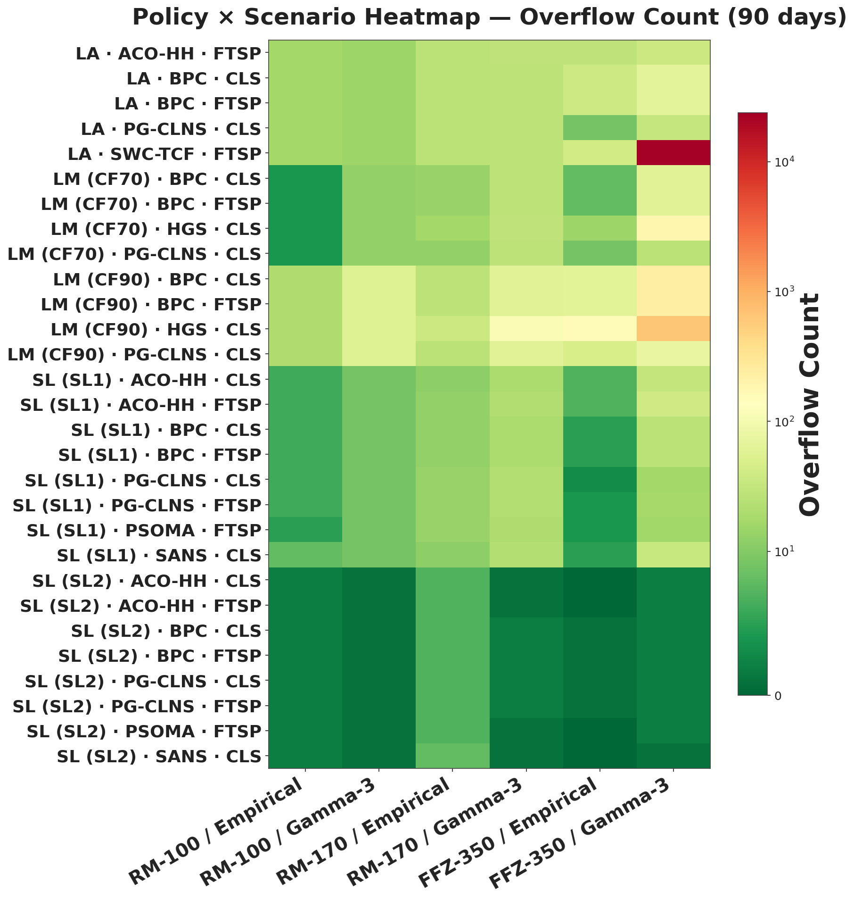</figure>

**Figure 22:** *Overflow count heatmap: each row is a full policy configuration (selection variant + constructor + improver), each column a simulation scenario (region × N × distribution).*

<figure style="display:block;width:100%;margin:0.8em 0;padding:0;">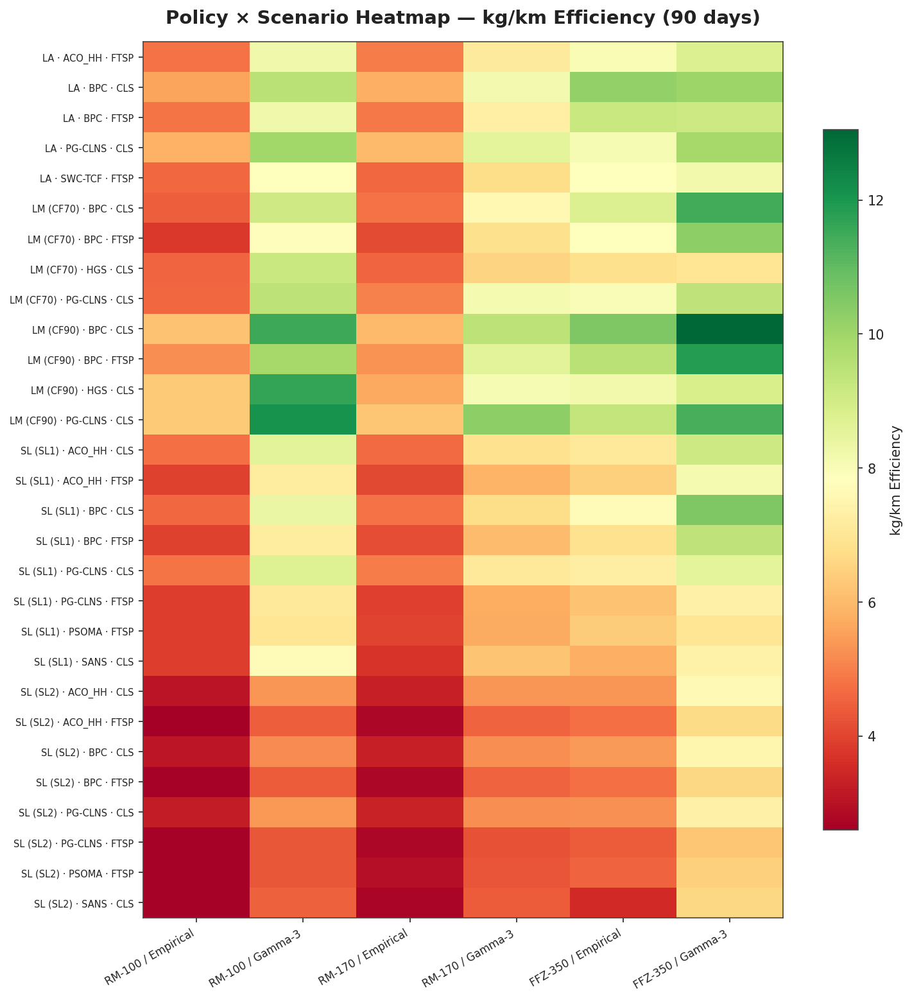</figure>

**Figure 23:** *kg/km efficiency heatmap with the same layout (rows = policy configurations, columns = scenarios).*

<figure style="display:block;width:100%;margin:0.8em 0;padding:0;">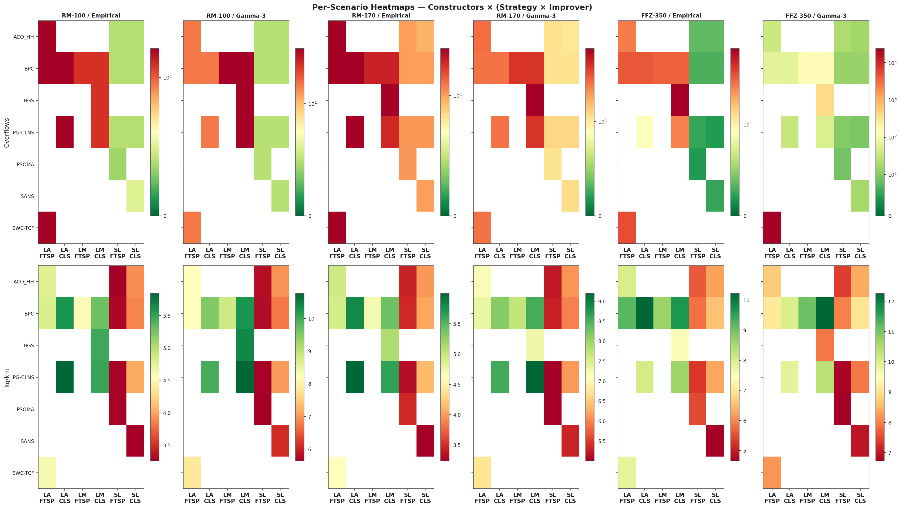</figure>

**Figure 24:** *One panel per scenario: route constructors on the rows, selection strategy × route improver combinations on the columns.*

**[Interactive heatmap](private/simulation/90d/policy_heatmap_interactive.html)**

<!-- [ANALYSIS: Insert your observations here] -->

### 3.4 Selection Strategy Comparison (LA vs LM vs SL)

<figure style="display:block;width:100%;margin:0.8em 0;padding:0;"></figure>

**Figure 25:** *One panel per waste distribution. Each bubble = one (strategy, scenario) combination, averaged over constructors and improvers; bubble size ∝ N.*

<figure style="display:block;width:100%;margin:0.8em 0;padding:0;"></figure>

**Figure 26:** *Same chart with symlog X axis.*

**[Interactive bubble chart](private/simulation/90d/strategy_bubble_interactive.html)**

#### LA (Look-Ahead)

**RM-100 / Empirical:** best overflow: **ACO_HH** (17.0); best efficiency: **PG-CLNS** (5.838 kg/km).

**RM-100 / Gamma-3:** best overflow: **ACO_HH** (15.0); best efficiency: **PG-CLNS** (9.947 kg/km).

**RM-170 / Empirical:** best overflow: **ACO_HH** (27.0); best efficiency: **PG-CLNS** (5.999 kg/km).

**RM-170 / Gamma-3:** best overflow: **BPC** (28.0); best efficiency: **PG-CLNS** (8.539 kg/km).

**FFZ-350 / Empirical:** best overflow: **PG-CLNS** (9.0); best efficiency: **BPC** (9.701 kg/km).

**FFZ-350 / Gamma-3:** best overflow: **PG-CLNS** (32.0); best efficiency: **PG-CLNS** (9.886 kg/km).

<!-- [ANALYSIS: Insert your observations here] -->

#### LM (Last-Minute)

**RM-100 / Empirical:** best overflow: **BPC** (12.5); best efficiency: **PG-CLNS** (5.483 kg/km).

**RM-100 / Gamma-3:** best overflow: **BPC** (35.0); best efficiency: **PG-CLNS** (10.762 kg/km).

**RM-170 / Empirical:** best overflow: **PG-CLNS** (20.0); best efficiency: **PG-CLNS** (5.634 kg/km).

**RM-170 / Gamma-3:** best overflow: **BPC** (44.0); best efficiency: **PG-CLNS** (9.191 kg/km).

**FFZ-350 / Empirical:** best overflow: **PG-CLNS** (28.0); best efficiency: **BPC** (9.142 kg/km).

**FFZ-350 / Gamma-3:** best overflow: **PG-CLNS** (51.0); best efficiency: **BPC** (11.667 kg/km).

<!-- [ANALYSIS: Insert your observations here] -->

#### SL (Service-Level)

**RM-100 / Empirical:** best overflow: **PSOMA** (3.5); best efficiency: **PG-CLNS** (3.659 kg/km).

**RM-100 / Gamma-3:** best overflow: **ACO_HH** (5.0); best efficiency: **ACO_HH** (6.397 kg/km).

**RM-170 / Empirical:** best overflow: **ACO_HH** (9.8); best efficiency: **BPC** (3.761 kg/km).

**RM-170 / Gamma-3:** best overflow: **ACO_HH** (11.0); best efficiency: **ACO_HH** (5.663 kg/km).

**FFZ-350 / Empirical:** best overflow: **PSOMA** (2.0); best efficiency: **BPC** (6.177 kg/km).

**FFZ-350 / Gamma-3:** best overflow: **PSOMA** (9.0); best efficiency: **BPC** (8.514 kg/km).

<!-- [ANALYSIS: Insert your observations here] -->

<!-- [ANALYSIS: Insert your observations here] -->

### 3.5 Route Improver Comparison (FTSP vs CLS)

<figure style="display:block;width:100%;margin:0.8em 0;padding:0;">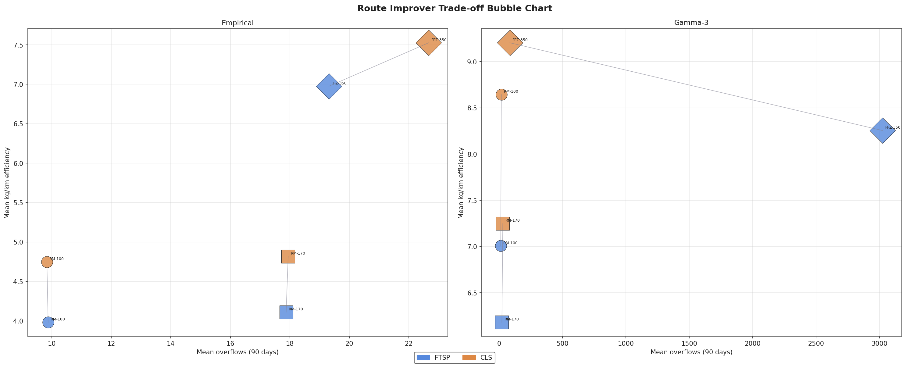</figure>

**Figure 27:** *Each bubble = one (improver, scenario) combination averaged over strategies and constructors — contrasts the route improvers directly.*

<figure style="display:block;width:100%;margin:0.8em 0;padding:0;">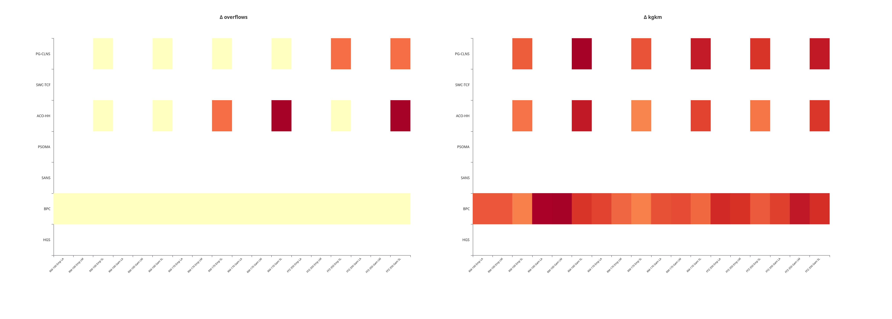</figure>

**Figure 28:** *Delta heatmap (CLS − FTSP) per constructor × configuration.*

<!-- [ANALYSIS: Insert your observations here] -->

### 3.6 Key Findings

<figure style="display:block;width:100%;margin:0.8em 0;padding:0;">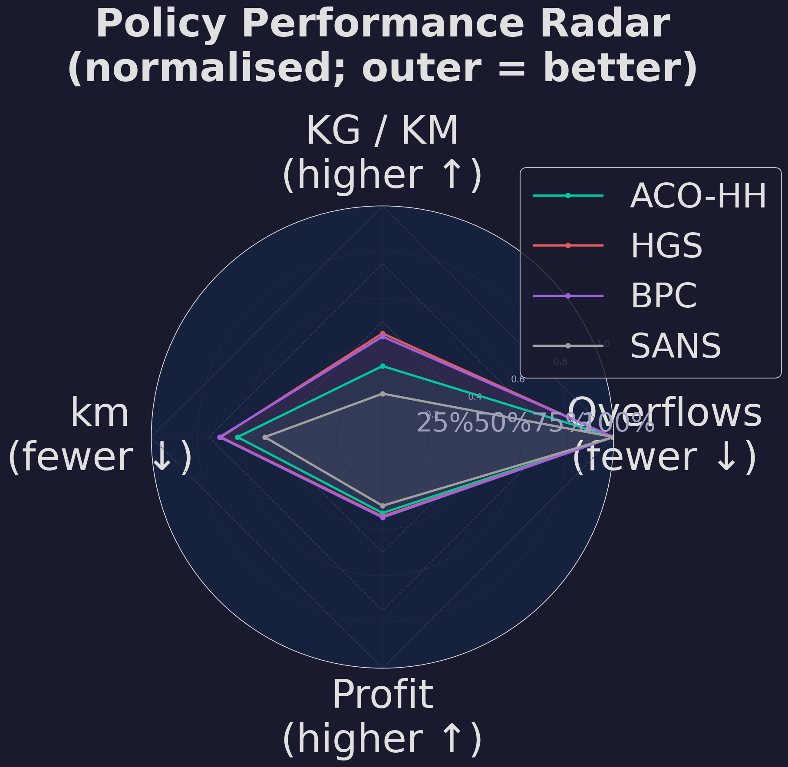</figure>

**Figure 29:** *Overlaid radar chart for key constructors. Outer = better on all axes.*

<figure style="display:block;width:100%;margin:0.8em 0;padding:0;">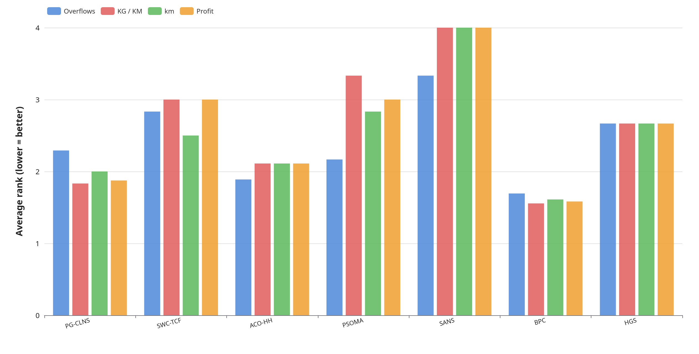</figure>

**Figure 30:** *Average rank of each route constructor across all scenarios and strategies (improvers pooled). Bars grow upward — shorter = better.*

<!-- [ANALYSIS: Insert your observations here] -->

### 3.7 Full Results Table

**Table 12:** *Full results over the 90-day horizon — rows: graph size × region × data distribution; columns: mandatory selection strategy × route constructor × route improver. Each cell reports mean±std overflows and mean±std kg/km.*

| N | Region | Distribution | LA ACO_HH FTSP | LA ACO_HH CLS | LA BPC FTSP | LA BPC CLS | LA HGS FTSP | LA HGS CLS | LA PG-CLNS FTSP | LA PG-CLNS CLS | LA PSOMA FTSP | LA PSOMA CLS | LA SANS FTSP | LA SANS CLS | LA SWC-TCF FTSP | LA SWC-TCF CLS | LM ACO_HH FTSP | LM ACO_HH CLS | LM BPC FTSP | LM BPC CLS | LM HGS FTSP | LM HGS CLS | LM PG-CLNS FTSP | LM PG-CLNS CLS | LM PSOMA FTSP | LM PSOMA CLS | LM SANS FTSP | LM SANS CLS | LM SWC-TCF FTSP | LM SWC-TCF CLS | SL ACO_HH FTSP | SL ACO_HH CLS | SL BPC FTSP | SL BPC CLS | SL HGS FTSP | SL HGS CLS | SL PG-CLNS FTSP | SL PG-CLNS CLS | SL PSOMA FTSP | SL PSOMA CLS | SL SANS FTSP | SL SANS CLS | SL SWC-TCF FTSP | SL SWC-TCF CLS |
|---|---|---|---|---|---|---|---|---|---|---|---|---|---|---|---|---|---|---|---|---|---|---|---|---|---|---|---|---|---|---|---|---|---|---|---|---|---|---|---|---|---|---|---|---|
| 100 | Rio Maior | Empirical | 17.0 ov 4.770 kg/km | — | 17.0 ov 4.810 kg/km | 17.0 ov 5.592 kg/km | — | — | — | 17.0 ov 5.838 kg/km | — | — | — | — | 17.0 ov 4.629 kg/km | — | — | — | 12.5 ov 4.510 kg/km | 12.5 ov 5.291 kg/km | — | 12.5 ov 5.460 kg/km | — | 12.5 ov 5.483 kg/km | — | — | — | — | — | — | 4.0 ov 3.273 kg/km | 4.0 ov 3.911 kg/km | 4.0 ov 3.301 kg/km | 4.0 ov 3.865 kg/km | — | — | 4.0 ov 3.283 kg/km | 4.0 ov 4.035 kg/km | 3.5 ov 3.281 kg/km | — | — | 5.0 ov 3.259 kg/km | — | — |
|  |  | Gamma-3 | 15.0 ov 8.211 kg/km | — | 15.0 ov 8.196 kg/km | 15.0 ov 9.508 kg/km | — | — | — | 15.0 ov 9.947 kg/km | — | — | — | — | 15.0 ov 7.862 kg/km | — | — | — | 35.0 ov 8.824 kg/km | 35.0 ov 10.277 kg/km | — | 35.0 ov 10.405 kg/km | — | 35.0 ov 10.762 kg/km | — | — | — | — | — | — | 5.0 ov 5.819 kg/km | 5.0 ov 6.974 kg/km | 5.0 ov 5.802 kg/km | 5.0 ov 6.781 kg/km | — | — | 5.0 ov 5.701 kg/km | 5.0 ov 7.035 kg/km | 5.0 ov 5.643 kg/km | — | — | 5.0 ov 6.110 kg/km | — | — |
| 170 | Rio Maior | Empirical | 27.0 ov 4.945 kg/km | — | 27.0 ov 4.912 kg/km | 27.0 ov 5.797 kg/km | — | — | — | 27.0 ov 5.999 kg/km | — | — | — | — | 27.0 ov 4.605 kg/km | — | — | — | 21.0 ov 4.699 kg/km | 21.0 ov 5.407 kg/km | — | 26.5 ov 5.120 kg/km | — | 20.0 ov 5.634 kg/km | — | — | — | — | — | — | 10.0 ov 3.442 kg/km | 9.5 ov 3.983 kg/km | 10.0 ov 3.474 kg/km | 10.0 ov 4.047 kg/km | — | — | 10.5 ov 3.336 kg/km | 10.5 ov 4.140 kg/km | 10.5 ov 3.470 kg/km | — | — | 10.0 ov 3.239 kg/km | — | — |
|  |  | Gamma-3 | 29.0 ov 7.150 kg/km | — | 28.0 ov 7.315 kg/km | 28.0 ov 8.132 kg/km | — | — | — | 28.0 ov 8.539 kg/km | — | — | — | — | 28.0 ov 6.755 kg/km | — | — | — | 44.0 ov 7.696 kg/km | 44.0 ov 8.532 kg/km | — | 71.5 ov 7.290 kg/km | — | 44.0 ov 9.191 kg/km | — | — | — | — | — | — | 11.5 ov 5.219 kg/km | 10.5 ov 6.106 kg/km | 11.0 ov 5.296 kg/km | 11.0 ov 5.982 kg/km | — | — | 12.5 ov 5.009 kg/km | 12.5 ov 6.148 kg/km | 11.0 ov 5.004 kg/km | — | — | 12.0 ov 5.323 kg/km | — | — |
| 350 | Figueira da Foz | Empirical | 29.0 ov 8.010 kg/km | — | 38.0 ov 9.181 kg/km | 38.0 ov 10.220 kg/km | — | — | — | 9.0 ov 8.048 kg/km | — | — | — | — | 41.0 ov 7.815 kg/km | — | — | — | 35.5 ov 8.645 kg/km | 35.5 ov 9.639 kg/km | — | 82.5 ov 7.484 kg/km | — | 28.0 ov 8.628 kg/km | — | — | — | — | — | — | 3.5 ov 5.603 kg/km | 3.5 ov 6.224 kg/km | 3.0 ov 5.794 kg/km | 3.0 ov 6.561 kg/km | — | — | 2.5 ov 5.288 kg/km | 2.0 ov 6.268 kg/km | 2.0 ov 5.460 kg/km | — | — | 2.5 ov 4.659 kg/km | — | — |
|  |  | Gamma-3 | 36.0 ov 8.724 kg/km | — | 64.0 ov 9.114 kg/km | 64.0 ov 10.039 kg/km | — | — | — | 32.0 ov 9.886 kg/km | — | — | — | — | 23886.0 ov 8.178 kg/km | — | — | — | 149.0 ov 11.083 kg/km | 149.0 ov 12.251 kg/km | — | 407.5 ov 7.932 kg/km | — | 51.0 ov 10.383 kg/km | — | — | — | — | — | — | 20.5 ov 7.408 kg/km | 16.5 ov 8.382 kg/km | 14.0 ov 8.005 kg/km | 14.0 ov 9.023 kg/km | — | — | 10.0 ov 6.798 kg/km | 9.5 ov 7.941 kg/km | 9.0 ov 6.729 kg/km | — | — | 17.5 ov 7.003 kg/km | — | — |

<!-- [ANALYSIS: Insert your observations here] -->

---

## 4. Horizon Comparison (30d vs 90d)

This section compares results across the simulation horizons to identify which patterns are
robust across time scales and which shift as the evaluation window extends.

### Overflow Across Horizons

<figure style="display:block;width:100%;margin:0.8em 0;padding:0;"></figure>

*Side-by-side overflow bars for every configuration, one bar colour per horizon.
Growth across horizons indicates that overflow pressure accumulates over time.*

<figure style="display:block;width:100%;margin:0.8em 0;padding:0;"></figure>

*Relative change in mean overflows between the shortest and longest horizon: (90d − 30d) / 30d × 100.
Red bars = more overflows on the longer horizon; green bars = fewer.*

<!-- [ANALYSIS: Insert your observations here] -->

### Efficiency Across Horizons

<figure style="display:block;width:100%;margin:0.8em 0;padding:0;"></figure>

*Side-by-side kg/km efficiency comparison.
Consistent efficiency across horizons suggests the routing policy scales well.*

<!-- [ANALYSIS: Insert your observations here] -->

### Constructor Rankings Across Horizons

<figure style="display:block;width:100%;margin:0.8em 0;padding:0;">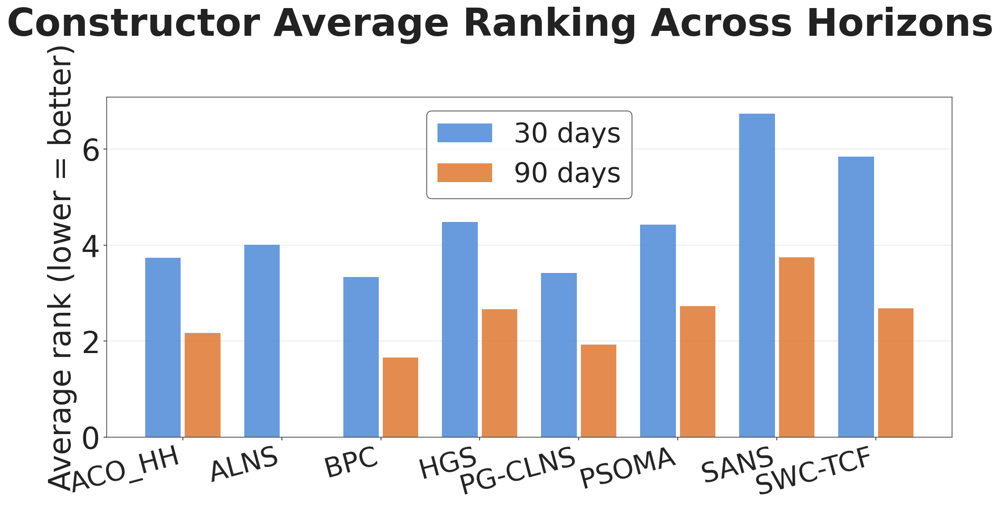</figure>

*Average constructor rank (lower = better) compared across horizons.
Constructors with stable ranks are robust; those that improve or regress warrant deeper investigation.*

<!-- [ANALYSIS: Insert your observations here] -->

### Key Observations

<!-- [ANALYSIS: Insert your observations here] -->

### Full Results Table — All Horizons

**Table 13:** *Full results across all simulation horizons — rows: graph size × region × data distribution; columns: horizon × mandatory selection strategy × route constructor × route improver. Each cell reports mean±std overflows and mean±std kg/km.*

| N | Region | Distribution | 30d LA ACO_HH FTSP | 30d LA ACO_HH CLS | 30d LA ALNS FTSP | 30d LA ALNS CLS | 30d LA BPC FTSP | 30d LA BPC CLS | 30d LA HGS FTSP | 30d LA HGS CLS | 30d LA PG-CLNS FTSP | 30d LA PG-CLNS CLS | 30d LA PSOMA FTSP | 30d LA PSOMA CLS | 30d LA SANS FTSP | 30d LA SANS CLS | 30d LA SWC-TCF FTSP | 30d LA SWC-TCF CLS | 30d LM ACO_HH FTSP | 30d LM ACO_HH CLS | 30d LM ALNS FTSP | 30d LM ALNS CLS | 30d LM BPC FTSP | 30d LM BPC CLS | 30d LM HGS FTSP | 30d LM HGS CLS | 30d LM PG-CLNS FTSP | 30d LM PG-CLNS CLS | 30d LM PSOMA FTSP | 30d LM PSOMA CLS | 30d LM SANS FTSP | 30d LM SANS CLS | 30d LM SWC-TCF FTSP | 30d LM SWC-TCF CLS | 30d SL ACO_HH FTSP | 30d SL ACO_HH CLS | 30d SL ALNS FTSP | 30d SL ALNS CLS | 30d SL BPC FTSP | 30d SL BPC CLS | 30d SL HGS FTSP | 30d SL HGS CLS | 30d SL PG-CLNS FTSP | 30d SL PG-CLNS CLS | 30d SL PSOMA FTSP | 30d SL PSOMA CLS | 30d SL SANS FTSP | 30d SL SANS CLS | 30d SL SWC-TCF FTSP | 30d SL SWC-TCF CLS | 90d LA ACO_HH FTSP | 90d LA ACO_HH CLS | 90d LA BPC FTSP | 90d LA BPC CLS | 90d LA HGS FTSP | 90d LA HGS CLS | 90d LA PG-CLNS FTSP | 90d LA PG-CLNS CLS | 90d LA PSOMA FTSP | 90d LA PSOMA CLS | 90d LA SANS FTSP | 90d LA SANS CLS | 90d LA SWC-TCF FTSP | 90d LA SWC-TCF CLS | 90d LM ACO_HH FTSP | 90d LM ACO_HH CLS | 90d LM BPC FTSP | 90d LM BPC CLS | 90d LM HGS FTSP | 90d LM HGS CLS | 90d LM PG-CLNS FTSP | 90d LM PG-CLNS CLS | 90d LM PSOMA FTSP | 90d LM PSOMA CLS | 90d LM SANS FTSP | 90d LM SANS CLS | 90d LM SWC-TCF FTSP | 90d LM SWC-TCF CLS | 90d SL ACO_HH FTSP | 90d SL ACO_HH CLS | 90d SL BPC FTSP | 90d SL BPC CLS | 90d SL HGS FTSP | 90d SL HGS CLS | 90d SL PG-CLNS FTSP | 90d SL PG-CLNS CLS | 90d SL PSOMA FTSP | 90d SL PSOMA CLS | 90d SL SANS FTSP | 90d SL SANS CLS | 90d SL SWC-TCF FTSP | 90d SL SWC-TCF CLS |
|---|---|---|---|---|---|---|---|---|---|---|---|---|---|---|---|---|---|---|---|---|---|---|---|---|---|---|---|---|---|---|---|---|---|---|---|---|---|---|---|---|---|---|---|---|---|---|---|---|---|---|---|---|---|---|---|---|---|---|---|---|---|---|---|---|---|---|---|---|---|---|---|---|---|---|---|---|---|---|---|---|---|---|---|---|---|---|---|---|---|---|---|---|
| 100 | Rio Maior | Empirical | 7.0 ov 4.159 kg/km | 7.0 ov 4.951 kg/km | 7.0 ov 4.225 kg/km | 7.0 ov 5.095 kg/km | 7.0 ov 4.138 kg/km | 7.0 ov 4.900 kg/km | 7.0 ov 4.182 kg/km | 7.0 ov 5.534 kg/km | 7.0 ov 4.106 kg/km | 7.0 ov 5.118 kg/km | 7.0 ov 4.346 kg/km | 7.0 ov 5.144 kg/km | 7.0 ov 3.468 kg/km | 7.0 ov 4.038 kg/km | 7.0 ov 4.063 kg/km | 7.0 ov 5.019 kg/km | 7.0 ov 4.521 kg/km | 7.0 ov 5.522 kg/km | 7.0 ov 4.557 kg/km | 7.0 ov 5.594 kg/km | 7.0 ov 4.603 kg/km | 7.0 ov 5.379 kg/km | 7.0 ov 4.601 kg/km | 11.0 ov 7.230 kg/km | 7.0 ov 4.514 kg/km | 7.0 ov 5.598 kg/km | 6.5 ov 4.659 kg/km | 6.5 ov 5.559 kg/km | 7.5 ov 3.782 kg/km | 7.5 ov 4.396 kg/km | 7.0 ov 4.407 kg/km | 7.0 ov 5.500 kg/km | 1.5 ov 3.091 kg/km | 1.5 ov 3.692 kg/km | 1.5 ov 3.053 kg/km | 1.5 ov 3.730 kg/km | 1.5 ov 3.084 kg/km | 1.5 ov 3.628 kg/km | 1.5 ov 3.113 kg/km | 2.5 ov 4.883 kg/km | 1.5 ov 3.045 kg/km | 1.5 ov 3.748 kg/km | 1.0 ov 3.080 kg/km | 1.0 ov 3.576 kg/km | 2.0 ov 2.598 kg/km | 2.0 ov 3.017 kg/km | 1.5 ov 2.967 kg/km | 1.5 ov 3.682 kg/km | 17.0 ov 4.770 kg/km | — | 17.0 ov 4.810 kg/km | 17.0 ov 5.592 kg/km | — | — | — | 17.0 ov 5.838 kg/km | — | — | — | — | 17.0 ov 4.629 kg/km | — | — | — | 12.5 ov 4.510 kg/km | 12.5 ov 5.291 kg/km | — | 12.5 ov 5.460 kg/km | — | 12.5 ov 5.483 kg/km | — | — | — | — | — | — | 4.0 ov 3.273 kg/km | 4.0 ov 3.911 kg/km | 4.0 ov 3.301 kg/km | 4.0 ov 3.865 kg/km | — | — | 4.0 ov 3.283 kg/km | 4.0 ov 4.035 kg/km | 3.5 ov 3.281 kg/km | — | — | 5.0 ov 3.259 kg/km | — | — |
|  |  | Gamma-3 | 4.0 ov 8.240 kg/km | 4.0 ov 9.725 kg/km | 4.0 ov 8.033 kg/km | 4.0 ov 9.857 kg/km | 4.0 ov 8.148 kg/km | 4.0 ov 9.451 kg/km | 4.0 ov 8.044 kg/km | 4.0 ov 9.444 kg/km | 4.0 ov 8.010 kg/km | 4.0 ov 9.943 kg/km | 4.0 ov 7.904 kg/km | 4.0 ov 9.328 kg/km | 4.0 ov 7.700 kg/km | 4.0 ov 8.924 kg/km | 4.0 ov 7.812 kg/km | 4.0 ov 9.412 kg/km | 8.0 ov 8.425 kg/km | 8.0 ov 9.999 kg/km | 8.0 ov 8.183 kg/km | 8.0 ov 10.090 kg/km | 8.0 ov 8.264 kg/km | 8.0 ov 9.740 kg/km | 8.0 ov 8.350 kg/km | 15.5 ov 10.623 kg/km | 8.0 ov 8.224 kg/km | 8.0 ov 10.212 kg/km | 8.0 ov 8.052 kg/km | 8.0 ov 9.585 kg/km | 8.0 ov 7.871 kg/km | 8.0 ov 9.151 kg/km | 8.0 ov 8.006 kg/km | 8.0 ov 9.634 kg/km | 1.5 ov 5.288 kg/km | 2.0 ov 6.368 kg/km | 1.5 ov 5.267 kg/km | 1.5 ov 6.495 kg/km | 1.5 ov 5.354 kg/km | 1.5 ov 6.234 kg/km | 1.5 ov 5.323 kg/km | 2.0 ov 7.111 kg/km | 1.5 ov 5.265 kg/km | 1.5 ov 6.516 kg/km | 1.5 ov 5.188 kg/km | 1.5 ov 6.244 kg/km | 1.5 ov 4.822 kg/km | 1.5 ov 5.585 kg/km | 1.5 ov 5.018 kg/km | 1.5 ov 6.109 kg/km | 15.0 ov 8.211 kg/km | — | 15.0 ov 8.196 kg/km | 15.0 ov 9.508 kg/km | — | — | — | 15.0 ov 9.947 kg/km | — | — | — | — | 15.0 ov 7.862 kg/km | — | — | — | 35.0 ov 8.824 kg/km | 35.0 ov 10.277 kg/km | — | 35.0 ov 10.405 kg/km | — | 35.0 ov 10.762 kg/km | — | — | — | — | — | — | 5.0 ov 5.819 kg/km | 5.0 ov 6.974 kg/km | 5.0 ov 5.802 kg/km | 5.0 ov 6.781 kg/km | — | — | 5.0 ov 5.701 kg/km | 5.0 ov 7.035 kg/km | 5.0 ov 5.643 kg/km | — | — | 5.0 ov 6.110 kg/km | — | — |
| 170 | Rio Maior | Empirical | 4.0 ov 4.339 kg/km | 4.0 ov 5.221 kg/km | 4.0 ov 4.110 kg/km | 4.0 ov 5.210 kg/km | 4.0 ov 4.194 kg/km | 4.0 ov 5.042 kg/km | 4.0 ov 4.245 kg/km | 7.0 ov 5.028 kg/km | 4.0 ov 4.156 kg/km | 4.0 ov 5.181 kg/km | 5.0 ov 4.263 kg/km | 5.0 ov 5.295 kg/km | 4.0 ov 3.487 kg/km | 4.0 ov 4.085 kg/km | 4.0 ov 3.963 kg/km | 4.0 ov 4.853 kg/km | 7.0 ov 4.106 kg/km | 7.0 ov 4.681 kg/km | 6.0 ov 4.187 kg/km | 6.0 ov 5.249 kg/km | 7.5 ov 4.417 kg/km | 7.5 ov 5.062 kg/km | 9.0 ov 4.081 kg/km | 14.5 ov 5.738 kg/km | 6.0 ov 4.199 kg/km | 6.0 ov 5.234 kg/km | 6.0 ov 4.539 kg/km | 6.0 ov 5.244 kg/km | 7.5 ov 3.530 kg/km | 7.5 ov 4.087 kg/km | 6.0 ov 3.944 kg/km | 6.0 ov 4.791 kg/km | 4.0 ov 3.096 kg/km | 4.0 ov 3.642 kg/km | 3.5 ov 3.002 kg/km | 3.5 ov 3.706 kg/km | 3.0 ov 3.209 kg/km | 3.0 ov 3.725 kg/km | 3.0 ov 3.193 kg/km | 6.0 ov 4.395 kg/km | 3.5 ov 3.067 kg/km | 3.5 ov 3.770 kg/km | 3.5 ov 3.169 kg/km | 4.0 ov 3.787 kg/km | 4.0 ov 2.627 kg/km | 4.0 ov 3.009 kg/km | 3.5 ov 2.821 kg/km | 3.5 ov 3.407 kg/km | 27.0 ov 4.945 kg/km | — | 27.0 ov 4.912 kg/km | 27.0 ov 5.797 kg/km | — | — | — | 27.0 ov 5.999 kg/km | — | — | — | — | 27.0 ov 4.605 kg/km | — | — | — | 21.0 ov 4.699 kg/km | 21.0 ov 5.407 kg/km | — | 26.5 ov 5.120 kg/km | — | 20.0 ov 5.634 kg/km | — | — | — | — | — | — | 10.0 ov 3.442 kg/km | 9.5 ov 3.983 kg/km | 10.0 ov 3.474 kg/km | 10.0 ov 4.047 kg/km | — | — | 10.5 ov 3.336 kg/km | 10.5 ov 4.140 kg/km | 10.5 ov 3.470 kg/km | — | — | 10.0 ov 3.239 kg/km | — | — |
|  |  | Gamma-3 | 5.0 ov 7.285 kg/km | 5.0 ov 8.469 kg/km | 5.0 ov 6.884 kg/km | 5.0 ov 8.275 kg/km | 5.0 ov 7.204 kg/km | 5.0 ov 8.085 kg/km | 11.0 ov 6.744 kg/km | 6.0 ov 5.583 kg/km | 5.0 ov 6.901 kg/km | 5.0 ov 8.412 kg/km | 5.0 ov 6.692 kg/km | 5.0 ov 8.154 kg/km | 5.0 ov 6.360 kg/km | 5.0 ov 7.413 kg/km | 5.0 ov 6.568 kg/km | 5.0 ov 8.063 kg/km | 9.5 ov 6.933 kg/km | 13.5 ov 7.951 kg/km | 9.0 ov 6.982 kg/km | 9.0 ov 8.092 kg/km | 9.0 ov 7.229 kg/km | 9.0 ov 7.998 kg/km | 21.5 ov 6.389 kg/km | 27.5 ov 7.743 kg/km | 9.0 ov 7.114 kg/km | 9.0 ov 8.711 kg/km | 9.0 ov 6.763 kg/km | 9.0 ov 8.182 kg/km | 9.0 ov 6.598 kg/km | 9.0 ov 7.656 kg/km | 9.0 ov 6.762 kg/km | 9.0 ov 7.851 kg/km | 2.5 ov 4.805 kg/km | 2.5 ov 5.614 kg/km | 2.5 ov 4.706 kg/km | 2.5 ov 5.488 kg/km | 2.5 ov 4.956 kg/km | 2.5 ov 5.562 kg/km | 3.0 ov 4.862 kg/km | 4.5 ov 5.788 kg/km | 2.5 ov 4.685 kg/km | 2.5 ov 5.644 kg/km | 2.5 ov 4.546 kg/km | 2.5 ov 5.488 kg/km | 2.5 ov 4.108 kg/km | 2.5 ov 4.802 kg/km | 2.5 ov 4.364 kg/km | 2.5 ov 5.005 kg/km | 29.0 ov 7.150 kg/km | — | 28.0 ov 7.315 kg/km | 28.0 ov 8.132 kg/km | — | — | — | 28.0 ov 8.539 kg/km | — | — | — | — | 28.0 ov 6.755 kg/km | — | — | — | 44.0 ov 7.696 kg/km | 44.0 ov 8.532 kg/km | — | 71.5 ov 7.290 kg/km | — | 44.0 ov 9.191 kg/km | — | — | — | — | — | — | 11.5 ov 5.219 kg/km | 10.5 ov 6.106 kg/km | 11.0 ov 5.296 kg/km | 11.0 ov 5.982 kg/km | — | — | 12.5 ov 5.009 kg/km | 12.5 ov 6.148 kg/km | 11.0 ov 5.004 kg/km | — | — | 12.0 ov 5.323 kg/km | — | — |
| 350 | Figueira da Foz | Empirical | 7.0 ov 7.356 kg/km | 9.0 ov 8.348 kg/km | 4.0 ov 6.332 kg/km | 4.0 ov 7.302 kg/km | 11.0 ov 8.454 kg/km | 11.0 ov 9.446 kg/km | 16.0 ov 6.507 kg/km | 16.0 ov 3.976 kg/km | 4.0 ov 6.702 kg/km | 4.0 ov 7.960 kg/km | 6.0 ov 6.661 kg/km | 4.0 ov 4.669 kg/km | 5.0 ov 5.282 kg/km | 5.0 ov 6.212 kg/km | 2.0 ov 6.757 kg/km | 4.0 ov 5.050 kg/km | 7.5 ov 7.082 kg/km | 10.5 ov 8.006 kg/km | 8.5 ov 6.594 kg/km | 8.5 ov 7.651 kg/km | 15.0 ov 8.548 kg/km | 15.0 ov 9.536 kg/km | 30.5 ov 6.797 kg/km | 30.5 ov 7.307 kg/km | 8.5 ov 6.922 kg/km | 8.5 ov 8.324 kg/km | 10.5 ov 7.103 kg/km | 9.5 ov 4.555 kg/km | 11.5 ov 5.916 kg/km | 11.5 ov 6.907 kg/km | 20.5 ov 6.185 kg/km | 15.5 ov 3.575 kg/km | 1.0 ov 5.217 kg/km | 1.0 ov 5.784 kg/km | 1.0 ov 4.838 kg/km | 1.0 ov 5.551 kg/km | 2.0 ov 5.552 kg/km | 2.0 ov 6.363 kg/km | 3.5 ov 5.519 kg/km | 3.5 ov 5.805 kg/km | 1.0 ov 5.136 kg/km | 1.0 ov 6.153 kg/km | 1.5 ov 5.319 kg/km | 1.0 ov 3.714 kg/km | 1.0 ov 3.931 kg/km | 1.0 ov 4.618 kg/km | 3.5 ov 4.701 kg/km | 3.0 ov 3.259 kg/km | 29.0 ov 8.010 kg/km | — | 38.0 ov 9.181 kg/km | 38.0 ov 10.220 kg/km | — | — | — | 9.0 ov 8.048 kg/km | — | — | — | — | 41.0 ov 7.815 kg/km | — | — | — | 35.5 ov 8.645 kg/km | 35.5 ov 9.639 kg/km | — | 82.5 ov 7.484 kg/km | — | 28.0 ov 8.628 kg/km | — | — | — | — | — | — | 3.5 ov 5.603 kg/km | 3.5 ov 6.224 kg/km | 3.0 ov 5.794 kg/km | 3.0 ov 6.561 kg/km | — | — | 2.5 ov 5.288 kg/km | 2.0 ov 6.268 kg/km | 2.0 ov 5.460 kg/km | — | — | 2.5 ov 4.659 kg/km | — | — |
|  |  | Gamma-3 | 5.0 ov 8.357 kg/km | 10.0 ov 9.431 kg/km | 11.0 ov 7.740 kg/km | 11.0 ov 9.211 kg/km | 11.0 ov 8.661 kg/km | 11.0 ov 9.535 kg/km | 16.0 ov 7.876 kg/km | 16.0 ov 3.283 kg/km | 11.0 ov 7.961 kg/km | 11.0 ov 9.492 kg/km | 12.0 ov 7.628 kg/km | 12.0 ov 5.187 kg/km | 5.0 ov 7.762 kg/km | 5.0 ov 8.746 kg/km | 2166.0 ov 8.490 kg/km | 2168.0 ov 5.284 kg/km | 100.0 ov 9.091 kg/km | 71.5 ov 9.996 kg/km | 20.5 ov 8.427 kg/km | 20.5 ov 9.898 kg/km | 38.5 ov 10.815 kg/km | 38.5 ov 11.926 kg/km | 129.5 ov 9.312 kg/km | 129.5 ov 7.848 kg/km | 21.0 ov 8.927 kg/km | 21.0 ov 10.464 kg/km | 23.5 ov 8.223 kg/km | 20.0 ov 5.140 kg/km | 55.5 ov 7.113 kg/km | 55.5 ov 8.061 kg/km | 125.5 ov 9.609 kg/km | 105.0 ov 8.089 kg/km | 6.0 ov 7.496 kg/km | 5.5 ov 8.345 kg/km | 4.5 ov 6.521 kg/km | 4.0 ov 7.431 kg/km | 5.0 ov 8.049 kg/km | 5.0 ov 9.001 kg/km | 33.0 ov 8.576 kg/km | 33.0 ov 5.402 kg/km | 4.5 ov 6.578 kg/km | 4.0 ov 7.769 kg/km | 3.0 ov 6.577 kg/km | 2.0 ov 3.800 kg/km | 5.5 ov 5.957 kg/km | 5.5 ov 6.931 kg/km | 410.0 ov 8.929 kg/km | 40.5 ov 6.162 kg/km | 36.0 ov 8.724 kg/km | — | 64.0 ov 9.114 kg/km | 64.0 ov 10.039 kg/km | — | — | — | 32.0 ov 9.886 kg/km | — | — | — | — | 23886.0 ov 8.178 kg/km | — | — | — | 149.0 ov 11.083 kg/km | 149.0 ov 12.251 kg/km | — | 407.5 ov 7.932 kg/km | — | 51.0 ov 10.383 kg/km | — | — | — | — | — | — | 20.5 ov 7.408 kg/km | 16.5 ov 8.382 kg/km | 14.0 ov 8.005 kg/km | 14.0 ov 9.023 kg/km | — | — | 10.0 ov 6.798 kg/km | 9.5 ov 7.941 kg/km | 9.0 ov 6.729 kg/km | — | — | 17.5 ov 7.003 kg/km | — | — |

<!-- [ANALYSIS: Insert your observations here] -->

---

*Figures are stored under `figures/simulation/`.*
*Raw simulation data: `public/global/simulation/simulation_summary.csv`, `public/global/simulation/simulation_summary_90d.csv`.*

## Interactive Charts

### 30-Day Horizon

- [Overflow vs Efficiency — Pareto View](private/simulation/30d/pareto_scatter_interactive.html)
- [Strategy Trade-off Bubble Chart](private/simulation/30d/strategy_bubble_interactive.html)
- [Policy Configuration Heatmap](private/simulation/30d/policy_heatmap_interactive.html)

### 90-Day Horizon

- [Overflow vs Efficiency — Pareto View](private/simulation/90d/pareto_scatter_interactive.html)
- [Strategy Trade-off Bubble Chart](private/simulation/90d/strategy_bubble_interactive.html)
- [Policy Configuration Heatmap](private/simulation/90d/policy_heatmap_interactive.html)

