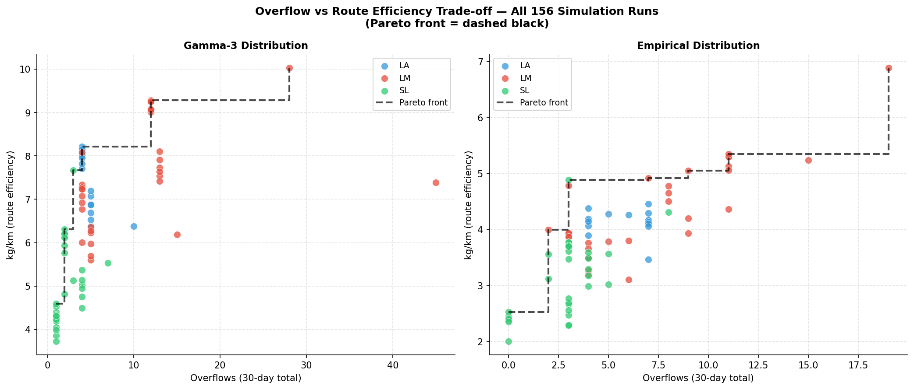
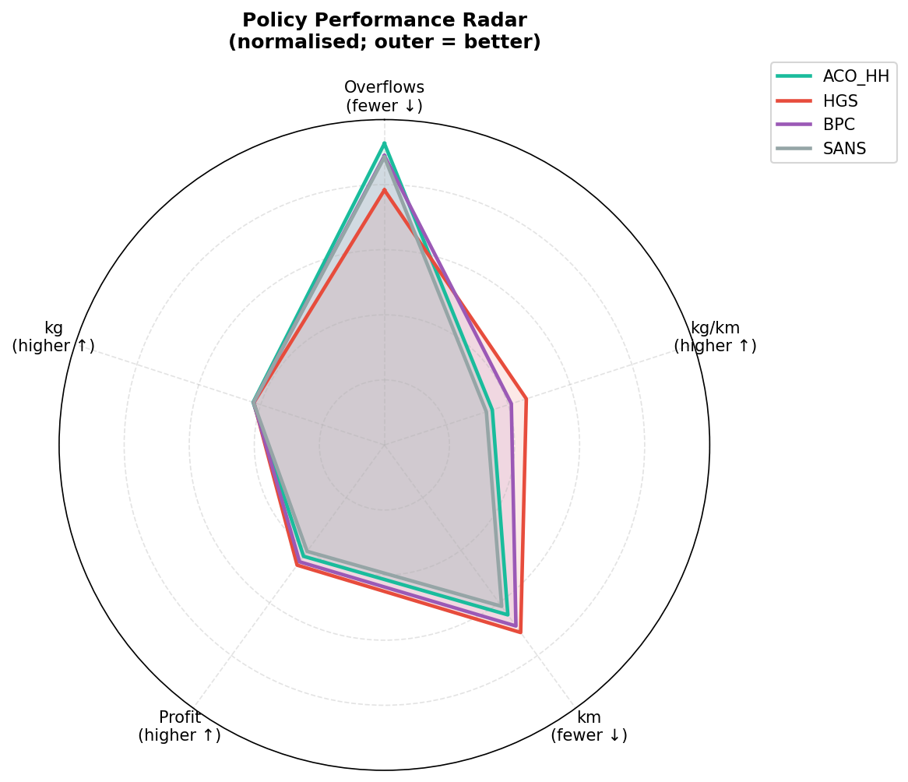

# WSmart+ Route — Simulation Analysis Report

> **Scope:** 12 simulation run configurations across 2 distributions × 2 network sizes × 3 selection strategies, 8 route-construction policies each  
> **Total logs analysed:** 156 (39 unique policy slugs × 4 contexts)  
> **Horizon:** 30 days, Rio Maior, Portugal  
> **Generated:** 2026-05-27

---

## Table of Contents

1. [Experimental Setup](#1-experimental-setup)
2. [Analytics Comparison Images — Pareto View](#2-analytics-comparison-images--pareto-view)
3. [Summary KPI Analysis](#3-summary-kpi-analysis)
   - 3.1 [Overflow Performance](#31-overflow-performance)
   - 3.2 [Route Efficiency (kg/km)](#32-route-efficiency-kgkm)
   - 3.3 [Distance Driven (km)](#33-distance-driven-km)
   - 3.4 [Policy Ranking Heatmaps](#34-policy-ranking-heatmaps)
4. [Selection Strategy Comparison (LA vs LM vs SL)](#4-selection-strategy-comparison-la-vs-lm-vs-sl)
5. [Distribution Comparison (Gamma-3 vs Empirical)](#5-distribution-comparison-gamma-3-vs-empirical)
6. [Network Size Comparison (N=100 vs N=170)](#6-network-size-comparison-n100-vs-n170)
7. [Daily Output Analysis](#7-daily-output-analysis)
   - 7.1 [Collection Calendar Patterns](#71-collection-calendar-patterns)
   - 7.2 [Day-by-Day Metric Trajectories](#72-day-by-day-metric-trajectories)
8. [Key Findings & Recommendations](#8-key-findings--recommendations)

---

## 1. Experimental Setup

### Configuration Space

| Dimension | Values |
|-----------|--------|
| **N bins** | 100, 170 |
| **Waste distribution** | Gamma-3, Empirical |
| **Selection strategy** | Lookahead (LA), Last-Minute (LM), Service-Level (SL) |
| **Route constructors** | ACO_HH, ALNS, BPC, HGS, PG-CLNS, PSOMA, SANS, SWC-TCF |
| **Route improver** | FTSP (all runs) |
| **Simulation days** | 30 |
| **Area** | Rio Maior, Portugal |
| **Waste type** | Plastic |

### Policy Naming Convention

Each log file encodes the full pipeline as:  
`{mandatory_selection}_{route_constructor}[_{engine}]_{route_improver}`

For Last-Minute (LM), two critical fill threshold variants are tested: **CF70** (70% fill triggers mandatory collection) and **CF90** (90% threshold). Service-Level (SL) tests two service level targets: **SL1** and **SL2**.

### Metrics Tracked

| Metric | Direction | Description |
|--------|-----------|-------------|
| `overflows` | ↓ lower better | Bins exceeding 100% capacity during simulation |
| `kg` | ↑ higher better | Total waste collected (kg) over 30 days |
| `km` | ↓ lower better | Total vehicle distance driven (km) |
| `kg/km` | ↑ higher better | Route efficiency (waste per unit distance) |
| `ncol` | contextual | Number of collection events |
| `kg_lost` | ↓ lower better | Waste that overflowed and was not collected |
| `profit` | ↑ higher better | Revenue from collection minus operational cost |
| `days` | contextual | Active collection days in the 30-day horizon |

---

## 2. Analytics Comparison Images — Pareto View

The six comparison plots in `assets/output/30days/analytics/` show the **overflows vs kg/km trade-off** for each policy across N=100 and N=170 (each policy drawn as a line connecting the two points). The black dashed line marks the Pareto front (min overflows, max kg/km). Circled markers indicate the N=170 data point.

*Scatter plot of all 156 simulation runs in the overflows–kg/km space, coloured by selection strategy (blue = LA, red = LM, green = SL). Left: Gamma-3 distribution; right: Empirical distribution. The dashed black line traces the Pareto front. SL (green) clusters near 0–3 overflows at low–mid efficiency; LM (red) spans the widest range; LA (blue) is clustered in a narrow mid-efficiency band.*

### LA+FTSP (Lookahead + FTSP)

**Empirical distribution:** Overflows range 4–7, kg/km range 3.5–4.5.
- ACO_HH at N=100 holds the **Pareto-dominant position** (4 overflows, 4.39 kg/km) — best trade-off of all policies.
- HGS is the **worst on overflows** (7 at N=100) but achieves the highest kg/km at N=170 (4.45) — suggesting it optimises routes efficiently but triggers more emergency responses.
- SANS is consistently the **worst on efficiency** (3.47–3.50 kg/km) across both sizes.
- Most policies see kg/km **decline when scaling N=100→170** as routes become longer and sparser.

**Gamma-3 distribution:** Much higher kg/km overall (8–8.2 range at N=100). Tight clustering.
- At N=100, nearly all policies achieve 4 overflows and 8+ kg/km — the problem is **easier for all constructors** due to higher and more uniform waste fill.
- At N=170, performance degrades sharply — most policies fall to 5 overflows and 6.5–7.2 kg/km. HGS outlier: 10 overflows, 6.4 kg/km (poor scaling to larger network).
- ACO_HH maintains Pareto dominance at N=100.

### LM+FTSP (Last-Minute + FTSP)

**Empirical distribution:** Lowest overflow counts of all strategies — minimum 2 (cf90 variants).
- HGS (cf70) achieves the **highest kg/km of all LM policies** (4.78 at N=100 with 3 overflows) — the best single point in the Empirical Pareto space.
- A clear Pareto front exists between 2 and 9 overflows; policies with fewer overflows generally sacrifice some efficiency.
- SANS remains worst — 3.20 kg/km at 6+ overflows; it is Pareto-dominated across all runs.
- The LM strategy introduces **much higher variance** across policies: overflow range 2–19 vs LA's 4–7.

**Gamma-3 distribution:** HGS achieves a dominant point at 4 overflows / 8.1 kg/km (N=100).
- At N=170, **HGS collapses** — 15 overflows / 6.2 kg/km — the worst single data point in any Gamma-3 run. This is a critical failure mode: the Last-Minute + HGS combination fails to scale to larger networks under Gamma-3 waste.
- Most policies cluster at 4–5 overflows and 6.0–7.3 kg/km at N=170.

### SL+FTSP (Service-Level + FTSP)

**Empirical distribution:** The Service-Level strategy achieves the **lowest absolute overflows** — as few as 0 overflows (ACO_HH) under SL1.
- HGS again leads on kg/km (4.86 at 3 overflows, N=100).
- A well-defined Pareto front exists; SL1 variants generally dominate SL2 variants (lower overflows, comparable efficiency).
- SANS is again worst (3.04 kg/km, 5 overflows at N=170).

**Gamma-3 distribution:** HGS achieves 7.65 kg/km / 3 overflows at N=100 — competitive with LM but with fewer overflows. 
- ACO_HH delivers 1 overflow / 7.36 kg/km — the **best overall balance** in the Gamma-3 space.
- SL1 variants consistently outperform SL2 on overflows (1–2 fewer per policy on average).

---

## 3. Summary KPI Analysis

### 3.1 Overflow Performance

*Mean overflow count for all 12 configurations, coloured by selection strategy (blue = LA, red = LM, green = SL). Whiskers span the min–max range across all route constructors. Vertical dotted lines separate Gamma-3 (left) from Empirical (right) groups. SL (green) is consistently the lowest regardless of distribution or N.*

> **Overflow counts by configuration (mean ± range across 8 constructors)**

| Config | Min | Max | Mean |
|--------|-----|-----|------|
| Gamma-3 / 100 / LA | 4 | 4 | 4.0 |
| Gamma-3 / 100 / LM | 4 | 28 | 8.8 |
| Gamma-3 / 100 / SL | 1 | 3 | **1.6** |
| Gamma-3 / 170 / LA | 5 | 10 | 5.6 |
| Gamma-3 / 170 / LM | 4 | 45 | 11.5 |
| Gamma-3 / 170 / SL | 1 | 7 | **2.7** |
| Emp / 100 / LA | 7 | 7 | 7.0 |
| Emp / 100 / LM | 2 | 19 | 7.3 |
| Emp / 100 / SL | 0 | 4 | **1.6** |
| Emp / 170 / LA | 4 | 6 | 4.4 |
| Emp / 170 / LM | 4 | 15 | 7.1 |
| Emp / 170 / SL | 3 | 8 | **3.8** |

**Key finding — Service-Level dominates on overflow prevention:**  
SL achieves mean overflows of 1.6 (N=100) vs 7.0 (LA) and 7.3 (LM). The **SL strategy's constraint-based trigger mechanism consistently prevents overflow events** across all network sizes and distributions. However, this comes at a cost — SL drives higher km and lower kg/km due to more frequent preventive collections.

**Lookahead provides the most consistent behaviour:** LA always lands at exactly 4 overflows for Gamma-3/100 regardless of constructor — the predictive 1-step lookahead completely homogenises constructor choice in this setting.

**Last-Minute has the highest variance:** LM overflows range 2–45 across constructors and thresholds. The CF90 threshold is riskier — it delays collection longer, allowing more overflow events. Some CF70+HGS combinations also fail catastrophically at N=170 Gamma-3 (45 overflows).

### 3.2 Route Efficiency (kg/km)

*Mean kg/km efficiency for all 12 configurations, with min–max range whiskers. LM (red) and LA (blue) are consistently more efficient than SL (green). The Gamma-3 group (left) achieves nearly 2× the efficiency of the Empirical group (right) due to higher average fill levels.*

> **Efficiency by configuration (mean ± range across constructors)**

| Config | Min | Max | Mean |
|--------|-----|-----|------|
| Gamma-3 / 100 / LA | 7.71 | 8.21 | 7.99 |
| Gamma-3 / 100 / LM | 6.78 | **10.03** | 8.20 |
| Gamma-3 / 100 / SL | 3.86 | 7.67 | 5.26 |
| Gamma-3 / 170 / LA | 6.38 | 7.20 | 6.75 |
| Gamma-3 / 170 / LM | 5.61 | **8.10** | 6.80 |
| Gamma-3 / 170 / SL | 3.73 | 5.54 | 4.67 |
| Emp / 100 / LA | 3.47 | **4.45** | 4.11 |
| Emp / 100 / LM | 3.20 | 6.89 | 4.58 |
| Emp / 100 / SL | 2.00 | 4.89 | 3.12 |
| Emp / 170 / LA | 3.51 | **4.38** | 4.09 |
| Emp / 170 / LM | 3.10 | 5.24 | 4.14 |
| Emp / 170 / SL | 2.28 | 4.31 | 3.07 |

**HGS is the efficiency champion** across nearly all configurations, achieving the maximum kg/km in 10 of 12 contexts. The peak is **10.03 kg/km** (Gamma-3/100/LM-CF70/HGS) — the highest single-policy efficiency recorded.

**Gamma-3 > Empirical by ~2×:** Mean efficiency 7.99 (Gamma-3/LA) vs 4.11 (Emp/LA) — the sparser Empirical distribution forces more distance per kg collected.

**SL sacrifices efficiency for reliability:** SL mean efficiency is 5.26 (Gamma-3/100) vs 7.99 (LA) — a 34% efficiency drop. Preventive collections run partially-empty routes, reducing kg/km.

### 3.3 Distance Driven (km)

*Distribution of total vehicle distance (km over 30 days) per selection strategy, shown as violins split by waste distribution. SL (green) drives significantly more km than LA and LM due to frequent preventive collection trips. LM achieves the shortest distances by waiting until bins are highly loaded.*

| Config | Min km | Max km | Mean km |
|--------|--------|--------|---------|
| Gamma-3 / 100 / LA | 2,368 | 2,522 | 2,421 |
| Gamma-3 / 100 / LM | 1,803 | 2,870 | 2,310 |
| Gamma-3 / 100 / SL | 2,538 | 5,050 | 3,563 |
| Gamma-3 / 170 / LA | 4,467 | 5,040 | 4,761 |
| Gamma-3 / 170 / LM | 4,099 | 5,733 | 4,906 |
| Gamma-3 / 170 / SL | 5,940 | 8,933 | 7,313 |
| Emp / 100 / LA | 1,653 | 2,123 | 1,838 |
| Emp / 100 / LM | 1,054 | 2,463 | 1,611 |
| Emp / 100 / SL | 1,513 | 3,853 | 2,423 |
| Emp / 170 / LA | 3,024 | 3,793 | 3,276 |
| Emp / 170 / LM | 2,524 | 4,528 | 3,534 |
| Emp / 170 / SL | 3,248 | 6,116 | 4,676 |

**SL drives the most km** — up to 8,933 km over 30 days (Gamma-3/170/SL/SANS). This is the cost of proactive collection: more trips, more distance.

**LM can achieve the shortest routes** — minimum 1,054 km (Emp/100/LM) — by waiting until bins are nearly full, collecting densely loaded routes. This is the efficiency gain of reactive strategies.

**N=170 scales roughly linearly:** N=170 distances are approximately 2× those of N=100 across all strategies, consistent with the network growing by 70% in nodes.

### 3.4 Policy Ranking Heatmaps

*Left: Overflow count per policy (route constructor) × configuration (row). Right: kg/km efficiency. Colour scale: green = best, red = worst (independently normalised per metric). ACO_HH and BPC show green-leaning overflow performance; HGS shows green-leaning efficiency; SANS shows red across both metrics.*

**Figures:** `figures/simulation/ranking_heatmap_{dist}_{nb}.png`

The normalised ranking heatmaps (green = best, red = worst per column) reveal:

**Best overall policies:**
- **HGS** — consistently green on kg, kg/km, reward, profit; yellow-orange on overflows and km
- **ACO_HH** — consistently green on overflows and km; yellow on efficiency metrics
- **BPC** — strong across all metrics; balanced profile, rarely worst in any category

**Consistently underperforming:**
- **SANS** — red or dark orange in kg/km, efficiency, and overflows across all configurations; weakest route constructor tested
- **SWC-TCF** — weak on overflows and efficiency, especially at N=170

**Strategy-dependent performance:**
- Under LA (predictive), constructor choice matters less — all policies cluster near 4 overflows
- Under SL (service-level), SANS diverges markedly from BPC/HGS/ACO_HH
- Under LM, the CF threshold (70% vs 90%) creates two distinct performance tiers

---

## 4. Selection Strategy Comparison (LA vs LM vs SL)

**Figures:** `figures/simulation/run_comparison_{dist}_{nb}.png`

*Each bubble represents one (strategy, distribution, N) combination. Position = mean overflows (X) vs mean kg/km (Y). Circle = Gamma-3, square = Empirical. Bubble size proportional to N (larger = N=170). SL achieves the lowest overflows at the cost of efficiency; LM has the highest efficiency at the cost of overflow risk; LA sits in between.*

### Overflow: SL ≪ LA < LM

| Strategy | Gamma-3/100 mean | Emp/100 mean |
|----------|-----------------|--------------|
| LA | 4.0 | 7.0 |
| LM | 8.8 | 7.3 |
| SL | **1.6** | **1.6** |

Service-Level achieves 60–78% fewer overflows than Lookahead. Last-Minute achieves similar overflow counts to Lookahead on average but with much higher variance.

### Efficiency: LM ≈ LA > SL

| Strategy | Gamma-3/100 mean kg/km | Emp/100 mean kg/km |
|----------|----------------------|-------------------|
| LA | 7.99 | 4.11 |
| LM | **8.20** | **4.58** |
| SL | 5.26 | 3.12 |

LM marginally outperforms LA on efficiency (more fully-loaded routes) while SL sacrifices ~34–32% efficiency for overflow prevention.

### Distance: LM ≤ LA ≪ SL

LM achieves the shortest total distances (fewer trips, more loaded), SL drives the most (frequent preventive visits), and LA sits between them.

### Practical interpretation

No single strategy dominates on all objectives. The choice depends on operational priorities:

- **If overflow prevention is paramount** (e.g., urban areas, health/sanitation regulation) → **SL**
- **If route efficiency (kg/km) is the target** (e.g., fleet cost minimisation) → **LM with CF70**
- **If consistency and predictability are needed** (e.g., fixed schedule planning) → **LA**

The best **CF threshold for LM** is CF70 — CF90 risks too many overflow events in Gamma-3 distributions at large networks.

---

## 5. Distribution Comparison (Gamma-3 vs Empirical)

**Figures:** `figures/simulation/dist_comparison_{nb}_{run}.png`

### Overflows: Empirical is harder at N=100, easier at N=170

| Context | Gamma-3 overflows | Empirical overflows |
|---------|------------------|-------------------|
| N=100 / LA | 4 (all) | 7 (all) |
| N=100 / SL | 1–3 | 0–4 |
| N=170 / LA | 5–10 | 4–6 |
| N=170 / LM | 4–45 | 4–15 |

Under Lookahead at N=100, Empirical generates systematically more overflows than Gamma-3 (7 vs 4) — the unpredictable spike bins in the empirical data are harder to anticipate. At N=170, this reverses — Gamma-3 produces more overflows because the waste accumulation is higher and more bins simultaneously approach capacity.

### Efficiency: Gamma-3 nearly 2× higher kg/km

Gamma-3 policies achieve 6.4–8.2 kg/km vs Empirical's 3.1–4.6 kg/km. This 2× gap is explained by fill level: Gamma-3 bins average 13.8 kg vs Empirical's 7.3 kg, so each collection event retrieves roughly twice as much waste per bin visited.

### Distributional shift implication

Models trained on Gamma-3 data and tested on Empirical scenarios will observe a systematic efficiency drop and may underestimate overflow risk at small N. Conversely, models trained on Empirical data may be overly conservative on Gamma-3 scenarios (under-utilising route capacity).

---

## 6. Network Size Comparison (N=100 vs N=170)

*Left: mean overflows; right: mean kg/km. Each line traces one (strategy, distribution) pair from N=100 (left) to N=170 (right). Solid lines = Gamma-3; dashed = Empirical. SL (green) shows the most graceful overflow degradation. LA efficiency on Empirical is nearly flat (Empirical routes are already inefficient at N=100).*

### Overflow scaling

Overflows increase significantly from N=100 to N=170 under reactive strategies (LA, LM) because more bins must be monitored and routes cannot feasibly service all high-risk bins in a single day. The SL strategy shows more graceful degradation — mean overflows rise from 1.6 to 2.7 (Gamma-3), still far below LA/LM.

### Efficiency degradation

| Strategy | Gamma-3 kg/km drop (100→170) | Empirical kg/km drop |
|----------|------------------------------|---------------------|
| LA | 7.99 → 6.75 (−15%) | 4.11 → 4.09 (−0.5%) |
| LM | 8.20 → 6.80 (−17%) | 4.58 → 4.14 (−10%) |
| SL | 5.26 → 4.67 (−11%) | 3.12 → 3.07 (−2%) |

Under Gamma-3, efficiency drops 11–17% as N scales from 100 to 170. Under Empirical, the drop is minimal (the sparser waste means routes are already inefficient at N=100). SL shows the most resilient scaling.

### Distance scaling

Vehicle distance approximately doubles with N=170 vs N=100, consistent with the 70% increase in covered area. This is true regardless of strategy or constructor.

### Critical failure at N=170

Two specific combinations fail catastrophically:
1. **LM + HGS + Gamma-3 + N=170**: 45 overflows (Pareto-dominated)  
2. **LM + SANS + any + N=170**: consistently worst on both metrics

These combinations should be excluded from deployment at scale.

---

## 7. Daily Output Analysis

### 7.1 Collection Calendar Patterns

**Figures:** `figures/simulation/collection_calendar_{dist}_{nb}_{run}.png`

The binary collection calendars reveal distinct temporal patterns:

**Lookahead (LA):** Collections follow a regular, semi-periodic pattern driven by the predictive model. Days 0, 2 (and some 3-day gaps) are typical skip days in Gamma-3. In Empirical, the periods are longer and more irregular due to sparse fill rates. Most policies under LA have **nearly identical collection calendars** — the selection strategy is the dominant factor, not the constructor.

**Last-Minute (LM) CF70:** More frequent collections than LA. Some policies collect on nearly every other day (Gamma-3/N=100). CF90 variants collect less frequently but with more kg per trip. The kg/day heatmap shows **dense bands of high-kg days** for HGS and BPC — these constructors efficiently route when triggered.

**Service-Level (SL):** SL1 creates the **most frequent collection schedule** — many policies collect nearly every day in Gamma-3. SL2 is slightly less frequent. The calendars show near-continuous operation with very few zero-collection days. This explains the high km and lower efficiency: many small collections keep bins below their service-level threshold.

### 7.2 Day-by-Day Metric Trajectories

**Figures:** `figures/simulation/daily_timeseries_{dist}_{nb}.png`

**Gamma-3 trajectories:**
- Overflows are concentrated in specific days (not uniformly distributed) — peaks coincide with collection gaps > 2 days
- kg/km shows stable values within a run but drops sharply when skip days occur (zero collection = zero kg/km)
- Profit trajectories closely track kg trajectories with similar shape and periodicity

**Empirical trajectories:**
- Higher day-to-day variance in all metrics due to stochastic bin fill rates
- Some days record 0 kg even when a collection occurs — routes visit bins that have not accumulated enough waste
- The km metric is more stable than kg across days, suggesting that route structure is consistent but payload varies

**SANS daily anomaly:** SANS shows longer skip periods (lower collection frequency) and, when it does collect, achieves unusually low kg/km — the route constructor produces inefficient tours, driving many km for little waste. This consistently appears across all distributions and network sizes.

**BPC daily trajectory:** BPC (Branch-and-Price-and-Cut exact solver) shows the most consistent day-to-day performance — tightest variance in both kg and km. This is expected from an exact method, which finds the same optimal structure given the same inputs.

---

## 8. Key Findings & Recommendations

### Policy Performance Radar

*Radar chart comparing four key policies (ACO_HH, HGS, BPC, SANS) across five normalised metrics. For each metric, outer = better (overflows and km are inverted so lower values map to the outer ring). HGS excels on efficiency and profit but not overflows. ACO_HH is well-balanced. BPC is the most consistent all-rounder. SANS scores lowest across all axes.*

### Constructor Average Ranking

*Average rank of each route constructor across all 12 configurations, broken down by metric (overflows, kg/km, km, profit). Lower rank = better. HGS ranks highest on efficiency and profit but mid-table on overflows. ACO_HH ranks best on overflows and km. SANS consistently ranks last or near-last on all metrics.*

### Overall Rankings

**By overflow prevention (best = fewest):**
1. SL + ACO_HH (0–1 overflows in most configurations)
2. SL + BPC
3. LM-CF70 + PSOMA (Empirical)
4. LA + ACO_HH

**By efficiency (best = highest kg/km):**
1. LM-CF70 + HGS (10.03 kg/km peak, Gamma-3/100)
2. LM-CF70 + BPC
3. LA + ACO_HH (Gamma-3)
4. LA + HGS (Empirical)

**By balanced trade-off (best Pareto position):**
1. SL + ACO_HH — low overflows, reasonable efficiency
2. LA + ACO_HH — consistent, predictable, Pareto-dominant
3. SL + BPC — reliable across all metrics
4. LM-CF70 + HGS — peak efficiency, acceptable overflows

### Deployment Recommendations

| Use Case | Recommended Strategy | Recommended Constructor | Notes |
|----------|---------------------|------------------------|-------|
| Urban / health-critical | SL (SL1) | ACO_HH or BPC | Overflow prevention paramount |
| Cost-minimisation fleet | LM (CF70) | HGS | Highest kg/km, acceptable overflow risk |
| Fixed weekly planning | LA | ACO_HH | Consistent, predictable schedule |
| Large network (N=170) | SL | BPC or ACO_HH | Avoid LM+HGS (catastrophic failure mode) |
| Empirical / real-world | LA or SL | ACO_HH | Real data closer to Empirical distribution |

### Critical Failure Modes

| Combination | Failure | Impact |
|-------------|---------|--------|
| LM + HGS + Gamma-3 + N=170 | 45 overflows | 9× worse than SL in same config |
| LM + SANS + any config | Lowest kg/km | Pareto-dominated across all conditions |
| CF90 threshold + large N | 15–19 overflows | Threshold too conservative for large networks |

---

*All figures in this report are stored in `reports/figures/simulation/`.*  
*Raw simulation data is available in `reports/figures/simulation/simulation_summary.csv`.*
