# WSmart+ Route — Simulation Analysis Report

> **Scope:** 30-day and 90-day simulation runs across 3 city/network configurations × 2 distributions × 3 selection strategies × 2 route improvers × 8 route constructors
> **Total logs analysed (30d):** 480
> **Horizons:** 30 days (N=480 logs) and 90 days (N=174 logs)
> **Cities:** RM-100 (N=100), RM-170 (N=170), FFZ-350 (N=350)
> **Generated:** <!-- date -->

---

## Table of Contents

1. [Experimental Setup](#1-experimental-setup)
2. [Analytics Comparison — Pareto View](#2-analytics-comparison--pareto-view)
3. [Summary KPI Analysis](#3-summary-kpi-analysis)
   - 3.1 [Overflow Performance](#31-overflow-performance)
   - 3.2 [Route Efficiency (kg/km)](#32-route-efficiency-kgkm)
   - 3.3 [Distance Driven (km)](#33-distance-driven-km)
   - 3.4 [Policy Ranking Heatmaps](#34-policy-ranking-heatmaps)
4. [Selection Strategy Comparison](#4-selection-strategy-comparison)
5. [Distribution Comparison](#5-distribution-comparison)
6. [Network Size Comparison](#6-network-size-comparison)
7. [Daily Output Analysis](#7-daily-output-analysis)
8. [FTSP vs CLS Route Improver Comparison](#8-ftsp-vs-cls-route-improver-comparison)
9. [Figueira da Foz — City Analysis (N=350)](#9-figueira-da-foz--city-analysis-n350)
14. [City Comparison](#city-comparison-across-all-cities)
15. [Key Findings & Recommendations](#key-findings--recommendations)
16. [90-Day Horizon Results](#90-day-horizon-results)
17. [30-Day vs 90-Day Comparison](#30-day-vs-90-day-comparison)

---

## 1. Experimental Setup

### Configuration Space

**Table 1:** *Configuration space — experimental dimensions and the values tested in this study.*

| Dimension | Values |
|-----------|--------|
| **Cities / N** | RM-100 (N=100), RM-170 (N=170), FFZ-350 (N=350) |
| **Waste distribution** | Empirical, Gamma-3 |
| **Selection strategy** | LA, LM, SL |
| **Route constructors** | ACO_HH, ALNS, BPC, HGS, PG-CLNS, PSOMA, SANS, SWC-TCF |
| **Route improvers** | CLS, FTSP |
| **Simulation days** | 30 and 90 |

### Policy Naming Convention

Each log file encodes the full pipeline as:
`{mandatory_selection}_{route_constructor}[_{engine}]_{route_improver}`

For Last-Minute (LM), two critical fill threshold variants are tested: **CF70** (70% fill triggers mandatory collection) and **CF90** (90% threshold). Service-Level (SL) tests two service level targets: **SL1** and **SL2**. Results in this report aggregate CF70 and CF90 under **LM**, and SL1/SL2 under **SL**, unless otherwise specified.

### Metrics Tracked

**Table 2:** *Metrics tracked per simulation run, their optimisation direction, and a brief description.*

| Metric | Direction | Description |
|--------|-----------|-------------|
| `overflows` | ↓ lower better | Bins exceeding 100% capacity during simulation |
| `kg` | ↑ higher better | Total waste collected (kg) over the simulation horizon |
| `km` | ↓ lower better | Total vehicle distance driven (km) |
| `kg/km` | ↑ higher better | Route efficiency (waste per unit distance) |
| `ncol` | contextual | Number of collection events |
| `kg_lost` | ↓ lower better | Waste that overflowed and was not collected |
| `profit` | ↑ higher better | Revenue from collection minus operational cost |
| `days` | contextual | Active collection days in the simulation horizon |

---

## 2. Analytics Comparison — Pareto View

<figure style="display:block;width:100%;margin:0.8em 0;padding:0;">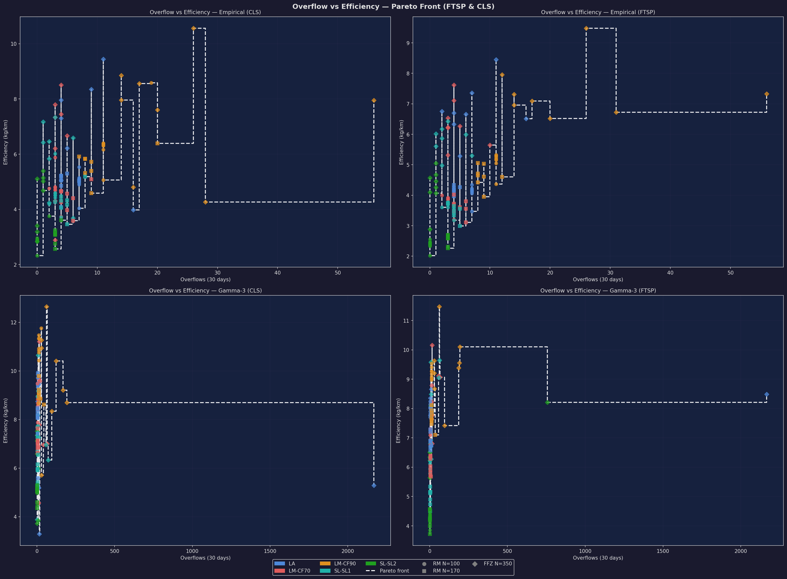</figure>

**Figure 1:** *Scatter of all simulation runs in the overflows–kg/km space, coloured by selection strategy and CF/SL variant. Four panels: Gamma-3/FTSP, Empirical/FTSP, Gamma-3/CLS, Empirical/CLS. Shape encodes city/N. Dashed white line = Pareto front.*

<figure style="display:block;width:100%;margin:0.8em 0;padding:0;">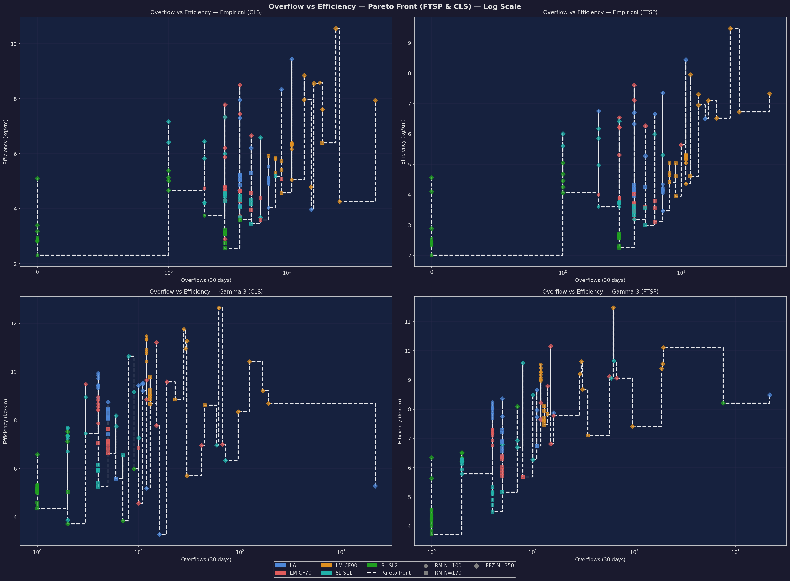</figure>

**Figure 2:** *Same four-panel chart with symlog X-axis — spreads the densely clustered low-overflow region.*

**[Interactive version](private/simulation/30d/pareto_scatter_interactive.html)**

### LA+FTSP (Lookahead + Fast-TSP)

<!-- [ANALYSIS: Insert your observations here] -->

### LM+FTSP (Last-Minute + Fast-TSP)

<!-- [ANALYSIS: Insert your observations here] -->

### SL+FTSP (Service-Level + Fast-TSP)

<!-- [ANALYSIS: Insert your observations here] -->

### Pareto-Front Policy Catalogue

**Table 3:** *Pareto-optimal policy configurations — each unique (selection variant, constructor, improver) that appeared on the Pareto front of at least one scenario, sorted by scenario count; metrics averaged across those scenarios.*

| Selection | Constructor | Improver | Overflows | kg/km | Pareto-Front Scenarios |
|-----------|-------------|----------|----------:|------:|------------------------|
| LA | ACO_HH | FTSP | 4.5 | 8.298 | FFZ-350 / Gamma-3, RM-100 / Gamma-3 |
| LM (CF70) | BPC | FTSP | 9.5 | 8.887 | FFZ-350 / Empirical, FFZ-350 / Gamma-3 |
| LM (CF90) | BPC | CLS | 44.0 | 11.604 | FFZ-350 / Empirical, FFZ-350 / Gamma-3 |
| LM (CF90) | BPC | FTSP | 44.0 | 10.476 | FFZ-350 / Empirical, FFZ-350 / Gamma-3 |
| SL (SL1) | PG-CLNS | CLS | 1.5 | 7.432 | FFZ-350 / Empirical, RM-100 / Gamma-3 |
| LA | BPC | CLS | 11.0 | 9.446 | FFZ-350 / Empirical |
| LA | BPC | FTSP | 11.0 | 8.454 | FFZ-350 / Empirical |
| LA | PG-CLNS | CLS | 4.0 | 9.943 | RM-100 / Gamma-3 |
| LA | SWC-TCF | FTSP | 2.0 | 6.757 | FFZ-350 / Empirical |
| LM (CF70) | BPC | CLS | 4.0 | 8.508 | FFZ-350 / Empirical |
| LM (CF70) | HGS | CLS | 3.0 | 9.487 | RM-100 / Gamma-3 |
| LM (CF70) | PG-CLNS | CLS | 3.0 | 7.796 | FFZ-350 / Empirical |
| LM (CF90) | HGS | CLS | 28.0 | 11.760 | RM-100 / Gamma-3 |
| LM (CF90) | PG-CLNS | CLS | 12.0 | 11.472 | RM-100 / Gamma-3 |
| SL (SL1) | BPC | CLS | 8.0 | 10.644 | FFZ-350 / Gamma-3 |
| SL (SL1) | BPC | FTSP | 8.0 | 9.578 | FFZ-350 / Gamma-3 |
| SL (SL1) | PG-CLNS | FTSP | 1.0 | 6.017 | FFZ-350 / Empirical |
| SL (SL2) | ACO_HH | CLS | 0.0 | 5.110 | FFZ-350 / Empirical |
| SL (SL2) | ACO_HH | FTSP | 0.0 | 4.568 | FFZ-350 / Empirical |
| SL (SL2) | BPC | FTSP | 2.0 | 6.519 | FFZ-350 / Gamma-3 |
| SL (SL2) | PSOMA | FTSP | 1.0 | 6.346 | FFZ-350 / Gamma-3 |
| SL (SL2) | SANS | CLS | 1.0 | 6.591 | FFZ-350 / Gamma-3 |

---

## 3. Summary KPI Analysis

### 3.1 Overflow Performance

<figure style="display:block;width:100%;margin:0.8em 0;padding:0;">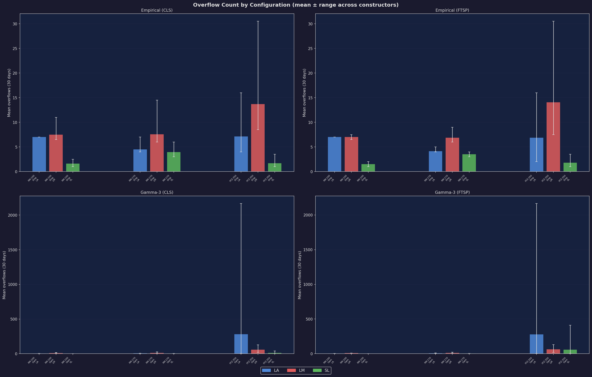</figure>

**Figure 3:** *Mean overflow count for all 18 configurations, shown for both FTSP and CLS (2×2 layout). Whiskers span the min–max range across all 8 route constructors.*

<figure style="display:block;width:100%;margin:0.8em 0;padding:0;">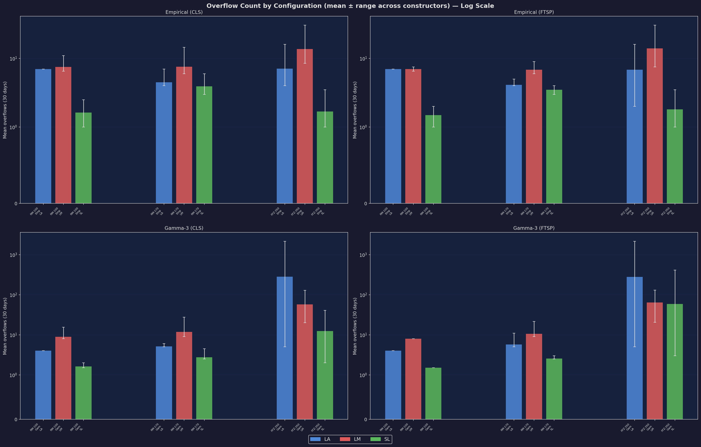</figure>

**Figure 4:** *Same chart with symlog Y axis — reveals structure in the RM configurations compressed in the linear scale.*

**Table 4:** *Overflow counts by configuration — mean ± min/max range across all route constructors (FTSP route improver).*

| Config | Min | Max | Mean |
|--------|-----|-----|------|
| RM-100 / Gamma-3 / LA | 4 | 4 | 4.0 |
| RM-100 / Gamma-3 / LM | 8 | 8 | 8.0 |
| RM-100 / Gamma-3 / SL | 2 | 2 | 1.5 |
| RM-100 / Empirical / LA | 7 | 7 | 7.0 |
| RM-100 / Empirical / LM | 6 | 8 | 7.0 |
| RM-100 / Empirical / SL | 1 | 2 | 1.5 |
| RM-170 / Gamma-3 / LA | 5 | 11 | 5.8 |
| RM-170 / Gamma-3 / LM | 9 | 22 | 10.6 |
| RM-170 / Gamma-3 / SL | 2 | 3 | 2.6 |
| RM-170 / Empirical / LA | 4 | 5 | 4.1 |
| RM-170 / Empirical / LM | 6 | 9 | 6.9 |
| RM-170 / Empirical / SL | 3 | 4 | 3.5 |
| FFZ-350 / Gamma-3 / LA | 5 | 2166 | 279.6 |
| FFZ-350 / Gamma-3 / LM | 20 | 130 | 64.2 |
| FFZ-350 / Gamma-3 / SL | 3 | 410 | 58.9 |
| FFZ-350 / Empirical / LA | 2 | 16 | 6.9 |
| FFZ-350 / Empirical / LM | 8 | 30 | 14.1 |
| FFZ-350 / Empirical / SL | 1 | 4 | 1.8 |

**Table 5:** *Overflow counts by configuration — mean ± min/max range across all route constructors (CLS route improver).*

| Config | Min | Max | Mean |
|--------|-----|-----|------|
| RM-100 / Gamma-3 / LA | 4 | 4 | 4.0 |
| RM-100 / Gamma-3 / LM | 8 | 16 | 8.9 |
| RM-100 / Gamma-3 / SL | 2 | 2 | 1.6 |
| RM-100 / Empirical / LA | 7 | 7 | 7.0 |
| RM-100 / Empirical / LM | 6 | 11 | 7.5 |
| RM-100 / Empirical / SL | 1 | 2 | 1.6 |
| RM-170 / Gamma-3 / LA | 5 | 6 | 5.1 |
| RM-170 / Gamma-3 / LM | 9 | 28 | 11.9 |
| RM-170 / Gamma-3 / SL | 2 | 4 | 2.8 |
| RM-170 / Empirical / LA | 4 | 7 | 4.5 |
| RM-170 / Empirical / LM | 6 | 14 | 7.6 |
| RM-170 / Empirical / SL | 3 | 6 | 3.9 |
| FFZ-350 / Gamma-3 / LA | 5 | 2168 | 280.5 |
| FFZ-350 / Gamma-3 / LM | 20 | 130 | 57.7 |
| FFZ-350 / Gamma-3 / SL | 2 | 40 | 12.4 |
| FFZ-350 / Empirical / LA | 4 | 16 | 7.1 |
| FFZ-350 / Empirical / LM | 8 | 30 | 13.7 |
| FFZ-350 / Empirical / SL | 1 | 4 | 1.7 |

<!-- [ANALYSIS: Insert your observations here] -->

### 3.2 Route Efficiency (kg/km)

<figure style="display:block;width:100%;margin:0.8em 0;padding:0;">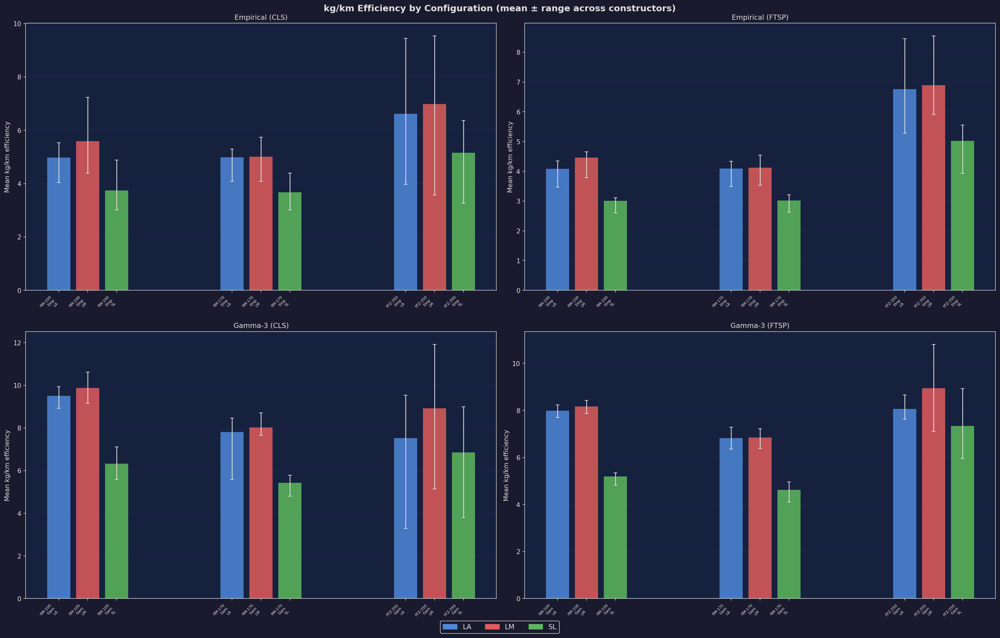</figure>

**Figure 5:** *Mean kg/km efficiency for all 18 configurations, with min–max range whiskers, for both FTSP and CLS.*

**Table 6:** *Route efficiency (kg/km) by configuration — mean ± min/max range across all route constructors (FTSP route improver).*

| Config | Min | Max | Mean |
|--------|-----|-----|------|
| RM-100 / Gamma-3 / LA | 7.70 | 8.24 | 7.99 |
| RM-100 / Gamma-3 / LM | 7.87 | 8.43 | 8.17 |
| RM-100 / Gamma-3 / SL | 4.82 | 5.35 | 5.19 |
| RM-100 / Empirical / LA | 3.47 | 4.35 | 4.09 |
| RM-100 / Empirical / LM | 3.78 | 4.66 | 4.46 |
| RM-100 / Empirical / SL | 2.60 | 3.11 | 3.00 |
| RM-170 / Gamma-3 / LA | 6.36 | 7.28 | 6.83 |
| RM-170 / Gamma-3 / LM | 6.39 | 7.23 | 6.85 |
| RM-170 / Gamma-3 / SL | 4.11 | 4.96 | 4.63 |
| RM-170 / Empirical / LA | 3.49 | 4.34 | 4.09 |
| RM-170 / Empirical / LM | 3.53 | 4.54 | 4.13 |
| RM-170 / Empirical / SL | 2.63 | 3.21 | 3.02 |
| FFZ-350 / Gamma-3 / LA | 7.63 | 8.66 | 8.06 |
| FFZ-350 / Gamma-3 / LM | 7.11 | 10.81 | 8.94 |
| FFZ-350 / Gamma-3 / SL | 5.96 | 8.93 | 7.34 |
| FFZ-350 / Empirical / LA | 5.28 | 8.45 | 6.76 |
| FFZ-350 / Empirical / LM | 5.92 | 8.55 | 6.89 |
| FFZ-350 / Empirical / SL | 3.93 | 5.55 | 5.03 |

**Table 7:** *Route efficiency (kg/km) by configuration — mean ± min/max range across all route constructors (CLS route improver).*

| Config | Min | Max | Mean |
|--------|-----|-----|------|
| RM-100 / Gamma-3 / LA | 8.92 | 9.94 | 9.51 |
| RM-100 / Gamma-3 / LM | 9.15 | 10.62 | 9.88 |
| RM-100 / Gamma-3 / SL | 5.59 | 7.11 | 6.33 |
| RM-100 / Empirical / LA | 4.04 | 5.53 | 4.97 |
| RM-100 / Empirical / LM | 4.40 | 7.23 | 5.60 |
| RM-100 / Empirical / SL | 3.02 | 4.88 | 3.74 |
| RM-170 / Gamma-3 / LA | 5.58 | 8.47 | 7.81 |
| RM-170 / Gamma-3 / LM | 7.66 | 8.71 | 8.02 |
| RM-170 / Gamma-3 / SL | 4.80 | 5.79 | 5.42 |
| RM-170 / Empirical / LA | 4.09 | 5.30 | 4.99 |
| RM-170 / Empirical / LM | 4.09 | 5.74 | 5.01 |
| RM-170 / Empirical / SL | 3.01 | 4.39 | 3.68 |
| FFZ-350 / Gamma-3 / LA | 3.28 | 9.54 | 7.52 |
| FFZ-350 / Gamma-3 / LM | 5.14 | 11.93 | 8.93 |
| FFZ-350 / Gamma-3 / SL | 3.80 | 9.00 | 6.85 |
| FFZ-350 / Empirical / LA | 3.98 | 9.45 | 6.62 |
| FFZ-350 / Empirical / LM | 3.57 | 9.54 | 6.98 |
| FFZ-350 / Empirical / SL | 3.26 | 6.36 | 5.16 |

<!-- [ANALYSIS: Insert your observations here] -->

### 3.3 Distance Driven (km)

<figure style="display:block;width:100%;margin:0.8em 0;padding:0;">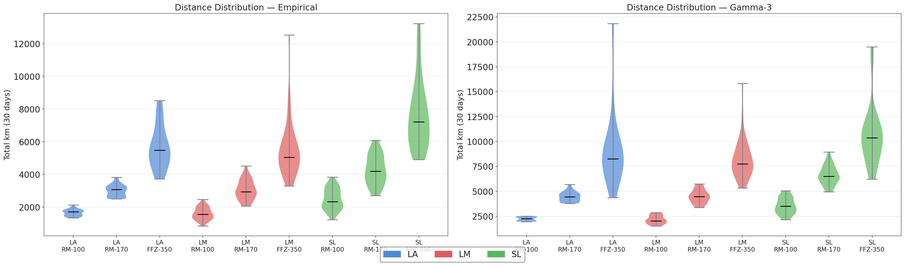</figure>

**Figure 6:** *Distribution of total vehicle distance (km) per selection strategy and city, for both FTSP and CLS.*

**Table 8:** *Vehicle distance driven (km) by configuration — mean ± min/max range across all route constructors (FTSP route improver).*

| Config | Min km | Max km | Mean km |
|--------|--------|--------|---------|
| RM-100 / Gamma-3 / LA | 2360 | 2526 | 2435 |
| RM-100 / Gamma-3 / LM | 2282 | 2450 | 2351 |
| RM-100 / Gamma-3 / SL | 3751 | 4208 | 3882 |
| RM-100 / Empirical / LA | 1688 | 2124 | 1809 |
| RM-100 / Empirical / LM | 1674 | 2073 | 1763 |
| RM-100 / Empirical / SL | 2594 | 3154 | 2746 |
| RM-170 / Gamma-3 / LA | 4413 | 5057 | 4710 |
| RM-170 / Gamma-3 / LM | 4576 | 5144 | 4848 |
| RM-170 / Gamma-3 / SL | 6629 | 8056 | 7152 |
| RM-170 / Empirical / LA | 3058 | 3814 | 3257 |
| RM-170 / Empirical / LM | 3014 | 3937 | 3354 |
| RM-170 / Empirical / SL | 4456 | 5375 | 4712 |
| FFZ-350 / Gamma-3 / LA | 4366 | 9201 | 8270 |
| FFZ-350 / Gamma-3 / LM | 6355 | 10150 | 8074 |
| FFZ-350 / Gamma-3 / SL | 6711 | 12201 | 9949 |
| FFZ-350 / Empirical / LA | 4158 | 6857 | 5436 |
| FFZ-350 / Empirical / LM | 4192 | 6275 | 5312 |
| FFZ-350 / Empirical / SL | 6559 | 10145 | 7610 |

<!-- [ANALYSIS: Insert your observations here] -->

### 3.4 Policy Ranking Heatmaps

<figure style="display:block;width:100%;margin:0.8em 0;padding:0;">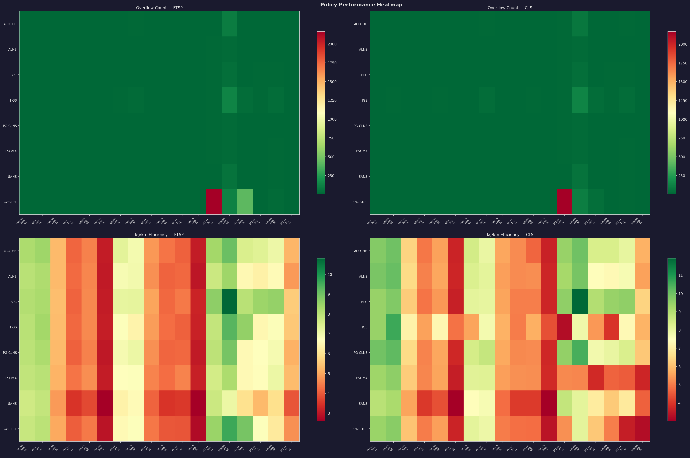</figure>

**Figure 7:** *Four panels: Overflow FTSP | Overflow CLS | Efficiency FTSP | Efficiency CLS. Rows = constructors, columns = all 18 configurations.*

<figure style="display:block;width:100%;margin:0.8em 0;padding:0;">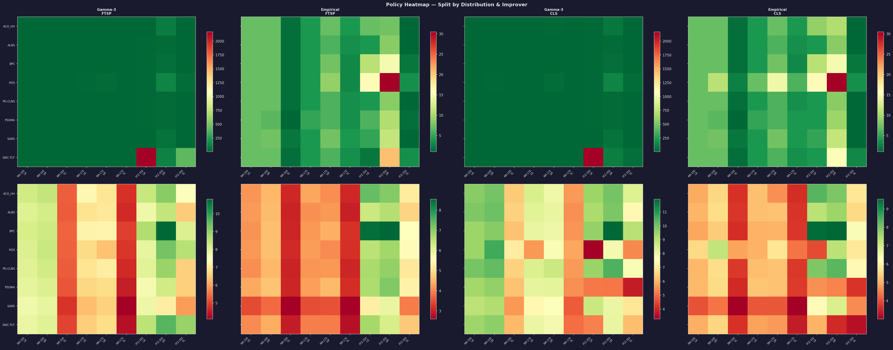</figure>

**Figure 8:** *Heatmaps split into Gamma-3 and Empirical panels for each improver.*

<figure style="display:block;width:100%;margin:0.8em 0;padding:0;">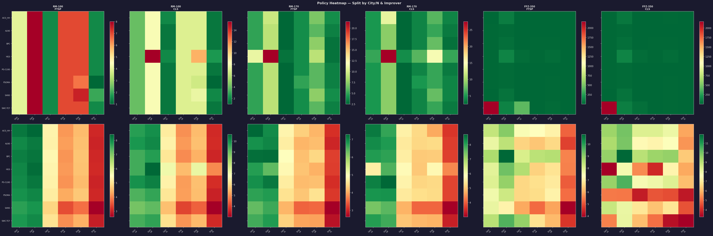</figure>

**Figure 9:** *Heatmaps for each city/N separately, for each improver.*

**[Interactive heatmap](private/simulation/30d/policy_heatmap_interactive.html)**

<!-- [ANALYSIS: Insert your observations here] -->

---

## 4. Selection Strategy Comparison (LA vs LM vs SL)

<figure style="display:block;width:100%;margin:0.8em 0;padding:0;">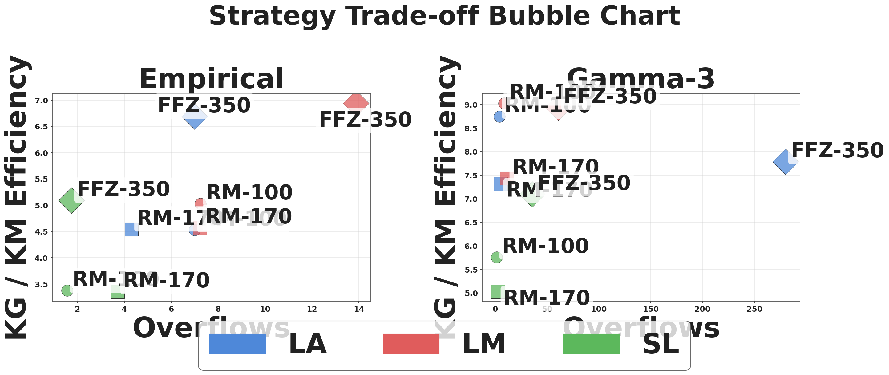</figure>

**Figure 10:** *Four panels (Gamma-3/FTSP, Empirical/FTSP, Gamma-3/CLS, Empirical/CLS). Each bubble = one (strategy, city/N) combination.*

<figure style="display:block;width:100%;margin:0.8em 0;padding:0;">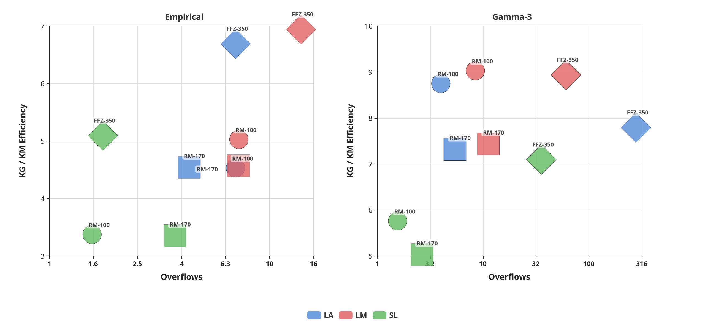</figure>

**Figure 11:** *Same chart with symlog X axis.*

**[Interactive bubble chart](private/simulation/30d/strategy_bubble_interactive.html)**

### LA
#### LA+CLS
**RM-100, Empirical:**
Best overflow: **ACO_HH** (7.0); Best efficiency: **HGS** (5.534 kg/km).

**RM-100, Gamma-3:**
Best overflow: **ACO_HH** (4.0); Best efficiency: **PG-CLNS** (9.943 kg/km).

**RM-170, Empirical:**
Best overflow: **ACO_HH** (4.0); Best efficiency: **PSOMA** (5.295 kg/km).

**RM-170, Gamma-3:**
Best overflow: **ACO_HH** (5.0); Best efficiency: **ACO_HH** (8.469 kg/km).

**FFZ-350, Empirical:**
Best overflow: **ALNS** (4.0); Best efficiency: **BPC** (9.446 kg/km).

**FFZ-350, Gamma-3:**
Best overflow: **SANS** (5.0); Best efficiency: **BPC** (9.535 kg/km).

<!-- [ANALYSIS: Insert your observations here] -->

#### LA+FTSP
**RM-100, Empirical:**
Best overflow: **ACO_HH** (7.0); Best efficiency: **PSOMA** (4.346 kg/km).

**RM-100, Gamma-3:**
Best overflow: **ACO_HH** (4.0); Best efficiency: **ACO_HH** (8.240 kg/km).

**RM-170, Empirical:**
Best overflow: **ACO_HH** (4.0); Best efficiency: **ACO_HH** (4.339 kg/km).

**RM-170, Gamma-3:**
Best overflow: **ACO_HH** (5.0); Best efficiency: **ACO_HH** (7.285 kg/km).

**FFZ-350, Empirical:**
Best overflow: **SWC-TCF** (2.0); Best efficiency: **BPC** (8.454 kg/km).

**FFZ-350, Gamma-3:**
Best overflow: **ACO_HH** (5.0); Best efficiency: **BPC** (8.661 kg/km).

<!-- [ANALYSIS: Insert your observations here] -->

### LM
#### LM+CLS
**RM-100, Empirical:**
Best overflow: **PSOMA** (6.5); Best efficiency: **HGS** (7.230 kg/km).

**RM-100, Gamma-3:**
Best overflow: **ACO_HH** (8.0); Best efficiency: **HGS** (10.623 kg/km).

**RM-170, Empirical:**
Best overflow: **ALNS** (6.0); Best efficiency: **HGS** (5.738 kg/km).

**RM-170, Gamma-3:**
Best overflow: **ALNS** (9.0); Best efficiency: **PG-CLNS** (8.711 kg/km).

**FFZ-350, Empirical:**
Best overflow: **ALNS** (8.5); Best efficiency: **BPC** (9.536 kg/km).

**FFZ-350, Gamma-3:**
Best overflow: **PSOMA** (20.0); Best efficiency: **BPC** (11.926 kg/km).

<!-- [ANALYSIS: Insert your observations here] -->

#### LM+FTSP
**RM-100, Empirical:**
Best overflow: **PSOMA** (6.5); Best efficiency: **PSOMA** (4.659 kg/km).

**RM-100, Gamma-3:**
Best overflow: **ACO_HH** (8.0); Best efficiency: **ACO_HH** (8.425 kg/km).

**RM-170, Empirical:**
Best overflow: **ALNS** (6.0); Best efficiency: **PSOMA** (4.539 kg/km).

**RM-170, Gamma-3:**
Best overflow: **ALNS** (9.0); Best efficiency: **BPC** (7.229 kg/km).

**FFZ-350, Empirical:**
Best overflow: **ACO_HH** (7.5); Best efficiency: **BPC** (8.548 kg/km).

**FFZ-350, Gamma-3:**
Best overflow: **ALNS** (20.5); Best efficiency: **BPC** (10.815 kg/km).

<!-- [ANALYSIS: Insert your observations here] -->

### SL
#### SL+CLS
**RM-100, Empirical:**
Best overflow: **PSOMA** (1.0); Best efficiency: **HGS** (4.883 kg/km).

**RM-100, Gamma-3:**
Best overflow: **ALNS** (1.5); Best efficiency: **HGS** (7.111 kg/km).

**RM-170, Empirical:**
Best overflow: **BPC** (3.0); Best efficiency: **HGS** (4.395 kg/km).

**RM-170, Gamma-3:**
Best overflow: **ACO_HH** (2.5); Best efficiency: **HGS** (5.788 kg/km).

**FFZ-350, Empirical:**
Best overflow: **ACO_HH** (1.0); Best efficiency: **BPC** (6.363 kg/km).

**FFZ-350, Gamma-3:**
Best overflow: **PSOMA** (2.0); Best efficiency: **BPC** (9.001 kg/km).

<!-- [ANALYSIS: Insert your observations here] -->

#### SL+FTSP
**RM-100, Empirical:**
Best overflow: **PSOMA** (1.0); Best efficiency: **HGS** (3.113 kg/km).

**RM-100, Gamma-3:**
Best overflow: **ACO_HH** (1.5); Best efficiency: **BPC** (5.354 kg/km).

**RM-170, Empirical:**
Best overflow: **BPC** (3.0); Best efficiency: **BPC** (3.209 kg/km).

**RM-170, Gamma-3:**
Best overflow: **ACO_HH** (2.5); Best efficiency: **BPC** (4.956 kg/km).

**FFZ-350, Empirical:**
Best overflow: **ACO_HH** (1.0); Best efficiency: **BPC** (5.552 kg/km).

**FFZ-350, Gamma-3:**
Best overflow: **PSOMA** (3.0); Best efficiency: **SWC-TCF** (8.929 kg/km).

<!-- [ANALYSIS: Insert your observations here] -->

---

## 5. Distribution Comparison (Empirical vs Gamma-3)

### Empirical
#### Empirical — CLS
<!-- [ANALYSIS: Insert your observations here] -->

#### Empirical — FTSP
<!-- [ANALYSIS: Insert your observations here] -->

### Gamma-3
#### Gamma-3 — CLS
<!-- [ANALYSIS: Insert your observations here] -->

#### Gamma-3 — FTSP
<!-- [ANALYSIS: Insert your observations here] -->

---

## 6. Network Size Comparison

<figure style="display:block;width:100%;margin:0.8em 0;padding:0;"></figure>

**Figure 12:** *Scaling chart for Rio Maior (N=100 → N=170) for both FTSP and CLS.*

<!-- [ANALYSIS: Insert your observations here] -->

---

## 7. Daily Output Analysis

### 7.1 Collection Calendar Patterns

<!-- [ANALYSIS: Insert your observations here] -->

### 7.2 Day-by-Day Metric Trajectories

<!-- [ANALYSIS: Insert your observations here] -->

---

## 8. FTSP vs CLS Route Improver Comparison

<figure style="display:block;width:100%;margin:0.8em 0;padding:0;">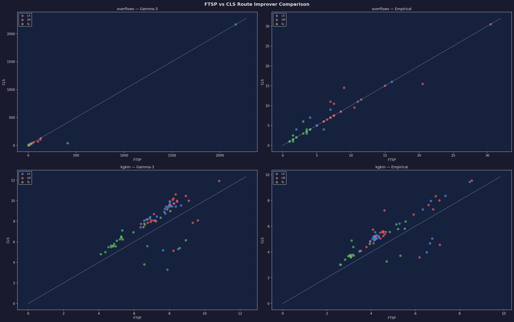</figure>

**Figure 13:** *FTSP vs CLS scatter per metric. Points above the diagonal = CLS > FTSP; below = FTSP > CLS.*

<figure style="display:block;width:100%;margin:0.8em 0;padding:0;"></figure>

**Figure 14:** *Delta heatmap (CLS - FTSP) per constructor x configuration. Red = FTSP better, green = CLS better.*

<!-- [ANALYSIS: Insert your observations here] -->

---

## 9. Figueira da Foz — New City Analysis (N=350)

### CLS
Best efficiency: **BPC** LM (11.926 kg/km, 38.5 overflows).
<!-- [ANALYSIS: Insert your observations here] -->

### FTSP
Best efficiency: **BPC** LM (10.815 kg/km, 38.5 overflows).
<!-- [ANALYSIS: Insert your observations here] -->

## City Comparison Across All Cities

<figure style="display:block;width:100%;margin:0.8em 0;padding:0;">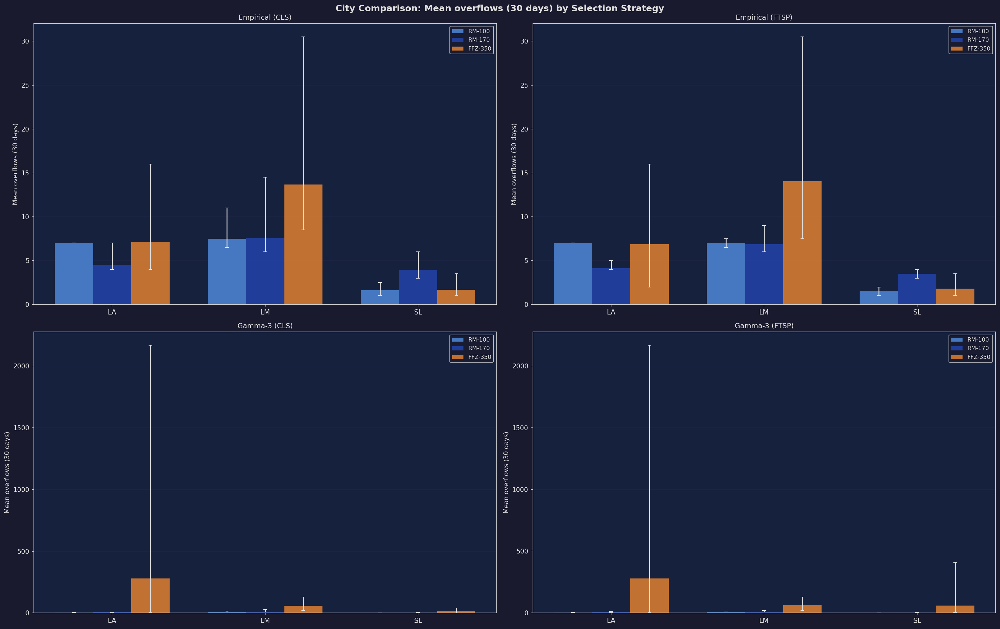</figure>

**Figure 15:** *Mean overflow counts for each selection strategy across all city/N configurations, for both FTSP and CLS.*

<figure style="display:block;width:100%;margin:0.8em 0;padding:0;">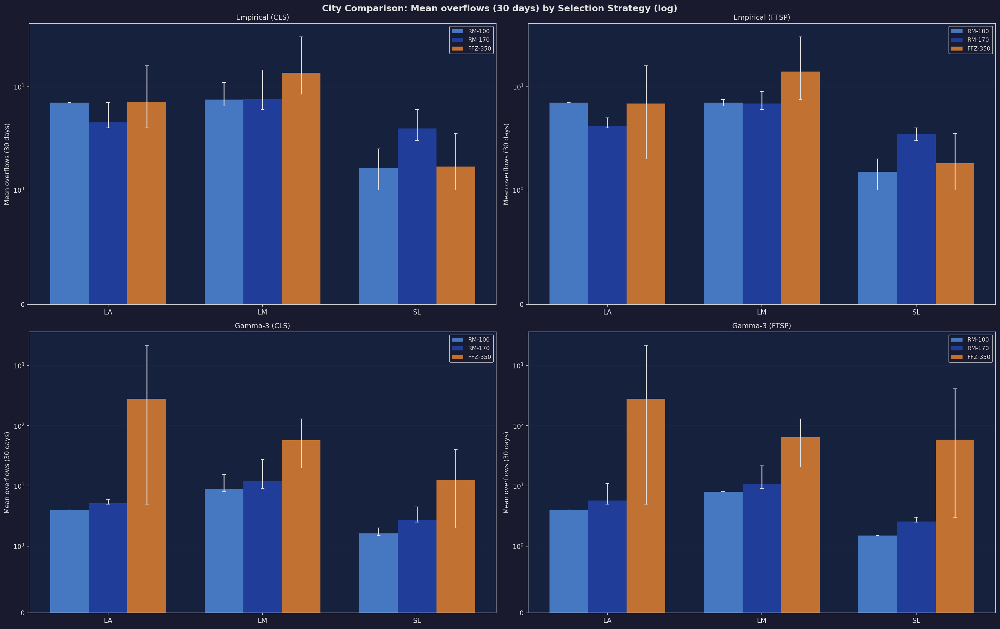</figure>

**Figure 16:** *Log-scale version of the overflow comparison.*

**[Interactive city comparison](private/simulation/30d/city_comparison_interactive.html)**

<figure style="display:block;width:100%;margin:0.8em 0;padding:0;">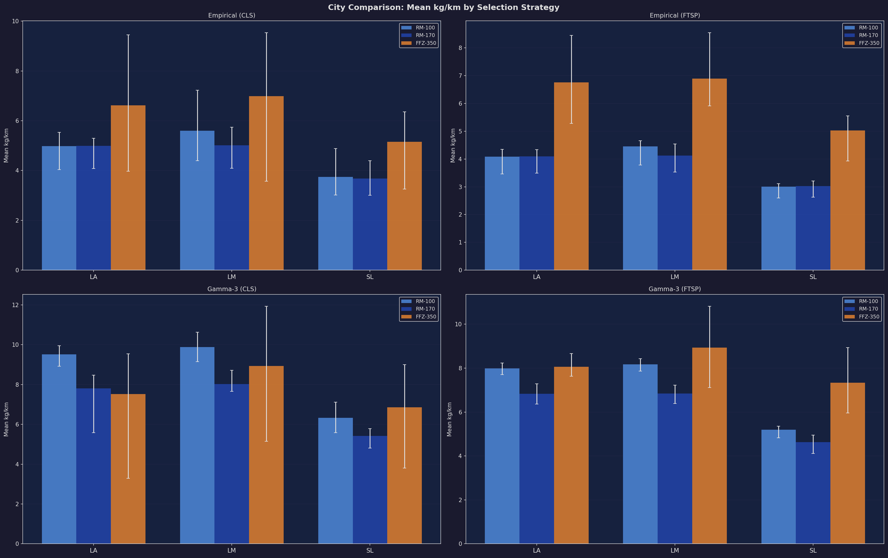</figure>

**Figure 17:** *Mean kg/km efficiency across cities.*

<figure style="display:block;width:100%;margin:0.8em 0;padding:0;">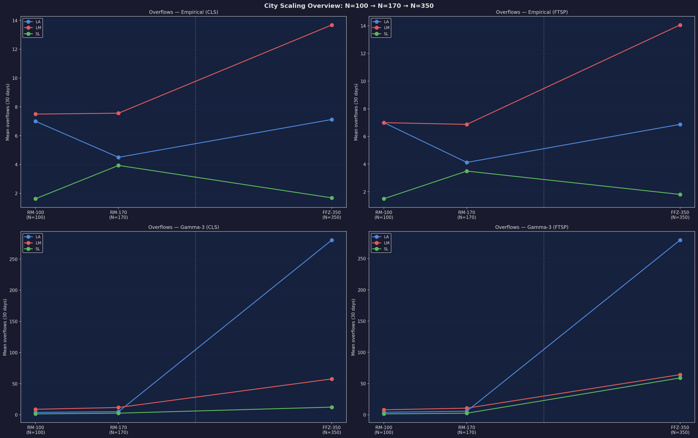</figure>

**Figure 18:** *Scaling chart from N=100 → N=350, for both FTSP and CLS.*

<!-- [ANALYSIS: Insert your observations here] -->

---

## Key Findings & Recommendations

### Policy Performance Radar

<figure style="display:block;width:100%;margin:0.8em 0;padding:0;">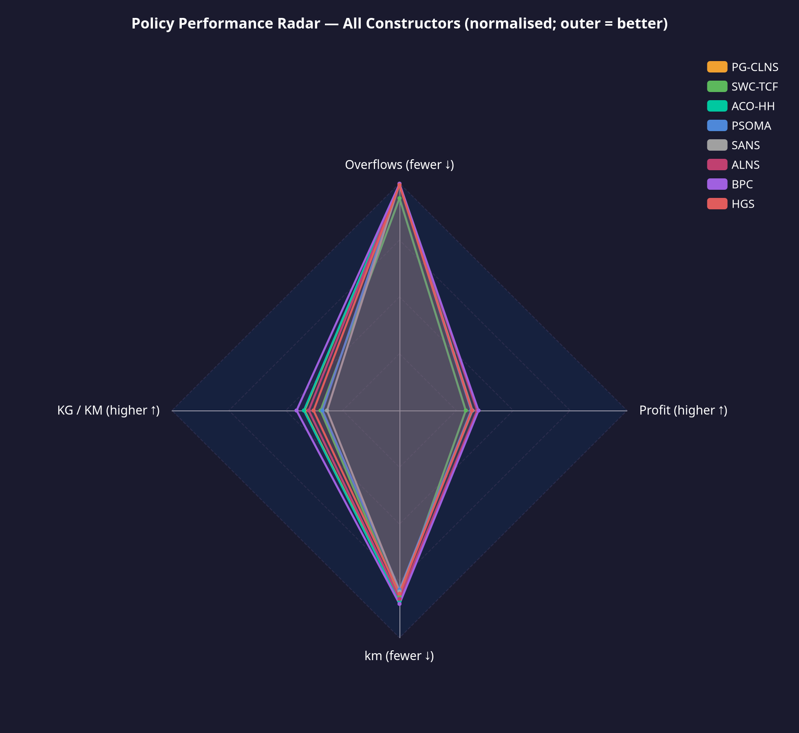</figure>

**Figure 19:** *Overlaid radar chart for key constructors (ACO_HH, HGS, BPC, SANS). Outer = better on all axes.*

### Constructor Average Ranking

<figure style="display:block;width:100%;margin:0.8em 0;padding:0;">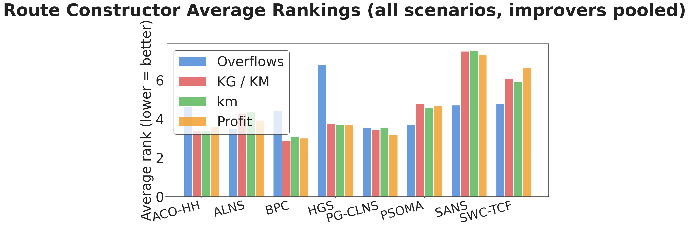</figure>

**Figure 20:** *Average rank of each route constructor across all configurations, for FTSP and CLS. Bars grow upward — shorter = better.*

**[Interactive constructor comparison](private/simulation/30d/constructor_comparison_interactive.html)**

<!-- [ANALYSIS: Insert your observations here] -->

### Deployment Recommendations

**Table 9:** *Deployment recommendations — suggested policy configuration per operational use case.*

| Use Case | Strategy | Constructor | Route Improver | Notes |
|----------|:--------:|:-----------:|:--------------:|-------|
| Overflow prevention | SL | <!-- best_ov_constructor --> | <!-- improver --> | <!-- notes --> |
| Maximum efficiency | LM | <!-- best_eff_constructor --> | <!-- improver --> | <!-- notes --> |
| Balanced trade-off | LA | <!-- constructor --> | <!-- improver --> | <!-- notes --> |

---

*All figures stored in `figures/simulation/30d/`.*
*Raw simulation data: `public/global/simulation/simulation_summary.csv`.*

## Interactive Charts

- [Overflow vs Efficiency — Pareto View](private/simulation/30d/pareto_scatter_interactive.html)
- [Strategy Trade-off Bubble Chart](private/simulation/30d/strategy_bubble_interactive.html)
- [Policy Configuration Heatmap](private/simulation/30d/policy_heatmap_interactive.html)
- [Constructor Comparison](private/simulation/30d/constructor_comparison_interactive.html)
- [City Comparison](private/simulation/30d/city_comparison_interactive.html)

---

## 90-Day Horizon Results

> **Scope:** Same city/distribution/strategy/constructor space as the 30-day runs.
> **Total logs analysed (90d):** 174
> **Constructors available:** ACO_HH, BPC, HGS, PG-CLNS, PSOMA, SANS, SWC-TCF

### Overview

<!-- [ANALYSIS: Insert your observations here] -->

### 90d — Overflow Performance

<figure style="display:block;width:100%;margin:0.8em 0;padding:0;">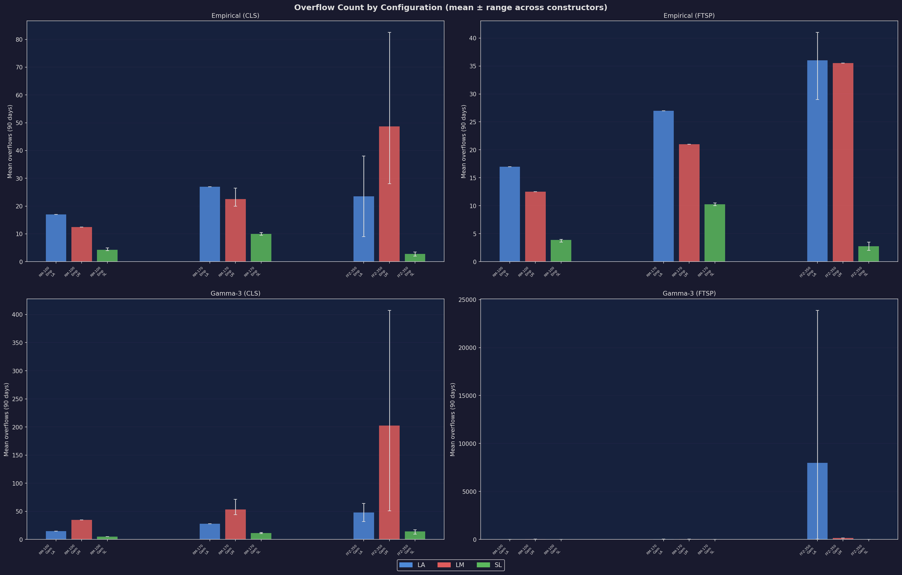</figure>

**Figure 21:** *Mean overflow count for all configurations over the 90-day horizon, mean ± range across constructors.*

<figure style="display:block;width:100%;margin:0.8em 0;padding:0;">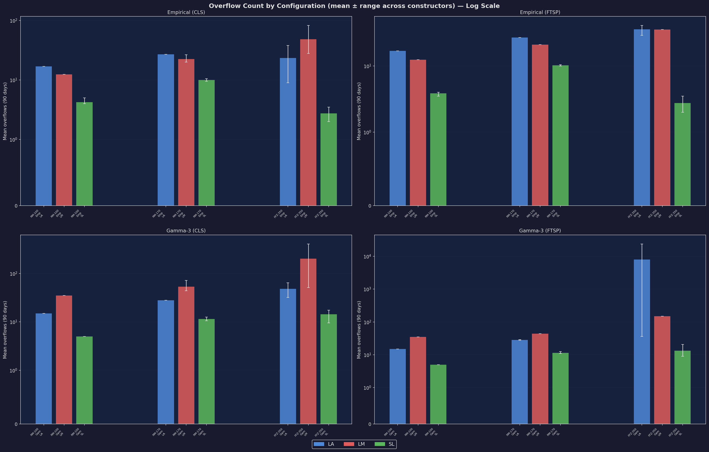</figure>

**Figure 22:** *Same chart, symlog Y axis.*

**Table 10:** *90-day overflow counts by configuration — mean ± min/max range (FTSP).*

| Config | Min | Max | Mean |
|--------|-----|-----|------|
| RM-100 / Gamma-3 / LA | 15 | 15 | 15.0 |
| RM-100 / Gamma-3 / LM | 35 | 35 | 35.0 |
| RM-100 / Gamma-3 / SL | 5 | 5 | 5.0 |
| RM-100 / Empirical / LA | 17 | 17 | 17.0 |
| RM-100 / Empirical / LM | 12 | 12 | 12.5 |
| RM-100 / Empirical / SL | 4 | 4 | 3.9 |
| RM-170 / Gamma-3 / LA | 28 | 29 | 28.3 |
| RM-170 / Gamma-3 / LM | 44 | 44 | 44.0 |
| RM-170 / Gamma-3 / SL | 11 | 12 | 11.5 |
| RM-170 / Empirical / LA | 27 | 27 | 27.0 |
| RM-170 / Empirical / LM | 21 | 21 | 21.0 |
| RM-170 / Empirical / SL | 10 | 10 | 10.2 |
| FFZ-350 / Gamma-3 / LA | 36 | 23886 | 7995.3 |
| FFZ-350 / Gamma-3 / LM | 149 | 149 | 149.0 |
| FFZ-350 / Gamma-3 / SL | 9 | 20 | 13.4 |
| FFZ-350 / Empirical / LA | 29 | 41 | 36.0 |
| FFZ-350 / Empirical / LM | 36 | 36 | 35.5 |
| FFZ-350 / Empirical / SL | 2 | 4 | 2.8 |

**Table 11:** *90-day overflow counts by configuration — mean ± min/max range (CLS).*

| Config | Min | Max | Mean |
|--------|-----|-----|------|
| RM-100 / Gamma-3 / LA | 15 | 15 | 15.0 |
| RM-100 / Gamma-3 / LM | 35 | 35 | 35.0 |
| RM-100 / Gamma-3 / SL | 5 | 5 | 5.0 |
| RM-100 / Empirical / LA | 17 | 17 | 17.0 |
| RM-100 / Empirical / LM | 12 | 12 | 12.5 |
| RM-100 / Empirical / SL | 4 | 5 | 4.2 |
| RM-170 / Gamma-3 / LA | 28 | 28 | 28.0 |
| RM-170 / Gamma-3 / LM | 44 | 72 | 53.2 |
| RM-170 / Gamma-3 / SL | 10 | 12 | 11.5 |
| RM-170 / Empirical / LA | 27 | 27 | 27.0 |
| RM-170 / Empirical / LM | 20 | 26 | 22.5 |
| RM-170 / Empirical / SL | 10 | 10 | 10.0 |
| FFZ-350 / Gamma-3 / LA | 32 | 64 | 48.0 |
| FFZ-350 / Gamma-3 / LM | 51 | 408 | 202.5 |
| FFZ-350 / Gamma-3 / SL | 10 | 18 | 14.4 |
| FFZ-350 / Empirical / LA | 9 | 38 | 23.5 |
| FFZ-350 / Empirical / LM | 28 | 82 | 48.7 |
| FFZ-350 / Empirical / SL | 2 | 4 | 2.8 |

<!-- [ANALYSIS: Insert your observations here] -->

### 90d — Route Efficiency (kg/km)

<figure style="display:block;width:100%;margin:0.8em 0;padding:0;">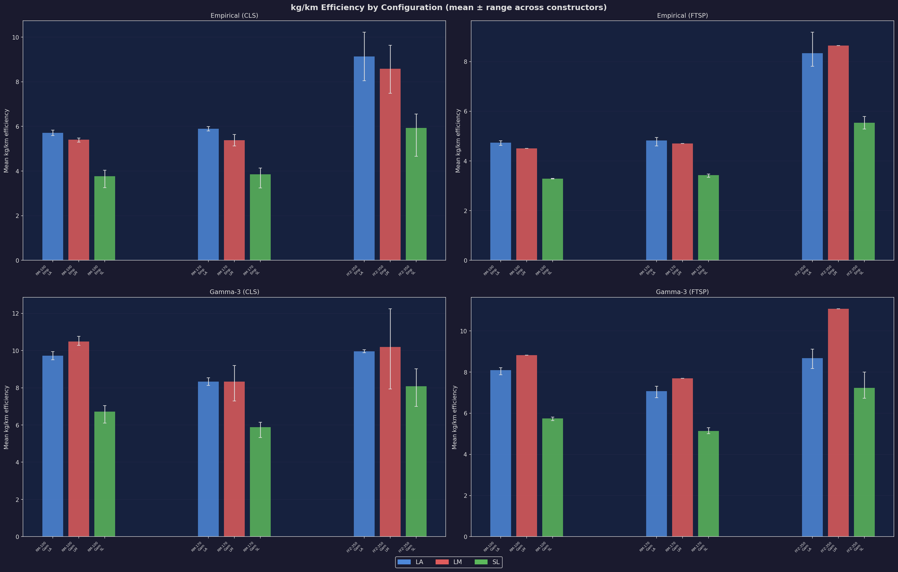</figure>

**Figure 23:** *Mean kg/km efficiency for all configurations over 90 days.*

**Table 12:** *90-day route efficiency (kg/km) — FTSP.*

| Config | Min | Max | Mean |
|--------|-----|-----|------|
| RM-100 / Gamma-3 / LA | 7.86 | 8.21 | 8.09 |
| RM-100 / Gamma-3 / LM | 8.82 | 8.82 | 8.82 |
| RM-100 / Gamma-3 / SL | 5.64 | 5.82 | 5.74 |
| RM-100 / Empirical / LA | 4.63 | 4.81 | 4.74 |
| RM-100 / Empirical / LM | 4.51 | 4.51 | 4.51 |
| RM-100 / Empirical / SL | 3.27 | 3.30 | 3.28 |
| RM-170 / Gamma-3 / LA | 6.76 | 7.32 | 7.07 |
| RM-170 / Gamma-3 / LM | 7.70 | 7.70 | 7.70 |
| RM-170 / Gamma-3 / SL | 5.00 | 5.30 | 5.13 |
| RM-170 / Empirical / LA | 4.60 | 4.94 | 4.82 |
| RM-170 / Empirical / LM | 4.70 | 4.70 | 4.70 |
| RM-170 / Empirical / SL | 3.34 | 3.47 | 3.43 |
| FFZ-350 / Gamma-3 / LA | 8.18 | 9.11 | 8.67 |
| FFZ-350 / Gamma-3 / LM | 11.08 | 11.08 | 11.08 |
| FFZ-350 / Gamma-3 / SL | 6.73 | 8.01 | 7.24 |
| FFZ-350 / Empirical / LA | 7.81 | 9.18 | 8.34 |
| FFZ-350 / Empirical / LM | 8.64 | 8.64 | 8.64 |
| FFZ-350 / Empirical / SL | 5.29 | 5.79 | 5.54 |

**Table 13:** *90-day route efficiency (kg/km) — CLS.*

| Config | Min | Max | Mean |
|--------|-----|-----|------|
| RM-100 / Gamma-3 / LA | 9.51 | 9.95 | 9.73 |
| RM-100 / Gamma-3 / LM | 10.28 | 10.76 | 10.48 |
| RM-100 / Gamma-3 / SL | 6.11 | 7.03 | 6.73 |
| RM-100 / Empirical / LA | 5.59 | 5.84 | 5.72 |
| RM-100 / Empirical / LM | 5.29 | 5.48 | 5.41 |
| RM-100 / Empirical / SL | 3.26 | 4.03 | 3.77 |
| RM-170 / Gamma-3 / LA | 8.13 | 8.54 | 8.34 |
| RM-170 / Gamma-3 / LM | 7.29 | 9.19 | 8.34 |
| RM-170 / Gamma-3 / SL | 5.32 | 6.15 | 5.89 |
| RM-170 / Empirical / LA | 5.80 | 6.00 | 5.90 |
| RM-170 / Empirical / LM | 5.12 | 5.63 | 5.39 |
| RM-170 / Empirical / SL | 3.24 | 4.14 | 3.85 |
| FFZ-350 / Gamma-3 / LA | 9.89 | 10.04 | 9.96 |
| FFZ-350 / Gamma-3 / LM | 7.93 | 12.25 | 10.19 |
| FFZ-350 / Gamma-3 / SL | 7.00 | 9.02 | 8.09 |
| FFZ-350 / Empirical / LA | 8.05 | 10.22 | 9.13 |
| FFZ-350 / Empirical / LM | 7.48 | 9.64 | 8.58 |
| FFZ-350 / Empirical / SL | 4.66 | 6.56 | 5.93 |

<!-- [ANALYSIS: Insert your observations here] -->

### 90d — Distance Driven (km)

<figure style="display:block;width:100%;margin:0.8em 0;padding:0;">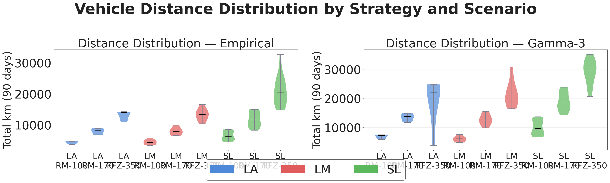</figure>

**Figure 24:** *Distribution of total vehicle distance over 90 days per selection strategy and city.*

**Table 14:** *90-day vehicle distance (km) — FTSP.*

| Config | Min km | Max km | Mean km |
|--------|--------|--------|---------|
| RM-100 / Gamma-3 / LA | 7172 | 7491 | 7283 |
| RM-100 / Gamma-3 / LM | 6717 | 6717 | 6717 |
| RM-100 / Gamma-3 / SL | 10687 | 11006 | 10833 |
| RM-100 / Empirical / LA | 4523 | 4700 | 4594 |
| RM-100 / Empirical / LM | 4961 | 4961 | 4961 |
| RM-100 / Empirical / SL | 6929 | 7019 | 6957 |
| RM-170 / Gamma-3 / LA | 13720 | 14865 | 14208 |
| RM-170 / Gamma-3 / LM | 13343 | 13343 | 13343 |
| RM-170 / Gamma-3 / SL | 19566 | 20748 | 20198 |
| RM-170 / Empirical / LA | 8285 | 8903 | 8511 |
| RM-170 / Empirical / LM | 8838 | 8838 | 8838 |
| RM-170 / Empirical / SL | 12106 | 12748 | 12386 |
| FFZ-350 / Gamma-3 / LA | 3811 | 24802 | 17495 |
| FFZ-350 / Gamma-3 / LM | 19583 | 19583 | 19583 |
| FFZ-350 / Gamma-3 / SL | 28128 | 32610 | 30769 |
| FFZ-350 / Empirical / LA | 12220 | 14271 | 13580 |
| FFZ-350 / Empirical / LM | 13095 | 13095 | 13095 |
| FFZ-350 / Empirical / SL | 20379 | 22181 | 21231 |

<!-- [ANALYSIS: Insert your observations here] -->

### 90d — Policy Ranking Heatmaps

<figure style="display:block;width:100%;margin:0.8em 0;padding:0;">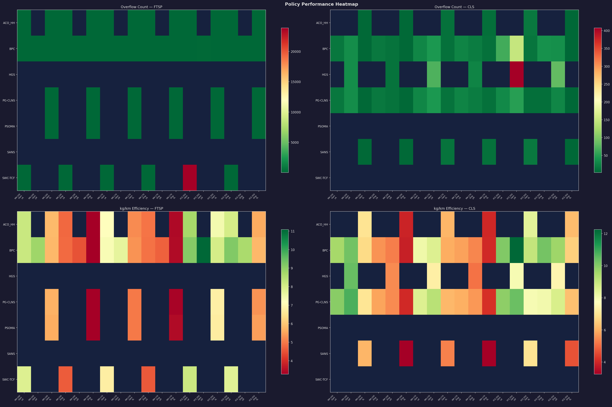</figure>

**Figure 25:** *Constructor × configuration performance heatmap for the 90-day runs.*

<figure style="display:block;width:100%;margin:0.8em 0;padding:0;">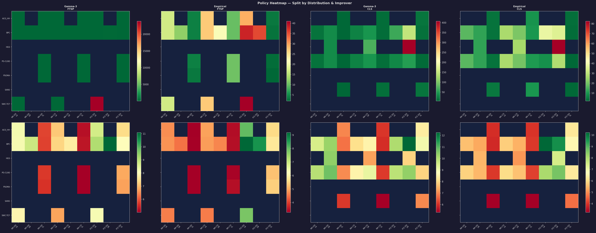</figure>

<figure style="display:block;width:100%;margin:0.8em 0;padding:0;">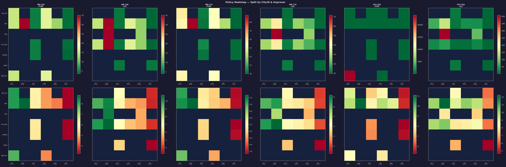</figure>

<!-- [ANALYSIS: Insert your observations here] -->

### 90d — Selection Strategy Comparison

<figure style="display:block;width:100%;margin:0.8em 0;padding:0;">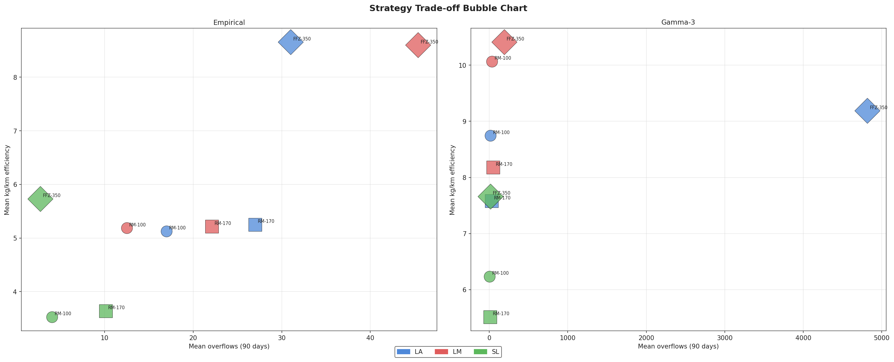</figure>

**Figure 26:** *Strategy trade-off bubble chart over 90 days.*

<figure style="display:block;width:100%;margin:0.8em 0;padding:0;">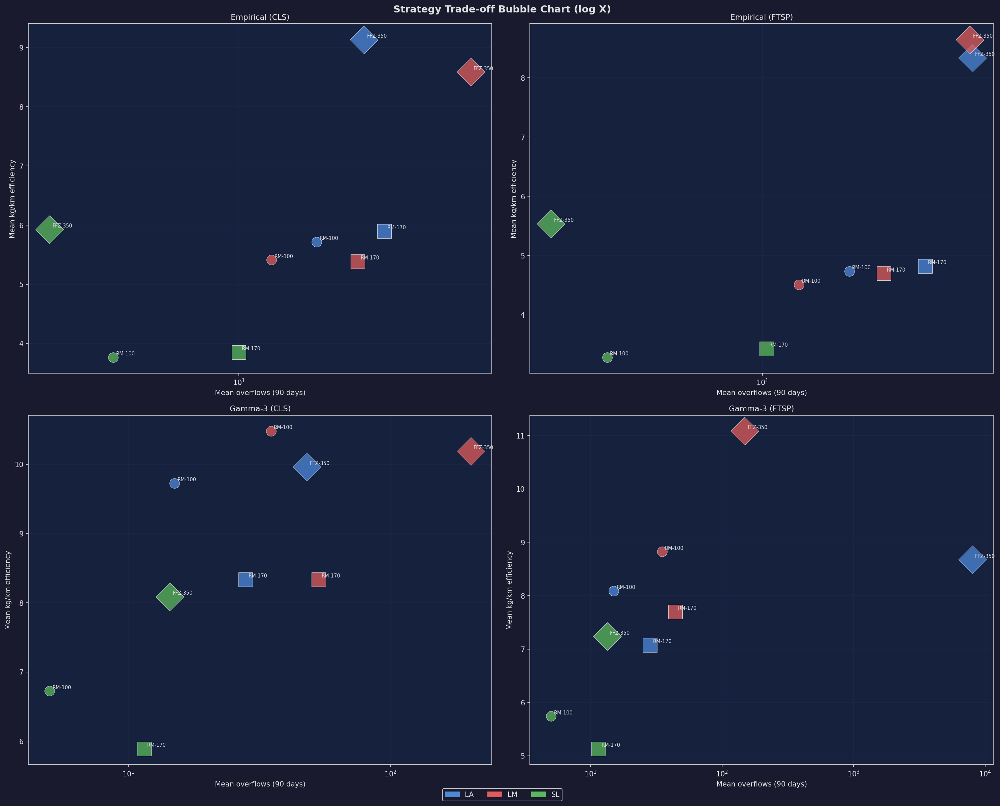</figure>

<!-- [ANALYSIS: Insert your observations here] -->

### 90d — Pareto View

<figure style="display:block;width:100%;margin:0.8em 0;padding:0;">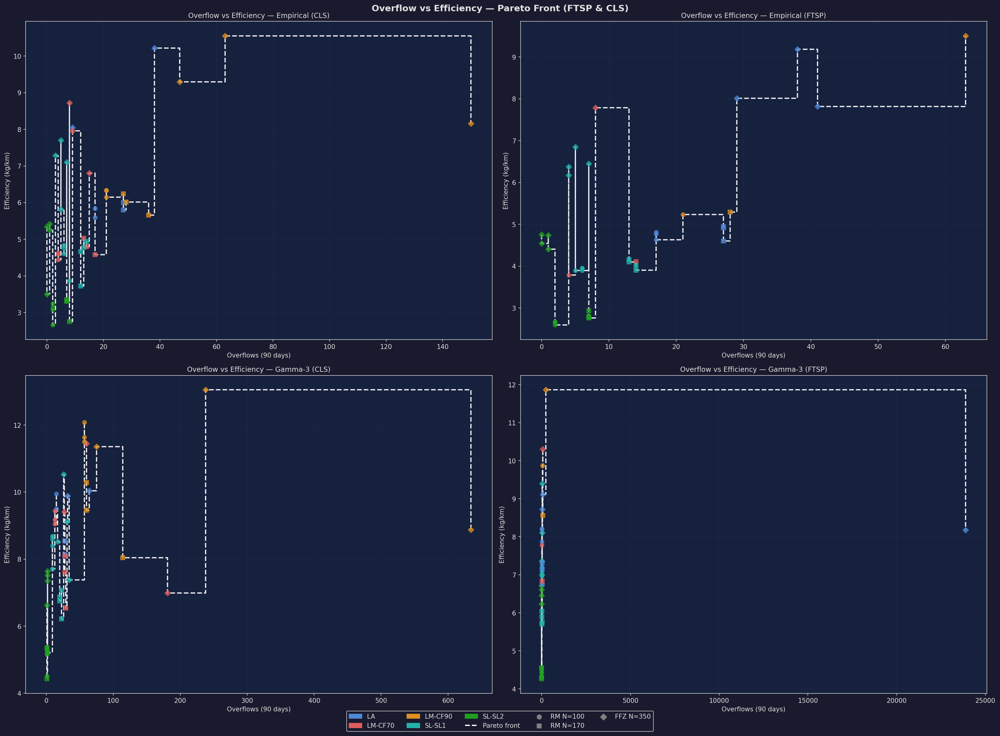</figure>

**Figure 27:** *Pareto front scatter for the 90-day runs.*

### 90d — Pareto-Front Policy Catalogue

**Table 15:** *Pareto-optimal configurations from the 90-day runs.*

| Selection | Constructor | Improver | Overflows | kg/km | Pareto-Front Scenarios |
|-----------|-------------|----------|----------:|------:|------------------------|
| LM (CF70) | BPC | FTSP | 27.0 | 8.622 | FFZ-350 / Empirical, FFZ-350 / Gamma-3, RM-100 / Gamma-3 |
| LM (CF90) | BPC | FTSP | 119.3 | 10.413 | FFZ-350 / Empirical, FFZ-350 / Gamma-3, RM-100 / Gamma-3 |
| SL (SL2) | ACO_HH | FTSP | 1.0 | 5.335 | FFZ-350 / Empirical, FFZ-350 / Gamma-3, RM-170 / Gamma-3 |
| LA | ACO_HH | FTSP | 22.0 | 8.111 | FFZ-350 / Empirical, RM-100 / Gamma-3 |
| LM (CF90) | BPC | CLS | 150.5 | 11.802 | FFZ-350 / Empirical, FFZ-350 / Gamma-3 |
| SL (SL1) | BPC | CLS | 15.5 | 9.119 | FFZ-350 / Empirical, FFZ-350 / Gamma-3 |
| SL (SL1) | BPC | FTSP | 15.5 | 8.125 | FFZ-350 / Empirical, FFZ-350 / Gamma-3 |
| SL (SL1) | PG-CLNS | CLS | 6.0 | 7.985 | FFZ-350 / Empirical, RM-100 / Gamma-3 |
| SL (SL2) | ACO_HH | CLS | 1.0 | 6.494 | FFZ-350 / Empirical, FFZ-350 / Gamma-3 |
| LA | BPC | CLS | 38.0 | 10.220 | FFZ-350 / Empirical |
| LA | BPC | FTSP | 38.0 | 9.181 | FFZ-350 / Empirical |
| LA | PG-CLNS | CLS | 15.0 | 9.947 | RM-100 / Gamma-3 |
| LM (CF70) | BPC | CLS | 8.0 | 8.726 | FFZ-350 / Empirical |
| LM (CF70) | PG-CLNS | CLS | 13.0 | 9.445 | RM-100 / Gamma-3 |
| LM (CF90) | PG-CLNS | CLS | 57.0 | 12.079 | RM-100 / Gamma-3 |
| SL (SL1) | ACO_HH | FTSP | 9.0 | 7.200 | RM-100 / Gamma-3 |
| SL (SL1) | PSOMA | FTSP | 4.0 | 6.378 | FFZ-350 / Empirical |
| SL (SL2) | BPC | CLS | 1.0 | 5.416 | FFZ-350 / Empirical |
| SL (SL2) | SANS | CLS | 1.0 | 6.624 | FFZ-350 / Gamma-3 |

---

## 30-Day vs 90-Day Comparison

This section compares results between the 30-day and 90-day simulation horizons to identify
which patterns are robust across time scales and which shift as the evaluation window extends.

### Overflow: 30d vs 90d

<figure style="display:block;width:100%;margin:0.8em 0;padding:0;">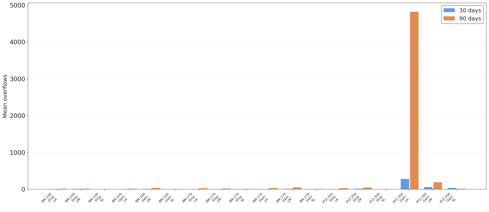</figure>

*Side-by-side overflow bars for every configuration. Blue = 30-day, orange = 90-day.
Taller orange bars indicate that overflow pressure grows with a longer horizon.*

<figure style="display:block;width:100%;margin:0.8em 0;padding:0;">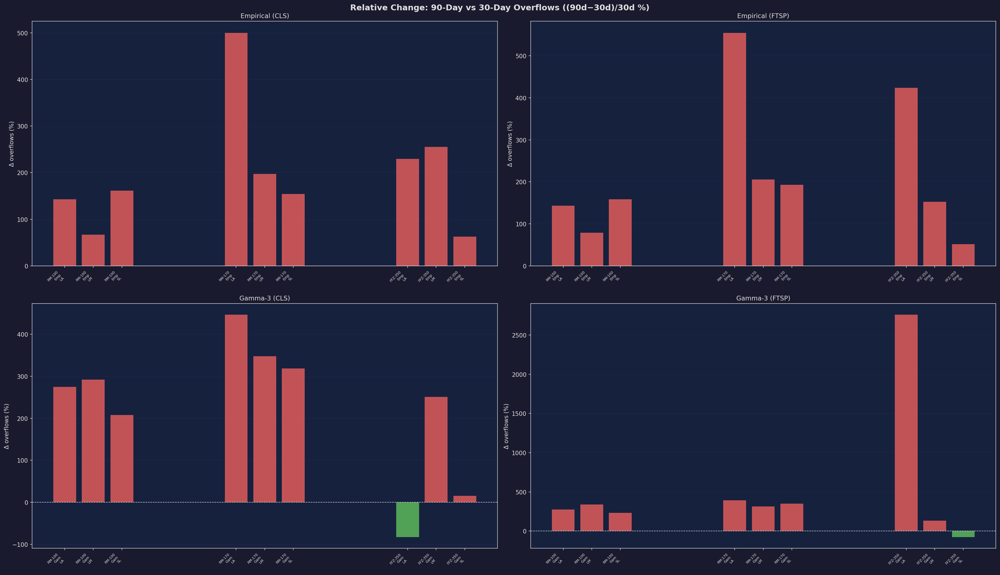</figure>

*Relative change in mean overflows: (90d − 30d) / 30d × 100.
Red bars = more overflows at 90 days; green bars = fewer.*

<!-- [ANALYSIS: Insert your observations here] -->

### Efficiency: 30d vs 90d

<figure style="display:block;width:100%;margin:0.8em 0;padding:0;">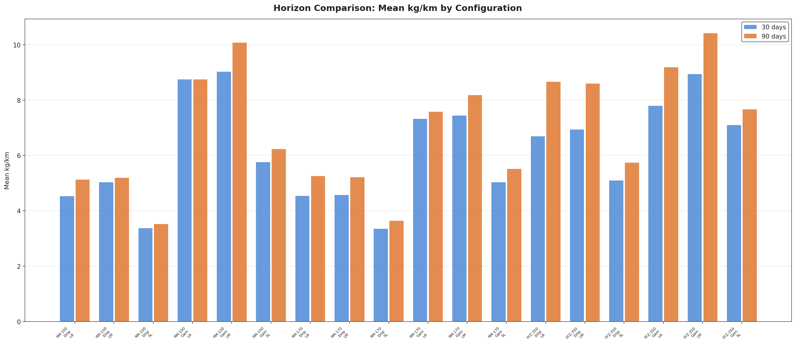</figure>

*Side-by-side kg/km efficiency comparison.
Consistent efficiency across horizons suggests the routing policy scales well.*

<!-- [ANALYSIS: Insert your observations here] -->

### Constructor Rankings: 30d vs 90d

<figure style="display:block;width:100%;margin:0.8em 0;padding:0;">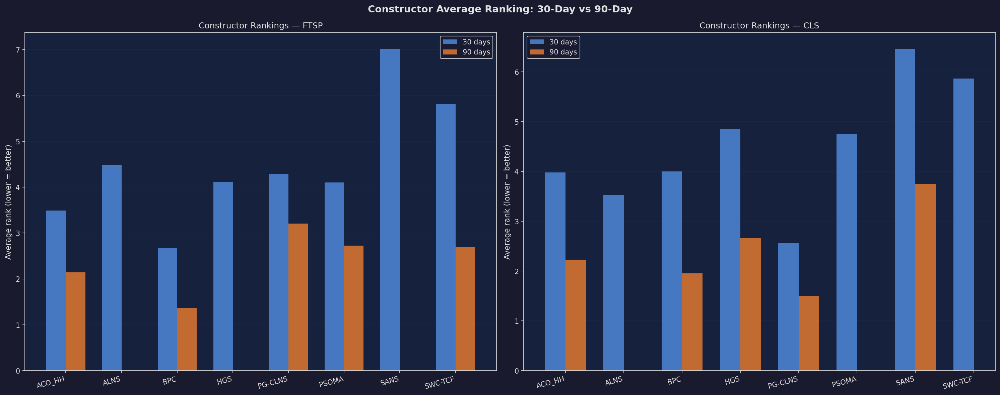</figure>

*Average constructor rank (lower = better) for FTSP and CLS, compared across horizons.
Constructors with stable ranks are robust; those that improve or regress warrant deeper investigation.*

<!-- [ANALYSIS: Insert your observations here] -->

### Key Observations

<!-- [ANALYSIS: Insert your observations here] -->

---
