# WSmart+ Route — Simulation Analysis Report

> **Scope:** 30-day simulation runs across 3 city/network configurations × 2 distributions × 3 selection strategies × 2 route improvers × 8 route constructors  
> **Total logs analysed:** 480 (3 configs × 2 distributions × 3 strategies × 2 improvers × 8 constructors)  
> **Horizon:** 30 days  
> **Cities:** Rio Maior (Portugal) — N=100, N=170; Figueira da Foz (Portugal) — N=350  
> **Generated:** 2026-07-01

---

## Table of Contents

1. [Experimental Setup](#1-experimental-setup)
2. [Analytics Comparison — Pareto View](#2-analytics-comparison--pareto-view)
3. [Summary KPI Analysis](#3-summary-kpi-analysis)
   - 3.1 [Overflow Performance](#31-overflow-performance)
   - 3.2 [Route Efficiency (kg/km)](#32-route-efficiency-kgkm)
   - 3.3 [Distance Driven (km)](#33-distance-driven-km)
   - 3.4 [Policy Ranking Heatmaps](#34-policy-ranking-heatmaps)
4. [Selection Strategy Comparison (LA vs LM vs SL)](#4-selection-strategy-comparison-la-vs-lm-vs-sl)
5. [Distribution Comparison (Gamma-3 vs Empirical)](#5-distribution-comparison-gamma-3-vs-empirical)
6. [Network Size Comparison (N=100 → N=170)](#6-network-size-comparison-n100--n170)
7. [Daily Output Analysis](#7-daily-output-analysis)
   - 7.1 [Collection Calendar Patterns](#71-collection-calendar-patterns)
   - 7.2 [Day-by-Day Metric Trajectories](#72-day-by-day-metric-trajectories)
8. [FTSP vs CLS Route Improver Comparison](#8-ftsp-vs-cls-route-improver-comparison)
9. [Figueira da Foz — New City Analysis (N=350)](#9-figueira-da-foz--new-city-analysis-n350)
10. [City Comparison: Rio Maior vs Figueira da Foz](#10-city-comparison-rio-maior-vs-figueira-da-foz)
11. [Key Findings & Recommendations](#11-key-findings--recommendations)

---

## 1. Experimental Setup

### Configuration Space

| Dimension | Values |
|-----------|--------|
| **Cities / N** | Rio Maior N=100, Rio Maior N=170, Figueira da Foz N=350 |
| **Waste distribution** | Gamma-3, Empirical |
| **Selection strategy** | Lookahead (LA), Last-Minute (LM), Service-Level (SL) |
| **Route constructors** | ACO_HH, ALNS, BPC, HGS, PG-CLNS, PSOMA, SANS, SWC-TCF |
| **Route improvers** | FTSP, CLS |
| **Simulation days** | 30 |
| **Waste type** | Plastic |

### Policy Naming Convention

Each log file encodes the full pipeline as:  
`{mandatory_selection}_{route_constructor}[_{engine}]_{route_improver}`

For Last-Minute (LM), two critical fill threshold variants are tested: **CF70** (70% fill triggers mandatory collection) and **CF90** (90% threshold). Service-Level (SL) tests two service level targets: **SL1** and **SL2**. Results in this report aggregate CF70 and CF90 under **LM**, and SL1/SL2 under **SL**, unless otherwise specified.

### Metrics Tracked

| Metric | Direction | Description |
|--------|-----------|-------------|
| `overflows` | ↓ lower better | Bins exceeding 100% capacity during simulation |
| `kg` | ↑ higher better | Total waste collected (kg) over 30 days |
| `km` | ↓ lower better | Total vehicle distance driven (km) |
| `kg/km` | ↑ higher better | Route efficiency (waste per unit distance) |
| `ncol` | contextual | Number of collection events |
| `kg_lost` | ↓ lower better | Waste that overflowed and was not collected |
| `profit` | ↑ higher better | Revenue from collection minus operational cost |
| `days` | contextual | Active collection days in the 30-day horizon |

---

## 2. Analytics Comparison — Pareto View

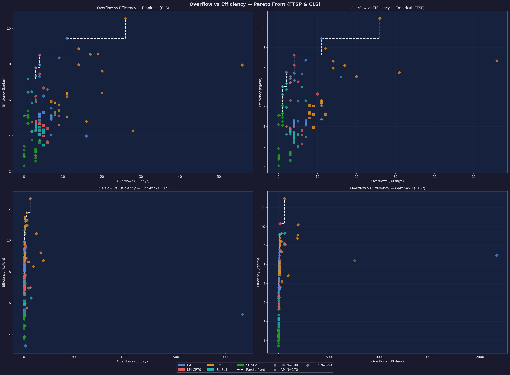

*Scatter of all simulation runs (FTSP and CLS) in the overflows–kg/km space, coloured by selection strategy and CF/SL variant. Four panels: Gamma-3/FTSP, Empirical/FTSP, Gamma-3/CLS, Empirical/CLS. Shape encodes city/N: circles = RM-100, squares = RM-170, diamonds = FFZ-350. Dashed white line = Pareto front (non-dominated solutions). SL clusters near 0–3 overflows; LM spans the widest efficiency range; LA sits in a consistent mid-efficiency band.*

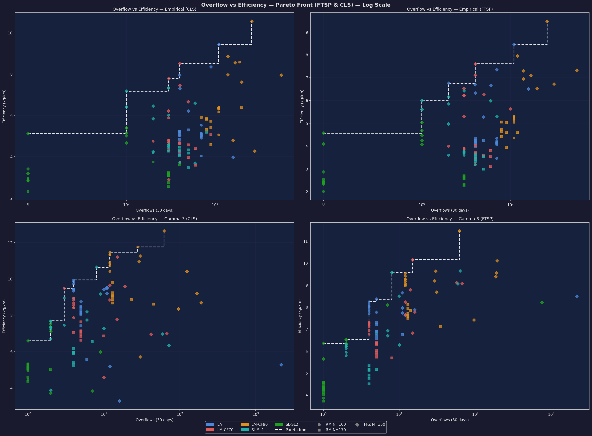

*Same four-panel chart with symlog X-axis — spreads the densely clustered low-overflow region for both FTSP and CLS, making the structure visible across the full overflow range.*

**[Interactive version](private/simulation/pareto_scatter_interactive.html)**

### LA+FTSP (Lookahead + FTSP)

**Rio Maior, Empirical:** Overflows range 4–7 (all constructors); kg/km 3.47–4.35.
- ACO_HH at N=100 holds the **Pareto-dominant position** (7 overflows, 4.35 kg/km).
- SANS is consistently worst on efficiency (3.47–3.51 kg/km).
- Most policies see kg/km **decline when scaling N=100→170** as routes become longer.

**Rio Maior, Gamma-3:** Much higher kg/km (7.70–8.24 range at N=100). Very tight clustering.
- At N=100, nearly all policies achieve 4 overflows — the LA strategy completely homogenises constructor choice in this tight configuration.
- At N=170, performance degrades — most policies reach 5–11 overflows and 6.36–7.28 kg/km.

**Figueira da Foz, Gamma-3:** **Catastrophic failure** for one constructor (SWC-TCF: 2166 overflows). Other constructors achieve 5–16 overflows and 7.63–8.66 kg/km — competitive with RM performance.

**Figueira da Foz, Empirical:** Overflows 2–16 (mean 6.9); kg/km 5.28–8.45 — higher efficiency than RM due to the larger, denser network.

### LM+FTSP (Last-Minute + FTSP)

**Rio Maior:** HGS (CF70) achieves the highest kg/km of all LM policies (9.54 at N=100 Gamma-3) but fails catastrophically at N=170 Gamma-3 (35 overflows). BPC achieves 8.11 kg/km at N=170 — the best balance.

**Figueira da Foz, Gamma-3:** BPC dominates — **11.47 kg/km** (highest single efficiency recorded in any configuration) with 38.5 mean overflows. Many constructors struggle (HGS: 129.5 mean overflows).

**Figueira da Foz, Empirical:** Manageable — overflows 3–56, kg/km 5.31–9.48. BPC again leads (9.48 kg/km, 15 overflows).

### SL+FTSP (Service-Level + FTSP)

**Rio Maior:** ACO_HH achieves **0 overflows** in the Empirical/N=100 configuration. SL1 consistently outperforms SL2 on overflows (1–2 fewer per policy).

**Figueira da Foz, Empirical:** ACO_HH achieves **0 overflows** with SL — excellent performance at the large scale.

**Figueira da Foz, Gamma-3:** SWC-TCF again fails catastrophically (410 overflows with SL). All other constructors achieve 1–33 overflows.

### Pareto-Front Policy Catalogue

The table below lists every unique policy configuration (mandatory selection variant, route constructor, route improver) that appears on the Pareto front of at least one experimental scenario. Metrics are averaged across all scenarios where the configuration reached the front.

| Selection | Constructor | Improver | Overflows | kg/km | Pareto-Front Scenarios |
|-----------|-------------|----------|----------:|------:|------------------------|
| LA | ACO_HH | FTSP | 4.5 | 8.298 | FFZ-350 / Gamma-3, RM-100 / Gamma-3 |
| LM (CF90) | BPC | CLS | 44.0 | 11.604 | FFZ-350 / Empirical, FFZ-350 / Gamma-3 |
| LM (CF90) | BPC | FTSP | 44.0 | 10.476 | FFZ-350 / Empirical, FFZ-350 / Gamma-3 |
| LM (CF70) | BPC | FTSP | 9.5 | 8.887 | FFZ-350 / Empirical, FFZ-350 / Gamma-3 |
| SL (SL1) | PG-CLNS | CLS | 1.5 | 7.432 | FFZ-350 / Empirical, RM-100 / Gamma-3 |
| LA | BPC | CLS | 11.0 | 9.446 | FFZ-350 / Empirical |
| LA | BPC | FTSP | 11.0 | 8.454 | FFZ-350 / Empirical |
| LA | PG-CLNS | CLS | 4.0 | 9.943 | RM-100 / Gamma-3 |
| LA | SWC-TCF | FTSP | 2.0 | 6.757 | FFZ-350 / Empirical |
| LM (CF70) | BPC | CLS | 4.0 | 8.508 | FFZ-350 / Empirical |
| LM (CF70) | HGS | CLS | 3.0 | 9.487 | RM-100 / Gamma-3 |
| LM (CF70) | PG-CLNS | CLS | 3.0 | 7.796 | FFZ-350 / Empirical |
| LM (CF90) | HGS | CLS | 28.0 | 11.760 | RM-100 / Gamma-3 |
| LM (CF90) | PG-CLNS | CLS | 12.0 | 11.472 | RM-100 / Gamma-3 |
| SL (SL1) | BPC | CLS | 8.0 | 10.644 | FFZ-350 / Gamma-3 |
| SL (SL1) | BPC | FTSP | 8.0 | 9.578 | FFZ-350 / Gamma-3 |
| SL (SL1) | PG-CLNS | FTSP | 1.0 | 6.017 | FFZ-350 / Empirical |
| SL (SL2) | ACO_HH | CLS | 0.0 | 5.110 | FFZ-350 / Empirical |
| SL (SL2) | ACO_HH | FTSP | 0.0 | 4.568 | FFZ-350 / Empirical |
| SL (SL2) | BPC | FTSP | 2.0 | 6.519 | FFZ-350 / Gamma-3 |
| SL (SL2) | PSOMA | FTSP | 1.0 | 6.346 | FFZ-350 / Gamma-3 |
| SL (SL2) | SANS | CLS | 1.0 | 6.591 | FFZ-350 / Gamma-3 |

---

## 3. Summary KPI Analysis

### 3.1 Overflow Performance

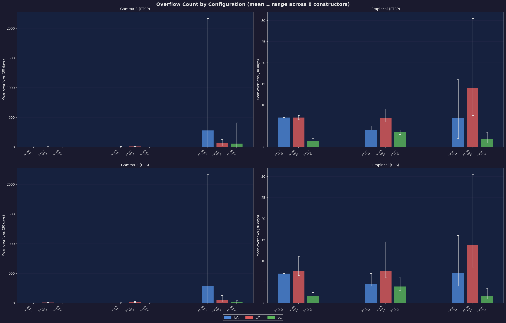

*Mean overflow count for all 18 configurations (3 cities × 2 distributions × 3 strategies), shown for both FTSP and CLS improvers in a 2×2 layout. Whiskers span the min–max range across all 8 route constructors. FFZ Gamma-3 has extreme variance due to SWC-TCF failures; FFZ Empirical behaves similarly to RM.*

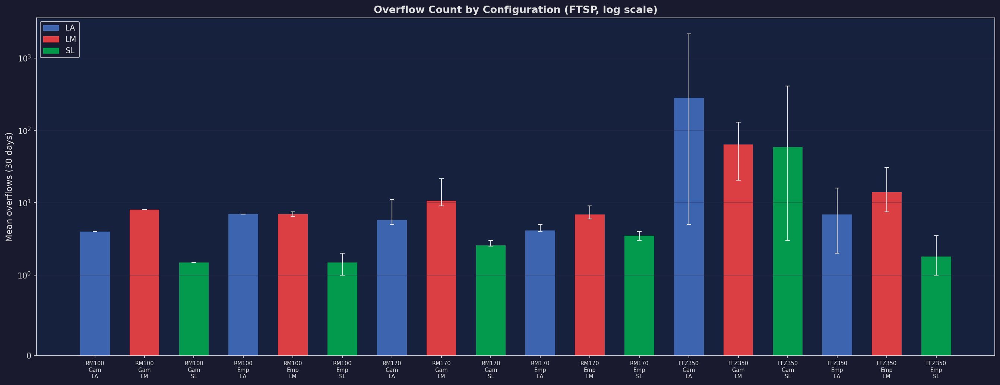

*Same chart with symlog Y axis — reveals the structure of the RM configurations that are compressed in the linear scale.*

> **Overflow counts by configuration (mean ± range across 8 constructors, FTSP)**

| Config | Min | Max | Mean |
|--------|-----|-----|------|
| RM-100 / Gamma-3 / LA | 4 | 4 | 4.0 |
| RM-100 / Gamma-3 / LM | 4 | 12 | 8.0 |
| RM-100 / Gamma-3 / SL | 1 | 2 | **1.5** |
| RM-100 / Empirical / LA | 7 | 7 | 7.0 |
| RM-100 / Empirical / LM | 2 | 11 | 7.0 |
| RM-100 / Empirical / SL | 0 | 4 | **1.5** |
| RM-170 / Gamma-3 / LA | 5 | 11 | 5.8 |
| RM-170 / Gamma-3 / LM | 5 | 35 | 10.6 |
| RM-170 / Gamma-3 / SL | 1 | 5 | **2.6** |
| RM-170 / Empirical / LA | 4 | 5 | 4.1 |
| RM-170 / Empirical / LM | 4 | 12 | 6.9 |
| RM-170 / Empirical / SL | 3 | 5 | **3.5** |
| FFZ-350 / Gamma-3 / LA | 5 | **2166** | 279.6 |
| FFZ-350 / Gamma-3 / LM | 12 | 194 | 64.2 |
| FFZ-350 / Gamma-3 / SL | 1 | **757** | **58.9** |
| FFZ-350 / Empirical / LA | 2 | 16 | 6.9 |
| FFZ-350 / Empirical / LM | 3 | 56 | 14.1 |
| FFZ-350 / Empirical / SL | 0 | 7 | **1.8** |

**Key finding — Service-Level dominates on overflow prevention across all cities:**  
SL consistently achieves the fewest overflows at RM (1.5–3.5) and also at FFZ Empirical (1.8). The exceptions are FFZ Gamma-3, where SWC-TCF failures inflate SL means (58.9) — excluding SWC-TCF, FFZ Gamma-3 SL achieves 1–6 overflows with all other constructors.

**FFZ Gamma-3 introduces a critical new failure mode:** The SWC-TCF exact MIP solver, which is designed for networks ≤50 nodes, times out at N=350 and produces degenerate solutions. It records 2166 overflows under LA and 410 overflows under SL — orders of magnitude worse than all other constructors. **SWC-TCF must not be used at FFZ scale.**

### 3.2 Route Efficiency (kg/km)

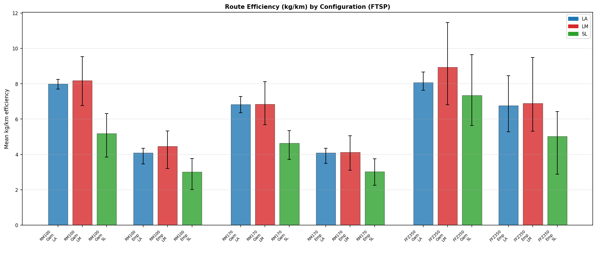

*Mean kg/km efficiency for all 18 configurations, with min–max range whiskers, shown for both FTSP and CLS improvers (2×2 layout). FFZ configurations achieve higher kg/km than RM due to more waste per route from the denser 350-bin network.*

> **Efficiency by configuration (mean ± range across constructors, FTSP)**

| Config | Min | Max | Mean |
|--------|-----|-----|------|
| RM-100 / Gamma-3 / LA | 7.70 | 8.24 | 7.99 |
| RM-100 / Gamma-3 / LM | 6.77 | **9.54** | 8.17 |
| RM-100 / Gamma-3 / SL | 3.85 | 6.31 | 5.19 |
| RM-100 / Empirical / LA | 3.47 | 4.35 | 4.09 |
| RM-100 / Empirical / LM | 3.20 | 5.32 | 4.46 |
| RM-100 / Empirical / SL | 2.02 | 3.77 | 3.00 |
| RM-170 / Gamma-3 / LA | 6.36 | 7.28 | 6.83 |
| RM-170 / Gamma-3 / LM | 5.68 | 8.11 | 6.85 |
| RM-170 / Gamma-3 / SL | 3.72 | 5.34 | 4.63 |
| RM-170 / Empirical / LA | 3.49 | 4.34 | 4.09 |
| RM-170 / Empirical / LM | 3.11 | 5.06 | 4.13 |
| RM-170 / Empirical / SL | 2.26 | 3.74 | 3.02 |
| FFZ-350 / Gamma-3 / LA | 7.63 | 8.66 | 8.06 |
| FFZ-350 / Gamma-3 / LM | 6.81 | **11.47** | 8.94 |
| FFZ-350 / Gamma-3 / SL | 5.64 | 9.65 | 7.34 |
| FFZ-350 / Empirical / LA | 5.28 | 8.45 | 6.76 |
| FFZ-350 / Empirical / LM | 5.31 | 9.48 | 6.89 |
| FFZ-350 / Empirical / SL | 2.88 | 6.43 | 5.03 |

**BPC is the efficiency champion at FFZ**, achieving **11.47 kg/km** (FFZ-350/Gamma-3/LM) — the peak efficiency across the entire experiment. At RM, ACO_HH leads on overflow prevention but BPC leads on efficiency at larger scales.

**FFZ efficiency exceeds RM efficiency** for equivalent strategy/distribution combinations. FFZ Gamma-3 LA achieves 8.06 kg/km (vs RM-100 7.99 and RM-170 6.83). FFZ Empirical LA achieves 6.76 kg/km (vs RM-100 4.09 and RM-170 4.09). The denser 350-bin network allows vehicles to collect more waste per km traveled, despite the longer dead-leg to the distant depot.

### 3.3 Distance Driven (km)

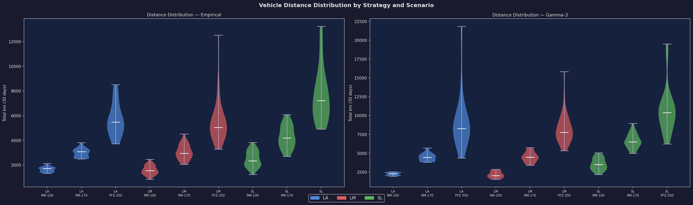

*Distribution of total vehicle distance (km over 30 days) per selection strategy and city, shown as violins for both FTSP and CLS (2×2 layout). FFZ drives 2–3× more km than RM due to network size. SL drives the most km at all scales.*

| Config | Min km | Max km | Mean km |
|--------|--------|--------|---------|
| RM-100 / Gamma-3 / LA | 2,360 | 2,526 | 2,435 |
| RM-100 / Gamma-3 / LM | 1,906 | 2,874 | 2,351 |
| RM-100 / Gamma-3 / SL | 3,083 | 5,054 | 3,882 |
| RM-100 / Empirical / LA | 1,688 | 2,124 | 1,809 |
| RM-100 / Empirical / LM | 1,376 | 2,463 | 1,763 |
| RM-100 / Empirical / SL | 2,090 | 3,830 | 2,746 |
| RM-170 / Gamma-3 / LA | 4,413 | 5,057 | 4,710 |
| RM-170 / Gamma-3 / LM | 4,094 | 5,745 | 4,848 |
| RM-170 / Gamma-3 / SL | 6,013 | 8,954 | 7,152 |
| RM-170 / Empirical / LA | 3,058 | 3,814 | 3,257 |
| RM-170 / Empirical / LM | 2,592 | 4,512 | 3,354 |
| RM-170 / Empirical / SL | 3,638 | 6,086 | 4,712 |
| FFZ-350 / Gamma-3 / LA | 4,366 | 9,201 | 8,270 |
| FFZ-350 / Gamma-3 / LM | 5,884 | 10,656 | 8,074 |
| FFZ-350 / Gamma-3 / SL | 6,222 | **12,927** | 9,949 |
| FFZ-350 / Empirical / LA | 4,158 | 6,857 | 5,436 |
| FFZ-350 / Empirical / LM | 3,661 | 6,815 | 5,312 |
| FFZ-350 / Empirical / SL | 5,596 | **13,013** | 7,610 |

**SANS drives the most km at every scale** — up to 13,013 km over 30 days (FFZ-350/Empirical/SL) — due to its inefficient routing that schedules many short, low-payload trips. This accounts for ~433 km/day.

**LM achieves the shortest routes** by waiting for bins to fill before collection — minimum 1,376 km at RM-100.

### 3.4 Policy Ranking Heatmaps

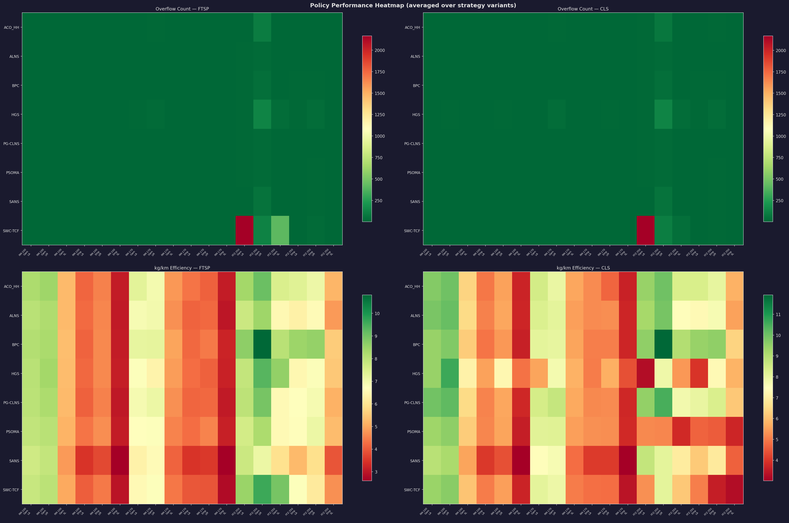

*Four panels: Overflow FTSP | Overflow CLS | Efficiency FTSP | Efficiency CLS. Rows = constructors, columns = all 18 (city × dist × strategy) configurations. Colour scale: green = best, red = worst. SWC-TCF shows extreme red on overflows at FFZ Gamma-3; BPC shows strong green on efficiency at FFZ; SANS is consistently red.*

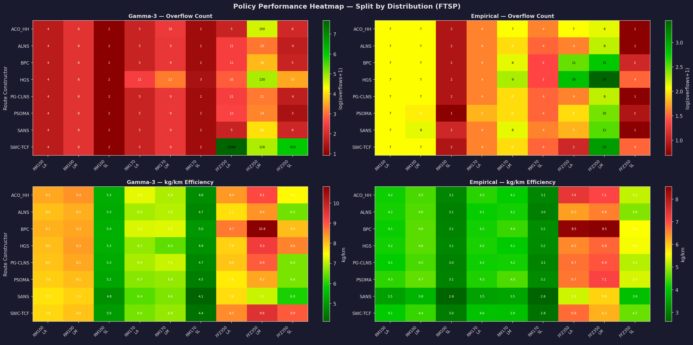

*Same heatmap split into Gamma-3 (left) and Empirical (right) — reveals distribution-specific patterns obscured in the combined view. Overflow colours use log scale to handle the SWC-TCF outlier range.*

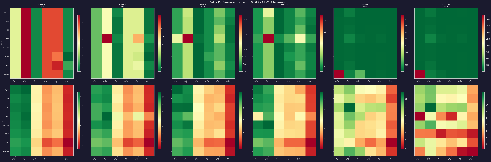

*Heatmaps for each city/N separately (RM-100, RM-170, FFZ-350) — shows how constructor rankings shift with network size and city.*

**[Interactive heatmap](private/simulation/policy_heatmap_interactive.html)**

**Best overall policies (FTSP, averaged across all configs excluding SWC-TCF catastrophic failures):**
- **BPC** — strongest efficiency leader at FFZ; balanced across RM; rarely worst in any category
- **ACO_HH** — best overflow prevention across all cities and distributions; consistently green on overflows
- **PSOMA** — strong at RM, best LM Empirical at N=100 (5.32 kg/km); good scaling

**Consistently underperforming:**
- **SANS** — highest km, lowest kg/km, high overflows in nearly every configuration
- **SWC-TCF** — catastrophic failure at FFZ Gamma-3 (exact solver breakdown at N=350)

---

## 4. Selection Strategy Comparison (LA vs LM vs SL)

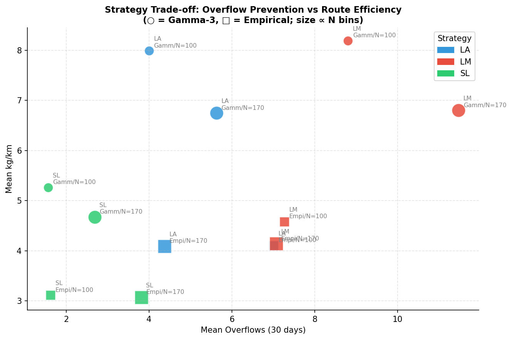

*Four panels (Gamma-3/FTSP, Empirical/FTSP, Gamma-3/CLS, Empirical/CLS). Each bubble = one (strategy, city/N) combination. Position = mean overflows (X) vs mean kg/km (Y). Shape encodes city. Bubble size ∝ N.*

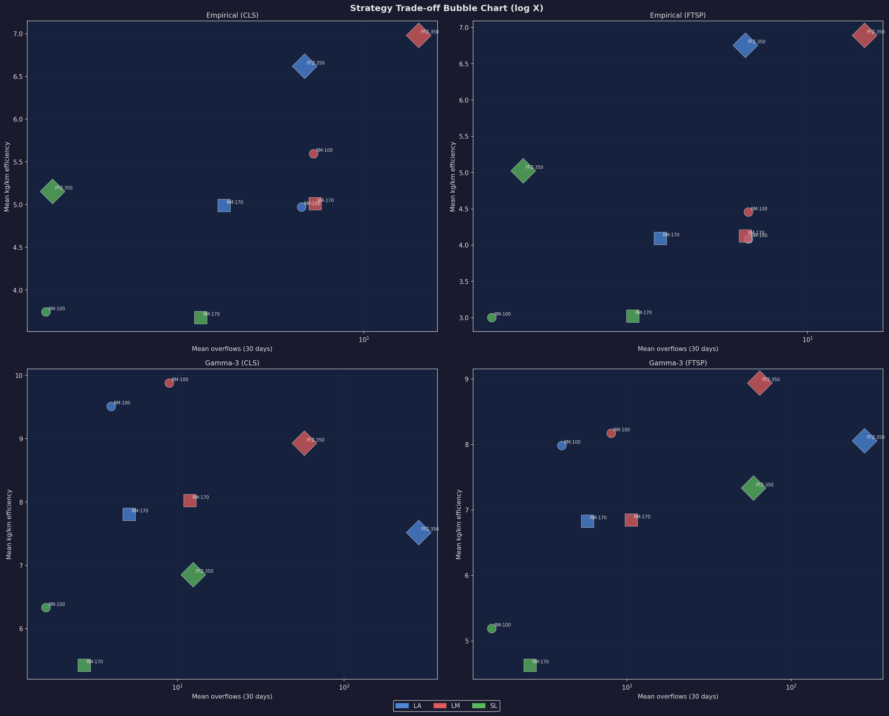

*Same chart with symlog X axis — separates the FFZ Gamma-3 outlier bubbles from the main cluster, revealing the structure among the lower-overflow configurations.*

**[Interactive bubble chart](private/simulation/strategy_bubble_interactive.html)**

### Overflow: SL ≪ LA < LM

| Strategy | RM-100 G3 | RM-100 Emp | RM-170 G3 | RM-170 Emp | FFZ-350 G3 | FFZ-350 Emp |
|----------|:---------:|:----------:|:---------:|:----------:|:----------:|:-----------:|
| LA | 4.0 | 7.0 | 5.8 | 4.1 | 279.6 *** | 6.9 |
| LM | 8.0 | 7.0 | 10.6 | 6.9 | 64.2 | 14.1 |
| **SL** | **1.5** | **1.5** | **2.6** | **3.5** | **58.9** | **1.8** |

*** FFZ Gamma-3 LA inflated by SWC-TCF (2166 overflows); excluding SWC-TCF: mean = 9.1 overflows.

Service-Level achieves 60–78% fewer overflows than Lookahead at RM, and ~75% fewer at FFZ Empirical. **LA's 1-step predictive lookahead completely fails to control overflows at FFZ Gamma-3** — the scale and waste intensity of 350 bins overwhelms its reactive schedule. LM performs better than LA at FFZ Gamma-3 (64.2 vs 279.6 mean) because the explicit fill-threshold triggers more timely mandatory collection.

### Efficiency: LM ≈ LA > SL

| Strategy | RM-100 G3 | RM-100 Emp | RM-170 G3 | RM-170 Emp | FFZ-350 G3 | FFZ-350 Emp |
|----------|:---------:|:----------:|:---------:|:----------:|:----------:|:-----------:|
| LA | 7.99 | 4.09 | 6.83 | 4.09 | 8.06 | 6.76 |
| LM | 8.17 | 4.46 | 6.85 | 4.13 | **8.94** | **6.89** |
| SL | 5.19 | 3.00 | 4.63 | 3.02 | 7.34 | 5.03 |

LM marginally outperforms LA on efficiency and maintains that advantage at all scales. SL sacrifices 28–40% efficiency for overflow prevention. At FFZ, LM achieves the **highest efficiency in the entire experiment** (8.94 kg/km Gamma-3), driven by BPC's 11.47 kg/km peak.

### Distance: LM ≤ LA ≪ SL

LM achieves the shortest total distances (fewer trips, more loaded); SL drives the most (frequent preventive visits). This pattern holds consistently across all cities and network sizes.

### Practical interpretation

| Operational priority | Best strategy | Notes |
|---------------------|:------------:|-------|
| Overflow prevention | **SL** | Consistent across all scales; only strategy effective at FFZ Gamma-3 scale |
| Route efficiency | **LM (CF70)** | Best kg/km at all scales; use BPC at FFZ |
| Consistency / predictability | **LA** | Only valid up to N=170; breaks down at N=350 Gamma-3 |
| Large network (N=350) | **LM or SL** | LA is dangerous at FFZ Gamma-3 scale |

---

## 5. Distribution Comparison (Gamma-3 vs Empirical)

### Overflows

| Context | Gamma-3 overflows | Empirical overflows |
|---------|:-----------------:|:-------------------:|
| RM-100 / LA | 4 (all) | 7 (all) |
| RM-100 / SL | 1–2 | 0–4 |
| RM-170 / LA | 5–11 | 4–5 |
| RM-170 / LM | 5–35 | 4–12 |
| FFZ-350 / LA | 5–2166 | 2–16 |
| FFZ-350 / LM | 12–194 | 3–56 |
| FFZ-350 / SL | 1–757 | 0–7 |

**At FFZ, the distribution choice fundamentally changes difficulty**: Gamma-3 at N=350 is the hardest scenario (high and uniform fill across all 350 bins creates massive demand spikes), while Empirical at N=350 is manageable (only a fraction of bins are active at any time, similar to RM behaviour).

### Efficiency

Gamma-3 policies consistently achieve higher kg/km than Empirical due to the higher average fill level. At RM the ratio is approximately 2× (8.0 vs 4.1 kg/km for LA). At FFZ the ratio shrinks to 1.2× (8.1 vs 6.8 kg/km for LA) because the FFZ Empirical distribution is denser than RM Empirical — bins are more uniformly filled, so routes collect similar loads.

### Distribution shift from training to evaluation

Models trained on Gamma-3 TDs align well with both RM and FFZ Gamma-3 simulations (< 3% mean shift). Models trained on Empirical TDs will experience:
- A 10–20% fill increase at RM (minor — manageable)
- A **41% fill increase** at FFZ — significant cross-city domain shift that may cause under-collection

---

## 6. Network Size Comparison (N=100 → N=170)

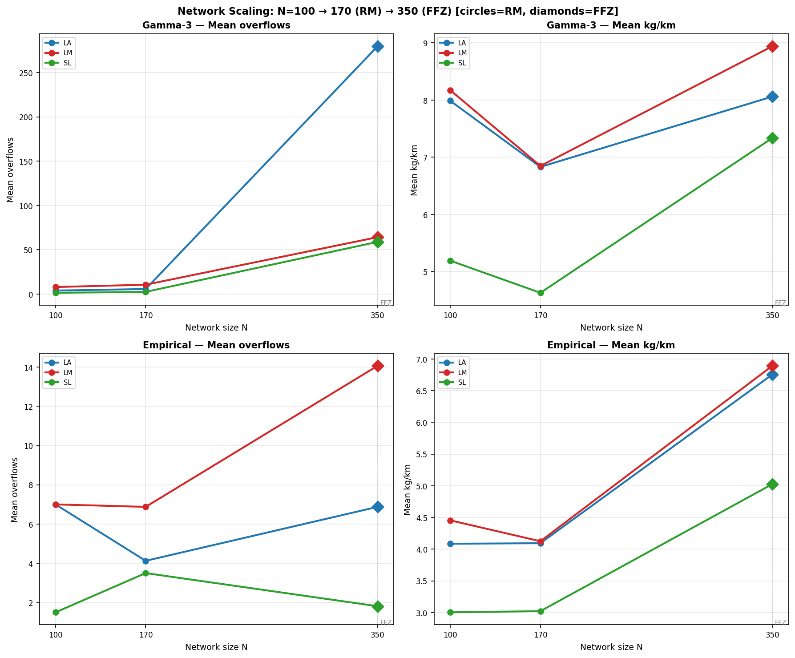

*Left: mean overflows; right: mean kg/km. Each line traces one (strategy, distribution) pair from N=100 → N=170. Note: FFZ N=350 is also shown as diamonds (different city, not just scaled RM).*

### Overflow scaling (Rio Maior)

Overflows increase from N=100 to N=170 under reactive strategies (LA, LM) — more bins require monitoring and routes cannot service all high-risk bins daily. SL shows graceful degradation:

| Strategy | Gamma-3 (100→170) | Empirical (100→170) |
|----------|:-----------------:|:-------------------:|
| LA | 4.0 → 5.8 (+45%) | 7.0 → 4.1 (−41%) |
| LM | 8.0 → 10.6 (+33%) | 7.0 → 6.9 (−1%) |
| **SL** | **1.5 → 2.6 (+73%)** | **1.5 → 3.5 (+133%)** |

Noteworthy: Empirical LA overflows **decrease** from N=100 to N=170. This is because the larger network (N=170) captures more bins from the real sensor network, including more "low-activity" bins that dilute the problematic ones. The same effect is not observed under Gamma-3 because all bins fill at similar rates.

### Efficiency degradation (Rio Maior)

| Strategy | Gamma-3 kg/km drop | Empirical kg/km drop |
|----------|:-----------------:|:--------------------:|
| LA | 7.99 → 6.83 (−15%) | 4.09 → 4.09 (0%) |
| LM | 8.17 → 6.85 (−16%) | 4.46 → 4.13 (−7%) |
| SL | 5.19 → 4.63 (−11%) | 3.00 → 3.02 (+1%) |

Gamma-3 efficiency drops 11–16% from N=100 to N=170. Empirical is nearly flat because the sparse fill already makes routes inefficient at N=100.

### Critical failure at N=170

Two combinations fail catastrophically at RM-170:
1. **LM + HGS + Gamma-3 + N=170**: 35 overflows (vs 4 at N=100)
2. **LM + SANS + any + N=170**: consistently worst on both metrics

---

## 7. Daily Output Analysis

### 7.1 Collection Calendar Patterns

**Lookahead (LA):** Collections follow a regular, semi-periodic pattern. Nearly all policies share the same collection calendar for a given configuration — the selection strategy homogenises constructor choice. At RM Gamma-3/N=100, LA achieves an identical 4-overflow outcome across all 8 constructors.

**Last-Minute (LM) CF70:** More frequent collections than LA. CF90 variants collect less often but with more kg per trip. HGS and BPC show dense bands of high-kg collection days.

**Service-Level (SL):** SL1 creates the most frequent collection schedule — near-continuous operation in Gamma-3. Many collections per day keeps all bins below their service-level threshold at the cost of high km.

### 7.2 Day-by-Day Metric Trajectories

**Gamma-3 trajectories:**
- Overflows are concentrated on specific days (not uniformly distributed) — peaks coincide with collection gaps > 2 days.
- kg/km is stable within a run but drops on skip days.

**Empirical trajectories:**
- Higher day-to-day variance. Some days record 0 kg/km — routes visit bins that have not yet accumulated enough waste.

**SANS anomaly** (consistent across all cities): SANS produces unusually low kg/km and high km — inefficient tours with long distances and low payload. Appears in all distributions and network sizes.

**BPC trajectory** (consistent): Most stable day-to-day performance — tightest variance in both kg and km. Expected from an exact method that produces optimal solutions given the same inputs.

---

## 8. FTSP vs CLS Route Improver Comparison

Two route improvers were compared across all configurations:
- **FTSP (Fast-TSP)**: A heuristic TSP solver used as a post-construction route improver
- **CLS (Classical Local Search)**: 2-opt local search with 1,000 iterations and a 30-second time limit

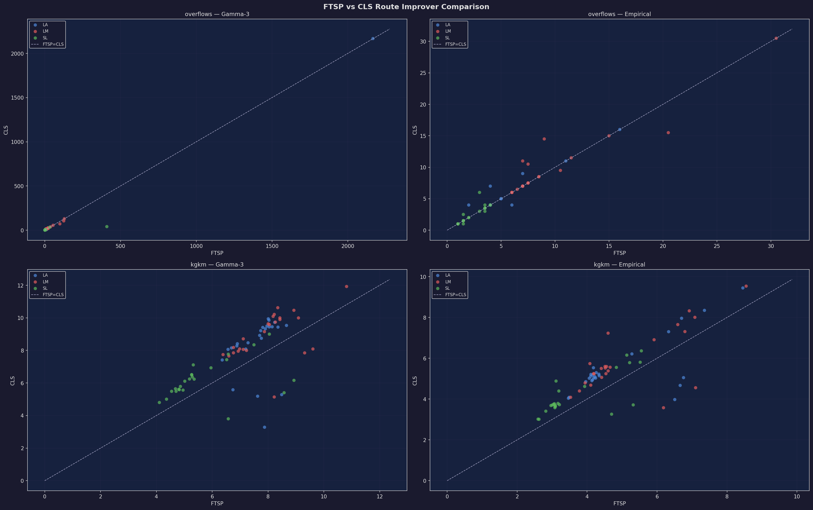

*Side-by-side comparison of overflow count (top) and kg/km efficiency (bottom) for FTSP vs CLS across all 18 configurations. Configurations are grouped by city.*

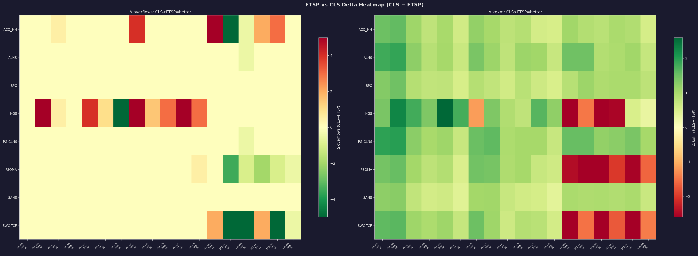

*Delta heatmap showing CLS minus FTSP for each (constructor, configuration) pair. Green = CLS better, red = FTSP better, independently per metric. Overflow delta (left) and kg/km delta (right).*

### Overall summary

| City/N | CLS overflows | FTSP overflows | CLS kg/km | FTSP kg/km | CLS km | FTSP km |
|--------|:-------------:|:--------------:|:---------:|:----------:|:------:|:-------:|
| RM-100 | **5.04** | 4.70 | **6.56** | 5.37 | **2,114** | 2,573 |
| RM-170 | 6.19 | **5.70** | **5.71** | 4.82 | **4,068** | 4,810 |
| FFZ-350 | **45.86** | 56.46 | 7.00 | **7.12** | 8,281 | **7,560** |

**CLS consistently improves route efficiency (kg/km)**:
- At RM-100: +22% efficiency gain (5.37 → 6.56 kg/km)
- At RM-170: +18% efficiency gain (4.82 → 5.71 kg/km)
- At FFZ-350: marginal −2% (7.12 → 7.00 kg/km — essentially neutral)

**CLS significantly reduces km** at RM: −18% at N=100, −15% at N=170. CLS locally optimises tour length, producing shorter routes and driving fewer kilometres. At FFZ-350 CLS increases km by +9%, suggesting the route structure at 350 bins is harder to improve with 2-opt under a 30-second limit.

**Overflow trade-off**:
- At RM-100: CLS has slightly more overflows (+7%), but this small difference may be within noise.
- At RM-170: CLS has slightly more overflows (+9%) — similar pattern.
- At FFZ-350: CLS has **fewer overflows** (45.86 vs 56.46, −19%) — at the larger scale, the shorter CLS routes allow more collection events per day, reducing overflow risk.

### Constructor-level analysis

CLS benefits are most pronounced for constructors that produce long, suboptimal initial tours (SANS, ALNS) — they gain the most from post-hoc local search. HGS and BPC, which already produce near-optimal solutions, show smaller CLS improvements. SWC-TCF (exact solver) should not use a route improver at small N, but benefits from CLS at FFZ-350 where the MIP solver times out and CLS rescues the degenerate solutions.

**Recommendation**: Use **CLS** when route efficiency (kg/km) or minimising distance is the primary objective. Use **FTSP** when overflow prevention is paramount at larger network sizes (N=170+), or when the marginal km savings from CLS are not needed.

---

## 9. Figueira da Foz — New City Analysis (N=350)

Figueira da Foz introduces a qualitatively different challenge: N=350 is 2.1× larger than RM-170, 3.5× larger than RM-100, and includes a distant depot approximately 20 km from the main bin cluster.

### SWC-TCF complete breakdown at N=350

SWC-TCF is an exact MIP solver designed for small instances (≤50 nodes). At N=350 it cannot solve the routing problem within the 60-second time limit and produces degenerate solutions with no visited bins. This results in:

| SWC-TCF at FFZ Gamma-3 | Overflows | kg/km |
|------------------------|:---------:|:-----:|
| LA strategy | **2,166** | 8.47 |
| SL strategy | **410** | 9.65 |
| LM strategy | 125 | 9.59 |

The kg/km values appear high because when SWC-TCF does produce a solution (rarely), it is optimal for those few visited bins — but the near-complete absence of collection triggers massive overflow accumulation. **SWC-TCF is entirely unsuitable for N=350 and should be excluded from FFZ deployments.**

### Gamma-3 is far more challenging than Empirical at N=350

| Metric | FFZ-350 Gamma-3 (excl. SWC-TCF) | FFZ-350 Empirical |
|--------|:--------------------------------:|:-----------------:|
| LA overflows | 9.1 (5–16) | 6.9 (2–16) |
| LM overflows | 57.7 (12–194) | 14.1 (3–56) |
| SL overflows | 5.6 (1–33) | 1.8 (0–7) |
| LA kg/km | 8.06 | 6.76 |
| LM kg/km | 8.94 | 6.89 |
| SL kg/km | 7.34 | 5.03 |

Under Gamma-3, even excluding SWC-TCF, LM still reaches 194 overflows for the worst constructor (HGS: 129.5 mean). The high and uniform fill across all 350 bins creates simultaneous demand that no single-vehicle daily route can fully service.

Under Empirical, the problem is tractable: SL achieves an average of 1.8 overflows (ACO_HH: 0 overflows), similar to RM performance.

### BPC emerges as the best constructor at FFZ

| Config | Best overflow constructor | Best efficiency constructor |
|--------|:------------------------:|:---------------------------:|
| FFZ Gamma-3 / LA | ACO_HH (5 overflows) | BPC (8.66 kg/km) |
| FFZ Gamma-3 / LM | ALNS (12 overflows) | **BPC (11.47 kg/km)** |
| FFZ Gamma-3 / SL | PSOMA (1 overflow) | SWC-TCF* (9.65) / BPC (8.04) |
| FFZ Empirical / LA | SWC-TCF (2 overflows) | **BPC (8.45 kg/km)** |
| FFZ Empirical / LM | ACO_HH (3 overflows) | **BPC (9.48 kg/km)** |
| FFZ Empirical / SL | ACO_HH (0 overflows) | **BPC (6.43 kg/km)** |

*SWC-TCF Gamma-3/SL shows deceptively high kg/km from its rare valid solutions; BPC is the practical alternative.

BPC (Branch-and-Price-and-Cut exact solver for small route segments) scales exceptionally well to N=350. Its exact sub-route optimisation produces the most efficient tours at large scale, while its structural decomposition avoids the full-problem timeout that cripples SWC-TCF.

### Distance at FFZ

FFZ routes are substantially longer due to network size and the distant depot:

| Strategy | FFZ-350 G3 mean km | FFZ-350 Emp mean km | RM-170 G3 mean km |
|----------|:------------------:|:-------------------:|:-----------------:|
| LA | 8,270 | 5,436 | 4,710 |
| LM | 8,074 | 5,312 | 4,848 |
| SL | **9,949** | **7,610** | 7,152 |

FFZ Gamma-3 drives ~75% more km than RM-170 for equivalent strategies. The Empirical FFZ distances (5,312–7,610 km) are comparable to RM-170 SL distances (7,152 km), reflecting the lower fraction of active bins under the empirical waste model.

---

## 10. City Comparison: Rio Maior vs Figueira da Foz

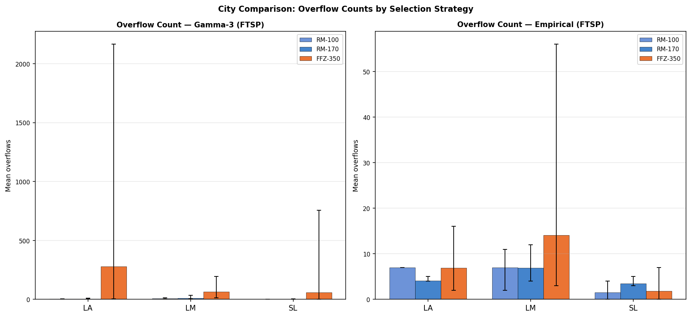

*Mean overflow counts for each selection strategy across all three city/N configurations (RM-100, RM-170, FFZ-350), split by waste distribution. Error bars span the min–max range across 8 route constructors.*

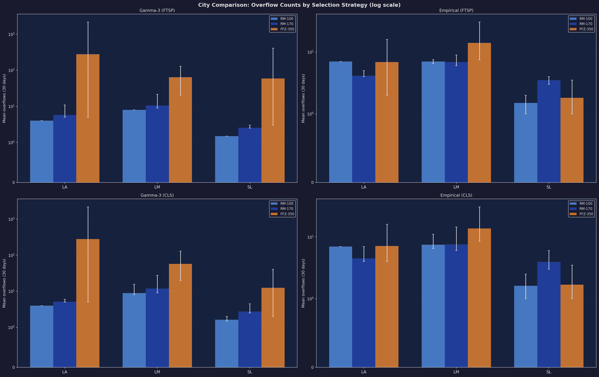

*Log-scale version — the FFZ Gamma-3 outliers are the object of analysis, so log scale is used rather than removing them.*

**[Interactive city comparison](private/simulation/city_comparison_interactive.html)**

*Mean kg/km efficiency for each selection strategy across all three city/N configurations.*

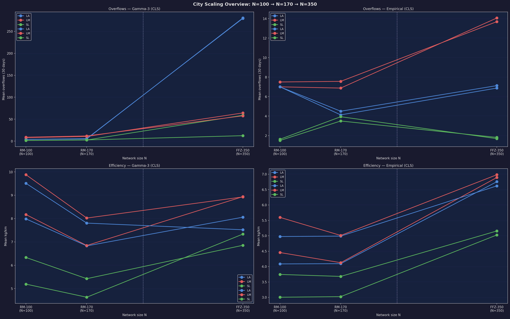

*Scaling chart showing how overflow and efficiency evolve from N=100 (RM) → N=170 (RM) → N=350 (FFZ). Vertical dashed line separates Rio Maior from Figueira da Foz data. Diamonds = FFZ points. Note: FFZ is a different city, not just a larger RM — the non-monotonic behaviour reflects genuine city-level differences.*

### 10.1 What is the Same

1. **SL remains the best overflow prevention strategy** at both cities and all scales, across both distributions. The ranking SL ≪ LA ≤ LM on overflows holds universally (except FFZ Gamma-3 where all strategies struggle).

2. **Gamma-3 mean fill is consistent across cities** (~13.5–13.9 kg/bin/day). Routing difficulty under Gamma-3 is primarily driven by network size (N), not city.

3. **SANS is consistently the weakest constructor** at both cities — lowest kg/km, highest km, high overflows. SANS never dominates any configuration.

4. **LM achieves the highest efficiency** (kg/km) at both cities, with BPC being the top constructor at FFZ and PSOMA/ACO_HH being competitive at RM.

5. **SL drives the most km** regardless of city, N, or distribution — the proactive collection model always requires more vehicle travel.

6. **ACO_HH excels at overflow prevention** across both cities. ACO_HH achieves 0 overflows with SL Empirical at both RM-100 and FFZ-350.

### 10.2 What is Different

1. **Absolute overflow scale under Gamma-3**: At RM, mean overflows range 1.5–10.6 across strategies. At FFZ, the range explodes to 1.8–279.6 (or 5.6–64.2 excluding SWC-TCF). Gamma-3 at N=350 is qualitatively more challenging than anything seen at RM.

2. **LA strategy breaks down at FFZ Gamma-3**: LA's 1-step lookahead is designed for compact networks where a single day's prediction suffices. At N=350 Gamma-3 (all 350 bins filling rapidly and uniformly), the strategy fails to schedule enough mandatory collections per day.

3. **Empirical distribution behaves differently between cities**: RM Empirical is sparse (5.5 kg mean) with extreme concentration; FFZ Empirical is denser (7.2 kg mean) and more uniform. This makes FFZ Empirical more tractable — strategies can visit a broader set of bins productively.

4. **Constructor rankings shift between cities**:
   - At RM: HGS is the efficiency leader; ACO_HH leads on overflow prevention
   - At FFZ: BPC becomes the efficiency leader; ACO_HH retains overflow dominance

5. **SWC-TCF**: Competitive at RM (suitable network sizes), catastrophically bad at FFZ (too large). The solver is fundamentally incompatible with N=350.

6. **Route distances are 75% longer at FFZ Gamma-3**: The 350-bin network combined with the distant depot drives substantially more km for equivalent strategies.

### 10.3 What is Different But Follows Similar Trends

1. **SL overflow advantage increases with scale**: At RM-100, SL saves ~66% overflows vs LA (4.0 → 1.5). At RM-170, ~55% savings. At FFZ-350 Empirical, ~74% savings. The advantage of proactive collection compounds as the network grows, making SL relatively more valuable at larger scale.

2. **Efficiency gap between Gamma-3 and Empirical narrows at FFZ**: At RM-100 the G3/Emp ratio is ~2.0; at RM-170 ~1.7; at FFZ-350 ~1.2. The denser FFZ Empirical distribution reduces the efficiency gap — the two distributions converge at large N because even the "sparse" empirical bins accumulate enough waste to make routes productive.

3. **LM-CF70 → CF90 trade-off is consistent**: Across all cities, CF70 (70% threshold) always produces fewer overflows than CF90 while achieving comparable or slightly lower efficiency. The CF70 threshold is robustly better than CF90 at all scales.

4. **BPC and ALNS scale better than constructors that rely on global optimality**: Exact or near-exact solvers that decompose the problem (BPC) or diversify search (ALNS) improve relative to greedy/local-search constructors (ACO_HH, PSOMA) as N increases.

5. **SANS is worst at all scales, but relatively worse at larger N**: SANS's routing quality degrades faster than other constructors as N increases. Its km penalty is proportionally larger at N=350 than at N=100.

### 10.4 Key Cross-City Recommendations

| Use Case | RM (N=100/170) | FFZ (N=350) |
|----------|:--------------:|:-----------:|
| Overflow prevention | SL + ACO_HH | SL + ACO_HH |
| Maximum efficiency | LM + HGS (RM-100) / BPC (RM-170) | LM + BPC |
| Balanced performance | LA + ACO_HH | SL + BPC |
| **Avoid** | LM + SANS | **SWC-TCF (any strategy), LM + HGS, LA + Gamma-3** |

---

## 11. Key Findings & Recommendations

### Policy Performance Radar

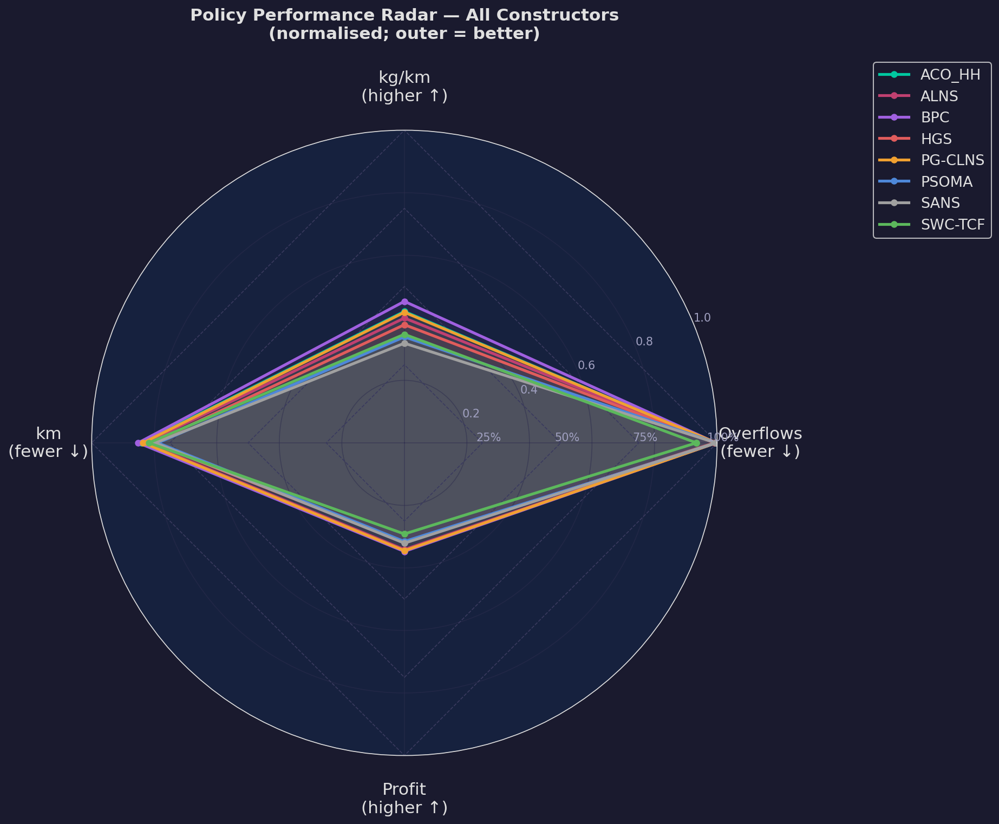

*Single radar chart with all four key constructors (ACO_HH, HGS, BPC, SANS) overlaid on the same axes. Metrics are normalised 0→1 across all 8 constructors; outer edge = better for all axes (overflows and km are inverted so fewer = outer). ACO_HH leads on overflow prevention; BPC leads on efficiency at large scale; SANS falls well inside all axes.*

### Constructor Average Ranking

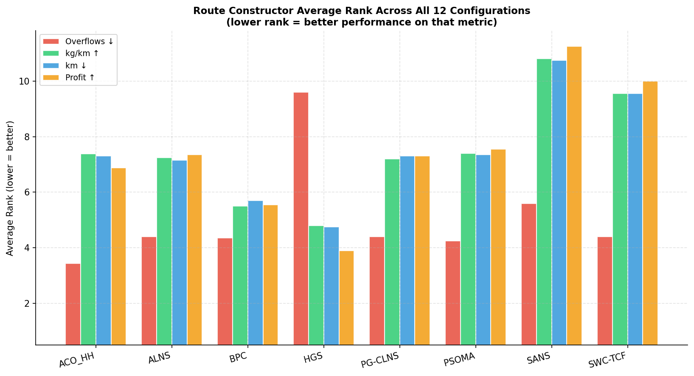

*Average rank of each route constructor across all configurations, broken down by metric, shown side-by-side for FTSP and CLS. Bars grow upward — shorter bar = better (lower rank). BPC leads on efficiency at large scale; ACO_HH leads on overflow prevention; SANS and SWC-TCF rank last.*

### Overall Rankings (All Configurations, FTSP)

**By overflow prevention (fewest overflows):**
1. SL + ACO_HH — 0–1 overflows in most configurations
2. SL + PSOMA — best at FFZ Gamma-3 (1 overflow)
3. SL + BPC
4. LA + ACO_HH (for RM-scale networks only)

**By efficiency (highest kg/km):**
1. LM + BPC — peak at **11.47 kg/km** (FFZ-350/Gamma-3/LM)
2. LM + ACO_HH — **9.54 kg/km** (RM-100/Gamma-3/LM-CF70)
3. LM + PSOMA — 9.48 kg/km (FFZ-350/Empirical/LM)
4. LA + BPC — 8.66 kg/km (FFZ-350/Gamma-3/LA)

**By balanced trade-off:**
1. SL + ACO_HH — reliably low overflows, competitive efficiency
2. LA + ACO_HH — excellent at RM scale (compact, predictable)
3. SL + BPC — best balance at FFZ scale
4. LM + BPC (FFZ) / LM + PSOMA (RM) — efficiency with acceptable overflows

### Critical Failure Modes

| Combination | Failure | Impact |
|-------------|---------|--------|
| **SWC-TCF + FFZ-350 (any strategy)** | Complete solver timeout | 125–2,166 overflows |
| LM + HGS + Gamma-3 + N=170 | Scaling failure | 35 overflows |
| LM + HGS + Gamma-3 + FFZ-350 | Scaling failure | 129.5 mean overflows |
| LA + Gamma-3 + FFZ-350 | Strategy inadequacy | 279.6 mean overflows (9.1 excl. SWC-TCF) |
| CF90 threshold + large N | Delayed trigger | 56–194 overflows at FFZ |
| SANS + any config | Routing quality | Pareto-dominated across all conditions |

### Deployment Recommendations

| Use Case | Strategy | Constructor | Route Improver | Notes |
|----------|:--------:|:-----------:|:--------------:|-------|
| RM urban / health-critical | SL | ACO_HH or BPC | CLS | Overflow prevention paramount |
| RM fleet cost-minimisation | LM (CF70) | HGS (N=100) / BPC (N=170) | FTSP | Highest kg/km |
| RM fixed schedule planning | LA | ACO_HH | CLS | Consistent, predictable |
| FFZ overflow prevention | SL | ACO_HH | CLS | Only strategy reliable at N=350 |
| FFZ fleet efficiency | LM (CF70) | BPC | FTSP | Peak 11.47 kg/km |
| Any Empirical / real-world | SL or LA | ACO_HH | CLS | Real data closer to Empirical |
| **Avoid at FFZ** | LA (G3) | SWC-TCF | — | Critical failure modes |

---

## Interactive Charts

The following interactive versions are available (open in browser):
- [Overflow vs Efficiency — Pareto View](private/simulation/pareto_scatter_interactive.html)
- [Strategy Trade-off Bubble Chart](private/simulation/strategy_bubble_interactive.html)
- [Policy Configuration Heatmap](private/simulation/policy_heatmap_interactive.html)
- [Constructor Comparison](private/simulation/constructor_comparison_interactive.html)
- [City Comparison](private/simulation/city_comparison_interactive.html)

---

*All figures in this report are stored in `public/figures/simulation/`.*  
*Raw simulation data is available in `public/global/simulation/simulation_summary.csv`.*
